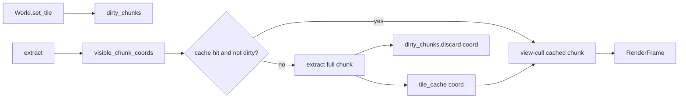

# M17 — Dirty-Chunk-Render-Cache

## Problem heute

[`World.dirty_chunks`](game_core/world.py) wird bei `set_tile()` gesetzt, aber [`ChunkRenderExtractor.extract()`](bridge/chunk_extractor.py) ignoriert das Flag und baut **jedes Frame** alle sichtbaren Chunks neu — inkl. Key→SpriteId-Auflösung und Listenbau.


Analogie: M15 macht dasselbe bereits für Kollision mit `collision_dirty_chunks` + `rebuild_chunk_solid()`.

## Ziel



- **CPU/Bridge-Optimierung** — kein partielles GPU-Upload (M9 bleibt: voller Instanz-Buffer pro Frame).
- **Sprites/Decorations** — außerhalb des Caches (weiter pro Frame extrahiert).

## Design-Entscheidungen

| Thema | Entscheidung | Begründung |
|-------|--------------|------------|
| Cache-Granularität | Voller Chunk (8×8 Tiles, alle Layer) | 64 Tiles/Layer sind trivial; Cache bleibt kamera-unabhängig |
| View-Culling | Pro Frame auf gecachten Daten | Ersetzt heutiges Culling in `_build_layer_batch()` |
| Off-screen dirty | Lazy rebuild | Chunk bleibt in `dirty_chunks`, bis sichtbar — spart CPU bei Malen außerhalb der Kamera |
| `clear_dirty()` | **Nicht** global am Frame-Ende | Würde unsichtbare Dirty-Flags verlieren; stattdessen `discard(coord)` pro rebuild |
| World-Wechsel (Load) | `invalidate_all()` | Demo ersetzt `world`-Objekt — Cache muss geleert werden |

## Implementierung

### 1. Extraktion splitten — [`bridge/chunk_extractor.py`](bridge/chunk_extractor.py)

Neue interne Methoden:

- **`_extract_full_chunk(chunk: Chunk) -> TileChunkRenderData | None`**
  - Alle `tx/ty` pro Layer (row-major), kein `visible_tile_range_in_chunk`
  - Overlay: leere Keys (`""`) weiter überspringen
  - Bestehende `_resolve_key()` / `_sprite_cache` wiederverwenden

- **`_cull_chunk_to_camera(data: TileChunkRenderData, camera: CameraData) -> TileChunkRenderData | None`**
  - Nutzt [`visible_tile_range_in_chunk`](bridge/visibility.py) für `data.chunk_coord`
  - Filtert `tile_ids` / `world_x` / `world_y` / `materials` pro Layer auf sichtbaren Bereich
  - Gibt `None` zurück wenn kein Tile im Viewport (Chunk kann trotzdem im Cache bleiben)

- **`extract()` anpassen**
  1. `coords = visible_chunk_coords(...)`
  2. Pro `coord`:
     - Wenn `coord not in dirty_chunks` und `coord in _tile_cache` → `_cull_chunk_to_camera(cached, camera)`
     - Sonst: `_extract_full_chunk(...)`, in `_tile_cache` speichern, `world.dirty_chunks.discard(coord)`
  3. Wie bisher `RenderFrame` bauen

- **Cache-API auf `ChunkRenderExtractor`**
  - `_tile_cache: dict[tuple[int, int], TileChunkRenderData]`
  - `invalidate_all() -> None` — leert Cache (Load, Welt-Reset)
  - Optional `invalidate(coord)` — für späteres M18 Streaming

- **`set_world(world: World)`** (empfohlen statt nur Property-Zuweisung)
  - Setzt `self.world`, ruft `invalidate_all()` auf
  - Demo nach Load: `extractor.set_world(world)` statt `extractor.world = world`

`_build_layer_batch()` entweder refactoren (full vs. culled Modus) oder durch die zwei neuen Pfade ersetzen — Ziel: keine doppelte Logik.

### 2. Demo anpassen — [`apps/chunk_world_demo.py`](apps/chunk_world_demo.py)

Nach `load_world`:

```python
extractor.set_world(world)  # statt extractor.world = world
```

Kein weiteres Demo-Feature nötig (kein Debug-Counter im Titel — optional, nicht Scope).

### 3. Tests — neu: [`tests/test_chunk_cache.py`](tests/test_chunk_cache.py)

Ohne GPU/Vulkan — minimaler `SpriteCatalog`:

```python
SpriteCatalog(key_to_id={"wt:tiles/grass": 1, "wt:tiles/stone": 2})
```

Testfälle:

1. **Cache hit** — zwei `extract()`-Aufrufe mit gleicher Kamera: zweiter Aufruf liefert identisches geculltes Ergebnis; interner Rebuild-Zähler (Monkeypatch auf `_extract_full_chunk`) wird nur einmal inkrementiert
2. **Dirty rebuild** — `set_tile()` → dritter `extract()`: Tile-IDs am geänderten Tile aktualisiert
3. **Off-screen dirty** — Tile außerhalb Kamera ändern → `dirty_chunks` enthält coord; sichtbarer `extract()` ohne Rebuild bis Kamera den Chunk sieht
4. **invalidate_all** — nach Invalidate: nächster `extract()` rebuildet
5. **View-cull** — gezoomte Kamera: weniger Tiles im Frame als voller Chunk im Cache (Cache-Eintrag hat mehr Instanzen als Frame-Ausschnitt)

### 4. Doku — [`docs/ARCHITECTURE.md`](docs/ARCHITECTURE.md)

- Meilenstein-Tabelle: Zeile **M17 | Dirty-Chunk-Render-Cache | bridge, game_core | ✓**
- Neuer Abschnitt **M17** mit Datenfluss, Cache-Regeln, Abgrenzung zu M18/M9
- M10-Abschnitt aktualisieren: „Bridge liest live + Cache“ statt „kein Cache“
- Checkliste ergänzen

## Bewusst nicht in M17

- Partielle GPU-Instanz-Updates
- Decoration-/Sprite-Cache
- Eager rebuild aller dirty Chunks (auch off-screen)
- Hot-Reload / Cache-Größenlimit (LRU) — erst relevant bei M18

## Abhängigkeit zu M18

Cache-Invalidierung pro `coord` und `set_world()` sind die Hooks für späteres Chunk-Entladen: entladener Chunk → `invalidate(coord)` + Eintrag aus `_tile_cache` entfernen.

## Risiko / Validierung

- **Visuell:** Demo starten, Free-Cam, zoomen/pannen — keine Lücken an Chunk-Rändern (Culling muss identisch zum bisherigen Verhalten sein)
- **Pinseln:** Tile ändern → sofort sichtbar
- **Load:** `Ctrl+L` nach Save — Welt korrekt, kein veralteter Cache
- Tests: `PYTEST_DISABLE_PLUGIN_AUTOLOAD=1 python -m pytest tests/test_chunk_cache.py -q`
