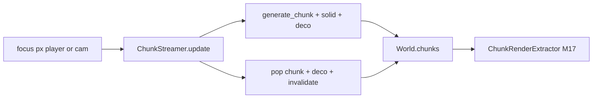

# M18 — Chunk-Streaming

## Ziel

Die Demo startet nicht mehr mit 256 festen Chunks ([`generate_demo_world(16,16)`](game_core/world_gen.py)), sondern hält nur ein **Fenster geladener Chunks** um den Fokus — prozedural unbegrenzt in alle Richtungen.



**Scope laut Entscheidung:**
- **Save/Load:** Im Streaming-Modus `Ctrl+S` / `Ctrl+L` → stderr-Hinweis, kein I/O
- **Decorations:** Deterministisch beim Chunk-Laden (`hash(cx,cy)`), beim Unload aus `world.decorations` entfernen

## Kern — [`game_core/chunk_streaming.py`](game_core/chunk_streaming.py) (neu)

```python
@dataclass
class ChunkStreamer:
    load_radius: int = 8          # Chunks um Fokus (Manhattan oder Chebyshev — Chebyshev empfohlen)
    unload_radius: int = 10       # load_radius + Hysterese gegen Load/Unload-Flackern
```

**Hilfsfunktionen:**
- `focus_to_chunk(focus_x, focus_y) -> (cx, cy)` — über `CHUNK_SIZE_PX`
- `coords_in_radius(center, radius) -> set[tuple[int,int]]` — Chebyshev (`max(|dx|,|dy|) <= radius`)

**`update(world, focus_x, focus_y, content, collision, extractor) -> None`:**

1. `center = focus_to_chunk(focus_x, focus_y)`
2. `wanted = coords_in_radius(center, load_radius)`
3. `keep = coords_in_radius(center, unload_radius)`

**Laden** — für `coord in wanted - world.chunks.keys()`:
- `world.chunks[coord] = generate_chunk(cx, cy)` aus [`world_gen.generate_chunk`](game_core/world_gen.py)
- `world.rebuild_chunk_solid(coord, content, collision)`
- `populate_chunk_decorations(world, content, cx, cy)` (neu, siehe unten)

**Entladen** — für `coord in world.chunks.keys() - keep`:
- `remove_decorations_in_chunk(world, coord)` (neu)
- `world.chunks.pop(coord)`
- `world.dirty_chunks.discard(coord)`
- `world.collision_dirty_chunks.discard(coord)`
- `extractor.invalidate(coord)` — M17-Hook

Rückgabe optional: `(loaded_count, unloaded_count)` für Demo-Titel.

## Decorations — [`game_core/world_gen.py`](game_core/world_gen.py)

Neue Funktionen (deterministisch, kein RNG ohne Seed):

- **`populate_chunk_decorations(world, content, cx, cy)`**
  - Hash aus `(cx, cy)` → ob/welche Decoration an lokalem Tile (z. B. 1 Baum pro ~4 Chunks, Bush seltener)
  - Nur Kategorien aus `content.decorations` (Rotation wie in `populate_demo_decorations`, aber chunk-lokal)
  - Welt-Tile: `wx = cx * CHUNK_SIZE_TILES + tx`

- **`remove_decorations_in_chunk(world, coord)`**
  - Tile-Bereich des Chunks: `wx in [cx*8, cx*8+7]`, `wy` analog
  - Filter `world.decorations` (tile-snapped Anker via `int(placed.world_x) // TILE_SIZE_PX`)

Bestehende `populate_demo_decorations()` bleibt für Tests/Fixed-World unverändert.

## World-Helfer (optional, minimal)

In [`game_core/world.py`](game_core/world.py) oder nur in `chunk_streaming.py`:
- `decoration_chunk_coord(placed) -> (cx, cy)` — für Filter beim Unload

Kein `World.remove_chunk()` nötig, wenn Logik im Streamer bleibt.

## Demo — [`apps/chunk_world_demo.py`](apps/chunk_world_demo.py)

| Änderung | Detail |
|----------|--------|
| Start | `world = World()` leer; `streamer = ChunkStreamer()` |
| Initial | `streamer.update(...)` um Spawn `(256, 256)` (Chunk ~4,4); dann `spawn_character_at_center` |
| Pro Frame | **Vor** Bewegung/Pinseln: Fokus = `player.camera_focus_*` (Follow) oder `cam_x/cam_y` (Free-Cam) → `streamer.update(...)` |
| Konstanten | `WORLD_COLS/ROWS` entfernen; `_world_center_px` durch festen Spawn ersetzen |
| Save/Load | Wenn `streaming_mode`: stderr `"Save/Load nicht im Streaming-Modus"` und `continue` |
| Titel | `loaded N chunks` ergänzen |

`streaming_mode = True` als Modul-Konstante (kein Toggle in v1).

## Integration mit bestehenden Meilensteinen

| Meilenstein | Verhalten |
|-------------|-----------|
| **M17** | `invalidate(coord)` bei Unload; neue Chunks lazy im Cache beim ersten sichtbaren `extract()` |
| **M15** | `rebuild_chunk_solid` nur für neu geladene Chunks |
| **M14/Nav** | `get_tile() → None` auf entladenen Chunks = blockiert — deshalb **Streaming vor Bewegung** |
| **M16** | Deaktiviert in Streaming-Demo (v1) |
| **M12b Pinsel** | Funktioniert nur auf geladenen Chunks (`set_tile` gibt False wenn Chunk fehlt — nach `update` ok) |

## Tests — neu: [`tests/test_chunk_streaming.py`](tests/test_chunk_streaming.py)

Ohne GPU — Mock-`extractor` mit `invalidate` spy:

1. **load_radius** — leere World, `update` bei (0,0): `len(world.chunks) == (2*8+1)²` (121 bei radius 8)
2. **unload** — Fokus weit weg bewegen: alte Chunks nicht mehr in `world.chunks`
3. **deterministic_deco** — gleicher `(cx,cy)` zweimal laden → gleiche Decoration-IDs
4. **unload_removes_deco** — Decoration in Chunk, Unload → nicht mehr in `world.decorations`
5. **invalidate_on_unload** — Mock bestätigt `invalidate(coord)` aufgerufen
6. **solid_grid** — neu geladener Chunk hat `chunk.solid_grid is not None` nach update

Bestehende Tests mit `generate_demo_world(16,16)` **unverändert** — Streaming ist Demo-spezifisch.

## Doku — [`docs/ARCHITECTURE.md`](docs/ARCHITECTURE.md)

- Meilenstein-Tabelle: **M18 | Chunk-Streaming | game_core, apps | ✓**
- Abschnitt M18: Fokus, Radien, Load/Unload, Decorations, Save/Load-Ausnahme, M17/M16-Bezug
- Demo-Zeile: M8–M18, Hinweis Streaming infinite
- Checkliste ergänzen

## Bewusst nicht in M18

- Chunked Save/Load, partieller Spielstand
- Fixed-World ↔ Streaming-Toggle
- Async/Thread-Loading, LRU über `unload_radius` hinaus
- Negative Chunk-Koordinaten-Sonderfälle testen (Python `//` ist fine für negative wx — optional ein Test)

## Validierung

- Demo: weit laufen (WASD) — neue Terrain-Generation, kein Rand
- Free-Cam weit fliegen — Chunks laden/entladen, kein Crash
- Zoom/Pan — keine Render-Lücken (M17-Cull unverändert)
- Ctrl+S/L — Hinweis, kein File-Schreiben
- `PYTEST_DISABLE_PLUGIN_AUTOLOAD=1 python -m pytest tests/test_chunk_streaming.py -q`
