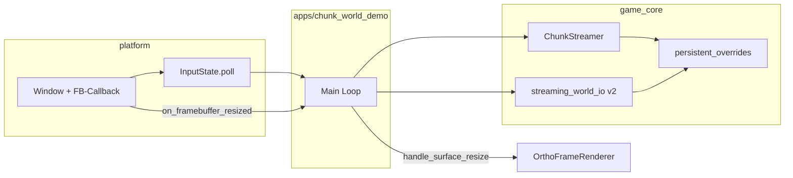

# M20 — Platform-Schale + Streaming-Persistenz

## Ziel

Zwei bisher getrennte Lücken in einem Meilenstein schließen:

1. **Platform-Schale:** GLFW-Input und Framebuffer-Resize zentral in [`platform/`](platform/), Demo wird dünn.
2. **Streaming-Save:** `Ctrl+S`/`Ctrl+L` im Streaming-Modus — nur **vom Spieler geänderte Chunks** (User-Wahl), prozedurale Baseline für den Rest.



**Nicht im Scope:** Async I/O, binäres Format, Migration aller Demos, Wasser/walkable-Fix, `render_*`-Änderungen.

---

## Teil A — Platform Input & Resize

### A1. [`platform/window.py`](platform/window.py)

- GLFW `set_framebuffer_size_callback` registrieren.
- API: `on_framebuffer_resized(callback: Callable[[int, int], None])` — Liste von Callbacks, nach stabiler Größe (bestehende `_wait_for_framebuffer_stable`-Logik bei `toggle_fullscreen` beibehalten).
- Optional: `set_window_title(title: str)` — kapselt `glfw.set_window_title`, Demo importiert kein `glfw` mehr für Titel.

### A2. Neu: [`platform/input.py`](platform/input.py)

Zentrale Input-Erfassung pro Frame:

```python
@dataclass(frozen=True, slots=True)
class InputFrame:
    keys_held: frozenset[str]      # z.B. "W", "F11", "LEFT_SHIFT"
    keys_pressed: frozenset[str]   # Rising edge dieses Frames
    ctrl_held: bool
    shift_held: bool
    mouse_left: bool
    mouse_right: bool
    scroll_delta: float            # akkumuliert seit letztem poll
    cursor_fb: tuple[float, float] # HiDPI-korrigiert
    escape: bool
    should_close: bool             # aus window.should_close
```

- `InputState(window: Window)` — hält `_prev_keys`, `_scroll_pending`.
- `poll() -> InputFrame` — ein `glfw.poll_events()` (oder nutzt bereits gepolltes Window), mappt GLFW-Keys auf Namen.
- Scroll: Callback an `Window` oder direkt in `InputState` registrieren (ersetzt Demo-`on_scroll`).
- Hilfsmethoden: `key_pressed(frame, "F")`, `ctrl_combo_pressed(frame, "S")`.

### A3. [`platform/__init__.py`](platform/__init__.py)

Export: `InputState`, `InputFrame` neben `Window`, `WindowConfig`.

### A4. Demo-Refactor [`apps/chunk_world_demo.py`](apps/chunk_world_demo.py)

- `import glfw` entfernen.
- `InputState` + `window.on_framebuffer_resized(lambda w,h: renderer.handle_surface_resize())`.
- `last_fb_size`-Polling entfernen (M19-Workaround).
- Alle `_key`/`_ctrl_key_edge`/`_movement_vector`-Helfer durch `InputFrame` ersetzen.
- F11: `input.key_pressed(frame, "F11")` → `window.toggle_fullscreen()` (Resize-Callback übernimmt Swapchain).

### A5. [`game_core/paint_brushes.py`](game_core/paint_brushes.py)

- `apply_paint_at_cursor(..., input_frame: InputFrame)` statt `window: Window`.
- `apply_tile_brush_palette(..., input_frame, wx, wy)` — Maus/Tasten aus `InputFrame`; `_GLFW_KEY_BY_NAME` bleibt intern für JSON-Key-Mapping, Abfrage über `key in input_frame.keys_held`.
- `_framebuffer_cursor` → `input_frame.cursor_fb`.

**Scope:** Nur `chunk_world_demo` + `paint_brushes` — andere Demos behalten direktes GLFW (kein M20-Zwang).

---

## Teil B — Streaming-Persistenz

### B1. Problem: Datenverlust beim Unload

Aktuell in [`game_core/chunk_streaming.py`](game_core/chunk_streaming.py) Zeile 72–78:

```python
remove_decorations_in_chunk(world, coord)
world.chunks.pop(coord)
world.dirty_chunks.discard(coord)  # ← Edits gehen verloren
```

**Fix:** Override-Cache im Streamer + selektives Decoration-Entfernen.

### B2. [`game_core/decorations.py`](game_core/decorations.py)

```python
@dataclass(slots=True)
class PlacedDecoration:
    world_x: float
    world_y: float
    decoration_id: str
    procedural: bool = False
```

- [`game_core/world_gen.py`](game_core/world_gen.py): `populate_chunk_decorations` / `populate_demo_decorations` → `procedural=True`.
- User-Pinsel via `place_decoration` → `False` (Default).

### B3. [`game_core/chunk_streaming.py`](game_core/chunk_streaming.py)

Erweiterung `ChunkStreamer`:

| Feld/Methode | Rolle |
|--------------|--------|
| `persistent_overrides: dict[tuple[int,int], Chunk]` | RAM-Cache für geänderte + aus Save geladene Chunks |
| `_flush_dirty_chunk(world, coord)` | Vor Unload: wenn `coord in world.dirty_chunks` → Chunk deep-copy in `persistent_overrides` |
| `_resolve_chunk(cx, cy)` | Override → `persistent_overrides[coord]`, sonst `generate_chunk` |
| `load_persistent_overrides(dict)` | Nach Load aus Disk |
| `clear_persistent_overrides()` | Neues Spiel |

**Load-Logik** (Zeile 63–70):

```python
if coord in self.persistent_overrides:
    world.chunks[coord] = copy_chunk(self.persistent_overrides[coord])
else:
    world.chunks[coord] = generate_chunk(cx, cy)
    populate_chunk_decorations(...)
```

**Unload-Logik:**

```python
self._flush_dirty_chunk(world, coord)
remove_procedural_decorations_in_chunk(world, coord)  # neu: nur procedural=True
world.chunks.pop(coord)
world.dirty_chunks.discard(coord)
```

Neue Hilfsfunktion in [`world_gen.py`](game_core/world_gen.py): `remove_procedural_decorations_in_chunk` (Filter auf `procedural`).

### B4. Neu: [`game_core/streaming_world_io.py`](game_core/streaming_world_io.py)

Save **Version 2**, Verzeichnis statt Monolith:

```
saves/streaming_world/
├── manifest.json
└── chunks/
    ├── 8_16.json
    └── -1_0.json   # negative coords: "cx_cy" encoding
```

**`manifest.json`:**

```json
{
  "version": 2,
  "chunk_size_tiles": 8,
  "player": { ... },
  "decorations": [ ... non-procedural only ... ],
  "chunk_coords": [[8, 16], [-1, 0]]
}
```

**`chunks/cx_cy.json`:** Reuse `_chunk_to_dict` / `_chunk_from_dict` aus [`world_io.py`](game_core/world_io.py) (intern importieren, nicht duplizieren).

| Funktion | Verhalten |
|----------|-----------|
| `save_streaming_world(dir, world, player, streamer)` | Schreibt `persistent_overrides` + aktuell geladene `dirty_chunks` (Union, dedupliziert); Decorations: alle mit `procedural=False`; Player in manifest |
| `load_streaming_world(dir) -> StreamingSnapshot` | Liest manifest + chunk files → `persistent_overrides`, `player`, `decorations` |
| `DEFAULT_STREAMING_SAVE_DIR` | `saves/streaming_world/` |

Nach Save: optional `world.dirty_chunks` leeren, Overrides bleiben im Streamer.

**M16 bleibt:** [`world_io.py`](game_core/world_io.py) unverändert für Fixed-World (`STREAMING_MODE=False` Pfad).

### B5. Demo Save/Load

In [`apps/chunk_world_demo.py`](apps/chunk_world_demo.py):

- `Ctrl+S` → `save_streaming_world(...)` (Streaming-Modus).
- `Ctrl+L` → `load_streaming_world` → `world = World()`, `streamer.clear_persistent_overrides()`, `streamer.load_persistent_overrides(...)`, `world.decorations = snapshot.decorations`, `player = snapshot.player`, `extractor.set_world(world)`, `extractor.invalidate_all()`, Streamer-Update am Player-Fokus.
- Entfernen der `STREAMING_MODE`-Blockade für Save/Load.

---

## Teil C — Tests

| Datei | Tests |
|-------|--------|
| Neu: `tests/test_platform_input.py` | `InputState` edge detection, scroll akkumuliert, cursor_fb-Skalierung (Mock Window oder minimal GLFW — bevorzugt reine Unit-Tests mit injiziertem Key-State wenn möglich) |
| Neu: `tests/test_streaming_world_io.py` | Roundtrip manifest+chunks; nur dirty coords geschrieben; negative coords |
| Erweitern: `tests/test_chunk_streaming.py` | Dirty chunk überlebt unload in `persistent_overrides`; Override statt `generate_chunk`; procedural deco entfernt, user deco bleibt |
| Bestehend: `tests/test_world_io.py` | unverändert (M16) |

---

## Teil D — Dokumentation

[`docs/ARCHITECTURE.md`](docs/ARCHITECTURE.md):

- Meilenstein-Tabelle: **M20** eintragen.
- Abschnitt M20 mit Platform-API, Save v2 Format, Override-Modell, Demo-Bindings.
- M18 „bewusst nicht: Chunked Save“ → erledigt durch M20.
- Demo-Zeile: `Ctrl+S`/`Ctrl+L` im Streaming.

---

## Definition of Done

- [ ] `chunk_world_demo` ohne `import glfw`
- [ ] FB-Resize via Callback, kein `last_fb_size`-Polling
- [ ] `Ctrl+S`/`Ctrl+L` speichert/lädt nur dirty/override Chunks + Player + user Decorations
- [ ] Gemalte Chunks überleben Unload (Override-Cache)
- [ ] User-Decorations überleben Unload; prozedurale werden beim Unload entfernt
- [ ] M16 Fixed-World Save weiterhin funktional (wenn `STREAMING_MODE=False`)
- [ ] Tests grün; ARCHITECTURE.md aktualisiert

---

## Umsetzungsreihenfolge

1. `platform/input.py` + Window-Resize-Callback
2. `chunk_world_demo` auf Platform-Input umstellen
3. `PlacedDecoration.procedural` + Unload-Fix
4. `ChunkStreamer.persistent_overrides` + Load/Unload-Logik
5. `streaming_world_io.py` + Demo Save/Load
6. Tests + ARCHITECTURE.md
