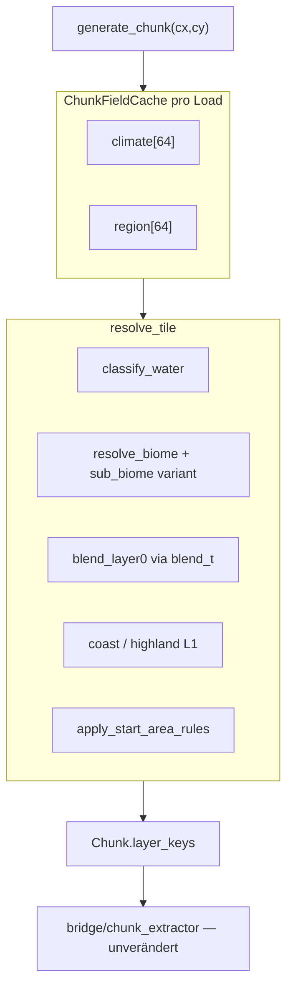

# M21-Rest + M22 — Umsetzungsplan

## Ausgangslage

M21-Kern steht ([`game_core/world_gen.py`](game_core/world_gen.py), [`noise.py`](game_core/noise.py), [`biomes.py`](game_core/biomes.py), Debug-Demo, Save v3). Offen laut [`milestones_detailed/world-gen.md`](milestones_detailed/world-gen.md) und Review:

| Lücke | Heute |
|-------|--------|
| `blend_t` semantisch | Nur in `BiomeRegionSample` + Debug-Farbe — **nicht** in `resolve_tile` / Deko |
| `ChunkFieldCache` | Pro Tile mehrfach `sample_climate` + `sample_biome_region` (~12 Min. Test-Suite) |
| Debug-Modus `Decorations` | Fehlt in [`apps/world_gen_debug_demo.py`](apps/world_gen_debug_demo.py) |
| Startgebiet | [`apply_start_area_rules`](game_core/world_gen.py) erzwingt `plains` — **kein** Seed-Scoring |
| M22 Blend-Tiles | Noch nicht implementiert |
| Sub-Biom-Noise | Noch nicht implementiert |

**Entscheidungen:** Layer-0-Mix bei Biom-Grenzen; Sub-Biom-Noise in M22 einplanen.

**Hinweis ruleset:** In [`ruleset.md`](ruleset.md) steht unter M22 „Bewusst nicht: Biom-Übergänge“ — widerspricht dem M22-Ziel. Beim Abschluss ruleset bereinigen (Blend-Tiles **ist** M22).

---

## Architektur nach Abschluss



---

## Phase A — M21-Rest: Performance (ChunkFieldCache)

**Ziel:** Ein Sample-Pass pro Chunk (8×8), Wiederverwendung in Tile-Auflösung und Deko.

**Neu in [`game_core/world_gen.py`](game_core/world_gen.py):**

```python
@dataclass
class ChunkFieldCache:
    coord: tuple[int, int]
    climate: tuple[ClimateSample, ...]   # len 64, ty*8+tx
    region: tuple[BiomeRegionSample, ...]

def build_chunk_field_cache(cx, cy, config) -> ChunkFieldCache
def resolve_tile_cached(tx, ty, cache, config, biomes) -> ResolvedTileSample
```

**Anpassungen:**
- `generate_chunk_terrain` / `populate_chunk_decorations` nutzen Cache statt erneuter Noise/Voronoi-Calls
- Öffentliche API `resolve_tile(wx, wy)` bleibt — baut intern Mini-Cache oder delegiert

**DoD:** Streaming-Tests deutlich schneller (Ziel: Full-Suite unter ~3 Min. statt ~12 Min.); bestehende Naht-/Determinismus-Tests unverändert grün.

**Tests:** [`tests/test_world_gen_climate.py`](tests/test_world_gen_climate.py) — Cache vs. Direct-Sample identisch pro `(wx, wy)`.

---

## Phase B — M22: Layer-0-Biom-Blend

**Ziel:** `blend_t` steuert sichtbare Übergänge auf **Layer 0** zwischen `nearest_biome` und `second_biome`.

**Logik in [`game_core/biomes.py`](game_core/biomes.py) + `resolve_tile`:**

```python
def resolve_blended_layer0(
    region: BiomeRegionSample,
    biomes_config: BiomesConfig,
    *,
    blend_threshold: float,  # aus world_gen.json
) -> tuple[str, BiomeId]:
    # blend_t nahe 0 → second_biome Layer 0
    # blend_t nahe 1 → nearest Layer 0
    # optional: dedizierter transition-Key aus biomes.json
```

**Erweiterung [`assets/content/biomes.json`](assets/content/biomes.json):**

```json
"blend": {
  "threshold": 0.45,
  "transitions": {
    "desert|savanna": "wt:tiles/sand",
    "savanna|plains": "wt:tiles/dirt"
  }
}
```

- Paar-Keys normalisiert (`min|max` Biom-Id) → optionaler Übergangs-Tile auf L0
- Fallback ohne Eintrag: bei `blend_t < 0.5` → `tile_mapping_for_biome(second_biome).layer0`, sonst nearest

**Wasser:** Blend nur auf Land — Wasser weiterhin rein height-basiert.

**Deko-Blend (M22 Teil B2):** In [`populate_chunk_decorations`](game_core/world_gen.py): in Blendzone erlaubte IDs aus **beiden** Biomen, Dichte interpoliert mit `blend_t`.

**Tests:** [`tests/test_world_gen_voronoi.py`](tests/test_world_gen_voronoi.py) + neues `tests/test_world_gen_blend.py` — synthetische `BiomeRegionSample`-Fixtures, L0-Key wechselt über `blend_t`.

**Assets:** Ggf. 1–2 neue Übergangs-Platzhalter in [`tiles.json`](assets/content/tiles.json) + `bake_atlas` (nur wenn transitions neue Keys brauchen).

---

## Phase C — M22: Sub-Biom-Noise

**Ziel:** Variation innerhalb einer Voronoi-Zelle ohne neue Regionen — dritte, feine Noise-Schicht.

**Config [`assets/content/world_gen.json`](assets/content/world_gen.json):**

```json
"sub_biome": {
  "scale": 0.015,
  "octaves": 2,
  "lacunarity": 2.0,
  "persistence": 0.5
}
```

**Implementierung:**
- `WorldGenConfig` + `_fbm_for(config, "sub_biome")`
- `pick_biome_variant(climate_class, cell_hash, sub_sample, biomes_config) -> BiomeId` — wählt aus `climate_classes[].biomes[]` per `(cell_hash ^ quantize(sub_sample))` statt nur `cell_hash`
- Einbindung in `sample_biome_region` / `resolve_biome` — **nach** Klimaklasse, **vor** Tile-Mapping

**DoD:** Gleiche Zelle zeigt leichte Biom-Variation (z. B. plains vs. mixed_forest), aber große Klimazonen bleiben stabil; chunk-stabil und seed-stabil.

**Debug:** Optional neuer Modus `SubBiome` in Debug-Demo oder Erweiterung `FinalBiome`.

---

## Phase D — M21-Rest: Startgebiet + Seed-Qualität

**Ziel:** Spielbare Starts über viele Seeds — nicht nur radiales `plains`-Override.

**Neu in [`game_core/world_gen.py`](game_core/world_gen.py):**

```python
def score_spawn_area(config) -> float:
    """0..1 — Landanteil, kein Deep-Water im Kern, minimale Fragmentierung."""

def ensure_playable_seed(config, max_attempts=32) -> WorldGenConfig:
    """Für G-Regen / initial load: Seed erhöhen bis score >= min_score."""
```

**Config-Erweiterung `world_gen.json` → `start_area`:**

- `min_score` (z. B. 0.6)
- `sample_grid_radius` (Tiles um Spawn)
- `max_seed_attempts`

**Verfeinerung `apply_start_area_rules`:**
- Nur eingreifen wenn `score < min_score` **oder** Tile wäre Deep-Water im Kern
- Sanftere Abstufung statt hartem `plains` everywhere (Falloff beibehalten)

**Demo [`apps/chunk_world_demo.py`](apps/chunk_world_demo.py):** `G`-Regen ruft `ensure_playable_seed` auf; Titel zeigt `seed` + `score`.

**Tests:** `tests/test_world_gen_spawn.py` — Mock-Configs, Score monoton bei mehr Land.

---

## Phase E — M21-Rest: Debug-Modus Decorations

**Ziel:** Spec [`world-gen.md`](milestones_detailed/world-gen.md) Modus `Decorations`.

**[`apps/world_gen_debug_demo.py`](apps/world_gen_debug_demo.py):**
- `DebugMode.DECORATIONS` + Taste `D`
- Chunk-Generierung wie `TERRAIN`, danach `populate_chunk_decorations` pro geladenem Chunk
- Streaming unverändert, nur Demo lädt Deko explizit

Kein Renderer-Eingriff — bestehende Decoration-Pipeline.

---

## Phase F — Dokumentation + ruleset

- [`ruleset.md`](ruleset.md): M21 als ✅ mit Rest-Punkten abgehakt; M22 präzisieren (Blend L0, Sub-Biom, Deko-Blend); widersprüchliche „Bewusst nicht“-Zeile entfernen
- [`docs/ARCHITECTURE.md`](docs/ARCHITECTURE.md): Abschnitt M22, Datenfluss mit Cache + Blend + Sub-Biom
- [`milestones_detailed/world-gen.md`](milestones_detailed/world-gen.md): optional kurzer „Completed / M22 moved“-Verweis (nur wenn gewünscht)

---

## Liefer-Reihenfolge (PR-freundlich)

1. **Phase A** — ChunkFieldCache + Performance-Tests
2. **Phase B** — Layer-0-Blend + biomes.json + Tests
3. **Phase C** — Sub-Biom-Noise + Tests
4. **Phase D** — Spawn-Scoring + Demo-Integration
5. **Phase E** — Debug Decorations
6. **Phase F** — Docs/ruleset

---

## Bewusst nicht in diesem Paket

- Rivers/Hydrologie, Ore/Ressourcen (→ M23)
- `resource_profile` in `ResolvedTileSample` (→ M23)
- GPU-Noise, async Worldgen
- Wetter/Tageszeit pro Biom
- Biom-Metadaten-Cache in [`game_core/world.py`](game_core/world.py) (optional laut Spec — nur bei Bedarf)
