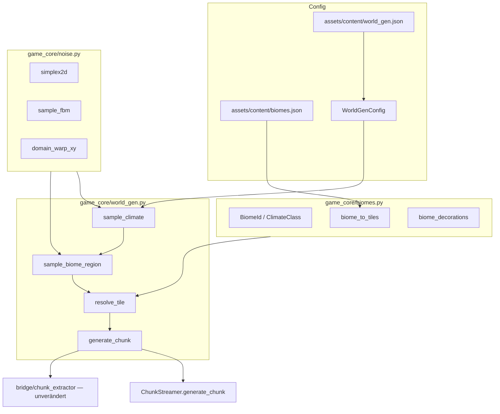

# M21 — Hybrid World-Gen (world-gen.md)

## Entscheidungen (geklärt)

| Thema | Wahl |
|-------|------|
| Noise | **fBM-Simplex**, eigene Implementierung in [`game_core/noise.py`](game_core/noise.py), keine PyPI-Dependency |
| Tiles | **Neue Placeholder-Tiles backen** (`deep_water`, `shallow_water`, `sand`, `snow`) + Einträge in `tiles.json`, `bake_atlas`, Collision |
| Spec-Autorität | [`milestones_detailed/world-gen.md`](milestones_detailed/world-gen.md) — absorbiert ruleset M21+M22; [`ruleset.md`](ruleset.md) wird nach Abschluss angepasst |

## Architektur-Überblick



**Kernprinzip:** Alle Samples in **Welt-Tile-Koordinaten** `(wx, wy)`, nie chunk-lokal. Pro Chunk einmal ein `ChunkFieldCache` (8×8 oder feineres Grid) für Height/Temp/Moisture/Warp — Wiederverwendung in Tile-, Biom- und Deko-Schritten.

## Phase 0 — Fundament (vor Schritt 1)

### Assets & Registry

Neue Keys in [`assets/content/tiles.json`](assets/content/tiles.json):

- `wt:tiles/deep_water` — layer 0, `walkable: false`
- `wt:tiles/shallow_water` — layer 0, `walkable: false` (oder true falls gewünscht; konsistent halten)
- `wt:tiles/sand` — layer 0
- `wt:tiles/snow` — layer 0

Anpassungen:

- [`tools/bake_atlas.py`](tools/bake_atlas.py) — `PLACEHOLDER_SPECS` um 4 Farb-Platzhalter erweitern
- PNGs unter `assets/sprites/tiles/` erzeugen (via `--generate-placeholders` oder manuell)
- Atlas neu backen → [`assets/demo_atlas/`](assets/demo_atlas/)
- [`tools/bake_collision.py`](tools/bake_collision.py) für neue Tile-Sprites ausführen

### Config & globaler Kontext

Neue Dateien:

- [`assets/content/world_gen.json`](assets/content/world_gen.json) — alle Parameter aus world-gen.md (height_*, sea_level, shallow_water_band, biome_*, temperature_scale, moisture_scale, start_area_*)
- [`assets/content/biomes.json`](assets/content/biomes.json) — Biom-Listen pro ClimateClass, Tile-Mapping, erlaubte Decorations (Schritt 7+)

[`game_core/world_gen.py`](game_core/world_gen.py) erhält:

```python
@dataclass
class WorldGenConfig: ...

_active_config: WorldGenConfig | None = None

def load_world_gen_config(path) -> WorldGenConfig: ...
def configure_world_gen(config: WorldGenConfig) -> None: ...
def get_world_gen_config() -> WorldGenConfig: ...
```

**Seed-Strategie:** Ein globaler `world_seed` in `WorldGenConfig` (nicht chunk-lokal). Optional XOR-Mixing für Sub-Generatoren wie in ruleset — aber **Hauptdeterminismus über Weltkoordinaten + world_seed**, nicht `(cx,cy)`-only.

**Streaming-Persistenz:** Manifest v3 in [`game_core/streaming_world_io.py`](game_core/streaming_world_io.py) um Feld `"world_seed"` erweitern; Load setzt `configure_world_gen()`. Ohne Seed-Feld → Default aus JSON (Abwärtskompatibel).

### [`game_core/noise.py`](game_core/noise.py)

- `simplex2d(x, y, seed) -> float` in `[0, 1]` oder `[-1, 1]` (intern konsistent)
- `sample_fbm(wx, wy, *, octaves, lacunarity, persistence, scale, seed, offsets) -> float` — vorkalkulierte Frequenz/Amplitude-Arrays pro `WorldGenConfig`-Instanz
- `domain_warp_xy(wx, wy, *, frequency, magnitude, seed) -> tuple[float, float]`

Simplex-Referenz: klassischer 2D-Gradient-Simplex (Ken Perlin / Stefan Gustavson), ~80–120 Zeilen, deterministisch, seed via Permutationstabelle.

---

## Phase 1 — Schritt 1–2: Height + Klima

### Datenstrukturen (in `world_gen.py` oder `world_gen_types.py`)

```python
@dataclass(frozen=True)
class ClimateSample:
    height: float
    temperature: float
    moisture: float
    continentalness: float
    warp_x: float
    warp_y: float
    water_depth_like: float  # optional, height - sea_level
```

### Schritt 1 — Height + Wasser

- `sample_height(wx, wy, config) -> float` — fBM-Simplex, normalisiert
- `classify_water(height, config) -> WaterClass` — `DEEP`, `SHALLOW`, `LAND`
- `generate_chunk(cx, cy)` **Schritt-1-Modus:** nur Layer 0 mit `deep_water` / `shallow_water` / `grass` (Land-Platzhalter bis Schritt 8)
- Ersetzt [`_tile_key_for_chunk`](game_core/world_gen.py) Demo-Schachbrett

**DoD:** Unit-Tests Determinismus + Chunk-Naht-Stabilität `(wx, wy)` an Grenze.

### Schritt 2 — Klima-Felder

- `sample_climate(wx, wy, config) -> ClimateSample` — Temp/Moisture mit größerem `scale`, weniger Oktaven als Height
- Noch **keine** Biom-Ableitung — nur Felder füllen

### Debug-Demo (Start)

Neue App [`apps/world_gen_debug_demo.py`](apps/world_gen_debug_demo.py) — Kopie des Musters aus [`apps/chunk_world_demo.py`](apps/chunk_world_demo.py):

- Streaming + Free-Cam
- Tasten 1–4: Modi `Height`, `Water`, `Temperature`, `Moisture`
- Visualisierung: Sample-Wert → quantisierte Bucket → farbige Tile-Keys (nutzt neue + bestehende Tiles als Farbpalette)
- Kein Renderer-Eingriff — nur andere Tile-Keys in `generate_chunk_debug(cx, cy, mode, config)`

Eintrag in [`pyproject.toml`](pyproject.toml): `wt-world-gen-debug = "apps.world_gen_debug_demo:main"`

---

## Phase 2 — Schritt 3–6: Voronoi-Pipeline

### [`game_core/biomes.py`](game_core/biomes.py) (Grundgerüst)

```python
class ClimateClass(Enum): NEUTRAL, HOT_HUMID, HOT_DRY, COLD_HUMID, COLD_DRY
class BiomeId(Enum): ...  # desert, taiga, plains, ...
```

### Schritt 3 — Rohes Voronoi

- `hash_cell(cell_x, cell_y, seed) -> int` — Integer-Hash wie Unity `BiomeMath`
- `seed_point_in_cell(cell_x, cell_y, cell_size, seed) -> tuple[float, float]`
- `sample_biome_region_raw(wx, wy, config) -> BiomeRegionSample` — 3×3 Nachbarn, nearest only

`BiomeRegionSample`: `cell_x`, `cell_y`, `nearest_biome`, `distance_1`, …

Debug-Modi: `VoronoiCells`, `SeedPoints` (Layer 1 Marker-Tiles oder Deko-less grid lines via Tile-Farben)

### Schritt 4 — Klimaklassen pro Region

- `climate_class_at(wx, wy, config) -> ClimateClass` — aus globalen Temp/Moisture + `neutral_climate_width`
- Pro Zelle: Klasse am Zell-Seed-Punkt oder Zellmittelpunkt (konsistent dokumentieren)
- Debug-Modus: `ClimateClass`

### Schritt 5 — Domain Warp

- Warp vor Distanzvergleich in `sample_biome_region`
- Debug: Toggle `VoronoiRaw` vs `VoronoiWarp` ( zwei Modi oder Taste)

### Schritt 6 — Border Blend

- `border_distance = distance_2 - distance_1`, `blend_t` wenn `< biome_blend_width`
- `BiomeRegionSample` vollständig: `second_biome`, `distance_2`, `blend_t`
- Debug-Modus: `VoronoiBlend`

**Tests:** Hash-Stabilität, 3×3-Suche Grenzfälle, `blend_t ∈ [0,1]`, Nachbar-Chunk identisch an `(wx, wy)`.

---

## Phase 3 — Schritt 7–8: Biome + Tiles

### Schritt 7 — Landbiome auflösen

- `resolve_biome(climate, region, water_class, config) -> BiomeId`
- Wasser **immer** über Height, Land über ClimateClass + Zell-Variation (Hash-basierte Auswahl aus erlaubter Liste in `biomes.json`)
- Debug-Modus: `FinalBiome`

### Schritt 8 — Tile-Mapping

- `resolve_tile(wx, wy, config) -> ResolvedTileSample` mit `tile_key_layer0`, `tile_key_layer1`, `biome_id`, `is_walkable`
- `generate_chunk()` produziert echte [`Chunk.layer_keys`](game_core/world.py) — Layer 1 für Küsten/Schneeinseln/Ufer (sand-Ränder, path-ähnliche Overlays sparsam)
- `generate_chunk_terrain(cx, cy, config) -> dict[int, list[str]]` wie ruleset — von `generate_chunk` aufgerufen

**Integration:** [`game_core/chunk_streaming.py`](game_core/chunk_streaming.py) ruft weiter `generate_chunk(cx, cy)` — Config muss vorher via Demo/Save gesetzt sein.

---

## Phase 4 — Schritt 9–10: Decorations + Startgebiet

### Schritt 9 — Biomabhängige Decorations

Erweiterung [`populate_chunk_decorations`](game_core/world_gen.py):

- Pro Tile `(wx, wy)`: `BiomeId` → erlaubte IDs aus `biomes.json`, Dichte + deterministischer Sub-Seed `(world_seed, wx, wy)`
- Bestehende `procedural=True` + `remove_procedural_decorations_in_chunk` beibehalten
- Walkability/Solid-Grid via [`world.rebuild_chunk_solid`](game_core/world.py) unverändert

Debug-Modus: `Decorations`

### Schritt 10 — Startgebiet

- `apply_start_area_rules(wx, wy, sample, config) -> ResolvedTileSample` — Radial um `(start_x, start_y)` aus Config
- Regeln: weniger Deep-Water, bevorzugt `NEUTRAL`/gemäßigte Biome, Deko-Dichte reduziert
- [`apps/chunk_world_demo.py`](apps/chunk_world_demo.py):
  - `G` — neuer Random-Seed, nur prozedurale Chunks flushen, **`persistent_overrides` bleiben**
  - Streaming nutzt `configure_world_gen` + optional Save-Seed

---

## Tests (neu/erweitert)

| Datei | Inhalt |
|-------|--------|
| `tests/test_noise.py` | Simplex/fBM Determinismus, Wertebereich, seed-Abhängigkeit |
| `tests/test_world_gen_climate.py` | `sample_climate` Naht-Tests an Chunk-Grenzen |
| `tests/test_world_gen_voronoi.py` | Hash, Seed-Punkte, blend_t |
| `tests/test_world_gen_tiles.py` | `generate_chunk` Layer-Keys, Wasserklassen |
| `tests/test_chunk_streaming.py` | Anpassen: Baseline-Vergleich mit gesetzter Config |
| `tests/test_streaming_world_io.py` | Manifest v3 + `world_seed` Roundtrip |

Bestehende Tests, die feste Demo-Muster erwarten ([`test_chunk_streaming.py`](tests/test_chunk_streaming.py), [`test_streaming_world_io.py`](tests/test_streaming_world_io.py)), auf config-basierte Baselines umstellen.

---

## Dokumentation (nach Implementierung)

- [`ruleset.md`](ruleset.md) — M21 auf Hybrid-Modell erweitern, M22 als „weitgehend in M21 integriert“ markieren oder scope reduzieren
- [`docs/ARCHITECTURE.md`](docs/ARCHITECTURE.md) — M21-Abschnitt: Module, Datenfluss, Config, Debug-Demo, Save v3

---

## Bewusst nicht in M21 (laut world-gen.md)

Ressourcen/Ore, Rivers/Hydrologie, async Job-System, GPU-Noise, Wetter — bleiben für M23+.

## Risiken & Mitigationen

| Risiko | Mitigation |
|--------|------------|
| `generate_chunk()` ohne gesetzte Config | Default aus `world_gen.json` bei Import; Demos rufen `configure_world_gen` explizit |
| Tests brechen durch neues Terrain | Tests nutzen festen Test-Seed + Config-Fixture |
| Debug-Farben unleserlich | Quantisierte 8–12 Buckets, Modi dokumentiert in Demo-Hilfe |
| Performance 3×3 Voronoi × 64 Tiles/Chunk | ChunkFieldCache; optional später Subsampling (nicht M21) |

## Empfohlene Liefer-Reihenfolge (PR-fähige Inkremente)

1. Phase 0 + Schritt 1 + Debug-Demo (Height/Water)
2. Schritt 2 + Klima-Debug-Modi
3. Schritte 3–6 + Voronoi-Debug-Modi
4. Schritte 7–8 + chunk_world_demo zeigt echtes Terrain
5. Schritte 9–10 + Save v3 + Docs
