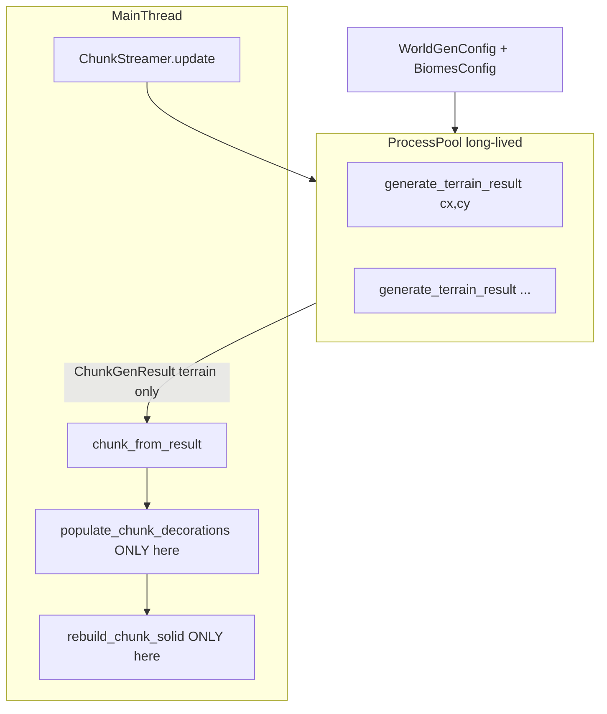

# M22b — Parallel Chunk Generation (rev. 3)

## Motivation

Nach M22 existiert [`ChunkFieldCache`](game_core/world_gen.py) pro Chunk, aber Chunks werden **sequentiell** erzeugt:

- [`generate_demo_world(16, 16)`](game_core/world_gen.py) → 256× `generate_chunk` (~Hauptgrund für ~13 Min. Full-Suite)
- [`ChunkStreamer._load_chunk`](game_core/chunk_streaming.py) → synchron pro fehlendem Chunk
- Noise in [`game_core/noise.py`](game_core/noise.py) ist **reines Python** → Threads wegen GIL ungeeignet

**Ziel:** **Nur Terrain** chunkweise parallelisieren (`ProcessPoolExecutor`); Determinismus `(seed, cx, cy) → identischer Chunk`.

**Scope-Grenze M22b:** In M22b werden **Decorations ausschließlich im Main-Thread** berechnet und angewendet. Worker erzeugen **nur Terrain** (`ChunkGenResult`), **keine** `DecorationPlacement`-Daten.



---

## Architektur-Entscheidungen

| Entscheidung | Wahl | Begründung |
|--------------|------|------------|
| Parallelität | **ProcessPool**, nicht Threads | CPU-bound Simplex/fBM entgeht GIL |
| Worker-Output | **Nur Terrain** | Keine Deko-Grauzone; World-Mutation Main-Thread |
| IPC-Payload | **`ChunkGenResult`**, kein `Chunk` | Pickling-Overhead minimieren |
| Layer-Format M22b | **`tuple[str, ...]`** (Sprite-Keys) | Praktisch jetzt; Tile-IDs später vorbereitet |
| Globals | **`WorldGenContext` pro Worker** | `_cached_fbm` race-anfällig |
| Pool-Lebensdauer | **Langlebig, Recycle Standard** | `warm_fbm_cache()` amortisiert |
| Pool-Recreate | **Nur Seed/Config-Wechsel** | Nicht pro Batch |
| `discard()` | **Discard-on-arrival** | Kein hartes Task-Cancel |
| Debug-Modus | **Parallel aus** | Synchron via `generate_chunk_debug` |
| Fallback | **`parallel.workers: 0`** | Identisch zu heute |

---

## Phase 0 — Benchmarks (Baseline + Vergleichsritual)

### Ausführung

**Script:** [`tools/benchmark_world_gen.py`](tools/benchmark_world_gen.py)

```bash
python tools/benchmark_world_gen.py --label baseline   # Phase 0, vor Parallel
python tools/benchmark_world_gen.py --label parallel   # Phase 5, nach M22b
python tools/benchmark_world_gen.py --compare          # liest beide Labels, druckt Delta
```

### Metriken (fest, pro Run)

| Metrik | Beschreibung |
|--------|--------------|
| `noise_only_s` | `sample_height` + Klima, 64 Tiles × N Chunks |
| `generate_chunk_s` | Voller Terrain-Pfad inkl. `ChunkFieldCache`, N Chunks sequentiell |
| `decorations_s` | `populate_chunk_decorations`, N Chunks |
| `solid_rebuild_s` | `rebuild_chunk_solid`, N Chunks |
| `apply_full_s` | Einhängen + Deko + Solid (wie `_load_chunk`), N Chunks |
| `demo_world_16x16_s` | Gesamtzeit `generate_demo_world(16, 16)` |
| `streaming_first_load_s` | Simuliert Erstload: alle Coords in `load_radius=8` (289 Chunks), sequentiell |

Optional lokal (nicht in CI): CPU-Auslastung pro Kern.

### Speicherort

**Primär:** [`docs/benchmarks/world_gen_m22b.md`](docs/benchmarks/world_gen_m22b.md)

Struktur:

```markdown
# World-Gen Performance — M22b

| Metrik | Baseline (Datum, Commit) | Parallel (Datum, Commit) | Speedup |
|--------|--------------------------|--------------------------|---------|
| demo_world_16x16_s | … | … | …× |
| … | … | … | … |
```

Script schreibt zusätzlich maschinenlesbar: [`docs/benchmarks/world_gen_m22b.json`](docs/benchmarks/world_gen_m22b.json) (Labels als Keys).

**Querverweis:** Kurzer Absatz in [`docs/ARCHITECTURE.md`](docs/ARCHITECTURE.md) → „World-Gen Performance“ verlinkt auf obige Datei.

### DoD Benchmark (Teil von M22b)

- Phase 0: **`baseline`-Zeile** in `world_gen_m22b.md` + JSON geschrieben
- Phase 5: **`parallel`-Zeile** + `--compare`-Output dokumentiert
- Mindestens gemessen: **`demo_world_16x16_s`** und **`streaming_first_load_s`**

### Erfolgskriterium (qualitativ)

M22b gilt performance-seitig als erfolgreich, wenn:

1. **`demo_world_16x16_s` mindestens ~3× schneller** (parallel vs. baseline, gleiche Hardware)
2. **`apply_full_s` nicht zum dominanten Anteil** der Gesamtzeit geworden ist (sonst → M22c Solid-Batching)

Feedback-Loop: Phase 0 schreiben → Phase 3–4 implementieren → Phase 5 erneut schreiben → vergleichen → ggf. M22c planen.

---

## Phase 1 — WorldGenContext (ohne Parallelität)

**Neu:** [`game_core/world_gen_context.py`](game_core/world_gen_context.py)

```python
@dataclass
class WorldGenContext:
    config: WorldGenConfig
    biomes: BiomesConfig
    _fbm_cache: dict[str, object]

    @classmethod
    def from_active(cls) -> WorldGenContext: ...
    def warm_fbm_cache(self) -> None: ...
    def generate_chunk(self, cx: int, cy: int) -> Chunk: ...
    def generate_terrain_result(self, cx: int, cy: int) -> ChunkGenResult: ...
```

**Refactor [`game_core/world_gen.py`](game_core/world_gen.py):** `_fbm_for_ctx`, optionales `ctx`, öffentliche API unverändert.

**DoD:** World-Gen-Tests grün; Benchmark `baseline` nach Refactor optional wiederholen (Drift-Check).

---

## Phase 2 — ChunkGenResult (IPC + Tile-ID-Vorbereitung)

**Neu:** [`game_core/world_gen_result.py`](game_core/world_gen_result.py)

```python
@dataclass(frozen=True, slots=True)
class DecorationPlacement:
    wx: int
    wy: int
    decoration_id: str

@dataclass(frozen=True, slots=True)
class ChunkGenResult:
    coord: tuple[int, int]
    layer0: tuple[str, ...]   # len 64, row-major — M22b: Sprite-Keys (wt:tiles/…)
    layer1: tuple[str, ...]   # len 64
    decorations: tuple[DecorationPlacement, ...] | None = None  # M22b: immer None
```

**M22b-Regel (explizit):** Worker setzen **`decorations=None`**. Feld existiert nur für spätere API-Stabilität; **wird in M22b nicht befüllt**. Decorations laufen ausschließlich über `populate_chunk_decorations()` im Main-Thread nach `chunk_from_result()`.

**Tile-ID-Vorbereitung (bewusster Zwischenstand):**

- M22b nutzt **`tuple[str, ...]`** — praktisch, kein Mapping nötig für `Chunk.from_terrain`
- Spätere Optimierung: `tuple[int, ...]` mit kompakten Tile-IDs
- **Jetzt vorbereiten** in [`game_core/content_registry.py`](game_core/content_registry.py):
  - `tile_key_to_id(key: str) -> int`
  - `tile_id_to_key(tile_id: int) -> str`
  - Stabile IDs aus `tiles.json`-Reihenfolge oder explizitem Registry-Index
- `chunk_from_result()` bleibt der **einzige** Übergang Result → `Chunk`; später nur diese Funktion auf IDs umstellen

**Parität:** `chunk_from_result(r).layer_keys == generate_chunk(cx,cy).layer_keys`

---

## Phase 3 — Batch-Parallelität

**Neu:** [`game_core/world_gen_parallel.py`](game_core/world_gen_parallel.py)

- Langlebiger `ProcessPoolExecutor` via `get_or_create_pool(ctx)` / `shutdown_pool()`
- Worker: `_generate_terrain_task(coord) -> ChunkGenResult` — **nur layer0/layer1**, `decorations=None`
- `generate_results_parallel()` → `dict[coord, ChunkGenResult]`
- `generate_chunks_parallel()` → Wrapper via `chunk_from_result`

**Integration:** [`generate_demo_world`](game_core/world_gen.py) bei `workers > 0`.

**Config:** `parallel.workers` (`"auto"` / `0` / int), `parallel.prefetch` in [`world_gen.json`](assets/content/world_gen.json).

---

## Phase 4 — Streaming-Prefetch

**Neu:** [`game_core/chunk_gen_pool.py`](game_core/chunk_gen_pool.py) — `submit` / `poll_ready` / `discard` / `shutdown`

Zustände: `submitted → running → ready → applied | dropped`. **`discard()` = discard-on-arrival**, kein Abbruch laufender Tasks.

**[`ChunkStreamer`](game_core/chunk_streaming.py):** `poll_ready` → `chunk_from_result` → **`populate_chunk_decorations`** → **`rebuild_chunk_solid`** (alles Main-Thread).

**Performance-Risiko:** Burst-Apply kann Deko/Solid zum Hotspot machen — Benchmark quantifiziert; **M22c** falls nötig (Solid-Batching).

---

## Phase 5 — Tests, Docs, Nachher-Benchmark

**Tests:** Parität layer_keys, `decorations is None` in Worker-Results, `workers=0`, discard-Semantik.

**Docs:** `ruleset.md` M22b, `ARCHITECTURE.md` IPC/Pool/Benchmark-Link.

**Benchmark Phase 5:** `--label parallel` + `--compare`; Tabelle in `docs/benchmarks/world_gen_m22b.md` vervollständigen.

---

## Bewusst nicht in M22b

- Decorations im Worker (auch nicht als Descriptor)
- Parallel `populate_chunk_decorations` / `rebuild_chunk_solid`
- `tuple[int, ...]` Tile-IDs in IPC (nur Hook vorbereiten)
- GPU-Noise, Numba/Cython, pytest-xdist, hartes Task-Cancel
- M23 Ore/Ressourcen

---

## Future Work (M22c+)

| Thema | Beschreibung |
|-------|--------------|
| **Tile-ID-IPC** | `ChunkGenResult.layer0/layer1` → `tuple[int, ...]`; Mapping nur in `chunk_from_result` |
| **Worker-Deko-Descriptors** | Nur wenn Benchmark zeigt Deko als Bottleneck; derzeit explizit ausgeschlossen |
| **Solid-Rebuild-Batching** | `rebuild_chunk_solid` defer/batch nach Burst-Load |
| **Numba/Cython Noise** | Alternative zu Process-Overhead |

---

## Erwarteter Nutzen

| Szenario | Baseline (typ.) | Ziel parallel | Messung |
|----------|-----------------|---------------|---------|
| `demo_world_16x16` | ~13 Min. Suite-Anteil dominant | **≥3×** | `demo_world_16x16_s` |
| Full-Suite | ~13 Min. | **~2–4 Min.** | pytest gesamt |
| Streaming Erstload | spürbar | Prefetch über Frames | `streaming_first_load_s` |

Speedup **3–6×** auf Worldgen realistisch; kein linearer 8× wegen Main-Thread-Nacharbeit (Deko + Solid).

---

## Liefer-Reihenfolge

1. **Phase 0** — Benchmark-Script + `docs/benchmarks/world_gen_m22b.md` (**baseline**)
2. **Phase 1** — `WorldGenContext`
3. **Phase 2** — `ChunkGenResult` + `tile_key_to_id`-Hook + `chunk_from_result`
4. **Phase 3** — Batch-Parallel + Tests
5. **Phase 4** — Streaming-Prefetch + Demos
6. **Phase 5** — Docs + **parallel**-Benchmark + `--compare`
