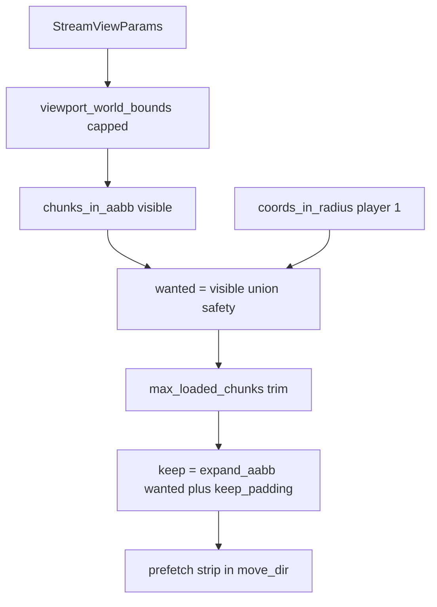

# M22d — Hybrides Chunk-Streaming

## 1. Empfehlung

**Verbindliche Richtung:** `ChunkStreamer` wechselt von reinem Radius-Modus auf **`mode: hybrid`** als neuen Default. Kern ist eine reine Mathe-Schicht in `game_core` (`StreamViewParams` + `compute_stream_sets`), die aus Fokus/Zoom/Viewport die Mengen `visible`, `wanted`, `keep`, `prefetch` berechnet.

**Warum besser als rein radius-basiert (heute `load_radius=8` → 289 Chunks):**
- Beobachtete Daten: `loaded=17`, `stream=5–17 s` pro Chunk-Grenze; Catch-up `loaded=65` einmalig ~17,5 s.
- 289 geladene Chunks erzeugen Folgekosten in `world.decorations`, `rebuild_chunk_solid` (globaler Scan), `decorations_to_sprites`, Extractor-Cache — auch im Steady-State.
- Hybrid reduziert **Baseline-Last** auf typischem Zoom (~40–120 statt 289 Chunks) und **Grenz-Strip** auf Viewport-Höhe statt voller Radius-Kante.

**Warum besser als rein viewport ohne Begrenzung:**
- Bei Zoom-out (`zoom=0.05`) würde das Viewport-Rechteck >50 Chunks breit — schlimmer als Radius 8.
- Hybrid cappt die Viewport-AABB (`max_half_chunks_cap` + `max_loaded_chunks`) und priorisiert Chunks nach Nähe zum Fokus.

**Warum besser als harte Sonderfälle ohne Safety/Hysterese:**
- Nur Viewport bricht Kollision beim Laufen in den nächsten Chunk (Solid/Deko fehlen außerhalb Bild).
- `player_safety_ring` (Chebyshev 1) + `keep_padding_chunks` verhindern Pop-in und Flapping ohne Radius-289-Zwang.
- `mode: radius` bleibt als expliziter Fallback für Tests/Tools — kein stiller Demo-Sonderpfad.

**`max_applies_per_frame`:** Nicht Kern des Designs, aber **Phase 4 empfohlen** (Default `4`, `0`=unbegrenzt für Tests). Verhindert `loaded=17` in einem Frame selbst bei optimiertem wanted.

---

## 2. Ziel-Design

### Chunk-Mengen (Definitionen)

| Menge | Definition | Zweck |
|-------|------------|-------|
| `visible` | Chunks, deren AABB das (gecappte) Viewport-Weltrechteck schneidet, ± `viewport_padding_chunks` | Render-nahe Load-Basis |
| `safety` | Chebyshev-Ring um `player_chunk` mit Radius `player_safety_ring` (Default 1) | Kollision, Bewegung, Deko vor Pop-in |
| `wanted` | `visible ∪ safety ∪ persistent_override_keys_nearby` | Muss geladen + dekoriert sein |
| `keep` | `wanted` AABB erweitert um `keep_padding_chunks` (Rechteck-Union, nicht Radius) | Hysterese — verhindert Load/Unload-Flattern |
| `prefetch` | Strip 1–2 Chunks vor `keep` in Bewegungsrichtung, nicht in `wanted` | Pool arbeitet voraus |
| `cap_trim` | Wenn \|wanted\| > `max_loaded_chunks`: behalte nächste N zum Fokus (Chebyshev-Distanz) | Zoom-out-Schutz |



### Zoom-in (normales Gameplay, z. B. zoom 0.35, 1280×720)

- Viewport-Halbbreite ≈ 1829 px → ~14 Chunks + Padding 1 → **~10×12 ≈ 120** max im Rechteck, typisch weniger nach Cap.
- `wanted` ≈ visible ∪ 9 safety-Chunks → **deutlich unter 289**.
- Grenz-Übertritt: **eine Spalte/Zeile** (~8–12 Chunks), nicht 17 (volle Radius-Kante).

### Zoom-out (Begrenzung)

Zweistufiges Cap (beide aktiv):

1. **`max_half_chunks_cap`** (z. B. 10): clamp der halben Viewport-Ausdehnung in Chunk-Einheiten, bevor AABB iteriert wird.
2. **`max_loaded_chunks`** (z. B. 160): wenn AABB trotzdem zu viele Coords liefert, sortiere nach `chebyshev(coord, focus_chunk)`, nimm die N nächsten.

Optional **`min_zoom_for_full_viewport`** (z. B. 0.15): unterhalb davon wird Viewport-Halbbreite nicht weiter vergrößert (festes Cap). Verhindert God-View-Explosion.

Fallback wenn `mode: radius`: bisheriges Verhalten (`load_radius`/`unload_radius`) — für Regression-Tests.

### Player-Safety-Ring

- `player_x/y` separat von Kamera-Fokus (Follow-Cam: leicht versetzt; Free-Cam: Spielerposition trotzdem übergeben).
- `safety = coords_in_radius(focus_to_chunk(player_x, player_y), player_safety_ring)`.
- **Immer** in `wanted`, auch wenn außerhalb `visible` (z. B. UI-Rand, leichte Kamera-Versetzung).

### Hysterese / keep

- `keep` = alle Chunks im AABB von `wanted`, erweitert um `keep_padding_chunks` (Default 1) auf jeder Seite.
- Unload nur wenn `coord ∉ keep` (wie heute, aber keep aus AABB statt `unload_radius`).
- Verhindert: Chunk kurz entladen → sofort nachladen an Grenze.

### Prefetch (Richtung)

- `StreamViewParams` enthält `move_dx`, `move_dy` (Welt-Pixel/Frame, aus Demo: Fokus-Delta oder Spieler-Delta).
- Wenn `hypot(move_dx, move_dy) > epsilon`: bestimme dominante Achse, erweitere `keep`-AABB um `prefetch_chunks` (Default 2) nur in Bewegungsrichtung → `prefetch_coords`.
- Pool: `submit(prefetch_coords - world.chunks - overrides)`; `discard_outside(keep ∪ prefetch_strip)`.

### max_applies_per_frame (ergänzend)

- Gilt für **Apply** (`_apply_generated_chunk`, `_load_chunk`) pro `update()`.
- Pool darf weiter prefetchen; Sync-Fallback nur bis Budget erschöpft.
- Wenn Pool aktiv: **kein** unbegrenzter Sync-`generate_chunk` für Restliste.
- Default `4`; Config `0` = unbegrenzt (Tests, Profiling-Vergleich).

---

## 3. M22d-Umsetzungsplan (Phasen)

### Phase 1 — Reine Mathe-Schicht (`game_core`)

**Ziel:** Viewport-/Safety-/Cap-/Keep-Berechnung ohne Render-Typen, vollständig unit-testbar.

**Dateien:** neu [`game_core/stream_view.py`](game_core/stream_view.py), neu [`tests/test_stream_view.py`](tests/test_stream_view.py)

**Kernänderungen:**
- `StreamViewParams` (frozen dataclass): `focus_x/y`, `player_x/y`, `zoom`, `viewport_w/h`, `move_dx/dy`
- `StreamingPolicy` / `StreamingConfig` (frozen): padding, caps, mode
- `viewport_world_bounds(params) -> (left, right, bottom, top)`
- `chunks_in_aabb(cx_min..cx_max, cy_min..cy_max) -> set[Coord]`
- `compute_stream_sets(params, policy) -> StreamSets(visible, wanted, keep, prefetch)`

**Risiken:** Y-up-Konsistenz mit [`bridge/visibility.py`](bridge/visibility.py) — Formeln 1:1 portieren, Tests mit festen Zahlen gegen Bridge-Erwartung (Bridge testet mit extrahierten floats, nicht importiert aus game_core in Phase 1).

**DoD:** Tests grün für zoom-in, zoom-out cap, safety ring, keep superset, prefetch strip, `max_loaded_chunks` trim.

---

### Phase 2 — ChunkStreamer-Integration

**Ziel:** `ChunkStreamer.update()` nutzt `compute_stream_sets` bei `mode=hybrid`; `mode=radius` unverändert.

**Dateien:** [`game_core/chunk_streaming.py`](game_core/chunk_streaming.py), neu [`game_core/streaming_config.py`](game_core/streaming_config.py) (oder in `stream_view.py`)

**Kernänderungen:**
- `update(..., view: StreamViewParams | None = None)` — wenn `view` gesetzt und `mode=hybrid`, Sets aus Phase 1; sonst Legacy-Radius.
- `load_streaming_config()` aus JSON; `ChunkStreamer` erhält `StreamingConfig`.
- Pool: `discard_outside(keep ∪ prefetch)`, prefetch aus `StreamSets.prefetch`.

**Risiken:** Bestehende Tests [`tests/test_chunk_streaming.py`](tests/test_chunk_streaming.py) nutzen Radius — explizit `mode=radius` in Fixtures beibehalten.

**DoD:** Alle M18/M22-Streaming-Tests mit `mode=radius` grün; neue Hybrid-Tests für kleineres `world.chunk_count` bei gleichem Viewport.

---

### Phase 3 — Demo + Profiling-Anbindung

**Ziel:** Produktionspfad nutzt Hybrid; keine Render-Imports in game_core.

**Dateien:** [`apps/chunk_world_demo.py`](apps/chunk_world_demo.py), [`tools/profile_frame.py`](tools/profile_frame.py), optional [`apps/world_gen_debug_demo.py`](apps/world_gen_debug_demo.py)

**Kernänderungen:**
- Demo baut `StreamViewParams` aus `cam_x/y`, `zoom`, `window.framebuffer_size`, `player.world_x/y`, Bewegungsdelta.
- `streamer.update(world, content, collision, extractor, view=params)` (Fokus weiterhin in params).
- `profile_frame --mode pan` übergibt Viewport-Parameter statt nur Fokus.

**Risiken:** Free-Cam ohne Spieler-Nachbar — `player_x/y` immer setzen (Spielerposition, nicht Kamera).

**DoD:** Demo-Titel `loaded` typisch <150 bei zoom 0.35; `stream hitch` Logs zeigen `loaded` << 17 nach Warmup; `profile_frame pan` deutlich niedrigere `max loaded/frame`.

---

### Phase 4 — Apply-Budget + Pool-Sync-Trennung (empfohlen)

**Ziel:** Spike-Dauer reduzieren, nicht nur Spike-Menge.

**Dateien:** [`game_core/chunk_streaming.py`](game_core/chunk_streaming.py)

**Kernänderungen:**
- `max_applies_per_frame` in Config; Apply-Schleifen mit Budget.
- Wenn Pool aktiv: Sync `_load_chunk`/`generate_chunk` nur für Budget-Rest oder ganz aus (nur `poll_ready`).

**Risiken:** Sichtbares Nachziehen am Rand — akzeptiert, mit Prefetch minimiert.

**DoD:** `profile_frame pan`: kein Frame mit `stream > 2000 ms` bei Default-Config; Demo spielbar ohne Multi-Sekunden-Freeze.

---

### Phase 5 — Bridge-DRY (optional, klein)

**Ziel:** Eine Wahrheit für Viewport-Mathe.

**Dateien:** [`bridge/visibility.py`](bridge/visibility.py)

**Kernänderungen:** `camera_world_bounds` extrahiert floats aus `CameraData`, ruft `game_core.stream_view.viewport_world_bounds` — **Import-Richtung bridge → game_core** (erlaubt).

**DoD:** Keine duplizierte Halbbreiten-Formel; Render-Tests unverändert grün.

---

### Phase 6 — Docs

**Dateien:** [`ruleset.md`](ruleset.md), [`docs/ARCHITECTURE.md`](docs/ARCHITECTURE.md)

**DoD:** M22d dokumentiert; Config-Schema beschrieben.

---

## 4. Dateiliste

| Datei | Aktion |
|-------|--------|
| [`game_core/stream_view.py`](game_core/stream_view.py) | **neu** — Mathe, `StreamViewParams`, `compute_stream_sets` |
| [`game_core/streaming_config.py`](game_core/streaming_config.py) | **neu** — `StreamingConfig`, `load_streaming_config()` |
| [`assets/content/streaming.json`](assets/content/streaming.json) | **neu** — Default-Policy |
| [`game_core/chunk_streaming.py`](game_core/chunk_streaming.py) | **ändern** — hybrid update, optional view param, apply budget |
| [`apps/chunk_world_demo.py`](apps/chunk_world_demo.py) | **ändern** — `StreamViewParams` bauen + move delta |
| [`tools/profile_frame.py`](tools/profile_frame.py) | **ändern** — hybrid + viewport args |
| [`bridge/visibility.py`](bridge/visibility.py) | **optional ändern** — DRY-Delegierung |
| [`tests/test_stream_view.py`](tests/test_stream_view.py) | **neu** |
| [`tests/test_chunk_streaming.py`](tests/test_chunk_streaming.py) | **ändern** — radius mode explicit + hybrid cases |
| [`tests/conftest.py`](tests/conftest.py) | **optional** — streaming config fixture |
| [`ruleset.md`](ruleset.md), [`docs/ARCHITECTURE.md`](docs/ARCHITECTURE.md) | **ändern** |

---

## 5. Pseudocode

```python
# game_core/stream_view.py

@dataclass(frozen=True, slots=True)
class StreamViewParams:
    focus_x: float
    focus_y: float
    player_x: float
    player_y: float
    zoom: float
    viewport_w: int
    viewport_h: int
    move_dx: float = 0.0
    move_dy: float = 0.0

@dataclass(frozen=True, slots=True)
class StreamSets:
    visible: frozenset[tuple[int, int]]
    wanted: frozenset[tuple[int, int]]
    keep: frozenset[tuple[int, int]]
    prefetch: frozenset[tuple[int, int]]

def viewport_world_bounds(p: StreamViewParams, policy: StreamingConfig) -> tuple[float, float, float, float]:
    zoom = max(p.zoom, policy.min_zoom)
    vp_w = max(p.viewport_w, 1)
    vp_h = max(p.viewport_h, 1)
    half_w = (vp_w / zoom) * 0.5
    half_h = (vp_h / zoom) * 0.5
    # Zoom-out cap: begrenze halbe Ausdehnung in Chunk-Einheiten
    max_half_px = policy.max_half_chunks_cap * CHUNK_SIZE_PX
    half_w = min(half_w, max_half_px)
    half_h = min(half_h, max_half_px)
    left = p.focus_x - half_w
    right = p.focus_x + half_w
    bottom = p.focus_y - half_h
    top = p.focus_y + half_h
    return left, right, bottom, top

def chunks_in_viewport(p: StreamViewParams, policy: StreamingConfig) -> set[tuple[int, int]]:
    left, right, bottom, top = viewport_world_bounds(p, policy)
    pad = policy.viewport_padding_chunks
    cx_min = floor(left / CHUNK_SIZE_PX) - pad
    cx_max = floor(right / CHUNK_SIZE_PX) + pad
    cy_min = floor(bottom / CHUNK_SIZE_PX) - pad
    cy_max = floor(top / CHUNK_SIZE_PX) + pad
    coords = set()
    for cy in range(cy_min, cy_max + 1):
        for cx in range(cx_min, cx_max + 1):
            coords.add((cx, cy))
    return _cap_by_distance(coords, focus_to_chunk(p.focus_x, p.focus_y), policy.max_loaded_chunks)

def player_safety_ring(p: StreamViewParams, policy: StreamingConfig) -> set[tuple[int, int]]:
    pc = focus_to_chunk(p.player_x, p.player_y)
    return coords_in_radius(pc, policy.player_safety_ring)

def expand_aabb(coords: set[Coord], padding: int) -> set[Coord]:
    if not coords or padding <= 0:
        return set(coords)
    cx_min = min(c[0] for c in coords); cx_max = max(c[0] for c in coords)
    cy_min = min(c[1] for c in coords); cy_max = max(c[1] for c in coords)
    out = set()
    for cy in range(cy_min - padding, cy_max + padding + 1):
        for cx in range(cx_min - padding, cx_max + padding + 1):
            out.add((cx, cy))
    return out

def prefetch_strip(keep: set[Coord], p: StreamViewParams, policy: StreamingConfig) -> set[Coord]:
    if policy.prefetch_chunks <= 0:
        return set()
    if hypot(p.move_dx, p.move_dy) < policy.prefetch_min_speed:
        return set()
    # dominante Achse
    if abs(p.move_dx) >= abs(p.move_dy):
        step = 1 if p.move_dx >= 0 else -1
        edge_cx = max(c[0] for c in keep) if step > 0 else min(c[0] for c in keep)
        cy_min, cy_max = min(c[1] for c in keep), max(c[1] for c in keep)
        strip = set()
        for i in range(1, policy.prefetch_chunks + 1):
            for cy in range(cy_min, cy_max + 1):
                strip.add((edge_cx + step * i, cy))
        return strip
    # ... analog für Y
    return strip

def compute_stream_sets(p: StreamViewParams, policy: StreamingConfig) -> StreamSets:
    if policy.mode == "radius":
        center = focus_to_chunk(p.focus_x, p.focus_y)
        wanted = coords_in_radius(center, policy.load_radius)
        keep = coords_in_radius(center, policy.unload_radius)
        return StreamSets(visible=wanted, wanted=wanted, keep=keep, prefetch=set())

    visible = chunks_in_viewport(p, policy)
    safety = player_safety_ring(p, policy)
    wanted = visible | safety
    wanted = _cap_by_distance(wanted, focus_to_chunk(p.focus_x, p.focus_y), policy.max_loaded_chunks)
    keep = expand_aabb(wanted, policy.keep_padding_chunks)
    prefetch = prefetch_strip(keep, p, policy) - wanted
    return StreamSets(visible=frozenset(visible), wanted=frozenset(wanted),
                       keep=frozenset(keep), prefetch=frozenset(prefetch))

def _cap_by_distance(coords, center, max_count) -> set:
    if len(coords) <= max_count:
        return coords
    ranked = sorted(coords, key=lambda c: (chebyshev(c, center), c))
    return set(ranked[:max_count])

# game_core/chunk_streaming.py — update() Kern
def update(self, world, content, collision, extractor, *, view: StreamViewParams | None = None):
    if view is not None and self.config.mode == "hybrid":
        sets = compute_stream_sets(view, self.config)
    else:
        center = focus_to_chunk(focus_x, focus_y)  # legacy args
        sets = StreamSets(...radius...)

    wanted, keep, prefetch = sets.wanted, sets.keep, sets.prefetch
    budget = self.config.max_applies_per_frame  # 0 = unlimited

    pool = self.ensure_chunk_gen_pool()
    if pool:
        pool.discard_outside(keep | prefetch)
        for result in pool.poll_ready():
            if budget == 0 or budget > 0:
                if result.coord in wanted and result.coord not in world.chunks:
                    self._apply_generated_chunk(...)
                    if budget > 0: budget -= 1
        pool.submit(c for c in (wanted | prefetch) if c not in world.chunks and c not in overrides)

    for coord in sorted(wanted, key=lambda c: chebyshev(c, focus_to_chunk(view.focus_x, view.focus_y))):
        if coord in world.chunks:
            continue
        if budget == 0 and pool is not None:
            break  # kein Sync-Fallback wenn Pool aktiv
        if budget == 0 and pool is None:
            pass  # unlimited sync only without pool / budget=0 explicit
        self._load_chunk(...)
        loaded += 1
        if budget > 0: budget -= 1

    for coord in list(world.chunks.keys()):
        if coord in keep:
            continue
        # unload ... (unverändert)
```

---

## 6. Config-Vorschlag

Datei: [`assets/content/streaming.json`](assets/content/streaming.json)

```json
{
  "version": 1,
  "mode": "hybrid",
  "hybrid": {
    "viewport_padding_chunks": 1,
    "player_safety_ring": 1,
    "keep_padding_chunks": 1,
    "max_half_chunks_cap": 10,
    "max_loaded_chunks": 160,
    "min_zoom": 0.05,
    "prefetch_chunks": 2,
    "prefetch_min_speed_px": 8.0,
    "max_applies_per_frame": 4
  },
  "radius_fallback": {
    "load_radius": 8,
    "unload_radius": 10
  }
}
```

| Feld | Pflicht | Rolle |
|------|---------|-------|
| `mode` | ja | `hybrid` \| `radius` |
| `viewport_padding_chunks` | ja (hybrid) | Render-Puffer um Viewport-AABB |
| `player_safety_ring` | ja (hybrid) | Chebyshev um Spieler-Chunk |
| `keep_padding_chunks` | ja (hybrid) | Hysterese |
| `max_half_chunks_cap` | ja (hybrid) | Zoom-out: max halbe Viewport-Ausdehnung in Chunks |
| `max_loaded_chunks` | ja (hybrid) | Hartes Limit \|wanted\| nach Distanz-Trim |
| `min_zoom` | optional | Untergrenze Zoom (numerische Stabilität) |
| `prefetch_chunks` | optional | 0 = aus |
| `prefetch_min_speed_px` | optional | Mindestbewegung für Prefetch |
| `max_applies_per_frame` | optional | 0 = unbegrenzt; Default 4 empfohlen |
| `radius_fallback.*` | ja (radius mode) | Legacy-Tests/Demos |

Config-Laden in `game_core` — **nicht** in `world_gen.json` mischen (Trennung World-Gen vs. Streaming-Lifecycle).

---

## 7. Verbote / Architekturgrenzen

- **Kein** `from bridge...`, `from render_scene...`, `from render_graphics...` in `game_core`.
- **Kein** `CameraData` in `game_core` — nur primitive `StreamViewParams`.
- **Keine** Hybrid-Logik nur in `chunk_world_demo` — Demo reicht Params durch, Entscheidung in `compute_stream_sets`.
- **Kein** unbegrenztes Viewport-Laden bei Zoom-out — `max_half_chunks_cap` und `max_loaded_chunks` sind Pflicht in hybrid.
- **Kein** Unload von Chunks in `safety` ohne dass sie aus `keep` gefallen sind.
- **Kein** Entfernen von `mode: radius` — Regression und Benchmarks müssen reproduzierbar bleiben.
- **Keine** Renderer-/Vulkan-Änderungen in M22d.

---

## 8. Teststrategie

### Unit: [`tests/test_stream_view.py`](tests/test_stream_view.py)

- Zoom 0.35 / 1280×720: \|visible\| < 150, \|wanted\| ≤ \|visible\| + 9 (ring 1)
- Zoom 0.05: \|wanted\| ≤ `max_loaded_chunks` (z. B. 160)
- `keep` ist Superset von `wanted` mit Padding
- Safety-Chunk außerhalb Viewport bleibt in `wanted`
- Prefetch: bei `move_dx > 0` enthält prefetch östliche Coords außerhalb `wanted`, nicht in `keep` innen
- `cap_trim`: bei künstlich kleinem `max_loaded_chunks` enthält wanted nur nächste Coords zum Fokus
- Golden: gleiche bounds wie Bridge bei gleichen floats (Bridge-Test extrahiert Werte, vergleicht mit `game_core`)

### Integration: [`tests/test_chunk_streaming.py`](tests/test_chunk_streaming.py)

- `mode=radius`: bestehende Tests unverändert
- `mode=hybrid` + kleines Viewport: nach `update()` \|world.chunks\| < 200
- Bewegung +1 Chunk: `loaded` ≤ viewport_height_chunks + safety (nicht 17 bei schmalem Viewport)
- Deko-Reload-Tests weiterhin mit explizitem radius oder großem viewport

### Manuell / Profil

- [`tools/profile_frame.py`](tools/profile_frame.py) `--mode pan`: `max loaded/frame` und worst `stream ms` vor/nach M22d dokumentieren
- Demo stderr: `stream hitch` — Ziel `loaded` ≤ 4–8 typisch mit Budget+Hybrid

### Kollision

- [`tests/test_navigation.py`](tests/test_navigation.py): Spieler an Chunk-Grenze, Ziel-Chunk nur in safety — Bewegung blockiert nicht wegen fehlendem Solid (Chunk geladen)

### Prefetch

- Mock `ChunkGenPool`: nach prefetch submit enthält Queue östliche Strip-Coords bei Ostbewegung

---

## Erwartete Wirkung (aus realen Logs)

| Metrik | Heute (radius 8) | Ziel M22d hybrid + Budget |
|--------|------------------|---------------------------|
| Geladene Chunks steady | ~289 | ~60–120 |
| `loaded` pro Grenze | ~17 | ~6–12 (viewport height) |
| Worst `stream ms` pan | 5500–17000 | <500–800 (verteilt) |
| Catch-up `loaded=65` | möglich | seltener; Budget verhindert 65er Sync-Welle |
