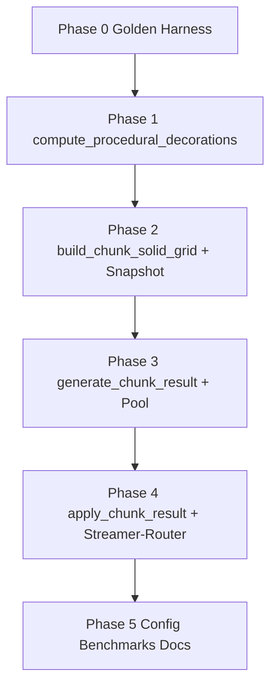
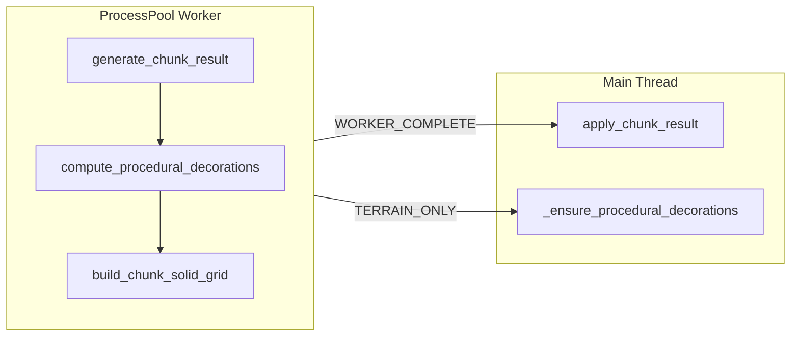

# M22e — Worker-Deko + Worker-Solid (geschärft)

## Kurzurteil zum bestehenden Plan

**Bereits gut:** Richtige Engpass-Diagnose (Main-Thread-Deko + Solid); Nutzung des bestehenden ProcessPool; IPC über `ChunkGenResult`; Trennung Worker-Berechnung / Main-Apply; Override-Pfad bleibt auf Main-Thread; Architekturgrenzen (`game_core` ohne Render).

**Noch unklar (behoben in diesem Dokument):** Wahrheitsquelle für Determinismus; exakte Bedingung Worker-Solid vs. `rebuild_chunk_solid`; Semantik von `decorations=None` vs. vollständigem Result; Content-Filter-Äquivalenz ohne `ContentRegistry` im Worker; Reihenfolge und Zuständigkeiten bei `apply_chunk_result`; wann `_decorated_chunks` / `collision_dirty_chunks` gesetzt werden; verbindliche Fallback-Matrix Debug/Sync/Override.

---

## Risikostellen (priorisiert)

| Prio | Risiko | Warum kritisch |
|------|--------|----------------|
| P0 | Determinismus-Drift Worker vs. Sequential | Sichtbare Welt-Unterschiede, nicht reproduzierbare Saves |
| P0 | `content.decoration_by_id`-Filter in Worker anders umgesetzt | Stille Deko-Abweichung trotz gleicher Biome-Logik |
| P1 | Worker-Solid bei Override/User-Deko | Falsche Kollision, Spieler-Fall-through |
| P1 | Unvollständiges `ChunkGenResult` (nur Deko oder nur Solid) | Inkonsistenter Apply-Zustand |
| P1 | Snapshot vs. Registry-Regeln divergieren | Worker und Main werten Walkable/Blocks unterschiedlich |
| P2 | Pool nicht invalidiert bei Content/Collision-Änderung | Stale Worker nach Asset-Update |
| P2 | `apply_chunk_result` setzt Dirty-Flags falsch | Save/Unload-Korruption |
| P2 | Debug-Pfad still anders als Release | QA sieht anderes Verhalten als Spieler |

---

## Verbindliche Entscheidungen

### 1. Determinismus

**Quelle der Wahrheit:** Funktion `sequential_reference_chunk(coord, content, collision) -> ReferenceChunkState` in `tests/support/chunk_reference.py` (neu). Sie führt den unveränderten heutigen Pfad aus:

1. `generate_chunk(cx, cy)`
2. Chunk in leere `World` einfügen
3. `populate_chunk_decorations(world, content, cx, cy)`
4. `world.rebuild_chunk_solid(coord, content, collision)`

**Referenz-Artefakte:** `layer_keys`, sortierte `(wx, wy, decoration_id: str, procedural=True)`-Liste, `solid_grid: bytes`.

**Worker-/Pure-Pfad muss matchen:** `generate_chunk_result` auf Main-Thread (ohne Pool) und im ProcessPool müssen dieselben Artefakte liefern wie `sequential_reference_chunk` für alle Test-Koordinaten.

**Warum:** Golden-Tests gegen eine explizite Referenz statt gegen einen sich wandelnden Wrapper verhindern, dass die Extraktion den Test mitdefiniert.

**Test-Matrix Determinismus:**

| Test | Vergleich |
|------|-----------|
| `test_compute_deco_matches_populate` | `compute_procedural_decorations` Placements (als Strings) == Deko nach `populate` |
| `test_build_solid_matches_rebuild` | `build_chunk_solid_grid` == `rebuild_chunk_solid` nach sequentieller Deko |
| `test_generate_chunk_result_matches_reference` | Main-Thread `generate_chunk_result` == `sequential_reference_chunk` |
| `test_parallel_chunk_result_matches_reference` | ProcessPool-Result == `sequential_reference_chunk` |
| `test_apply_chunk_result_matches_reference` | World-Zustand nach `apply_chunk_result` == World nach Referenzpfad |

**Seed:** Tests nutzen `configure_world_gen(load_world_gen_config())` mit festem Seed aus Config; mindestens 12 Koordinaten inkl. negativ, `(0,0)`, Startgebiet-Rand.

---

### 2. Extraktion `compute_procedural_decorations`

**Extraktionsregel:** Zeilen 1045–1073 aus `populate_chunk_decorations` werden 1:1 in `compute_procedural_decorations` übernommen. `world.place_decoration` und `content.decoration_by_id` entfallen in der Pure-Funktion.

**Signatur (verbindlich):**

```python
def compute_procedural_decorations(
    cx: int,
    cy: int,
    *,
    ctx: WorldGenContext,
    known_decoration_ids: frozenset[str],
) -> tuple[DecorationPlacement, ...]:
```

**Erlaubte Inputs:** `cx`, `cy`, `ctx.config`, `ctx.biomes`, `ctx`-gebundener fBM-Cache via `build_chunk_field_cache(cx, cy, config=ctx.config, biomes_config=ctx.biomes)`. Kein `get_world_gen_config()`, kein `get_biomes_config()`, kein `World`, kein `ContentRegistry`.

**Ersetzung des Content-Filters:** `if content.decoration_by_id(decoration_id) is None: continue` wird zu `if decoration_id not in known_decoration_ids: continue`. `known_decoration_ids` = `frozenset(entry.id for entry in registry.decorations)` beim Snapshot-Build.

**`DecorationPlacement` intern (Pure):** `wx: int`, `wy: int`, `decoration_id: str`. IPC-Konvertierung zu `int` erst in `generate_chunk_result` via `stable_tile_id(decoration_id)`.

**Wrapper `populate_chunk_decorations` (Main-Thread, bleibt):**

```python
placements = compute_procedural_decorations(cx, cy, ctx=WorldGenContext.from_active(), known_decoration_ids=...)
for p in placements:
    world.place_decoration(p.wx, p.wy, p.decoration_id, procedural=True)
```

**Warum:** Einzige Quelle der Deko-Logik; Wrapper und Worker rufen dieselbe Pure-Funktion auf; Content-Filter bleibt semantisch identisch.

---

### 3. Worker-Solid vs. Main-Thread-Solid

**Worker-Solid ist zulässig nur für prozedural frisch generierte Chunks ohne gespeicherten Override**, d.h. wenn **alle** Bedingungen erfüllt:

- `parallel_worker_apply is True`
- `get_debug_mode() is None`
- `result.decorations is not None` **und** `result.solid_grid is not None`
- `len(result.solid_grid) == CHUNK_SOLID_GRID_BYTES`
- `coord not in persistent_overrides`
- `coord not in world.dirty_chunks` zum Apply-Zeitpunkt
- Keine `PlacedDecoration` mit `procedural=False` in Chunk-Bounds (bei frischem Pool-Apply immer wahr; Guard bleibt verbindlich)

**`rebuild_chunk_solid` bleibt Pflicht** wenn **eine** Bedingung zutrifft:

- `coord in persistent_overrides` (`_load_chunk` Override-Pfad)
- Pool inaktiv (`parallel_workers==0` oder `parallel_prefetch==False`) → Sync-`_load_chunk`
- `get_debug_mode() is not None`
- `parallel_worker_apply is False`
- `ChunkGenResult` ohne vollständige Worker-Payload (`decorations is None` oder `solid_grid is None`)
- `coord in world.collision_dirty_chunks` vor Apply
- Nach User-Paint / User-Deko / `world.set_tile` im Chunk

**`build_chunk_solid_grid` (Worker/Pure):** Input = `Chunk` aus Layer-IDs + `decorations`-Tuple des Results + `WorkerContentSnapshot` + `CollisionCatalog`. Kein `World`-Scan. Nur prozedurale Deko aus dem Result.

**`rebuild_chunk_solid` (Main):** Unverändert; scannt `world.decorations` global. Pflicht für Override-/Paint-Fälle.

**Warum:** Frisch generierte Chunks haben keine fremden User-Deko; Override-Chunks können globale User-Deko enthalten, die der Worker nicht kennt.

---

### 4. `ChunkGenResult`-Schema

| Feld | Pflicht | Semantik |
|------|---------|----------|
| `coord` | immer | `(cx, cy)` |
| `layer0`, `layer1` | immer | je `CHUNK_TILE_COUNT` ints (M22c) |
| `decorations` | bedingt | `None` = Terrain-only (Legacy/M22b). Tuple = Worker-Deko vorhanden |
| `solid_grid` | bedingt | `None` = kein Worker-Solid. `bytes` Länge exakt `CHUNK_SOLID_GRID_BYTES` |

**Vollständigkeit (verbindlich):**

- **WORKER_COMPLETE:** `decorations is not None` **und** `solid_grid is not None`
- **TERRAIN_ONLY:** `decorations is None` **und** `solid_grid is None`
- **Jede andere Kombination:** `ValueError` in `apply_chunk_result` und in `generate_chunk_result` vor Rückgabe

**`DecorationPlacement` (IPC):** `wx: int`, `wy: int`, `decoration_id: int` (`stable_tile_id` auf den String-Key aus Biomes/Content).

**ID-System:** Ein Hash-Verfahren: `stable_tile_id` aus `game_core/tile_ids.py` für Tiles und Decorations. Main-Thread: `decoration_id_to_key(int) -> str` in `ContentRegistry` (Reverse-Map mit Kollisions-Assert beim Laden, analog Tiles). Worker: keine String-Keys in IPC, nur ints.

**Warum:** Kein paralleles ID-System; partielle Results werden abgelehnt statt still halb angewendet.

---

### 5. Content-/Collision-Snapshots im Worker

**`WorkerContentSnapshot` (frozen dataclass, `game_core/worker_content_snapshot.py`):**

| Feld | Inhalt |
|------|--------|
| `known_decoration_ids` | `frozenset[str]` — alle Decoration-IDs aus Registry |
| `non_walkable_tile_ids` | `frozenset[int]` — `stable_tile_id(key)` wo `not tile_walkable(key)` |
| `decoration_sprite_key_by_id` | `dict[int, str]` — nur Einträge aus `known_decoration_ids` |
| `decoration_blocks_by_id` | `dict[int, bool]` — `blocks_movement` pro Decoration |
| `fingerprint` | `str` — deterministischer Hash über alle obigen Daten |

**Nicht im Snapshot:** Tile-Labels, Brush-Paletten, GPU-Keys, Render-Layer, `_decoration_by_id`-Objekte, `World`.

**Worker-Init (verbindlich):** Jeder Worker ruft `load_content_registry()` und `load_collision_catalog()` lokal auf und baut `WorkerContentSnapshot.from_registry(registry)`. Kein Pickle der Registry über `initargs`.

**Main-Thread:** Baut denselben Snapshot für Fingerprint; `CollisionCatalog` wird für `rebuild_chunk_solid` weiterhin direkt genutzt, nicht aus Snapshot abgeleitet.

**Regelgleichheit:** `build_chunk_solid_grid` nutzt `non_walkable_tile_ids` und `decoration_blocks_by_id` aus Snapshot; `rebuild_chunk_solid` nutzt `content.tile_walkable` und `content.decoration_blocks`. Test `test_snapshot_walkable_matches_registry` prüft Äquivalenz.

**Pool-Invalidierung — Signatur-Tuple:**

```python
(config_pool_signature, snapshot.fingerprint, collision_manifest_stat, "m22e")
```

`collision_manifest_stat` = `(mtime_ns, size)` von `assets/collision/manifest.json`. Bei Signatur-Wechsel: `invalidate_parallel_pool()` vor neuem Submit.

**Warum:** Worker und Main laden dieselben Dateien; Fingerprint erkennt Content-Drift ohne große IPC-Payloads.

---

### 6. Batch-Apply auf dem Main-Thread

**`apply_chunk_result(world, result, content, collision) -> Chunk`** — nur aufrufbar bei `WORKER_COMPLETE`.

**Verbindliche Reihenfolge:**

1. `validate_chunk_gen_result(result)` — Längen, Vollständigkeit, `coord`
2. `chunk = chunk_from_result(result, content)`
3. `world.chunks[result.coord] = chunk`
4. `world.place_decorations_batch(result.coord, placements)` — neu; konvertiert `decoration_id: int` → `str` via `content.decoration_id_to_key`; überspringt unbekannte IDs; setzt `procedural=True`; markiert betroffene Chunks **nicht** in `collision_dirty_chunks` (Solid kommt aus Result)
5. `chunk.solid_grid = result.solid_grid` (Referenz auf Chunk in `world.chunks`)
6. `world.collision_dirty_chunks.discard(result.coord)`
7. `world.dirty_chunks` — **nicht** setzen (prozedural, unverändert)

**`_decorated_chunks`:** Setzt **ausschließlich** `ChunkStreamer` nach erfolgreichem `apply_chunk_result` via `self._decorated_chunks.add(coord)`. Nicht in `apply_chunk_result`.

**Extractor-Invalidierung:** Bleibt Aufgabe des Streamers/Callers; `apply_chunk_result` ruft kein `extractor.invalidate`.

**`place_decorations_batch`:** Ein Durchlauf: existierende prozedurale Deko an denselben `(wx,wy)` innerhalb des Chunks ersetzen; am Ende `world.decorations` erweitern. Kein `rebuild_chunk_solid` in dieser Funktion.

**Warum:** Klare Zuständigkeiten — `apply_chunk_result` mutiert nur `World`; Streamer behält Lifecycle-Flags; Solid kommt fertig, kein Dirty-Stale.

---

### 7. Fallback- und Debug-Verhalten

**Worker-Apply aktiv** wenn **alle** wahr: `parallel_worker_apply`, `parallel_prefetch`, `parallel_workers > 0`, `get_debug_mode() is None`, Pool liefert `WORKER_COMPLETE`.

**Fallback (Main-Thread-Pfad)** — `_ensure_procedural_decorations` mit `populate` + `rebuild_chunk_solid`:

| Bedingung | Worker-Task-Output | Main-Apply |
|-----------|-------------------|------------|
| `parallel_worker_apply=False` | `TERRAIN_ONLY` | `_ensure_procedural_decorations` |
| `get_debug_mode() != None` | `TERRAIN_ONLY` (kein Parallel-Submit in `generate_results_parallel`, unverändert M22b) | `_ensure_procedural_decorations` |
| `persistent_overrides` | kein Pool-Submit für coord | `_load_chunk` |
| Pool inaktiv / Sync | — | `_load_chunk` → `_ensure_procedural_decorations` |
| `WORKER_COMPLETE` + Pool | vollständiges Result | `apply_chunk_result` |

**Kein stilles Drift-Verhalten:** Worker generiert **keine** halben Results. Entweder `WORKER_COMPLETE` oder `TERRAIN_ONLY`. Main wählt Pfad über `is_worker_complete(result)` — keine Heuristik auf einzelne Felder verstreut.

**`generate_terrain_result`:** Deprecated-Alias ruft `generate_chunk_result` auf; bei deaktiviertem Worker-Apply wird intern `TERRAIN_ONLY` zurückgegeben.

---

### 8. Teststrategie (Reihenfolge)

| Phase | Tests | Zweck |
|-------|-------|-------|
| 0 | `sequential_reference_chunk` Harness | Wahrheitsquelle fixiert |
| 1 | `test_compute_deco_matches_populate` | Extraktion ohne Seiteneffekte |
| 1 | `test_known_decoration_filter_equivalent` | Snapshot-Filter == `decoration_by_id` |
| 2 | `test_build_solid_matches_rebuild` | Pure Solid == Main |
| 2 | `test_snapshot_walkable_matches_registry` | Snapshot-Regeln == Registry |
| 3 | `test_generate_chunk_result_matches_reference` | Main Worker-Logik |
| 3 | `test_parallel_chunk_result_matches_reference` | IPC/Pool |
| 3 | `test_invalid_partial_result_raises` | Schema-Guards |
| 4 | `test_apply_chunk_result_matches_reference` | Batch-Apply |
| 4 | `test_apply_sets_no_dirty_chunks` | Dirty-Invariante |
| 5 | `test_streaming_pool_uses_apply_chunk_result` | Spy: kein `populate` auf Pool-Pfad |
| 5 | `test_streaming_override_uses_rebuild` | Override lädt, ruft `rebuild` |
| 5 | `test_streaming_sync_fallback_populates` | `workers=0` unverändert |
| 5 | `test_debug_mode_disables_worker_apply` | Debug = Sequential |

**Benchmarks (vor/nach, verbindlich dokumentiert in `docs/benchmarks/world_gen_m22e.md`):**

| Messung | Tool |
|---------|------|
| `apply_ms_per_chunk` Main sequential vs. `apply_chunk_result` | `tools/benchmark_world_gen.py --mode apply` |
| `streamer.update` pan steady | `tools/profile_frame.py --mode pan` |
| `generate_chunk_result` Worker vs. sequential | bestehendes `benchmark_world_gen` Grid 8×8 |

---

## Umsetzungsreihenfolge



1. **Phase 0:** `sequential_reference_chunk` + erste Golden-Tests (rot, weil noch nicht extrahiert)
2. **Phase 1:** Extraktion Deko; Wrapper; `decoration_id_to_key`; Phase-1-Tests grün
3. **Phase 2:** `build_chunk_solid_grid`, `WorkerContentSnapshot`; Solid-Golden grün
4. **Phase 3:** `generate_chunk_result`, Worker-Init, Signatur; Parallel-Golden grün
5. **Phase 4:** `apply_chunk_result`, `place_decorations_batch`, Streamer-Router `is_worker_complete`; Integrationstests grün
6. **Phase 5:** `world_gen.json` `worker_apply`, Benchmarks, `ruleset.md` / `ARCHITECTURE.md`, volle `pytest`

**Regressions-Schutz:** Jede Phase endet mit grüner Test-Teilmenge; Phase 4 erst nach Parallel-Golden; kein Streamer-Umbau vor Phase 3.

---

## Pfadtrennung / Fallback-Regeln (Entscheidungsbaum)

```
poll_ready / _load_chunk
├─ coord in persistent_overrides → _load_chunk → _ensure_procedural_decorations (populate + rebuild)
├─ pool is None → _load_chunk → _ensure_procedural_decorations
├─ result is WORKER_COMPLETE and parallel_worker_apply and debug_mode is None
│   → apply_chunk_result → _decorated_chunks.add
└─ else → chunk_from_result + _ensure_procedural_decorations
```

`_apply_generated_chunk` wird ersetzt durch Router `_apply_chunk_from_result(world, result, content, collision)`.

---

## Definition of Done

M22e ist abgeschlossen wenn:

- [ ] Alle Tests aus Teststrategie Phase 0–5 grün
- [ ] Volle `pytest`-Suite grün
- [ ] `parallel.worker_apply: true` in `world_gen.json`; Rollback via `false` auf M22b+M22d-Verhalten ohne Code-Änderung
- [ ] Golden-Tests: mindestens 12 Coords, Worker == Sequential für Layer, Deko, Solid
- [ ] `profile_frame --mode pan`: dokumentierte Vorher/Nachher-Werte in `world_gen_m22e.md`
- [ ] Kein `bridge`/`render_*`-Import in neuen `game_core`-Modulen
- [ ] `ruleset.md` und `ARCHITECTURE.md` aktualisiert; M22b-Text „Deko/Solid nur Main-Thread“ korrigiert
- [ ] Override-, Sync-, Debug-Pfade haben explizite Tests und nutzen **nicht** `apply_chunk_result`

---

## Architektur (unverändert, präzisiert)

### Datenfluss M22e



### Config

[`assets/content/world_gen.json`](assets/content/world_gen.json):

```json
"parallel": {
  "workers": "auto",
  "prefetch": true,
  "worker_apply": true
}
```

`WorldGenConfig.parallel_worker_apply: bool` — ein Schalter für Deko **und** Solid gemeinsam.

### Verbote

- Kein `bridge`/`render_*` in `game_core`
- Keine Worker-Mutation an `World`
- Kein Spatial Index, kein Renderer-Umbau
- Kein hartes Task-Cancel (M22b)
- `max_applies_per_frame`-Tuning in `streaming.json` ist **kein** Teil von M22e

### Betroffene Module

- [`game_core/world_gen.py`](game_core/world_gen.py) — Extraktion, `is_worker_complete`
- [`game_core/world_gen_result.py`](game_core/world_gen_result.py) — Schema, `apply_chunk_result`, Validierung
- [`game_core/world_gen_context.py`](game_core/world_gen_context.py) — `generate_chunk_result`
- [`game_core/world_gen_parallel.py`](game_core/world_gen_parallel.py) — Worker-Init, Signatur
- [`game_core/worker_content_snapshot.py`](game_core/worker_content_snapshot.py) — neu
- [`game_core/collision_grid.py`](game_core/collision_grid.py) — `build_chunk_solid_grid`
- [`game_core/content_registry.py`](game_core/content_registry.py) — `decoration_id_to_key`
- [`game_core/chunk_streaming.py`](game_core/chunk_streaming.py) — Router
- [`game_core/world.py`](game_core/world.py) — `place_decorations_batch`
- [`tests/support/chunk_reference.py`](tests/support/chunk_reference.py) — neu
