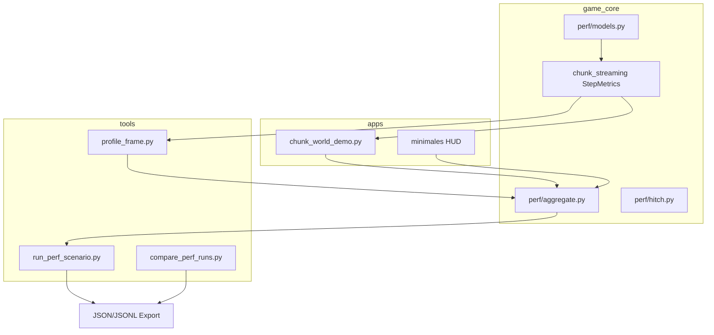

# M23 — Profiling & Runtime-Metriken

## Empfehlung

**Zentraler Unterbau in `game_core/perf/`** (Datenmodelle, Aggregation, Hitch-Logik, Szenario-Deskriptoren) — **ohne** Bridge-/Render-Imports. Mess-Orchestrierung in **`tools/`** (headless CLI) und **`apps/chunk_world_demo.py`** (Runtime + minimales HUD). [`tools/profile_frame.py`](tools/profile_frame.py) wird Refactor-Consumer, kein Paralleluniversum.

**Aktivierung:** Config-gesteuert (`assets/content/profiling.json`), Default **aus**. Im deaktivierten Zustand **keine** `perf_counter`-Aufrufe in Hot Paths (Out-Parameter `None` / early return).

**Milestone-Reihenfolge (verbindlich):** M23 = Beobachtbarkeit → **M24 = Ores** (bisheriges M23 in [`ruleset.md`](ruleset.md) wird umnummeriert; Mini-Map/Fog of War rückt auf M25).

---

## Zielbild von M23

Nach Abschluss kann das Projekt:

- reproduzierbare Szenarien (steady, pan, zoom_out, catchup) per CLI fahren und Runs vergleichen
- im laufenden Demo strukturierte Frame-/Streaming-Metriken erfassen und exportieren
- Hitchs mit fest definierten Tags klassifizieren (Mehrfach-Tags, deterministische Auswertung)
- Vorher/Nachher-Reports für Streaming-Fixes dokumentieren (Baseline in `docs/benchmarks/perf/`)
- Unload-Hitchs von Apply-Hitchs anhand **getrennter** `stream_apply_ms` / `stream_unload_ms` unterscheiden
- CLI- und Demo-Runs anhand **identischer** `frame_ms`-Definition vergleichen

---

## Metrik-Modell

### Pflichtmetriken (pro Frame)

| Feld | Quelle | Bedeutung |
|------|--------|-----------|
| `frame_index` | Orchestrator | Laufender Frame-Zähler (0-basiert, nach Warmup) |
| `scenario_id` | Szenario-Config | steady / pan / zoom_out / catchup |
| `frame_ms` | PerfSession tick boundary | Siehe **Frame-Definition** unten |
| `stream_ms` | `ChunkStreamer.update` | Gesamtzeit Streaming-Schritt |
| `stream_apply_ms` | innerhalb update | Load/Apply-Pfad (Pool + Sync-Apply) |
| `stream_unload_ms` | innerhalb update | Unload-Schleife inkl. Deko-Entfernung |
| `stream_loaded` | update return | Geladene Chunks |
| `stream_unloaded` | update return | Entladene Chunks |
| `chunk_count` | `world.chunk_count` | Geladene Chunks nach Schritt |
| `focus_x`, `focus_y`, `zoom` | StreamViewParams / Demo | Kontext für Hitch-Reproduktion |

### Optionale Metriken (nur apps/tools, nicht game_core)

| Feld | Quelle |
|------|--------|
| `deco_extract_ms` | Teilphase innerhalb `frame_ms`: `decorations_to_sprites` |
| `tile_extract_ms` | Teilphase innerhalb `frame_ms`: `extractor.extract` |
| `deco_sprite_count` | nach Extract |
| `collision_ms` | `ensure_collision_fresh` — **außerhalb** `frame_ms`, nur Demo, nicht export-Pflicht |

### Frame-Definition (verbindlich)

#### Begriff „Profiling-Frame“

Ein **Profiling-Frame** ist eine Iteration des **kanonischen CPU-Ticks** nach Abschluss der Warmup-Phase. Warmup-Frames werden gezählt, aber **nicht** in `frames.jsonl`, Hitch-Events oder Summary-KPIs aufgenommen.

#### Kanonischer Tick-Umfang (`frame_ms`)

`frame_ms` ist die Wall-Clock-Zeit von `PerfSession.begin_tick()` bis `PerfSession.end_tick()` und umfasst **ausschließlich** diese Phasen in fester Reihenfolge:

1. **Szenario-Schritt** — Berechnung von Fokus, Zoom, `StreamViewParams`, Bewegungsdelta (reine Koordinaten-/View-Logik, kein I/O)
2. **`streamer.update`** — inklusive interner Apply-/Unload-Timer (`stream_ms`, `stream_apply_ms`, `stream_unload_ms`)
3. **`decorations_to_sprites`** — Bridge-Extract Deko (wenn Extract für den Lauf aktiv)
4. **`extractor.extract`** — Bridge-Extract Tiles (wenn Extract für den Lauf aktiv)

**Nicht** in `frame_ms`:

- GPU-Render, Swapchain, VSync, `renderer.draw`
- Demo-Gameplay außerhalb des Ticks: Charakterbewegung, Paint, Save/Load, Input-Polling
- Kollisions-Refresh außerhalb des Ticks
- Pool-Worker-Compute (asynchron, nicht tickgebunden)

**Extract-Default:** In CLI-Runs und Demo `--profile` ist Extract **aktiv**. Deaktivierung nur explizit per Szenario-/Laufmodus-Flag `extract_enabled: false` (dann entfallen Phasen 3–4 aus dem Tick, `frame_ms` = Szenario + Stream only); der Export vermerkt `extract_enabled` im Manifest.

#### CLI vs. Demo — gleiche Definition

| Aspekt | CLI (`run_perf_scenario`, `profile_frame`) | Demo (`chunk_world_demo --profile`) |
|--------|--------------------------------------------|-------------------------------------|
| Was ist ein Frame? | Eine Runner-Iteration nach Warmup | Eine Main-Loop-Iteration nach Warmup |
| Was misst `frame_ms`? | Kanonischer Tick (Phasen 1–4) | **Identisch** — Tick wird vor Stream+Extract platziert |
| Loop-Zeit insgesamt | ≈ `frame_ms` (kein Render) | > `frame_ms` (Bewegung/Render folgen **nach** `end_tick()`) |
| Vergleichbarkeit | Baseline | `frame_ms`/`stream_ms`-KPIs direkt vergleichbar mit CLI |

**Orchestrator-Regel:** CLI und Demo rufen dieselbe Funktion `PerfSession.run_canonical_tick(...)` auf. Abweichungen in der Aufruf-Reihenfolge sind verboten.

#### HUD vs. Export

Das minimale Demo-HUD zeigt **primär** `stream_ms` (Rolling Average) und `chunk_count`, optional `hitch_count` — **nicht** die gesamte Loop-Zeit. `frame_ms` erscheint im Export und in Summary-KPIs, nicht als Ersatz-FPS.

### Aggregationsebenen

1. **Pro Frame** — Rohsample (`FrameMetrics`, frozen dataclass)
2. **Rolling Window** — letzte N Frames in-memory (Ringbuffer, N aus Config) für HUD
3. **Hitch-Events** — append-only Liste bei Schwellwert-Verletzung
4. **Run-Summary** — am Ende: Mittelwert, P95, Max je Pflichtmetrik + Zähler

### Vergleichs-KPIs (Dokumentation / Reports)

Pflicht in Summary und Benchmark-Markdown:

- `frame_ms_mean`, `frame_ms_p95`, `frame_ms_max`
- `stream_ms_mean`, `stream_ms_p95`, `stream_ms_max`
- `stream_unload_ms_p95`, `stream_unload_ms_max`
- `hitch_count`, `hitch_load_count`, `hitch_unload_count`, `hitch_stream_count`, `hitch_frame_count`
- `max_loaded_per_frame`, `max_unloaded_per_frame`
- `chunk_count_mean`

---

## Architektur und Instrumentierung



### Neue Module (game_core)

| Datei | Verantwortung |
|-------|---------------|
| [`game_core/perf/__init__.py`](game_core/perf/__init__.py) | Public API |
| [`game_core/perf/models.py`](game_core/perf/models.py) | `FrameMetrics`, `StreamStepMetrics`, `HitchEvent`, `RunSummary`, `ScenarioDescriptor` |
| [`game_core/perf/config.py`](game_core/perf/config.py) | `ProfilingConfig`, `load_profiling_config()` |
| [`game_core/perf/hitch.py`](game_core/perf/hitch.py) | `classify_hitch(metrics, thresholds) -> tuple[str, ...]` |
| [`game_core/perf/aggregate.py`](game_core/perf/aggregate.py) | Ringbuffer, P95/Mean/Max, Summary-Build |
| [`game_core/perf/session.py`](game_core/perf/session.py) | `PerfSession`: `begin_tick`/`end_tick`, `run_canonical_tick`, `record_frame()`, `flush()` |
| [`game_core/perf/export_schema.py`](game_core/perf/export_schema.py) | Schema-Version, Pflichtfeld-Validierung, Serialisierung |

### Instrumentierung ChunkStreamer

[`game_core/chunk_streaming.py`](game_core/chunk_streaming.py):

- Signatur erweitern: `update(..., step_metrics: StreamStepMetrics | None = None) -> tuple[int, int]`
- Wenn `step_metrics is None`: **keine** Timer — bestehendes Verhalten
- Wenn gesetzt: `sets_ms`, `apply_ms`, `unload_ms`, `total_ms`, `loaded`, `unloaded` befüllen
- Apply-Timer umfasst Pool-poll-Apply + Sync-`_load_chunk`-Pfad; Unload-Timer nur Unload-Schleife

**Kein** Logging/I/O in `game_core` — nur Metrik-Struct befüllen.

### Config

Neue Datei [`assets/content/profiling.json`](assets/content/profiling.json):

```json
{
  "version": 1,
  "enabled": false,
  "hitch": {
    "stream_ms": 8.0,
    "frame_ms": 16.0,
    "loaded_count": 4,
    "unloaded_count": 4
  },
  "scenarios": {
    "steady": { "frames": 300, "warmup_frames": 60 },
    "pan": { "frames": 300, "pan_axis": "x", "pan_chunks_per_frame": 1.0 },
    "zoom_out": { "frames": 200, "zoom": 0.05 },
    "catchup": { "frames": 400, "warmup_frames": 120, "pan_chunks_per_frame": 1.0 }
  },
  "export": { "ring_buffer_frames": 120 }
}
```

Schwellwerte **nicht** hard-coded in Code — immer aus Config.

---

## Szenarien und Laufmodi

### Szenario-Typen (konfigurierbar)

| ID | Zweck |
|----|-------|
| `steady` | Steady-State nach Warmup — Baseline stream_ms ≈ 0 |
| `pan` | Kontinuierliches Panning — Apply/Prefetch-Last |
| `zoom_out` | Min-Zoom — große wanted-Menge, Cap-Druck |
| `catchup` | Warmup + Pan — initiale Catch-up-Spikes isolieren |

Implementierung: [`game_core/perf/scenarios.py`](game_core/perf/scenarios.py) — reine Funktionen `focus_for_frame(scenario, frame_index) -> (focus_x, focus_y, zoom, move_dx, move_dy)`; nutzt bestehende [`StreamViewParams`](game_core/stream_view.py).

Jeder Szenario-Runner-Durchlauf setzt `warmup_frames` aus Config; erst danach beginnt `frame_index` bei 0 für Export.

### Laufmodi (getrennt)

| Modus | Aktivierung | Verhalten |
|-------|-------------|-----------|
| **Normal** | `profiling.enabled=false` | Keine Metrik-Sammlung, kein Export |
| **Runtime-Profiling** | Demo-Flag `--profile` | `PerfSession` aktiv, kanonischer Tick, Export bei Exit |
| **CLI-Benchmark** | `python tools/run_perf_scenario.py --scenario pan` | Headless, kanonischer Tick, Export Pflicht |
| **Legacy-CLI** | `profile_frame.py` | Ruft shared Scenario-Runner auf |

**Debug-World-Gen-Modus** (`get_debug_mode() != None`) schließt Streaming-Benchmarks aus — Szenario-Runner bricht mit Hinweis ab (wie M22b-Benchmark).

---

## Hitch-Erfassung und Export

### Hitch-Definition

Ein Frame erzeugt ein **HitchEvent**, wenn `classify_hitch()` mindestens ein Tag liefert. Kein Hitch ohne Tag.

### Hitch-Tag-Regeln (verbindlich)

#### Erlaubte Tags (geschlossene Menge)

| Tag | Bedingung (Schwellwert aus `profiling.json` `hitch.*`) |
|-----|----------------------------------------------------------|
| `stream_slow` | `stream_ms >= hitch.stream_ms` |
| `frame_slow` | `frame_ms >= hitch.frame_ms` |
| `load_burst` | `stream_loaded >= hitch.loaded_count` |
| `unload_burst` | `stream_unloaded >= hitch.unloaded_count` |

Keine weiteren Tags in M23. Keine abgeleiteten Subtypen.

#### Mehrfach-Tags

**Mehrfach-Tags sind erlaubt und verbindlich:** Alle zutreffenden Tags werden gesetzt. Es gibt **keine** Tag-Priorität und **kein** „primary tag“.

#### Deterministische Tag-Reihenfolge

`classify_hitch()` gibt Tags in **fester Sortierfolge** zurück:

`frame_slow` → `stream_slow` → `load_burst` → `unload_burst`

Nur Tags, deren Bedingung erfüllt ist, erscheinen in der Liste. Gleiche Metrik-Eingabe → gleiche Tag-Liste (reproduzierbar).

#### Summary-Zähler (Auswertung)

Pro Run, aus HitchEvents abgeleitet:

| Zähler | Inkrement wenn |
|--------|----------------|
| `hitch_count` | mindestens ein Tag gesetzt |
| `hitch_frame_count` | `frame_slow` ∈ tags |
| `hitch_stream_count` | `stream_slow` ∈ tags |
| `hitch_load_count` | `load_burst` ∈ tags |
| `hitch_unload_count` | `unload_burst` ∈ tags |

Ein Event kann mehrere Zähler gleichzeitig erhöhen.

#### Apply vs. Unload — keine Tag-Erweiterung

Unterscheidung Apply/Unload erfolgt **nicht** über zusätzliche Tags, sondern über Pflichtfelder `stream_apply_ms` und `stream_unload_ms` im HitchEvent und in FrameMetrics. Auswertungs-Skripte filtern auf Dominanzverhältnis offline, ohne Engine-Heuristik.

### HitchEvent-Felder (Pflicht)

`frame_index`, `scenario_id`, `tags` (sortierte Liste), `frame_ms`, `stream_ms`, `stream_apply_ms`, `stream_unload_ms`, `stream_loaded`, `stream_unloaded`, `chunk_count`, `focus_x`, `focus_y`, `zoom`

### Export-Schema (versioniert)

#### Schema-Version

- Feld `schema_version` (integer) in **manifest.json**, **summary.json** und jeder **hitches.jsonl**-Zeile
- M23 initial: **`schema_version: 1`**
- Pflege-Regel: **Integer increment** bei breaking changes (Umbenennung/Entfernung Pflichtfelder, geänderte Semantik). **Additive** Felder in bestehenden Objekten erhöhen `schema_version` **nicht** — nur dokumentieren in [`docs/benchmarks/perf/SCHEMA.md`](docs/benchmarks/perf/SCHEMA.md)
- Breaking change → neues `schema_version`; alte Runs bleiben lesbar; `compare_perf_runs` unterstützt explizit gelistete Versionen

#### manifest.json — Pflichtfelder

| Feld | Typ | Bedeutung |
|------|-----|-----------|
| `schema_version` | int | Export-Schema (M23: 1) |
| `run_id` | string | Eindeutige Run-ID (Zeitstempel + scenario + git) |
| `recorded_at` | string | ISO-8601 UTC |
| `scenario_id` | string | steady / pan / zoom_out / catchup |
| `run_mode` | string | `cli` \| `demo` |
| `extract_enabled` | bool | Ob Phasen 3–4 im Tick aktiv waren |
| `warmup_frames` | int | Übersprungene Frames vor Export |
| `recorded_frames` | int | Anzahl Zeilen in frames.jsonl |
| `git_commit` | string | Kurz-Hash oder `unknown` |
| `config_fingerprint` | object | Hashes/Fingerprints von world_gen, streaming, profiling |

#### frames.jsonl — Pflichtfelder pro Zeile

`schema_version`, `frame_index`, `scenario_id`, `frame_ms`, `stream_ms`, `stream_apply_ms`, `stream_unload_ms`, `stream_loaded`, `stream_unloaded`, `chunk_count`, `focus_x`, `focus_y`, `zoom`

Optionale Felder (dürfen fehlen): `deco_extract_ms`, `tile_extract_ms`, `deco_sprite_count`

#### hitches.jsonl — Pflichtfelder pro Zeile

Alle HitchEvent-Pflichtfelder inkl. `schema_version`, `tags`

#### summary.json — Pflichtfelder

`schema_version`, `run_id`, `scenario_id`, `run_mode`, `recorded_frames`, alle Vergleichs-KPIs aus Metrik-Modell

#### compare_perf_runs — Verhalten bei unbekannter Version

- Bekannte `schema_version` → voller KPI-Vergleich
- Unbekannte `schema_version` → Exit-Code ungleich 0, Fehlermeldung mit unterstützten Versionen; **kein** stiller Vergleich
- Additive optionale Felder in bekannter Version → ignorieren

### Export-Verzeichnis

Pro Run: `docs/benchmarks/perf/runs/<run_id>/`

| Datei | Inhalt |
|-------|--------|
| `manifest.json` | Run-Header (Pflichtfelder oben) |
| `frames.jsonl` | Eine FrameMetrics-Zeile pro Profiling-Frame |
| `hitches.jsonl` | HitchEvents (leer erlaubt) |
| `summary.json` | RunSummary KPIs |

Vergleich: [`tools/compare_perf_runs.py`](tools/compare_perf_runs.py) — Delta-Report zweier `summary.json` mit gleicher `schema_version`.

### Schnittstelle zu profile_frame.py

- `StreamingStats` / `FrameProfiler` nach `game_core/perf` migrieren
- `profile_frame.py` wird dünner CLI-Wrapper um `run_perf_scenario`
- stderr-Hitch-Log: serialisiertes HitchEvent (key=value oder JSON-Zeile), Tags in fester Reihenfolge

---

## Umsetzungsplan (Phasen)

### Phase 0 — Metrik-Modell + Config + Schema-Contract
- `game_core/perf/models.py`, `config.py`, `aggregate.py`, `hitch.py`, `export_schema.py`
- `assets/content/profiling.json`
- Unit-Tests: P95, Hitch-Klassifikation (Mehrfach-Tags, Sortierfolge), Schema-Validierung, leere Session

**DoD:** Tests grün; Hitch- und Schema-Contract dokumentiert in `SCHEMA.md`

### Phase 1 — ChunkStreamer-Instrumentierung
- `StreamStepMetrics` + optionaler Out-Parameter in `update()`
- Tests: Timer nur wenn `step_metrics` gesetzt

**DoD:** Bestehende Streaming-Tests unverändert grün

### Phase 2 — Szenario-Runner (shared)
- `game_core/perf/scenarios.py`, `PerfSession.run_canonical_tick`
- [`tools/run_perf_scenario.py`](tools/run_perf_scenario.py)
- Refactor [`tools/profile_frame.py`](tools/profile_frame.py)

**DoD:** steady + pan CLI-Runs; `frame_ms` identisch zur Spec

### Phase 3 — Export + Vergleich
- `PerfSession.flush()` schreibt schema_version=1 Artefakte
- [`tools/compare_perf_runs.py`](tools/compare_perf_runs.py)
- [`docs/benchmarks/perf/README.md`](docs/benchmarks/perf/README.md) + `SCHEMA.md`

**DoD:** Zwei Runs vergleichbar; unbekannte schema_version → Fehler

### Phase 4 — Runtime-Integration Demo
- [`apps/chunk_world_demo.py`](apps/chunk_world_demo.py): `--profile`, kanonischer Tick vor Bewegung/Render
- Minimales HUD: stream_ms rolling, chunk_count, hitch_count
- Export bei Exit mit `run_mode: demo`

**DoD:** Demo-Export KPIs mit CLI-Run vergleichbar (gleiches Szenario)

### Phase 5 — Docs + Milestone-Renummerierung
- [`ruleset.md`](ruleset.md), [`docs/ARCHITECTURE.md`](docs/ARCHITECTURE.md): M23 Profiling; M24 Ores

**DoD:** Milestone-Tabelle konsistent

---

## Verbote / Grenzen

- Kein `bridge`/`render_*`-Import in `game_core/perf` oder instrumentiertem Streaming-Kern
- Kein GPU/Vulkan-Profiling
- Keine Ores/Ressourcen-Gameplay-Metriken (→ M24)
- Kein generisches Analytics/Telemetry für alle Subsysteme
- Kein Spatial Index, kein Streaming-Architektur-Umbau
- Kein dauerhafter Timer-Overhead bei `enabled=false`
- HUD nur in Demo — **nicht** in `game_core`
- Keine Hitch-Tags außerhalb der geschlossenen Menge
- Keine abweichende `frame_ms`-Definition zwischen CLI und Demo

---

## Definition of Done — M23

M23 ist abgeschlossen wenn:

- [ ] `game_core/perf/` inkl. `export_schema.py` existiert
- [ ] **Frame-Definition:** `PerfSession.run_canonical_tick` in CLI und Demo identisch; `frame_ms` exkl. Render/Gameplay; Warmup ausgeschlossen
- [ ] **Hitch-Tags:** geschlossene Menge, Mehrfach-Tags, feste Sortierfolge, Summary-Zähler deterministisch; Unit-Tests ohne Interpretationsspielraum
- [ ] **Export-Schema:** `schema_version: 1` in manifest/summary/hitches; Pflichtfelder laut Spec; `SCHEMA.md`; `compare_perf_runs` lehnt unbekannte Version ab
- [ ] `ChunkStreamer.update(..., step_metrics=None)` mit Apply/Unload-Split
- [ ] `assets/content/profiling.json`
- [ ] CLI: `run_perf_scenario` für alle Szenariotypen → Export
- [ ] `profile_frame.py` nutzt shared Runner
- [ ] `chunk_world_demo --profile` + minimales HUD + Export `run_mode: demo`
- [ ] Baseline-Run in `docs/benchmarks/perf/`
- [ ] `ruleset.md`: M23 = Profiling, M24 = Ores
- [ ] Volle relevante pytest-Suite grün

### Fragen, die nach M23 beantwortbar sind

- Wo entstehen Hitchs — Stream, Frame-Pipeline, Load oder Unload?
- Sind Demo- und CLI-`stream_ms`/`frame_ms` bei gleichem Szenario vergleichbar?
- Welche Config-Änderung verbessert KPI X messbar?
- Ist M24-Ore performance-neutral belegbar?

---

## Risiken

| Risiko | Mitigation |
|--------|------------|
| Timer-Overhead verfälscht Messung | Nur bei aktivem Profiling messen |
| Demo-Loop vermischt Tick-Grenze | `begin_tick`/`end_tick` vor Bewegung/Render |
| Export-Inkompatibilität | schema_version + compare guard |
| ruleset-Renumber bricht Links | Phase 5 Durchsicht |
