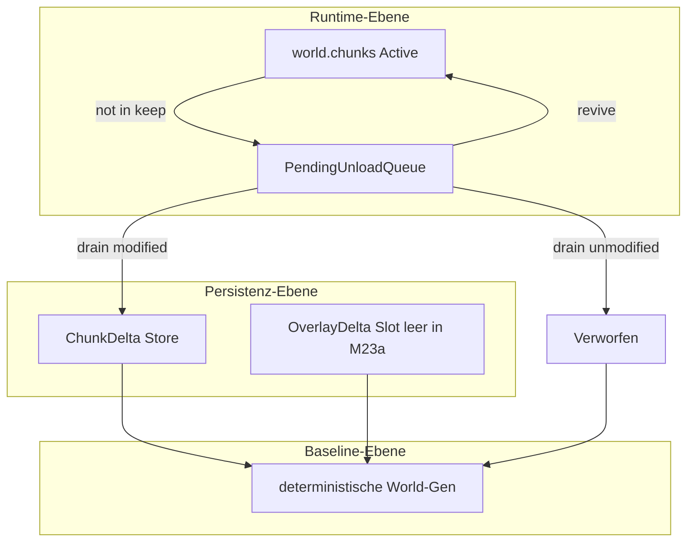

# M23a — Deferred Unload & Sparse Persistence

## Verbindliche Grundsätze

Diese Regeln gelten für den gesamten Milestone und alle späteren Erweiterungen auf diesem Fundament:

1. **Unbearbeitete Chunks werden beim Unload verworfen, nicht gespeichert.**
2. **Persistenz ist sparse und delta-basiert** — es werden nur Abweichungen von der deterministischen Baseline persistiert.
3. **Deterministische World-Gen** (Seed + Config-Fingerprint) ist **Source of Truth** für unveränderte Chunks.
4. **Deferred Unload** ist eine **Main-Thread-Zustands- und Budgetierungsfrage**, keine Worker-Mutationsfrage.
5. **Exploration-, Traffic-, Heatmap- und spätere Wear-/Path-Daten** sind **Overlay-Deltas** über der Baseline — keine Full-Chunk-Snapshots und keine normalen Tile-Basislayer.

---

## Empfehlung

**Milestone-Nummerierung:** **M23a** — Einschub zwischen abgeschlossenem M23 (Profiling) und geplantem M24 (Ores). M24 baut auf Suppression-/Terrain-Deltas auf; spätere Exploration-/Map-Features bauen auf Overlay-Deltas auf.

**Gesamtentscheidung:**

| Entscheidung | Festlegung |
|--------------|------------|
| Unload-Modell | Zweiphasig: **Mark** (sofort, O(1) pro Koordinate) + **Drain** (budgetiert, teure Finalisierung) |
| Budgetierung | **Chunk-Anzahl primär** (`max_unloads_per_frame`), **Zeit-Guard sekundär** (`max_unload_ms_per_frame`) |
| Persistenz | **`ChunkDelta`** ersetzt Full-Chunk-Kopien in `persistent_overrides`; eager **PersistenzFlags**, kein `chunk_differs_from_baseline` im Hot-Path |
| Revive | **Harte Priorität** vor Neu-Generierung und vor Worker-Apply für dieselbe Koordinate |
| Overlay | **Schema-Slot** in Save v4, **keine Implementierung** von Exploration/Fog/Heat in M23a |
| Migration | **Save v3 → v4 einmalige Migration beim Load**; Fingerprint-Mismatch → harter Fehler |

**Problembeleg (M23):** Demo-Run `20260709T204531Z_demo_unknown` — `stream_unload_ms_max ≈ 1628 ms`, `max_unloaded_per_frame = 12`, `stream_apply_ms` in Hitchs irrelevant. Primärer Hebel: budgetierter Drain, nicht Load.

---

## Zielbild

Nach M23a:

- `ChunkStreamer.update` entscheidet weiterhin sofort, welche Koordinaten nicht mehr in `keep` sind.
- Teure Unload-Arbeit wird **über Frames verteilt** via Pending-Queue.
- `world.chunks` enthält **ausschließlich aktive Runtime-Chunks**.
- Unveränderte Koordinaten hinterlassen **keinen Persistenz-Eintrag**.
- Re-Entry aus Pending stellt den gespeicherten Snapshot wieder her — **ohne Regenerierung, ohne Worker-Apply-Konkurrenz**.
- Save v4 beschreibt pro Koordinate nur Deltas; Overlay-Daten haben einen reservierten, leeren Erweiterungspfad.



---

## Architekturprinzipien

- **Drei getrennte Ebenen:** Runtime (`world.chunks`), Übergang (Pending-Queue), Persistenz (Delta-Store). Keine Vermischung.
- **Koordinate vs. Zustand:** Eine `(cx, cy)` kann gleichzeitig **nicht geladen** sein und **persistiertes Delta** besitzen — das ist korrekt und erwünscht. Sie darf **niemals** gleichzeitig aktiv und pending sein.
- **Semantik vor Physik:** Physische Restdaten (z. B. prozedurale Deko-Einträge in `world.decorations` bis Drain) gelten ab Mark-Phase **semantisch als inaktiv** — nicht sichtbar, nicht kollidierend, nicht querybar.
- **Dirty ≠ Persistenz:** Render-/Extractor-Dirty und Kollisions-Rebuild-Bedarf sind Runtime-Cache-Themen; Persistenz folgt eigenen **PersistenzFlags**.
- **Main-Thread-only:** Alle Mark-, Revive-, Drain- und Persistenz-Operationen laufen auf dem Main-Thread.
- **M23-kompatibel:** Metriken erweitern das bestehende `StreamStepMetrics`-Modell — kein zweites Profiling-System.

---

## Begriffsmodell

| Begriff | Ebene | Bedeutung |
|---------|-------|-----------|
| **Baseline** | Generierung | Deterministischer Soll-Zustand aus Seed + World-Gen + Config |
| **Active Chunk** | Runtime | Chunk in `world.chunks`, voll nutzbar |
| **PendingUnload** | Runtime-Übergang | Koordinate aus `world.chunks` entfernt, Snapshot in Queue, semantisch inaktiv |
| **Draining** | Runtime-Übergang | Ein Pending-Eintrag wird gerade finalisiert — nicht revivable |
| **Discarded** | Terminal | Kein Runtime-, kein Persistenz-Eintrag; Re-Load nur via Baseline |
| **Terrain-Delta** | Persistenz | Sparse Abweichung von Baseline (Tiles, Suppressions) |
| **Overlay-Delta** | Persistenz (Zukunft) | Visited, Traffic, Heat, Wear — über Baseline, kein Terrain-Ersatz |
| **PersistenzFlags** | Tracking | Eager markierte persistenzrelevante Änderungen |
| **RuntimeDirty** | Cache | Extractor-/Render-Invalidierung — **nicht** automatisch persistenzrelevant |
| **CollisionDirty** | Cache | Solid-Rebuild-Bedarf — **nicht** automatisch persistenzrelevant |

### Entkopplung Dirty vs. Persistenz

| Mechanismus | Zweck | Persistenz? |
|-------------|-------|-------------|
| `world.dirty_chunks` | Render-Cache / Extractor-Invalidierung | Nein — allein kein Delta |
| `world.collision_dirty_chunks` | Solid-Rebuild | Nein — allein kein Delta |
| `world.mark_dirty` via `set_tile` | Tile-Mutation | Ja — setzt `PersistenzFlags.TILE_MODIFIED` |
| User-Deko platzieren/entfernen | Spieler-Delta | Ja — `USER_DECO` / ggf. Suppression |
| Prozedurale Deko generieren | Baseline-Bestandteil | Nein |
| Prozedurale Deko entfernen (M24-Vorbereitung) | Negativ-Delta | Ja — `SUPPRESSION` |

**Regel:** Persistenz-Relevanz folgt **ausschließlich PersistenzFlags**, nicht dem Vorhandensein von RuntimeDirty.

---

## Zustandsmodell

### Runtime-Zustände pro Koordinate `(cx, cy)`

Eine Koordinate befindet sich **höchstens in einem** Runtime-Zustand:

| Runtime-Zustand | `world.chunks` | Pending-Queue | Semantisch aktiv |
|-----------------|----------------|---------------|------------------|
| **Active** | ja | nein | ja |
| **PendingUnload** | nein | ja (wartend) | **nein** |
| **Draining** | nein | ja (in Bearbeitung) | **nein** |
| **Absent** | nein | nein | nein |

**Verboten:** Active und Pending gleichzeitig. Zwei Pending-Einträge für dieselbe Koordinate.

### Persistenz-Zustand (orthogonale Ebene)

Unabhängig vom Runtime-Zustand:

| Persistenz-Zustand | Delta-Store | Bedeutung |
|--------------------|-------------|-----------|
| **Kein Delta** | — | Baseline gilt; Re-Load via `generate_chunk` |
| **Terrain-Delta** | `persistent_deltas[coord]` | Abweichung von Baseline persistiert |
| **Overlay-Delta** (Zukunft) | `overlay_deltas[coord]` | Nutzungs-/Exploration-Daten über Baseline |

**Erlaubt und normal:** `Absent` (Runtime) + `Terrain-Delta` (Persistenz) — Chunk ist entladen, aber Spieler-Änderungen überdauern.

### Capabilities pro Runtime-Zustand

| Capability | Active | PendingUnload | Draining | Absent |
|------------|--------|---------------|----------|--------|
| Gerendert / Extract | ja | **nein** | **nein** | nein |
| Kollision / Solid | ja | **nein** | **nein** | nein |
| Gameplay-Queries (Tile, Deko) | ja | **nein** | **nein** | nein |
| `chunk_count` | ja | **nein** | **nein** | nein |
| Worker-Apply-Ziel | ja (wenn unmodified) | **nein** | **nein** | ja (wenn wanted, kein Delta) |
| Revive möglich | — | **ja** | **nein** | — |

### Lebenszyklus

```
Active → (coord ∉ keep) → PendingUnload
PendingUnload → (coord ∈ wanted, vor Drain) → Active   [Revive]
PendingUnload → (Drain startet) → Draining
Draining → (unmodified) → Absent + kein Delta   [Discarded]
Draining → (modified) → Absent + Terrain-Delta   [Persisted]
Absent + kein Delta → (coord ∈ wanted) → Active via generate_chunk / Worker-Apply
Absent + Terrain-Delta → (coord ∈ wanted) → Active via Baseline + apply_delta
```

---

## Deko- und Query-Semantik nach Mark-Phase

### Verbindliche Regeln ab Mark

1. Koordinate wird aus `world.chunks` entfernt.
2. Extractor wird für die Koordinate invalidiert — Chunk erscheint **nicht** in Extract/Render.
3. Kollisions-Queries behandeln die Koordinate als **nicht geladen** — kein Solid aus Pending-Snapshot.
4. Prozedurale Decorations im Chunk-Bounds **dürfen physisch** in `world.decorations` verbleiben bis Drain — **semantisch** gelten sie ab Mark als **Ghost-Daten**: unsichtbar, nicht kollidierend, nicht für Gameplay-Queries.

### Ghost-Vermeidung

| Phase | Maßnahme |
|-------|----------|
| Mark | Extractor-Invalidierung; Koordinate aus allen aktiven Query-Pfaden ausschließen |
| Revive (vor Drain) | Snapshot zurück in `world.chunks`; Ghost-Deko wieder semantisch aktiv — **keine** Doppel-Platzierung |
| Drain | Prozedurale Deko im Bounds physisch entfernen; Snapshot verwerfen oder Delta schreiben |
| Revive (nach Drain) | Nur über Active-Pfad — Snapshot existiert nicht mehr; ggf. Baseline + Delta |

**Invariante:** Zu keinem Zeitpunkt existieren zwei semantisch aktive Chunk-Instanzen für dieselbe Koordinate.

---

## Persistenzmodell

### Schichten

| Schicht | Inhalt | M23a-Umfang |
|---------|--------|-------------|
| **Baseline** | Vollständig deterministisch generiert | unverändert (World-Gen) |
| **Terrain-Delta** | Tile-Overrides, Suppressions | **implementieren** |
| **Overlay-Delta** | Visited, Traffic, Heat, Wear | **Schema-Slot only** |

### Terrain-Delta (`ChunkDelta`)

Neues Modul [`game_core/chunk_delta.py`](game_core/chunk_delta.py):

- `tile_overrides`: sparse Liste `(layer, local_tx, local_ty, tile_key)`
- `suppressions`: Liste entfernter prozeduraler Objekte (Vorbereitung M24 Ores/Deko-Entfernung)
- `compute_terrain_delta(snapshot, flags)` — **nur** aus PersistenzFlags + Snapshot, **kein** `generate_chunk` im Hot-Path
- `apply_terrain_delta(baseline_chunk, delta) -> Chunk`

### PersistenzFlags (eager, beim Mark gelesen)

| Flag | Auslöser |
|------|----------|
| `TILE_MODIFIED` | `world.set_tile` / Pinsel |
| `HAS_EXISTING_DELTA` | Koordinate bereits in `persistent_deltas` |
| `USER_DECO_IN_BOUNDS` | nicht-prozedurale Deko im Chunk |
| `SUPPRESSION` | entfernte prozedurale Objekte |

**Discard-Bedingung:** Kein Flag gesetzt → Drain verwirft Snapshot, **kein Schreibvorgang**.

### Was gespeichert wird

- Terrain-Deltas für Koordinaten mit gesetzten PersistenzFlags
- User-Decorations weiterhin im Manifest-Deko-Array ([`streaming_world_io.py`](game_core/streaming_world_io.py) — bestehender Pfad)
- `world_seed`, `world_gen_fingerprint`, Spieler — im Manifest

### Was nie gespeichert wird

- Vollständige Layer-Arrays unveränderter Chunks
- Prozedurale Decorations
- Pending-Queue-Inhalte
- „War mal geladen" als alleiniger Grund
- Overlay-Daten in M23a (Slot bleibt leer)

### Determinismus

- Load: `world_gen_fingerprint`-Mismatch → **harter Fehler**, kein stiller Fallback
- [`chunk_differs_from_baseline`](game_core/world_gen.py) nur für Tests, Save-Audit, Debug — **nicht** Unload/Streaming
- Regen (`flush_procedural_chunks`) respektiert Terrain-Deltas; überschreibt nur nicht-persistente prozedurale Bereiche

---

## Overlay-Readiness

### Produktziel (Zukunft, nicht M23a)

Spätere Achievement-Screenshots und World-Map-Darstellungen sollen nicht nur Terrain zeigen, sondern nachvollziehbar machen: wo der Spieler war, welche Wege genutzt wurden, wie sich Bewegung in die Welt eingeschrieben hat.

### Vorbereitung in M23a

| Maßnahme | Umfang |
|----------|--------|
| Save v4 Manifest-Feld `overlay_schema_version` | reserviert, Wert `0` = keine Overlay-Daten |
| Optionales `overlays/cx_cy.json` pro Koordinate | **Schema definiert, nicht befüllt** |
| Konzeptionelle Trennung `TerrainDelta` / `OverlayDelta` | in [`chunk_delta.py`](game_core/chunk_delta.py) als getrennte Typen |
| Overlay-Kategorien dokumentiert | `visited`, `traffic`, `heat`, `wear` — keine Implementierung |

### Overlay-Delta-Eigenschaften (verbindlich für spätere Milestones)

- Liegen **über** der Baseline, ersetzen sie nicht
- Sind **keine** Full-Chunk-Snapshots
- Werden **unabhängig** von Terrain-Delta entladen/persistiert — können existieren ohne Terrain-Delta
- Exploration/Fog-of-War (M25) konsumiert Overlay-Deltas, nicht Terrain-Full-Chunks

### Nicht in M23a

- Fog-of-War-Rendering, Mini-Map, Heatmap-Visualisierung
- Achievement-Screenshot-Pipeline
- Erosion-/Path-System, Traffic-Akkumulation zur Laufzeit

---

## Budgetierung und Queue-Modell

### Empfehlung: Hybrid, Chunk-Priorität

| Parameter | Rolle | Quelle |
|-----------|-------|--------|
| `max_unloads_per_frame` | Primäres Budget — max. finalisierte Drains | [`streaming.json`](assets/content/streaming.json) |
| `max_unload_ms_per_frame` | Sekundärer Zeit-Guard innerhalb Drain-Schleife | [`streaming.json`](assets/content/streaming.json) |
| FIFO-Queue | Deterministische Pending-Reihenfolge | [`pending_unload.py`](game_core/pending_unload.py) |

**Begründung:** Chunk-Kosten variieren stark (Deko-Dichte, Delta-Größe). Chunk-Budget cappt Worst-Case-Frames vorhersagbar; Zeit-Guard bricht nur pathologische Einzelfälle ab.

### Phasen-Kosten

| Phase | Operationen | Budget |
|-------|-------------|--------|
| **Mark** | Snapshot, Pop aus `world.chunks`, Invalidate, Enqueue, PersistenzFlags lesen | unbudgetiert, O(1) pro Koordinate |
| **Drain** | Deko-Entfernung, Delta-Compute, Persist/Discard | **budgetiert** |

### Queue-API [`game_core/pending_unload.py`](game_core/pending_unload.py)

- `mark(coord, entry)` — enqueue, setze Draining-Guard
- `revive(coord) -> entry | None` — nur wenn nicht Draining
- `drain(budget, time_guard) -> DrainResult`
- `contains(coord)`, `count`, `is_draining(coord)`

`DrainResult`: `drained`, `discarded`, `persisted`, `ms_elapsed`, `budget_exhausted`.

---

## Streaming-Integration

### Update-Reihenfolge in [`ChunkStreamer.update`](game_core/chunk_streaming.py)

**Verbindliche Reihenfolge — Revive vor allen Load-Pfaden:**

1. `_resolve_stream_sets` — `wanted`, `keep`, `prefetch`
2. **Revive** — `wanted ∩ pending` → Snapshot zurück in `world.chunks`, dequeue, Extractor-Rebind
3. Load / Worker-Apply — **nur** für `wanted \ world.chunks \ pending` (keine Konkurrenz mit Revive)
4. **Mark** — `world.chunks \ keep` → Pending (ersetzt synchronen Unload-Loop)
5. **Drain** — budgetiert aus Queue
6. Pool retention — unverändert

### Revive-Priorität (hart, unmissverständlich)

Für Koordinate `coord ∈ wanted`:

| Priorität | Pfad | Bedingung |
|-----------|------|-----------|
| **1** | **Revive** aus Pending-Queue | `pending.contains(coord)` und nicht Draining |
| **2** | Load aus `persistent_deltas` | Delta existiert, nicht pending |
| **3** | Load aus Override/Legacy | Migration noch nicht abgeschlossen |
| **4** | Worker-Apply / `generate_chunk` | unmodified, kein Delta, kein Pending |

**Verboten:** Worker-Apply oder Neu-Generierung für Koordinate, die Revive-fähig in Pending liegt.

### Interaktion mit bestehenden Pfaden

| Pfad | Regel |
|------|-------|
| `_should_use_worker_apply` | blockiert bei Pending, Terrain-Delta, User-Deko, PersistenzFlags |
| Debug-Modus | Config `drain_all_pending_in_debug` erlaubt sofortigen Voll-Drain |
| `overrides_for_save` | nur `persistent_deltas` + aktive Chunks mit PersistenzFlags — nie alle geladenen |
| `flush_procedural_chunks` | Pending zuerst drainen oder unmodified verwerfen; Terrain-Deltas bleiben |
| Bridge / Extractor | sieht nur Active-Chunks; Pending semantisch unsichtbar |

### Store-Umstellung

- `persistent_overrides: dict[coord, Chunk]` → **`persistent_deltas: dict[coord, ChunkDelta]`**
- Legacy-Full-Chunk nur noch als Migrationsquelle beim Load

---

## Migrations- und Kompatibilitätsentscheidung

| Situation | Entscheidung |
|-----------|--------------|
| Save v2/v3 (Full-Chunk-Overrides) | **Einmalige Migration beim Load** → Terrain-Delta; Full-Chunk danach verworfen |
| Save v4 (Delta-Format) | Native Load |
| `world_gen_fingerprint` mismatch | **Harter Fehler** — kein stiller Fallback, kein Auto-Regen |
| Alte Saves ohne Fingerprint | Migration setzt Fingerprint beim ersten v4-Save; Load verlangt explizite v4-Version |
| Bewusste Inkompatibilität | Nur bei Fingerprint-Drift — nicht bei Format-Upgrade v3→v4 |
| Übergangsmodus | **Keiner** — Migration ist deterministisch und einmalig pro Save |

**Kein** dauerhafter Dual-Path (Full-Chunk + Delta parallel im Hot-Path).

---

## Metriken / Profiling

### Problembezug (M23)

- Bottleneck ist **`stream_unload_ms`**, nicht Load
- Hitchs korrelieren mit **`unload_burst`** und hohem `max_unloaded_per_frame`
- Optimierungserfolg = sinkende `stream_unload_ms_p95`/`max` bei stabilen Load-Metriken

### Semantik-Anpassung (bestehendes Schema, additiv)

| Metrik | Neue Semantik |
|--------|---------------|
| `stream_unload_ms` | nur **Drain-Phase** |
| `stream_unloaded` | **finalisierte** Drains (nicht Marked) |

### Neue optionale Frame-Felder (schema v1, additiv)

| Feld | Zweck |
|------|-------|
| `stream_unload_marked` | in diesem Frame neu Marked |
| `stream_unload_drained` | in diesem Frame finalisiert |
| `pending_unload_count` | Queue-Tiefe am Frame-Ende |

### Summary-Ergänzungen (additiv)

| Feld | Zweck |
|------|-------|
| `max_pending_unload_count` | Worst-Case Queue-Stau |
| `unload_budget_exhausted_frames` | Frames mit erschöpftem Budget |
| `total_unload_discarded` | verworfene unmodified Chunks |
| `total_unload_persisted` | persistierte modified Chunks |

### Hitch-Erweiterung (optional, config-gesteuert)

- **`unload_backlog`**: `pending_unload_count` überschreitet Schwellwert aus [`profiling.json`](assets/content/profiling.json)
- Geschlossene Tag-Menge in [`hitch.py`](game_core/perf/hitch.py) erweitern — kein Telemetrie-Overkill

### Erfolgskriterium

Pan-/Catchup-Szenario: `stream_unload_ms_p95` und `frame_ms_p95` deutlich unter M23-Baseline; `max_unloaded_per_frame ≤ max_unloads_per_frame`; kein `stream_unload_ms_max` im Sekundenbereich.

---

## Umsetzungsphasen

### Phase 0 — Begriffsmodell, PersistenzFlags, Delta-Schema

**Module:** [`game_core/chunk_delta.py`](game_core/chunk_delta.py), [`game_core/world.py`](game_core/world.py)

- `PersistenzFlags` vs. `RuntimeDirty` / `CollisionDirty` trennen
- Eager Flag-Updates bei `set_tile`, User-Deko, Suppression-Hook
- `ChunkDelta` + leerer `OverlayDelta`-Typ + Save-Schema-Skelett
- `chunk_differs_from_baseline` aus Unload-Pfad entfernen

**DoD:** Flags korrekt; Tests für modified/unmodified; kein Verhaltenswechsel außer Tracking.

---

### Phase 1 — Pending-Queue, Mark, Revive, Deko-Semantik

**Module:** [`game_core/pending_unload.py`](game_core/pending_unload.py), [`game_core/chunk_streaming.py`](game_core/chunk_streaming.py)

- Queue + `PendingUnloadEntry(coord, snapshot, persistenz_flags)`
- Update-Reihenfolge mit **Revive vor Load**
- Ghost-Semantik: Extractor-Invalidierung, Query-Ausschluss
- Drain-Stub (sofort discard/persist ohne Budget) für Invarianten-Tests

**DoD:** Panning erzeugt Pending statt Massen-Unloads; Revive vor Worker-Apply; keine Doppel-Instanzen; Streaming-Tests grün.

---

### Phase 2 — Budgetierter Drain

**Module:** [`streaming_config.py`](game_core/streaming_config.py), [`streaming.json`](assets/content/streaming.json), [`chunk_streaming.py`](game_core/chunk_streaming.py)

- `max_unloads_per_frame`, `max_unload_ms_per_frame`
- FIFO-Drain mit Budget/Time-Guard
- Ghost-Deko-Entfernung in Drain; Delta-Compute oder Discard

**DoD:** `stream_unloaded ≤ max_unloads_per_frame`; keine Sekunden-Spikes; [`test_chunk_streaming.py`](tests/test_chunk_streaming.py) erweitert.

---

### Phase 3 — Save v4, Migration, Overlay-Slot

**Module:** [`streaming_world_io.py`](game_core/streaming_world_io.py), [`chunk_delta.py`](game_core/chunk_delta.py)

- Save v4: Terrain-Delta-Serialisierung, Fingerprint, `overlay_schema_version: 0`
- Load: v3 Full-Chunk → Terrain-Delta Migration
- Overlay-Schema dokumentiert, nicht befüllt

**DoD:** Roundtrip mit Edits; Save ohne Edits → leere `chunk_coords`; Fingerprint-Mismatch → Fehler; v3-Migration getestet.

---

### Phase 4 — M23-Metriken und Profiling-Validierung

**Module:** [`perf/models.py`](game_core/perf/models.py), [`perf/export_schema.py`](game_core/perf/export_schema.py), [`docs/benchmarks/perf/SCHEMA.md`](docs/benchmarks/perf/SCHEMA.md)

- Additive Frame/Summary-Felder; ggf. `unload_backlog`-Hitch
- Baseline-Compare vor/nach M23a (Pan/Catchup)

**DoD:** Export valide; messbarer Unload-P95-Rückgang; README/SCHEMA aktualisiert.

---

### Phase 5 — Dokumentation und Milestone-Eintrag

**Module:** [`ruleset.md`](ruleset.md), [`ARCHITECTURE.md`](docs/ARCHITECTURE.md)

- M23a vor M24; Persistenz-/Overlay-Vertrag; Architekturregeln verbindlich

**DoD:** Doku widerspruchsfrei; M23/M23a/M24/M25-Reihenfolge klar.

---

## Verbote / Grenzen

### In Scope (M23a)

- Deferred / budgeted unload, Pending-Queue, Revive-Priorität
- Verwerfen unbearbeiteter Chunks
- Sparse Terrain-Deltas, klare Persistenzbegriffe
- Overlay-Schema-Slot (leer)
- M23-Metrik-Erweiterung

### Nicht in Scope

- Exploration / Fog-of-War / Mini-Map (M25)
- Heatmap-Visualisierung, Achievement-Screenshots
- Erosion / Path / Traffic-Akkumulation
- Worker-Mutation von World
- Allgemeines Save-Redesign außerhalb M23a-Rahmen
- Renderer-/Bridge-Umbau

### Technische Verbote

- Unveränderte Chunks persistieren
- Active und Pending gleichzeitig für dieselbe Koordinate
- Worker-Apply für Revive-fähige Pending-Koordinaten
- `chunk_differs_from_baseline` / `generate_chunk` im Unload-Hot-Path
- Ghost-Deko für Render/Kollision/Queries nach Mark-Phase
- RuntimeDirty als alleiniger Persistenz-Trigger
- Overlay-Daten als Full-Chunk-Snapshots
- Zweites Profiling-System
- Stiller Fallback bei Fingerprint-Mismatch

---

## Definition of Done

M23a ist abgeschlossen, wenn:

1. Pending-Queue mit Mark / Revive / Drain in [`ChunkStreamer.update`](game_core/chunk_streaming.py) produktiv ist
2. **Revive hat Vorrang** vor Neu-Generierung und Worker-Apply — getestet und dokumentiert
3. `max_unloads_per_frame` budgetiert Finalisierung; kein synchroner Massen-Unload
4. Unveränderte Chunks werden verworfen — **nie** in Save/Delta-Store
5. Save v4 mit Terrain-Delta + Fingerprint + Overlay-Slot (`overlay_schema_version: 0`)
6. v3→v4-Migration beim Load funktioniert; Fingerprint-Mismatch → harter Fehler
7. Ghost-Semantik: Pending-Chunks unsichtbar für Render/Kollision/Queries
8. PersistenzFlags und RuntimeDirty sind entkoppelt — getestet
9. M23-Metriken zeigen reduzierte `stream_unload_ms_p95`/`max` vs. Baseline
10. [`ruleset.md`](ruleset.md) / [`ARCHITECTURE.md`](docs/ARCHITECTURE.md) dokumentieren M23a, Sparse-Persistence und Overlay-Readiness

### Kritische Testfälle

- Pan über viele Chunks: Pending wächst, Drain budgetiert, kein Sekunden-`stream_unload_ms`
- Pending → sofort `wanted`: Revive, identischer Zustand, keine Doppel-Deko
- Pending + `wanted`: Worker-Apply und `generate_chunk` werden **nicht** aufgerufen
- Unmodified: nach Drain kein Delta; Re-Load via Baseline identisch
- Modified: Delta-Roundtrip; Save enthält genau diese Koordinate
- Absent + Delta: Load via Baseline + apply_delta
- Ghost-Deko: nach Mark weder Render noch Kollision noch Query
- Budget=1 über N Frames: Queue leert deterministisch
- v3-Save: Migration zu v4-Delta korrekt
- Fingerprint-Mismatch: Load schlägt fehl
