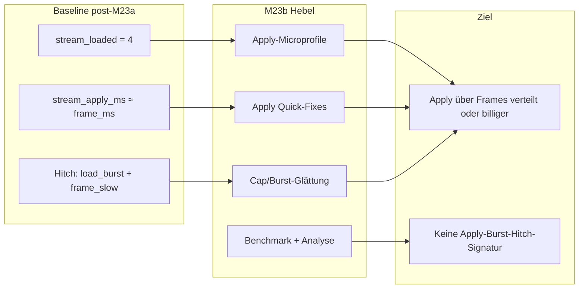

# M23b — Apply-/Load-Burst-Entschärfung

## Verbindliche Grundsätze

Diese Milestone-Einordnung ist bindend:

| Milestone | Inhalt |
|-----------|--------|
| **M23** | Beobachtbarkeit / Profiling-Basis |
| **M23a** | Deferred Unload / Sparse Persistence / Unload-Entschärfung |
| **M23b** | Apply-/Load-Burst-Entschärfung auf Basis der M23-Metriken |
| **M24** | Ores — wird von M23b **nicht** vorweggenommen |

Weitere harte Regeln:

1. **M23b bleibt vollständig im M23-Scope** — Profiling, Streaming-Tuning, Benchmarking, Szenario-Schärfung, eng begrenzte Quick-Fixes.
2. **M23b ist datengestützt** — maßgeblich sind Analyse-Runs und identische Vorher/Nachher-Vergleiche, nicht Vermutungen.
3. **Apply-/Load-Bursts sind Primärziel** — Unload gilt in M23b als bereits entschärft, solange neue Runs nichts anderes belegen.
4. **Quick-Fixes sind nur zulässig**, wenn sie im bestehenden Streaming- und M23-Metrik-Vertrag ausdrückbar bleiben (`stream_apply_ms`, `stream_loaded`, Hitch-Tags, `schema_version: 1`).
5. **Vorher/Nachher-Vergleich** auf identischen Szenarien mit gleicher `scenario_id`, gleichem `extract_enabled` und dokumentiertem Config-Fingerprint ist Pflicht.
6. **M23b optimiert nicht „irgendwie Performance“**, sondern reduziert die gemessenen und analysierten Apply-/Load-Burst-Hitches — ohne den M23/M23a-Architekturvertrag zu verlassen.

---

## Empfehlung

**Milestone-Nummerierung:** **M23b** — superior Milestone innerhalb M23, zwischen abgeschlossenem M23a und geplantem M24 (Ores).

**Gesamtentscheidung:**

| Entscheidung | Festlegung |
|--------------|------------|
| Primärhebel | **`stream_apply_ms`** im Apply-Pfad und **Cap-Burst-Verhalten** bei `max_applies_per_frame` |
| Nicht anfassen | Unload-Queue, Save v4, Persistenzmodell, Worker-Architektur, Overlay, Exploration |
| Messbasis | Bestehendes M23-Export-Schema + [`tools/analyze_perf_run.py`](tools/analyze_perf_run.py) |
| Baseline-Run | `20260710T204430Z_demo_unknown` (post-M23a Demo) |
| Repräsentatives Vergleichsszenario | **`catchup`** (Burst-Reproduktion) + **`pan`** (Regression); Demo-Run bleibt Integrations-Referenz |
| Erfolgsnachweis | [`tools/compare_perf_runs.py`](tools/compare_perf_runs.py) + Analyse-Report Vorher/Nachher |

**Zentrale technische These:** Die schweren Hitchs entstehen, wenn **vier Chunks in einem Frame synchron applied** werden und `stream_apply_ms` praktisch den gesamten `frame_ms` ausfüllt. M23b glättet oder senkt diese Apply-Spitzen — nicht das Profiling-Modell und nicht Unload.

---

## Problembeleg

Quelle: Analyse-Report [`docs/benchmarks/perf/runs/20260710T204430Z_demo_unknown/analysis/analysis_report.md`](docs/benchmarks/perf/runs/20260710T204430Z_demo_unknown/analysis/analysis_report.md), Summary [`summary.json`](docs/benchmarks/perf/runs/20260710T204430Z_demo_unknown/summary.json).

| Befund | Wert / Fakt |
|--------|-------------|
| Dominanter Bottleneck | **Load-/Apply-dominant** — 10/10 `frame_slow`-Hitchs |
| Schwere Hitch-Signatur | `stream_apply_ms ≈ stream_ms ≈ frame_ms` (typisch **≥ 99 %** Anteil, z. B. Frame 166: 902.7 / 902.8 / 907.0 ms) |
| Apply-Cap-Korrelation | **20/20 Hitch-Events** mit `stream_loaded = 4` (= `max_applies_per_frame`) |
| `max_loaded_per_frame` | **4** — identisch mit Cap |
| Kontextmuster | **`burst_with_tail`** — 10× bei schweren Spitzen; Companion-Frame +1 mit nur `load_burst` |
| `frame_ms_max` | **1063.64 ms** bei `frame_ms_p95 = 2.50 ms` — seltene Apply-Ausreißer, keine Dauerlast |
| `stream_ms_max` | **1061.40 ms** — praktisch deckungsgleich mit `frame_ms_max` |
| Hitch-Tags (schwer) | `frame_slow`, `stream_slow`, `load_burst` — **kein** `unload_burst`, **kein** `unload_backlog` |
| Unload unauffällig | `hitch_unload_count = 0`; `stream_unload_ms_p95 ≈ 0.01 ms`; `stream_unload_ms_max ≈ 0.19 ms` |
| M23a-Wirkung | Unload-Entschärfung **bestätigt** — M23b re-litigiert Unload **nicht** |

**Schlussfolgerung (verbindlich):** Der verbleibende Engpass ist **budgetierter 4er-Apply-Burst**, nicht Unload, nicht Extract-Dauerlast im Median.

---

## Zielbild

Nach M23b:

- Reproduzierbare Burst-Szenarien erzeugen definierte Apply-Spitzen und liefern vergleichbare Runs.
- Apply-Kosten im Hot-Path sind **lokalisiert** (Microprofile innerhalb `stream_apply_ms`) und **messbar reduziert** oder über Frames **geglättet**.
- Cap-/Burst-Logik verhindert monolithische 4-Chunk-Sync-Spitzen, ohne das hybride Streaming-Modell zu verlassen.
- Vorher/Nachher-Reports zeigen: **keine Hitchs mehr mit der bisherigen Apply-Burst-Signatur** auf den Referenzszenarien.
- M23-Metrikvertrag (`schema_version: 1`, kanonisches `frame_ms`, Hitch-Tags) bleibt unverändert; optionale Apply-Submetriken nur **additiv**.
- M24-Scope (Ores, Suppression-Runtime) bleibt unangetastet.

---

## Architekturprinzipien

- **Kein Streaming-Neudesign** — M23b darf **keine neue Streaming-Policy-Familie** einführen. [`ChunkStreamer.update`](game_core/chunk_streaming.py) behält die Phasenstruktur **Revive → Load/Apply → Mark → Drain**. M23b arbeitet ausschließlich an **Kosten und Verteilung innerhalb dieser Phasen**.
- **Keine zweite Metrikwelt** — Neue Metrikfelder sind **additiv** und bleiben **unterhalb** der bestehenden Pflichtfelder (`frame_ms`, `stream_ms`, `stream_apply_ms`, `stream_unload_ms`) und des `schema_version: 1`. Es wird **kein alternatives Export-Schema** eingeführt.
- **Adaptive Caps nur im Vertrag** — Szenario- oder modus-spezifische Cap-Anpassungen sind nur zulässig, wenn sie vollständig über [`assets/content/streaming.json`](assets/content/streaming.json) / [`assets/content/profiling.json`](assets/content/profiling.json) konfiguriert und in Docs/Baseline dokumentiert sind. **Harte Caps im Code ohne Config-Vertrag sind in M23b verboten.**
- **Apply vs. Unload bleiben getrennt gemessen** — `stream_apply_ms` und `stream_unload_ms` werden nicht zusammengelegt.
- **Cap ist Konfiguration, nicht Hardcode** — `max_applies_per_frame` bleibt Single Source in Config; Tuning erfolgt config-gesteuert und dokumentiert.
- **Worker-Apply bleibt bestehendes Modell** — keine neue Worker-Architektur; Quick-Fixes verbessern nur den bestehenden Apply-Pfad **intern**, ohne neue Load-Policy.
- **M23-Analyse ist Teil des Milestones** — [`game_core/perf/run_analysis/`](game_core/perf/run_analysis/) wird für Apply-Burst-DoD und Vorher/Nachher genutzt; kein zweites Profiling-System.
- **Kanonisches `frame_ms` unverändert** — Apply-Submetriken liegen **unterhalb** `stream_apply_ms`, nicht als Ersatz für `frame_ms`.

---

## Quick-Fix-Kategorien

M23b ist ein Bündel aus **a–c**. Jede Maßnahme muss im Metrik-Vertrag sichtbar sein und darf keinen Architekturwechsel bedeuten.

### a — Apply-Kosten senken

Ziel: **`stream_apply_ms` pro applied Chunk** und **`stream_apply_ms` in Burst-Frames** senken.

| Maßnahme | Planinhalt | Metrikbezug |
|----------|------------|-------------|
| **a1 Apply-Microprofile** | Subphasen innerhalb des Apply-Pfads werden sichtbar gemacht (z. B. Worker-Anteil, Sync-Generate, Delta-Apply, Pool-Wartezeiten). **Exakte Exportfelder und Tests werden in M23b Phase 1 festgelegt** — nicht auf Plan-Ebene. | additive optionale Felder unter `stream_apply_ms` |
| **a2 Redundante Sync-Arbeit entfernen** | Überflüssige oder doppelte Arbeit im Sync-Apply-Pfad abbauen. Konkrete Stellen werden aus Phase-1-Microprofile abgeleitet. | sinkendes `stream_apply_ms` bei gleichem `stream_loaded` |
| **a3 Apply-Hot-Path vereinfachen** | Kleine algorithmische oder strukturelle Verbesserungen mit **lokal begrenztem Diff** — keine neue Load-Policy. | P95/P99 `stream_apply_ms` auf Burst-Szenario |

**Verboten in a:** neue Persistenzschicht, Worker-Neudesign, Terrain-/Ore-Logik (M24).

### b — Cap-/Burst-Verhalten verfeinern

Ziel: **kein monolithischer Apply-Spike am Cap** mehr; Bursts werden budgetiert geglättet.

| Maßnahme | Planinhalt | Metrikbezug |
|----------|------------|-------------|
| **b1 Cap-Tuning** | `max_applies_per_frame` und ggf. szenario-/modusabhängige Config-Overrides evaluieren und dokumentieren. | `stream_loaded ≤ cap`; Hitch-Rate |
| **b2 Burst-Glättung** | Cap-/Burst-Tuning sorgt dafür, dass Budget und Cap **nicht mehr zu monolithischen Apply-Spitzen** führen, sondern Last über mehrere Frames verteilt wird. **Konkrete Umsetzung in den Implementierungsphasen**, unter Beibehaltung des bestehenden Budget-/Streaming-Modells. | weniger Cap-volle Frames mit `frame_slow`; niedrigeres `frame_ms_max` |
| **b3 Burst-Erkennung im Profiling** | Analyse/Report klassifiziert Cap-nahe Apply-Bursts explizit; optionale Summary-Ergänzungen nur additiv. Exakte Feldnamen in Phase 0/4 festlegen. | DoD-Auswertung automatisierbar |

**Verboten in b:** unbegrenztes Laden, Entfernen des Apply-Budgets, asynchrones Apply außerhalb des bestehenden Worker-Modells, adaptive Caps ohne Config-Vertrag.

### c — Szenario-/Benchmark-Schärfung

Ziel: **reproduzierbare Vorher/Nachher-Beweise** und klare Akzeptanzregeln.

| Maßnahme | Planinhalt | Metrikbezug |
|----------|------------|-------------|
| **c1 Burst-Referenzszenarien** | **`catchup`** und **`pan`** als Pflicht-Benchmarks. **Mindestens ein Szenario muss die Apply-Burst-Signatur zuverlässig reproduzieren**; Name und Details werden in der Umsetzung festgelegt (z. B. `load_burst_repro`). | identische `scenario_id` für Compare |
| **c2 Baseline-Contract** | Run `20260710T204430Z_demo_unknown` und frische CLI-Baselines unter `docs/benchmarks/perf/runs/` einfrieren | manifest + analysis als Referenz |
| **c3 Akzeptanz-Schwellen** | Regeln für akzeptables vs. inakzeptables `load_burst`-Verhalten (siehe unten); numerische Schwellen in Phase 0 bestätigen | Auswertung via Analyse-Tool + Compare |
| **c4 Vorher/Nachher-Reports** | Pflicht-Artefakte: `compare_perf_runs` + `analyze_perf_run` Markdown/JSON pro Baseline/Candidate | reviewbar, reproduzierbar |

**Schwellenvertrag (Phase 0):** Die exakten Schwellen — Hitch-Schwellwerte für `frame_ms`/`stream_ms` aus [`profiling.json`](assets/content/profiling.json) und der Analyse-Anteil `stream_apply_ms / frame_ms` für die Apply-Burst-Signatur — werden in **Phase 0 anhand der Referenz-Baselines festgelegt** und sind danach für M23b **verbindlich**. Die unten genannten Werte sind **Ausgangshypothesen aus dem Demo-Run**, keine vorab fixierte Implementierungswahrheit.

**Akzeptanzregeln `load_burst` (verbindlich nach Phase 0):**

| Status | Kriterium |
|--------|-----------|
| **Inakzeptabel** | Hitch mit Tags **`frame_slow` + `stream_slow` + `load_burst`**, Ursache **`apply_dominant`**, **`stream_loaded = max_applies_per_frame`**, **`stream_apply_ms / frame_ms`** oberhalb der in Phase 0 bestätigten Analyse-Schwelle (Ausgangshypothese: **≥ 0.9**) |
| **Akzeptabel (Cap-Tail)** | `load_burst`-Tag ohne `frame_slow` — Cap-Ausnutzung unter den in Phase 0 bestätigten Hitch-Schwellwerten |
| **Ziel M23b** | **Kein inakzeptables `load_burst`** auf Referenzszenarien; `hitch_frame_count = 0` für Apply-Burst-Signatur |

---

## Umsetzungsphasen

### Phase 0 — Baseline-Contract und Reproduzierbarkeit

**Module:** [`docs/benchmarks/perf/runs/`](docs/benchmarks/perf/runs/), [`tools/analyze_perf_run.py`](tools/analyze_perf_run.py), [`tools/run_perf_scenario.py`](tools/run_perf_scenario.py)

- Baseline-Run `20260710T204430Z_demo_unknown` als **M23b-Referenz** in Doku verankern (Summary-KPIs + Analyse-Report).
- Frische CLI-Baselines für **`catchup`** und **`pan`** erzeugen; Analyse-Reports ablegen.
- Apply-Burst-Signatur in Analyse-Tool als **explizite DoD-Prüfung** ergänzen.
- Burst-Reproduzierbarkeit feststellen und **Burst-Referenzszenario benennen**.
- **Analyse-Schwellen verbindlich festlegen** (Hitch-Tags, Cap-Korrelation, Apply-Anteil).

**DoD:** Referenz-Runs + Analyse vorhanden; reproduzierbares Burst-Szenario benannt; Schwellen dokumentiert; DoD-Checker zeigt Baseline-Ausgangslage (rot/inakzeptabel).

---

### Phase 1 — Apply-Microprofile

**Module:** [`game_core/chunk_streaming.py`](game_core/chunk_streaming.py), [`game_core/perf/models.py`](game_core/perf/models.py), [`game_core/perf/export_schema.py`](game_core/perf/export_schema.py)

- Apply-Subphasen innerhalb `stream_apply_ms` werden mit separaten Metriken sichtbar gemacht (z. B. Worker-Anteil, Sync-Generate, Delta-Apply, Pool-Wartezeiten).
- **Exakte Feldnamen und Export-Schema werden in der Implementierung festgelegt** — müssen aber **additiv** zu `schema_version: 1` sein.
- Summe der Sub-Metriken ≈ `stream_apply_ms`; Abweichung im Export validieren.
- Microprofile nur aktiv wenn Profiling aktiv — **zero overhead** wenn deaktiviert.

**DoD:** Dominante Apply-Subphase auf Burst-Szenario identifizierbar; Export schema v1 valide; Unit-Tests für Summen-Konsistenz und Deaktiv-Pfad.

---

### Phase 2 — Apply Quick-Fixes (Kategorie a)

**Module:** [`game_core/chunk_streaming.py`](game_core/chunk_streaming.py)

- Maßnahmen **a2/a3** ausschließlich auf der in Phase 1 identifizierten dominanten Subphase.
- Jeder Fix: einzeln benchmarkbar; kein Sammel-Refactor.
- Regression: Unload-Metriken und M23a-Invarianten unverändert grün.

**DoD:** Auf Burst-Referenzszenario messbare Senkung von `stream_apply_ms` **oder** `frame_ms_max` gegenüber Phase-0-Baseline; keine neuen Unload-Hitches.

---

### Phase 3 — Cap-/Burst-Tuning (Kategorie b)

**Module:** [`assets/content/streaming.json`](assets/content/streaming.json), [`game_core/streaming_config.py`](game_core/streaming_config.py), [`game_core/chunk_streaming.py`](game_core/chunk_streaming.py)

- Cap-/Burst-Tuning prüft und justiert die Anwendung von `max_applies_per_frame` und ggf. szenario-spezifische Config-Overrides.
- Ziel: **monolithische Apply-Spitzen vermeiden** und gleichzeitig Gesamtmittelwerte (`frame_ms_mean`) in akzeptablen Grenzen halten.
- **Konkrete Mechanik** (z. B. Verteilung über mehrere Frames) wird in Code entschieden — muss aber **innerhalb des bestehenden Budget-/Streaming-Modells** bleiben.
- Analyse-Erweiterungen für Cap-nahe Burst-Frames (Kategorie b3).
- Akzept-Grenze für Dauerlast-Regression: Schwellwert aus Phase 0 (gleiche Szenariofamilie).

**DoD:** Keine inakzeptablen Apply-Burst-Hitches auf Referenzszenario; `stream_loaded` am Cap tritt nicht mehr mit `frame_slow` in der DoD-Signatur auf.

---

### Phase 4 — Benchmark-Vergleich und DoD-Nachweis

**Module:** [`tools/compare_perf_runs.py`](tools/compare_perf_runs.py), [`tools/analyze_perf_run.py`](tools/analyze_perf_run.py), [`docs/benchmarks/perf/`](docs/benchmarks/perf/)

- Vorher/Nachher: Phase-0-Baseline vs. Post-M23b-Candidate — **`catchup`**, **`pan`**, Demo-Referenz.
- Pflicht-Artefakte: Compare-Output, Analyse-Reports, KPI-Tabelle.
- Regression gegen M23a: `hitch_unload_count`, `stream_unload_ms_p95` bleiben unauffällig.

**DoD:** Alle DoD-Kriterien (unten) auf Referenzszenarien erfüllt; Compare + Analyse unter `docs/benchmarks/perf/runs/` abgelegt.

---

### Phase 5 — Dokumentation

**Module:** [`ruleset.md`](ruleset.md), [`docs/benchmarks/perf/README.md`](docs/benchmarks/perf/README.md), [`docs/benchmarks/perf/ANALYSIS.md`](docs/benchmarks/perf/ANALYSIS.md)

- M23 / M23a / **M23b** / M24-Reihenfolge verbindlich.
- Apply-Burst-Akzeptanzregeln, Microprofile-Vertrag, Baseline-Referenz-Run.
- Quick-Fix-Katalog a–c mit Messnachweis.

**DoD:** Doku widerspruchsfrei; M23b abgeschlossen dokumentiert; kein M24-Scope-Leak.

---

## Verbotene Abweichungen

### In Scope (M23b)

- Apply-Microprofile (additiv)
- Apply-Quick-Fixes im bestehenden Streaming-Modell
- Cap-/Burst-Tuning und -Glättung
- Szenario-/Benchmark-Schärfung, Analyse-Erweiterung, Vorher/Nachher-Compare
- Dokumentation und Baseline-Pflege

### Nicht in Scope — verboten

- Ores / Suppression-Feature-Implementierung (M24)
- Exploration / Fog / Heatmap / Traffic-Systeme
- Save v5 oder Persistenz-Neuarchitektur
- Neue Overlay-Implementierung
- Worker-Architektur-Neuerfindung
- Komplettes Streaming-Redesign / neue Streaming-Policy-Familie
- Zweites Profiling-System neben M23
- Alternatives Export-Schema neben `schema_version: 1`
- Änderung der kanonischen `frame_ms`-Definition außerhalb des M23-Vertrags
- Unload-Re-Litigation / Rückbau M23a ohne neue Daten
- Renderer-/Bridge-Umbau als Performance-Hebel
- Adaptive Caps im Code ohne Config-Vertrag

### Technische Verbote

- `stream_apply_ms` und `stream_unload_ms` zusammenlegen
- Apply-Budget entfernen oder unbegrenzt laden
- Hitch-Tags oder `schema_version` breaking ändern
- Quick-Fixes ohne Messnachweis mergen
- DoD nur auf Demo ohne CLI-Referenzszenario belegen

---

## Definition of Done

M23b ist abgeschlossen, wenn **alle** Punkte erfüllt sind.

**Schwellenvertrag:** Numerische DoD-Schwellen (`frame_ms_max`-Reduktion, Apply-Anteil, Hitch-Schwellwerte) gelten in der **in Phase 0 dokumentierten Fassung**. Ausgangshypothesen aus dem Demo-Run dienen als Startpunkt; Abweichungen nur mit dokumentierter Begründung auf demselben Referenzszenario.

### 1. Vorher/Nachher-Vergleich

- Identisches Referenzszenario (**`catchup`** mindestens; **`pan`** zusätzlich ohne Regression).
- Baseline = Phase-0-Run; Candidate = Post-M23b-Run.
- [`tools/compare_perf_runs.py`](tools/compare_perf_runs.py) und [`tools/analyze_perf_run.py`](tools/analyze_perf_run.py) für beide Runs ausgeführt und abgelegt.

### 2. Spitzenreduktion (gegen Phase-0-Baseline)

| KPI | Baseline (belegt) | M23b-Ziel |
|-----|-------------------|-----------|
| `frame_ms_max` | **1063.64 ms** (Demo) / Burst-Szenario-Wert aus Phase 0 | **deutliche Reduktion** gegenüber Phase-0-Burst-Szenario; konkreter Faktor in Phase 0 festlegen (Ausgangshypothese: **≥ 10×** oder `frame_ms_max` unter bestätigter Hitch-Schwelle) |
| `stream_ms_max` | **1061.40 ms** | proportional zur `frame_ms_max`-Reduktion |
| `hitch_frame_count` | **10** (Demo) | **0** auf Referenzszenarien |
| `hitch_stream_count` | **10** | **0** auf Referenzszenarien |

### 3. Keine Hitchs mit bisheriger Apply-Burst-Signatur

Auf Referenzszenarien **null** Events, die die in Phase 0 bestätigte **inakzeptable Apply-Burst-Signatur** erfüllen:

- Ursache **`apply_dominant`**
- Tags **`frame_slow`**, **`stream_slow`**, **`load_burst`**
- **`stream_loaded = max_applies_per_frame`**
- **`stream_apply_ms / frame_ms`** oberhalb der Phase-0-Analyse-Schwelle (Ausgangshypothese: **≥ 0.9**)

Companion-Frames nur mit `load_burst` ohne `frame_slow` sind **akzeptabel**, sofern `frame_ms` und `stream_ms` unter den bestätigten Hitch-Schwellwerten bleiben.

### 4. Unload bleibt entschärft

- `hitch_unload_count = 0` auf Referenzszenarien
- `stream_unload_ms_p95` und `stream_unload_ms_max` nicht regressiv gegenüber M23a-Baseline
- Keine neue Dominanz von `unload_burst` / `unload_backlog`

### 5. M23-Metrikvertrag intakt

- `schema_version: 1` unverändert
- Pflichtfelder und kanonisches `frame_ms` unverändert
- Apply-Submetriken nur **optional/additiv**
- Export-Validierung und Analyse-Tool grün

### 6. Kein Scope-Verstoß

- Kein M24-Code (Ores, Suppression-Runtime)
- Keine verbotenen Architekturänderungen aus obiger Liste

### Kritische Testfälle

- Burst-Referenzszenario: **kein** inakzeptables Apply-Burst-Hitch gemäß Phase-0-Signatur
- `pan`: keine Regression bei `stream_unload_ms_p95`, `hitch_unload_count`
- Microprofile: Summe Sub-Metriken ≈ `stream_apply_ms`
- Profiling deaktiviert: kein Hot-Path-Overhead
- Analyse DoD-Checker: Baseline rot (Ausgangslage), Candidate grün
- Compare: gleiche `scenario_id`, gleiches `extract_enabled`
