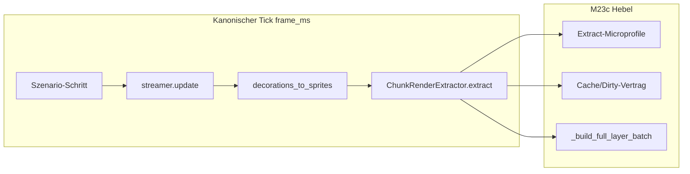

# M23c — Extract-Optimierung (Tile/Deko)

## Verbindliche Grundsätze

| Milestone | Inhalt |
|-----------|--------|
| **M23** | Profiling / Metriken / Szenarien / Export |
| **M23a** | Deferred Unload / Sparse Persistence |
| **M23b** | Apply-/Load-Burst-Entschärfung |
| **M23c** | Extract-Optimierung (Tile/Deko) im kanonischen Tick |
| **M24** | Ores / Suppression-Runtime — **nicht** Teil von M23c |

Harte Regeln:

1. **M23c arbeitet ausschließlich am Extract-Anteil von `frame_ms`** — `deco_extract_ms`, `tile_extract_ms` (Phasen 3–4 des kanonischen Ticks).
2. **Streaming, Apply, Unload, Hitch-Tags, `schema_version: 1`, kanonische `frame_ms`-Definition bleiben unverändert.** Optionale Extract-Submetriken sind additiv.
3. **M23c ist datengestützt** — Vorher/Nachher auf identischen Szenarien mit gleichem `extract_enabled` und dokumentiertem Config-Fingerprint.
4. **Kein Scope-Sprung:** kein Ores, kein Streaming-Redesign, kein GPU-Renderer-Umbau, keine neuen Hitch-Tags.
5. **M23c optimiert nicht erneut Apply/Load oder Unload** — `m23b_dod_passed` muss in Post-M23c-Runs erhalten bleiben.

---

## Problembeleg (bindend)

### Pre-M23b Demo — `20260710T204430Z_demo_unknown`

| Befund | Wert |
|--------|------|
| `frame_ms_max` | **1063.64 ms** |
| `frame_ms_p95` | **2.50 ms** |
| Hitch-Hauptursache | **Load-/Apply-dominant** (`stream_apply_ms ≈ frame_ms`, Cap 4) |
| Extract in Hitch-Kontext | ~91.6 % Anteil, **nicht** Primärbottleneck |

### Post-M23b Demo — `20260712T074209Z_demo_unknown` (M23c-Baseline „Vorher“)

Quelle: [`analysis_report.md`](docs/benchmarks/perf/runs/20260712T074209Z_demo_unknown/analysis/analysis_report.md), [`analysis_diagnosis.json`](docs/benchmarks/perf/runs/20260712T074209Z_demo_unknown/analysis/analysis_diagnosis.json)

| KPI | Wert |
|-----|------|
| `frame_ms_max` / p95 / mean | **15.61 / 5.71 / 2.97 ms** |
| M23b DoD | **bestanden** (`m23b_dod_passed = true`) |
| Anteil an `frame_ms` | Stream **6.6 %**, Apply **3.1 %**, Unload **0.3 %**, **Extract 92.8 %** |
| `tile_extract_ms` mean / p95 / max | **2.378 / 4.529 / 9.184 ms** |
| `deco_extract_ms` mean / p95 / max | **0.381 / 0.883 / 1.853 ms** |
| `extract_ms` mean / p95 / max | **2.759 / 5.367 / 10.929 ms** |
| Korrelation `frame_ms ↔ tile_extract_ms` | **r ≈ 0.974** (stark) |
| Korrelation `frame_ms ↔ deco_extract_ms` | **r ≈ 0.621** (moderat) |
| Korrelation `frame_ms ↔ extract_ms` | **r ≈ 0.987** (stark) |

**Schlussfolgerung (verbindlich):** Nach M23b ist **Extract der dominante CPU-Block**; innerhalb Extract ist **`ChunkRenderExtractor.extract()` / `_extract_full_chunk` / `_build_full_layer_batch`** der Primärhebel (~86 % des Extract-Anteils).

---

## Zielbild

Nach M23c:

- **Tile-Extract** ist messbar günstiger (Mean/P95/Max von `tile_extract_ms` unter Phase-0-Baseline).
- **Cache-Verhalten** ist transparent (Hits/Misses/Full-Rebuilds pro Frame exportierbar).
- **Reine Kamera-Bewegung** (steady/pan) erzeugt überwiegend Cache-Hits, keine unnötigen Full-Rebuilds.
- **Streaming/Apply/Unload** und **M23b DoD** bleiben grün.
- **M23-Metrikvertrag** intakt; Extract-Submetriken nur optional.
- Projekt ist **Extract-seitig bereit für M24**, ohne Ores-Implementierung vorwegzunehmen.

---

## Architekturprinzipien

- **Extract-Hot-Path zuerst:** [`bridge/chunk_extractor.py`](bridge/chunk_extractor.py) — `extract()` → Cache-Hit (`_cull_chunk_to_camera`) vs. Miss (`_extract_full_chunk` → `_build_full_layer_batch`).
- **Deko zweitrangig:** [`bridge/decoration_extractor.py`](bridge/decoration_extractor.py) — nur optimieren, wenn Microprofile oder Baseline es rechtfertigen.
- **Dirty ≠ Streaming:** `world.dirty_chunks` wird heute nur via `set_tile` gesetzt ([`game_core/world.py`](game_core/world.py)); `invalidate()` entfernt Cache-Einträge ohne Dirty-Flag ([`chunk_extractor.py`](bridge/chunk_extractor.py) Zeile 48–50). M23c präzisiert und testet diesen Vertrag — **keine Streaming-Logik-Änderung in M23a/M23b-Pfaden.**
- **Keine zweite Metrikwelt:** Submetriken hängen unter bestehenden optionalen Feldern; Rekonstruktion via [`game_core/perf/run_analysis/`](game_core/perf/run_analysis/) wie bei M23b.
- **Zero overhead wenn Profiling aus:** Sub-Timer und Zähler nur wenn Metriken-Out-Parameter gesetzt / Profiling aktiv — analog M23b Apply-Microprofile.
- **Determinismus:** Optimierungen dürfen sichtbare Tile-/Sprite-Ergebnisse nicht ändern — bestehende Tests in [`tests/test_chunk_cache.py`](tests/test_chunk_cache.py) bleiben grün.

---

## Optimierungs-Kategorien

### a — Extract-Microprofiling (Phase 1)

Ziel: Ursachen sichtbar machen, bevor optimiert wird.

| Kategorie | Inhalt | Metrikbezug |
|-----------|--------|-------------|
| **a1 Tile-Submetriken** | sichtbare Chunks, Cache-Hits/Misses, Full-Rebuild-Zähler, optional Full-Rebuild-ms vs. Cull-ms | additive optionale Frame-Felder unter `tile_extract_ms` |
| **a2 Deko-Submetriken** | Dekorationen im Sichtbereich, optional Iterations-Zähler | unter `deco_extract_ms` |

Exakte Feldnamen werden in Phase 1 festgelegt (nicht im Plan hardcoden).

### b — Cache-/Dirty-Vertrag (Phase 2)

Ziel: unnötige Full-Rebuilds eliminieren.

| Kategorie | Inhalt |
|-----------|--------|
| **b1 Vertrag dokumentieren** | Wann Full-Extract nötig: `dirty_chunks`, Cache-Miss (neuer Chunk), `invalidate()` |
| **b2 Spurious-Miss vermeiden** | Reine Pan/Zoom/Streaming-Events ohne Tile-Änderung dürfen keinen Voll-Extract auslösen, wenn Cache warm |
| **b3 Messen** | Hit-Rate via Phase-1-Submetriken auf steady/pan |

### c — `_build_full_layer_batch`-Optimierung (Phase 3)

Ziel: teure Miss-Pfade billiger machen — **ohne** sichtbare Welt zu ändern.

| Kategorie | Inhalt |
|-----------|--------|
| **c1 Allokationen reduzieren** | Listen/Tuples in Hot-Loop, Wiederverwendung wo sicher |
| **c2 Sprite-Key-Auflösung** | `_sprite_cache` stärker nutzen; Layer-Iteration ohne redundante Arbeit |
| **c3 Teil-Rebuild** | nur wenn Dirty-Information Layer-Granularität erlaubt — sonst Full-Rebuild beibehalten |

---

## Umsetzungsphasen

### Phase 0 — Extract-Baseline festschreiben

**Module:** [`docs/benchmarks/perf/M23C_BASELINE.md`](docs/benchmarks/perf/M23C_BASELINE.md) (neu), [`ruleset.md`](ruleset.md), [`docs/benchmarks/perf/runs/`](docs/benchmarks/perf/runs/)

- **Post-M23b Demo** `20260712T074209Z_demo_unknown` als verbindliche **M23c-Vorher-Referenz** dokumentieren (KPIs oben).
- **Pre-M23b Demo** `20260710T204430Z_demo_unknown` als historischer Kontext (Apply-dominiert) — nicht als M23c-Vergleichsziel.
- Szenario-Set festlegen: **`demo`**, **`steady`**, **`pan`**, **`catchup`** (extract_enabled=true).
- Fehlende CLI-Baselines erzeugen: mindestens **`steady`** + **`catchup`** oder **`zoom_out`** mit `analyze_perf_run`-Reports.
- **Reduktionsziel Phase 0 festlegen** (Schwellenvertrag): Ausgangshypothese **≥ 2× Reduktion** von `tile_extract_ms` p95/max und `extract_ms` p95/max gegenüber Post-M23b-Baseline auf Demo + ein CLI-Szenario; verbindlich nach ersten Microprofile-Runs bestätigen.

**DoD:** `M23C_BASELINE.md` + ruleset-Abschnitt M23c; Demo-Analyse verlinkt; mindestens ein CLI-Baseline-Run mit Extract-Verteilungen dokumentiert.

---

### Phase 1 — Extract-Microprofiling

**Module:** [`bridge/chunk_extractor.py`](bridge/chunk_extractor.py), [`bridge/decoration_extractor.py`](bridge/decoration_extractor.py), [`game_core/perf/models.py`](game_core/perf/models.py), [`game_core/perf/session.py`](game_core/perf/session.py), [`tools/run_perf_scenario.py`](tools/run_perf_scenario.py), [`apps/chunk_world_demo.py`](apps/chunk_world_demo.py)

- `ExtractStepMetrics` (mutable Out-Parameter, zero-init) — analog `StreamStepMetrics`.
- Tile-Submetriken in `extract()` nur wenn Metrics-Objekt übergeben; Demo/CLI durchreichen.
- Optionale Frame-Felder in `FrameMetrics` / Export nur wenn `tile_extract_ms > 0` (M23b-Muster).
- Deko: Zähler für sichtbare Dekorationen optional.

**DoD:** Submetriken in Export bei aktivem Profiling; fehlen bei deaktiviertem Profiling; Tests: Summen-Konsistenz, No-Overhead; Demo-Run zeigt Hit/Miss-Verteilung interpretierbar.

---

### Phase 2 — Cache-/Dirty-Vertrag präzisieren

**Module:** [`bridge/chunk_extractor.py`](bridge/chunk_extractor.py), [`game_core/world.py`](game_core/world.py), Doku in [`M23C_BASELINE.md`](docs/benchmarks/perf/M23C_BASELINE.md)

- Vertrag schriftlich fixieren (Tile-Extract):
  - **Full-Rebuild:** Cache-Miss ODER `coord in dirty_chunks`
  - **Cull-only:** Cache-Hit und nicht dirty
  - **invalidate(coord):** Cache-Eintrag weg, kein `dirty_chunks`-Set
  - **Neuer Chunk geladen:** Cache-Miss (kein Eintrag), kein automatisches dirty
- Bestehende Tests erweitern: steady/pan-Szenario-Runs oder Unit-Tests — erwartete Hit-Rate >> Miss nach Warmup.
- Keine Änderung an `ChunkStreamer.update`-Reihenfolge oder M23b-Caps.

**DoD:** Dokumentierter Vertrag; Tests grün; Microprofile auf steady zeigt hohe Hit-Rate, niedrige Full-Rebuild-Zähler.

---

### Phase 3 — `_build_full_layer_batch`-Optimierungen

**Module:** [`bridge/chunk_extractor.py`](bridge/chunk_extractor.py)

- Optimierungen **c1–c3** nur innerhalb Extract-Bridge; deterministische Ausgabe (`test_chunk_cache.py`, ggf. Snapshot-Vergleich Tile-IDs).
- Einzeln messbar (Microprofile: Full-Rebuild-ms sinkt bei gleicher Miss-Rate).

**DoD:** `tile_extract_ms` mean/p95/max **deutlich unter** Phase-0-Baseline auf Demo + CLI-Referenzszenario; keine Extract-Determinismus-Regression; M23/M23a/M23b-Tests grün.

---

### Phase 4 — Vorher/Nachher-Benchmarks

**Module:** [`tools/compare_perf_runs.py`](tools/compare_perf_runs.py), [`game_core/perf/run_analysis/reconstruct.py`](game_core/perf/run_analysis/reconstruct.py), [`docs/benchmarks/perf/runs/`](docs/benchmarks/perf/runs/)

- Runs: **Demo** + **steady** oder **catchup** (Pre/Post M23c).
- `compare_perf_runs.py` erweitern: Extract-KPIs aus `frames.jsonl` rekonstruieren (summary.json enthält Extract nicht):
  - `tile_extract_ms_mean/p95/max`
  - `deco_extract_ms_mean/p95/max`
  - `extract_ms_mean/p95/max`
- Analyse-Reports unter `<run_id>/analysis/` für Candidate-Runs.
- **M23b DoD-Checker** auf Candidate erneut ausführen — muss grün bleiben.

**DoD:** Compare-Output mit Extract-Deltas; Schwellenvertrag aus Phase 0 erfüllt; Problem-Ranking zeigt niedrigere absolute Extract-Werte; keine Apply-Burst-Rückkehr.

---

### Phase 5 — Doku und Milestone-Abschluss

**Module:** [`ruleset.md`](ruleset.md), [`docs/ARCHITECTURE.md`](docs/ARCHITECTURE.md), [`docs/benchmarks/perf/README.md`](docs/benchmarks/perf/README.md), [`docs/benchmarks/perf/ANALYSIS.md`](docs/benchmarks/perf/ANALYSIS.md)

- Milestone-Tabelle M23 → M23c → M24.
- Pre/Post-M23c Kern-KPIs (Demo + CLI).
- Extract-Kapitel: Microprofile-Felder, Cache-Vertrag, Optimierungskategorien.
- Klarstellung: M23b (Apply) + M23c (Extract) = M23-CPU-Basis vor M24.

**DoD:** Doku widerspruchsfrei; kein M24-Scope-Leak.

---

## Verbotene Abweichungen

- Änderung kanonischer `frame_ms`-Definition oder Tick-Reihenfolge
- Neue oder geänderte Hitch-Tags
- Änderung von `stream_ms` / `stream_apply_ms` / `stream_unload_ms`-Semantik
- Streaming-Policy, Worker-Architektur, M23b-Caps
- Ores / Suppression / Save v5
- Breaking changes an `schema_version: 1` Pflichtfeldern
- GPU-Renderer-Umbau als M23c-Hebel

---

## Definition of Done (M23c gesamt)

M23c ist abgeschlossen, wenn **alle** Punkte erfüllt sind:

### 1. Extract-Reduktion (gegen Phase-0-Baseline `20260712T074209Z_demo_unknown`)

| KPI | Baseline (Post-M23b Demo) | M23c-Ziel (nach Phase-0-Schwellenvertrag) |
|-----|---------------------------|-------------------------------------------|
| `tile_extract_ms` p95 / max | 4.53 / 9.18 ms | **≥ 2× Reduktion** (Hypothese; Phase 0 bestätigt) |
| `extract_ms` p95 / max | 5.37 / 10.93 ms | proportional |
| `deco_extract_ms` | 0.38 / 1.85 ms max | nicht regressiv; Optimierung optional |

Gleiches Muster auf **mindestens einem CLI-Szenario** (steady oder catchup).

### 2. Streaming/Apply/Unload intakt

- `m23b_dod_passed = true` auf Post-M23c Demo-Run
- Keine inakzeptable Apply-Burst-Signatur
- M23/M23a/M23b-Test-Suite grün

### 3. Metrikvertrag

- `schema_version: 1` unverändert
- Extract-Submetriken nur optional/additiv

### 4. Artefakte

- Vorher/Nachher-Reports unter `docs/benchmarks/perf/runs/` (Demo + CLI)
- `compare_perf_runs.py` mit Extract-KPIs
- [`M23C_BASELINE.md`](docs/benchmarks/perf/M23C_BASELINE.md) aktualisiert mit Post-M23c-Werten

### Kritische Testfälle

- Cache-Hit bei wiederholtem Extract ohne `set_tile` ([`tests/test_chunk_cache.py`](tests/test_chunk_cache.py))
- Dirty triggert Rebuild; off-screen dirty bleibt lazy
- Microprofile: zero overhead wenn deaktiviert
- Extract-Determinismus nach Phase-3-Optimierungen
- M23b DoD auf Candidate grün
