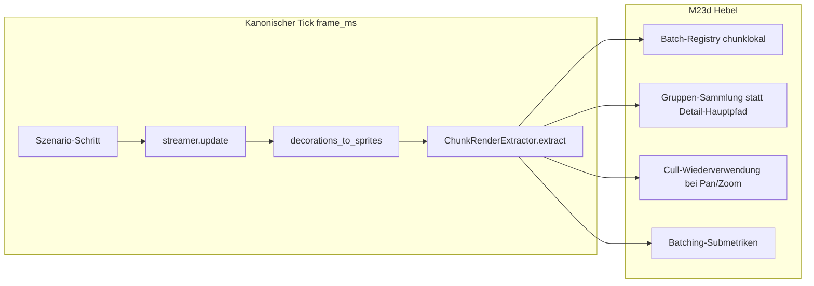

# M23d — Chunk-Render-Batching

## Verbindliche Grundsätze

| Milestone | Inhalt |
|-----------|--------|
| **M23** | Profiling / Metriken / Szenarien / Export |
| **M23a** | Deferred Unload / Sparse Persistence |
| **M23b** | Apply-/Load-Burst-Entschärfung |
| **M23c** | Extract-Optimierung (Tile/Deko) — Microprofile, Cache-/Dirty-Vertrag, Hot-Path |
| **M23d** | Chunk-/Gruppen-Batching im sichtbarkeitsabhängigen Extract-/Darstellungspfad |
| **M24** | Ores / Suppression-Runtime — **nicht** Teil von M23d |

Harte Regeln:

1. **M23d ist ein Batching-Milestone, kein LOD-Milestone.** Sichtbare Welt wird gruppenweise repräsentiert und weitergegeben. LOD/Mipmaps/Map-Mode dürfen höchstens als Folgearbeit erwähnt werden — nicht als versteckter Zweit-Milestone.
2. **M23d arbeitet ausschließlich am sichtbarkeitsabhängigen Extract-/Darstellungspfad** — `deco_extract_ms`, `tile_extract_ms` (Phasen 3–4 des kanonischen Ticks). Streaming, Apply, Unload, Save-Format und M23a/M23b-Pfade bleiben **unangetastet**.
3. **Kanonische `frame_ms`-Definition bleibt unverändert:** Szenario-Schritt → `streamer.update` → Deko-Extract → Tile-Extract. Render/GPU bleibt **außerhalb** von `frame_ms`.
4. **M23d erfindet keine zweite Metrikwelt.** Additive optionale Batching-Submetriken sind erlaubt; `schema_version: 1`, Pflichtfelder und bestehende KPIs bleiben kompatibel. Demo- und CLI-Runs bleiben vergleichbar.
5. **M23d ist datengetrieben** — Vorher/Nachher auf identischen Szenarien mit gleichem `extract_enabled` und dokumentiertem Config-Fingerprint.
6. **Batching ist Repräsentations- und Kostenfrage, kein Gameplay-Umbau.** Sichtbare Weltsemantik (Tile-IDs, Positionen, Layer) darf sich nicht willkürlich ändern — Determinismus-Tests bleiben bindend.
7. **M23b DoD und M23c Cache-/Dirty-Vertrag müssen auf Post-M23d-Runs grün bleiben.**
8. **M23d darf keine neue globale Welt-Batch-Ebene einführen**, die Chunk-Grenzen semantisch oder invalidierungstechnisch verwischt. Dirty/Rebuild und Invalidierung bleiben **chunkgebunden**; globale Sammelstrukturen dürfen nicht zur versteckten Primärrepräsentation werden — sonst unterläuft M23d den lokalen Dirty-/Rebuild-Vertrag und macht chunklokale Invalidierung unzuverlässig.

---

## Problembeleg (bindend)

### Nach M23b: Apply-/Unload-Burst ist nicht mehr der Primärbottleneck

Quelle: [`20260712T074209Z_demo_unknown`](docs/benchmarks/perf/runs/20260712T074209Z_demo_unknown/analysis/analysis_report.md) (Post-M23b Demo)

| Befund | Wert |
|--------|------|
| M23b DoD | **bestanden** |
| Anteil an `frame_ms` | Stream **6.6 %**, Apply **3.1 %**, Unload **0.3 %**, **Extract 92.8 %** |
| `frame_ms` mean / p95 / max | 2.97 / 5.71 / **15.61 ms** |
| Hitch-Hauptursache | **Extract-dominant** (Dauerlast), nicht Apply/Unload |

### Nach M23c: Extract bleibt der dominante CPU-Block

Quelle: [`20260712T082720Z_demo_unknown`](docs/benchmarks/perf/runs/20260712T082720Z_demo_unknown/analysis/analysis_diagnosis.json) (Post-M23c Demo, **M23d-Vorher-Baseline**)

| KPI | Wert |
|-----|------|
| M23b DoD | **bestanden** |
| Anteil an `frame_ms` | Stream **7.7 %**, Apply **3.2 %**, Unload **0.3 %**, **Extract 91.8 %** |
| `tile_extract_ms` mean / p95 / max | **2.95 / 4.89 / 6.41 ms** |
| `extract_ms` mean / p95 / max | **3.54 / 5.82 / 7.99 ms** |
| `chunk_count` mean / p95 | **176.8 / 189** |
| Korrelation `frame_ms ↔ tile_extract_ms` | **r ≈ 0.943** (stark) |
| Korrelation `frame_ms ↔ extract_ms` | **r ≈ 0.957** (stark) |
| Korrelation `frame_ms ↔ chunk_count` | **r ≈ 0.395** (schwach im Post-M23c-Demo; in Post-M23b-Baseline **r ≈ 0.684** moderat) |

### Post-M23b Zoom-/Sichtfeld-Korrelation (bindender Problemrahmen)

Quelle: [`20260712T074209Z_demo_unknown`](docs/benchmarks/perf/runs/20260712T074209Z_demo_unknown/analysis/analysis_diagnosis.json)

| Korrelation | Wert |
|-------------|------|
| `frame_ms ↔ zoom` | **r ≈ -0.824** (stark negativ) |
| `frame_ms ↔ chunk_count` | **r ≈ 0.684** (moderat) |
| `frame_ms ↔ tile_extract_ms` | **r ≈ 0.974** (stark) |
| `frame_ms ↔ extract_ms` | **r ≈ 0.987** (stark) |

**Schlussfolgerung (verbindlich, nicht weich):**

1. Nach M23b ist **Apply-/Unload-Burst nicht mehr der Primärbottleneck**.
2. Nach M23c bleibt der **sichtbarkeitsabhängige Extract-/Darstellungspfad der dominante CPU-Block** im kanonischen Tick (~**92 %** von `frame_ms`).
3. `tile_extract_ms` und `extract_ms` korrelieren **sehr stark** mit `frame_ms`; **Zoom-Out / großes Sichtfeld** treibt Kosten über steigende sichtbare Chunk-Anzahl.
4. **Vollbild + großes Sichtfeld skaliert ohne gruppierte Darstellung / weniger per-Chunk-Arbeit weiter schlecht** — M23c-Hot-Path-Optimierungen allein reichen nicht; die **per-sichtbarem-Chunk-Schleife** in [`bridge/chunk_extractor.py`](bridge/chunk_extractor.py) (`extract()` → pro Chunk Hit/Miss/Cull als primäre Repräsentationsstruktur) bleibt der Skalierungsengpass.

---

## Zielbild

Nach M23d:

- **Sichtbare Welt** wird im produktiven Pfad primär als **Satz vorbereiteter Gruppenrepräsentationen** (Chunk-Layer-Batches) zusammengestellt und weitergegeben — **nicht** mehr primär als pro-Frame-Liste einzelner Tile-Ausgabeobjekte durch den bisherigen per-Chunk-Detailpfad. **Interne tilebezogene Arbeit** beim chunklokalen Batch-Build oder bei Full-Rebuilds bleibt zulässig und erwartbar.
- **`tile_extract_ms` skaliert sublinearer** mit `chunk_count` — insbesondere bei großem Sichtfeld / Zoom-Out (Demo + `zoom_out`-CLI).
- **`frame_ms` sinkt proportional** zum Extract-Anteil; Korrelation `frame_ms ↔ tile_extract_ms` bleibt, absolute Werte fallen — **ohne** relevante Kostenverschiebung in Nachbar-KPIs.
- **Reine Kamera-Bewegung** (Pan/Zoom ohne Tile-Änderung) triggert **keine** chunkweiten Voll-Rebuilds; Cull-Ergebnisse werden wiederverwendet, wenn die sichtbare Tile-Teilmenge pro Chunk unverändert bleibt.
- **M23c Cache-/Dirty-Vertrag** bleibt gültig und wird durch Batching **nicht unterlaufen**.
- **M23b DoD** bleibt grün; Streaming/Apply/Unload unverändert.
- **`RenderFrame`-Semantik** (Tile-IDs, Positionen, Layer) bleibt deterministisch identisch zum Vor-M23d-Zustand.
- Projekt ist **Extract-seitig bereit für M24**, ohne Ores vorwegzunehmen.

---

## Architekturprinzipien

### 1. Batching-Einheit (bindende Entscheidung)

| Ebene | Festlegung |
|-------|------------|
| **Kleinste stabile Batch-Einheit** | **`(chunk_coord, layer_id)`** — ein vorbereiteter `TileLayerBatch` pro Chunk-Layer |
| **Räumliche Bindung** | Jeder Batch ist an genau **einen Chunk** und **einen Layer** gebunden — **nicht** global über die ganze Welt |
| **Sammel-Einheit für `RenderFrame`** | Sichtbare Chunk-Layer-Batches werden zu **`TileChunkRenderData`** gruppiert (bestehendes Format); `RenderFrame.tile_chunks` bleibt die Übergabe-Schnittstelle |
| **Kein Welt-Batch** | Mehrere Chunks werden **nicht** zu einem einzigen globalen Super-Batch verschmolzen; Gruppierung erfolgt **chunklokal**, Sammlung nur über die sichtbare Chunk-Menge |
| **Keine globale Primärrepräsentation** | Es darf **keine** übergeordnete Welt-Sammelstruktur eingeführt werden, die Chunk-Grenzen für Dirty/Rebuild/Invalidierung verwischt — siehe Harte Regel 8 |

Exakte interne Datenstrukturen (Registry-Typen, Cull-Cache-Keys) werden in Phase 2 festgelegt — die **Entscheidungsrichtung** oben ist bindend.

### 2. Repräsentationspfad vs. interne Tile-Arbeit (bindende Abgrenzung)

| Aspekt | Festlegung |
|--------|------------|
| **Was M23d ersetzt** | Die **primäre Ausgabestruktur** und den **Hauptrepräsentationspfad** für sichtbare Welt im produktiven `extract()`-Pfad |
| **Was M23d nicht verbietet** | **Interne tilebezogene Arbeit** beim chunklokalen Batch-Build, bei Full-Rebuilds oder bei der Erzeugung einzelner `TileLayerBatch`-Inhalte |
| **Was verboten ist** | Dass die produktive sichtbare Welt **pro Frame primär** als Menge einzelner Tile-Ausgabeobjekte durch den bisherigen per-Chunk-Detailpfad läuft — statt über vorbereitete, chunkgebundene Gruppenrepräsentationen |
| **Kurzform** | M23d batcht die **Repräsentation und Weitergabe**, nicht das Existenzrecht tilebezogener Build-Arbeit auf Chunk-Layer-Ebene |

### 3. Dirty-/Rebuild-Vertrag (bindend)

| Ereignis | Verhalten |
|----------|-----------|
| **Tile geändert** (`set_tile` → `dirty_chunks`) | Nur betroffene **`(coord, layer_id)`**-Batches invalidieren und beim nächsten sichtbaren Extract neu aufbauen |
| **Streaming Unload** | `invalidate(coord)` entfernt **alle** Batches des Chunks aus Registry und Cull-Cache — **kein** `dirty_chunks`-Set (M23c-Vertrag) |
| **Neuer Chunk geladen** | Cache-Miss für alle Layer des Chunks — einmaliger Full-Build, danach Registry-Eintrag |
| **Reine Pan/Zoom** | **Kein** `mark_dirty`; wenn `visible_tile_range_in_chunk(coord, camera)` unverändert → **Cull-Wiederverwendung** aus Cull-Cache; wenn Tile-Range sich ändert → nur **Cull-Update** für betroffene Layer, **kein** Full-Rebuild |
| **Warmup nach Kamera-Sprung** | Erster Frame nach Range-Änderung darf Cull-Miss haben; Folgeframes müssen Cull-Hits liefern (analog M23c steady/pan-Erwartung) |

**M23c-Prinzipien bleiben gültig:** Full-Rebuild nur bei Cache-Miss oder `dirty_chunks`; Cull-only bei warmem Batch ohne Dirty.

### 4. Batching-Pfad vs. Detailpfad (bindende Entscheidung)

| Pfad | Rolle |
|------|-------|
| **Batching-Pfad (produktiv)** | `extract()` stellt sichtbare Welt aus **Batch-Registry** + **Cull-Cache** als Gruppenrepräsentationen zusammen — Standard für Demo, CLI und Profiling |
| **Detailpfad (Legacy/Fallback)** | Bisherige per-Chunk-Schleife mit direktem `_extract_full_chunk` / `_cull_chunk_to_camera` als primäre Repräsentationsstruktur |

**Fallback ist nur erlaubt wenn:**

1. Expliziter **Test-/Debug-Modus** (`extract_mode="per_chunk"` oder gleichwertiger Flag) — nur in Tests, nicht in Produktion.
2. **Einmaliger Kaltstart** für einen Chunk-Layer ohne Registry-Eintrag (Streaming-Load, erster Sichtkontakt) — danach sofort Registry-Befüllung; kein dauerhafter Parallelbetrieb.

**Invariante:** Im M23d-Zielzustand ist der **Batching-Pfad der einzige produktive Hauptpfad**. Es darf **kein** dauerhafter Zustand entstehen, in dem zwei gleichwertige Hauptpfade unklar nebeneinander leben. Der Detailpfad wird nach Phase 3 auf Test-Only reduziert.

### 5. Modul-Grenzen

- **Primärer Hebel:** [`bridge/chunk_extractor.py`](bridge/chunk_extractor.py) — Registry, Sammlung, Cull-Cache
- **Typen unverändert nutzen:** [`render_scene/types.py`](render_scene/types.py) — `TileLayerBatch`, `TileChunkRenderData`, `RenderFrame`
- **GPU-Pfad unberührt:** [`render_graphics/tile_layer.py`](render_graphics/tile_layer.py) — `pack_textured_tile_chunks` bleibt; M23d optimiert CPU-Vorbereitung, nicht GPU-Packing
- **Deko außerhalb Primärziel:** [`bridge/decoration_extractor.py`](bridge/decoration_extractor.py) — nur Regression-Schutz, keine Batching-Umstellung in M23d
- **Sichtbarkeit:** [`bridge/visibility.py`](bridge/visibility.py) — `visible_chunk_coords`, `visible_tile_range_in_chunk` bleiben Single Source

### 6. Metrik-/Benchmark-Vertrag

**Bestehende KPIs für Vorher/Nachher (Pflicht, unverändert):**

| KPI | Quelle |
|-----|--------|
| `frame_ms` mean / p95 / max | `summary.json` + `frames.jsonl` |
| `tile_extract_ms` mean / p95 / max | `frames.jsonl` via [`extract_kpis.py`](game_core/perf/run_analysis/extract_kpis.py) |
| `deco_extract_ms` mean / p95 / max | `frames.jsonl` |
| `extract_ms` mean / p95 / max | `frames.jsonl` |
| `chunk_count` mean / p95 | `frames.jsonl` |
| M23b DoD | [`m23b_dod.py`](game_core/perf/run_analysis/m23b_dod.py) |
| M23c Extract-Submetriken | `tile_cache_hits/misses`, `tile_full_rebuild_ms`, `tile_cull_ms` (weiterhin gültig) |

**Zulässige additive Batching-Submetriken — Pflichtkategorien (exakte Feldnamen in Phase 1):**

Die folgenden **Metrikkategorien** sind verbindlich abzudecken. Die **exakten Feldnamen** werden in Phase 1 festgelegt — sofern sie dem bestehenden M23/M23c-Muster folgen (additiv, optional, zero overhead wenn Profiling aus). Der Plan legt **keine** endgültige Export-API fest.

| Kategorie (verbindlich) | Was messbar sein muss |
|-------------------------|----------------------|
| **Sichtbare Gruppen** | Anzahl der im Frame zusammengestellten Chunk-Layer-Batch-Gruppen |
| **Registry-Verhalten** | Treffer und Fehltreffer auf der Batch-Registry pro Frame |
| **Cull-Cache-Verhalten** | Treffer und Fehltreffer auf dem Cull-Cache pro Frame |
| **Rebuild-Zähler** | Anzahl chunklokaler Full-Rebuilds pro Frame (sollte ≈ M23c-Miss-Rate bleiben) |
| **Assemble-Anteil** | Zeitanteil der Gruppen-Sammlung innerhalb `tile_extract_ms` |

Submetriken nur wenn Profiling aktiv; zero overhead wenn deaktiviert. `schema_version: 1` bleibt.

**Kostenverschiebungs-Guardrails (verbindlich):**

Verbesserungen zählen nur dann als M23d-Erfolg, wenn sie **nicht** durch relevante Regressionen oder verdeckte Kostenverschiebungen erkauft werden.

| Guardrail | Regel |
|-----------|-------|
| **Extract-Nachbarn** | Reduktionen bei `tile_extract_ms` zählen nur bei **stabilen oder nicht regressiven** `deco_extract_ms`- und `extract_ms`-Werten |
| **Kanonischer Tick** | Keine Verlagerung von Arbeit in andere `frame_ms`-Teile, die den Batching-Hebel verschleiern (z. B. versteckte Vorbereitung außerhalb `tile_extract_ms` im kanonischen Tick) |
| **Streaming/Apply/Unload** | `stream_ms`, `stream_apply_ms`, `stream_unload_ms` dürfen **nicht regressiv** steigen; M23b DoD bleibt grün |
| **Semantik/Determinismus** | `RenderFrame`-Semantik und Determinismus-Vertrag bleiben unverändert — Batching-Erfolg ist **ungültig**, wenn Kosten nur verschoben statt reduziert wurden |
| **Kurzform** | Batching-Erfolg = echte Kostenreduktion, nicht Umbuchung |

**Vergleichsregeln:** Identische `scenario_id`, gleiches `extract_enabled`, dokumentierter Config-Fingerprint; Compare via [`compare_perf_runs.py`](tools/compare_perf_runs.py).

---

## Optimierungs- / Umbau-Kategorien

### a — Batching-Metriken / Diagnosefähigkeit (Phase 1)

Ziel: Batching-Verhalten messbar machen, bevor der Pfad umgestellt wird.

| Kategorie | Inhalt |
|-----------|--------|
| **a1 Registry-Metriken** | Kategorie Registry-Verhalten: Hits/Misses, sichtbare Gruppenzahl |
| **a2 Cull-Cache-Metriken** | Kategorie Cull-Cache-Verhalten: Hits/Misses, Assemble-Anteil |
| **a3 Export-Kompatibilität** | Additive Felder unter bestehenden optionalen Extract-Feldern; exakte Namen Phase-1-Entscheid |

### b — Batching-Datenmodell / Dirty-Vertrag (Phase 2)

Ziel: stabile räumliche Einheiten mit klarem Lebenszyklus.

| Kategorie | Inhalt |
|-----------|--------|
| **b1 Batch-Registry** | Key `(chunk_coord, layer_id)` → vorbereiteter `TileLayerBatch` (Full-Build-Ergebnis) |
| **b2 Cull-Cache** | Key `(chunk_coord, layer_id, tile_range)` → gecullter `TileLayerBatch` |
| **b3 Invalidierung** | `mark_dirty` → betroffene Layer; `invalidate(coord)` → ganzer Chunk; `invalidate_all()` → Welt-Load |
| **b4 Lebenszyklus** | Build-on-miss → Register → Cull-on-demand → Reuse |
| **b5 Migration** | Batch-orientiertes Cache-/Registry-Modell ersetzt den bisherigen primären Cachepfad; exakte Übergangsmechanik wird in Phase 2 festgelegt — Zielinvariante: Registry ist produktiver Primärpfad, kein dauerhafter Doppel-Primärpfad |

### c — Produktiver Batching-Pfad (Phase 3)

Ziel: Gruppenweise Repräsentation und Weitergabe statt Detailpfad als primäre Ausgabestruktur.

| Kategorie | Inhalt |
|-----------|--------|
| **c1 Sammlung** | `extract()` iteriert sichtbare Coords, holt Gruppenrepräsentationen aus Registry/Cull-Cache — der **Warm-Pfad** nutzt nicht mehr den bisherigen per-Chunk-Detailpfad als primäre Repräsentationsstruktur; interne tilebezogene Build-Arbeit bei Miss/Rebuild bleibt zulässig |
| **c2 Assemble** | Sammelt Chunk-Layer-Batches zu `TileChunkRenderData`-Gruppen für `RenderFrame` |
| **c3 Skalierung** | Kosten pro Frame wachsen primär mit **sichtbaren Gruppen mit Cull-Miss/Rebuild**, nicht linear mit jedem sichtbaren Chunk |
| **c4 Detailpfad-Reduktion** | Legacy-Pfad nur Test-Flag / Kaltstart-Fallback |

### d — Nicht in M23d (explizit ausgeschlossen)

| Ausgeschlossen | Begründung |
|----------------|------------|
| LOD / Mipmaps / Map-Mode | Folge-Milestone, nicht M23d |
| GPU/Vulkan/Renderer-Backend | Außerhalb `frame_ms`; `pack_textured_tile_chunks` unverändert |
| Streaming-Redesign | M23a/M23b-Vertrag |
| Save v5 / neue Persistenz | M23a |
| Ores / Suppression / M24 | Scope-Grenze |
| UI/HUD/Map-View-Umbau | Kein unkontrollierter UI-Scope |
| Globale Welt-Batch-Primärrepräsentation | Verwischt Chunk-Grenzen; unterläuft Dirty-/Invalidierungsvertrag |

---

## Umsetzungsphasen

### Phase 0 — Baseline & Zielvertrag

**Module:** [`docs/benchmarks/perf/M23D_BASELINE.md`](docs/benchmarks/perf/M23D_BASELINE.md) (neu), [`ruleset.md`](ruleset.md), [`docs/benchmarks/perf/runs/`](docs/benchmarks/perf/runs/)

- **M23d-Vorher-Referenz (Post-M23c):** Demo `20260712T082720Z_demo_unknown` — KPIs im Problembeleg oben.
- **Historischer Problemrahmen:** Post-M23b Demo `20260712T074209Z_demo_unknown` — Extract 92.8 %, Zoom-Korrelation r ≈ -0.824 (bindend dokumentiert, nicht als Vergleichsziel für Reduktion).
- **Szenario-Set:** `demo` (Integration), `zoom_out` (Primär-Skalierung), `steady` (Cull-Reuse), `catchup` (Regression).
- **Schwellenvertrag Phase 0 festlegen** (verbindlich nach Baseline-Dokument):
  - Demo, Frames mit `chunk_count ≥ 150`: `tile_extract_ms` p95 **≥ 1.5× Reduktion** gegen Post-M23c-Baseline
  - `frame_ms` p95 auf Demo **messbar gesenkt** (Ziel: Extract-Anteil sinkt absolut, nicht nur relativ)
  - `zoom_out`-CLI: `tile_extract_ms` p95 **nicht regressiv** gegen Post-M23c `m23c_candidate_zoom_out`; absolute Verbesserung wo sichtbare Chunk-Anzahl hoch
  - M23b DoD und M23c Cache-Verhalten auf allen Candidate-Runs **grün**
  - **Kostenverschiebungs-Guardrails:** `deco_extract_ms`, `stream_ms`, `stream_apply_ms`, `stream_unload_ms` **nicht regressiv**; `RenderFrame`-Determinismus unverändert; Reduktionen bei `tile_extract_ms` gelten nur bei erfüllten Guardrails
- CLI-Baselines erzeugen falls fehlend: `m23d_baseline_zoom_out`, `m23d_baseline_steady`.

**DoD:** `M23D_BASELINE.md` + ruleset-Abschnitt M23d; Demo-Analyse verlinkt; Schwellenvertrag inkl. Kostenverschiebungs-Guardrails dokumentiert; mindestens `zoom_out`-CLI-Baseline mit Analyse-Report.

---

### Phase 1 — Batching-Metriken / Diagnosefähigkeit

**Module:** [`bridge/chunk_extractor.py`](bridge/chunk_extractor.py), [`game_core/perf/models.py`](game_core/perf/models.py), [`game_core/perf/session.py`](game_core/perf/session.py), [`game_core/perf/export_schema.py`](game_core/perf/export_schema.py), [`tools/run_perf_scenario.py`](tools/run_perf_scenario.py), [`apps/chunk_world_demo.py`](apps/chunk_world_demo.py)

- `ExtractStepMetrics` um Batching-Zähler/Timer gemäß Pflichtkategorien erweitern (a1–a2).
- **Exakte Feldnamen** in Phase 1 festlegen — additiv, M23/M23c-Muster, keine API-Versteinerung im Plan.
- Optionale Frame-Felder nur wenn `tile_extract_ms > 0` (M23c-Muster).
- Demo/CLI durchreichen; bestehende M23c-Submetriken **parallel** exportieren (kein Ersatz).
- [`extract_kpis.py`](game_core/perf/run_analysis/extract_kpis.py) und [`compare_perf_runs.py`](tools/compare_perf_runs.py) um Batching-KPIs erweitern.

**DoD:** Alle Pflichtkategorien im Export bei aktivem Profiling messbar; fehlen bei deaktiviertem Profiling; Tests: Summen-Konsistenz innerhalb `tile_extract_ms`, No-Overhead; Demo-Run zeigt Registry-/Cull-Hit-Verteilung interpretierbar.

---

### Phase 2 — Batching-Datenmodell / Dirty-Vertrag

**Module:** [`bridge/chunk_extractor.py`](bridge/chunk_extractor.py), [`game_core/world.py`](game_core/world.py), [`docs/benchmarks/perf/M23D_BASELINE.md`](docs/benchmarks/perf/M23D_BASELINE.md), [`tests/test_chunk_cache.py`](tests/test_chunk_cache.py)

- M23d führt ein **batch-orientiertes Cache-/Registry-Modell** ein (b1–b2). Die **Migration** vom bisherigen primären Cachepfad wird in Phase 2 festgelegt — der Plan schreibt die exakte Übergangsmechanik nicht vor, solange die Zielinvariante gilt: **Batch-Registry ist produktiver Primärpfad; kein dauerhafter unklarer Doppel-Primärpfad.**
- Dirty-/Invalidierungs-Vertrag (b3) schriftlich in `M23D_BASELINE.md` fixieren — konsistent mit M23c-Tabelle in [`M23C_BASELINE.md`](docs/benchmarks/perf/M23C_BASELINE.md).
- Unit-Tests:
  - `set_tile` invalidiert nur betroffenen Chunk-Layer
  - `invalidate(coord)` räumt Registry + Cull-Cache chunkweise
  - Reine Pan/Zoom: Cull-Hits >> Cull-Misses nach Warmup (`steady`)
  - Zoom-Range-Änderung: Cull-Miss nur bei geändertem `tile_range`, kein Full-Rebuild

**DoD:** Dokumentierter Dirty-/Rebuild-Vertrag; Tests grün; Microprofile auf `steady` zeigt hohe Cull-Hit-Rate; Full-Rebuild-Rate ≈ M23c-Miss-Rate (keine Regression); Zielinvariante Primärpfad erfüllt.

---

### Phase 3 — Produktiver Batching-Pfad

**Module:** [`bridge/chunk_extractor.py`](bridge/chunk_extractor.py), [`bridge/__init__.py`](bridge/__init__.py), [`apps/chunk_world_demo.py`](apps/chunk_world_demo.py)

- `extract()` auf Batching-Pfad umstellen (c1–c2): sichtbare Welt wird als **Satz vorbereiteter Gruppenrepräsentationen** zusammengestellt — der produktive Pfad ersetzt den bisherigen per-Chunk-Detailpfad als **primäre Repräsentationsstruktur**, nicht jede interne tilebezogene Build-Arbeit.
- Detailpfad (c4) auf Test-Flag / einmaligen Kaltstart-Fallback reduzieren — **nicht** produktiver Hauptpfad.
- Determinismus: `RenderFrame`-Output byte-/semantisch identisch zu Vor-M23d für gleiche Welt+Kamera (bestehende Tests + Snapshot-Vergleich Tile-IDs/Positionen).
- Keine Änderung an `ChunkStreamer.update`-Reihenfolge, M23b-Caps oder Deko-Extract-Semantik.

**DoD:** Demo und CLI nutzen Batching-Pfad als produktive Hauptrepräsentation; `tile_extract_ms` auf Demo (chunk_count ≥ 150) und `zoom_out`-CLI unter Schwellenvertrag; Kostenverschiebungs-Guardrails erfüllt; keine Determinismus-Regression; M23/M23a/M23b/M23c-Tests grün.

---

### Phase 4 — Benchmarks / Compare / Candidate-Auswertung

**Module:** [`tools/compare_perf_runs.py`](tools/compare_perf_runs.py), [`tools/analyze_perf_run.py`](tools/analyze_perf_run.py), [`docs/benchmarks/perf/runs/`](docs/benchmarks/perf/runs/)

- Runs: **Demo** + **`zoom_out`** (Pflicht) + **`steady`** oder **`catchup`** (Regression).
- Pre: Post-M23c-Baseline-Runs; Post: `m23d_candidate_*`.
- Compare: Extract-KPIs + Batching-Submetriken + `chunk_count`-Stratifizierung.
- **M23b DoD-Checker** auf alle Candidates — muss grün bleiben.
- **M23c Cache-Vertrag verifizieren:** Full-Rebuild-Rate nicht höher als Pre-M23d bei gleichem Szenario.
- **Kostenverschiebungs-Prüfung (Pflicht):** Candidate-Runs gegen Guardrails prüfen — `deco_extract_ms`, `stream_ms`, `stream_apply_ms`, `stream_unload_ms` nicht regressiv; `frame_ms`-Verbesserung nicht allein durch Metrik-Umbuchung erklärbar; `RenderFrame`-Determinismus grün. **Batching-Erfolg ist ungültig, wenn Kosten nur verschoben statt reduziert wurden.**

**DoD:** Compare-Output mit Extract- und Batching-Deltas; Schwellenvertrag aus Phase 0 erfüllt; Kostenverschiebungs-Guardrails erfüllt; Problem-Ranking zeigt niedrigere absolute Extract-Werte bei hohem `chunk_count`; keine Apply-Burst-Rückkehr.

---

### Phase 5 — Doku / Milestone-Abschluss

**Module:** [`ruleset.md`](ruleset.md), [`docs/ARCHITECTURE.md`](docs/ARCHITECTURE.md), [`docs/benchmarks/perf/README.md`](docs/benchmarks/perf/README.md), [`docs/benchmarks/perf/ANALYSIS.md`](docs/benchmarks/perf/ANALYSIS.md), [`docs/benchmarks/perf/M23D_BASELINE.md`](docs/benchmarks/perf/M23D_BASELINE.md)

- Milestone-Tabelle M23 → M23d → M24.
- Pre/Post-M23d Kern-KPIs (Demo + CLI).
- Batching-Kapitel: Einheit, Registry, Cull-Cache, Dirty-Vertrag, Pfad-Entscheidung, Repräsentationspfad vs. interne Tile-Arbeit, Kostenverschiebungs-Guardrails.
- Klarstellung: M23b (Apply) + M23c (Extract-Hot-Path) + M23d (Extract-Batching) = M23-CPU-Basis vor M24.
- LOD explizit als **nicht** M23d vermerken.

**DoD:** Doku widerspruchsfrei; kein M24-/LOD-Scope-Leak; Milestone in ruleset als ✅ markierbar.

---

## Verbotene Abweichungen

- M23d heimlich zu LOD/Mipmaps/Map-Mode erweitern
- M23d als „Render-Experiment“ oder GPU-Backend-Redesign formulieren
- M23d mit M24 Ores oder Suppression vermischen
- Benchmark-/Metrikvertrag abschwächen oder `schema_version` breaking ändern
- Kanonische `frame_ms`-Definition oder Tick-Reihenfolge antasten
- Neue oder geänderte Hitch-Tags
- Änderung von `stream_ms` / `stream_apply_ms` / `stream_unload_ms`-Semantik
- Streaming-Policy, Worker-Architektur, M23b-Caps, M23a Unload-Queue
- Save v5, Overlay-Implementierung, UI/HUD/Map-View-Umbau
- Dauerhaft zwei gleichwertige Extract-Hauptpfade (Batching + Detail) in Produktion
- Globales Welt-Batching über Chunk-Grenzen hinweg oder globale Welt-Batch-Primärrepräsentation
- M23d-Erfolg durch Kostenverschiebung statt echter Reduktion „erkaufen“
- Bloße Brainstorming-Datei ohne bindende Architekturentscheidungen

---

## Definition of Done (M23d gesamt)

M23d ist abgeschlossen, wenn **alle** Punkte erfüllt sind:

### 1. Extract-/Batching-Reduktion (gegen Phase-0-Baseline Post-M23c)

| KPI | Baseline (Post-M23c Demo) | M23d-Ziel |
|-----|---------------------------|-----------|
| `tile_extract_ms` p95 (Demo, `chunk_count ≥ 150`) | ~4.9 ms | **≥ 1.5× Reduktion** |
| `frame_ms` p95 (Demo) | 6.42 ms | **messbar gesenkt** (Extract-getrieben) |
| `tile_extract_ms` p95 (`zoom_out` CLI) | Post-M23c Referenz | **nicht regressiv**; Verbesserung wo messbar |
| `deco_extract_ms` | Post-M23c | **nicht regressiv** |

### 2. Kostenverschiebungs-Guardrails (verbindlich)

- Reduktionen bei `tile_extract_ms` gelten **nur** bei stabilen oder nicht regressiven `deco_extract_ms`, `extract_ms`, `stream_ms`, `stream_apply_ms`, `stream_unload_ms`
- Keine Verlagerung von Arbeit in andere kanonische Tick-Teile, die den Batching-Hebel verschleiern
- `RenderFrame`-Semantik und Determinismus unverändert — **Batching-Erfolg ist ungültig, wenn Kosten nur verschoben statt reduziert wurden**

### 3. Batching-Verhalten nachweisbar

- Batching-Submetriken (Pflichtkategorien) zeigen: hohe Registry-Hits nach Warmup; Cull-Hits bei Pan/Zoom; Full-Rebuild-Rate ≈ M23c-Miss-Rate
- Sichtbare Gruppenzahl korreliert mit `chunk_count`; Kosten korrelieren stärker mit Miss/Rebuild als mit bloßer Gruppenzahl

### 4. Architektur-Invarianten

- Batching-Pfad ist **produktiver Standard**; Detailpfad nur Test/Kaltstart
- Batch-Einheit `(chunk_coord, layer_id)`; Dirty/Rebuild chunklokal; keine globale Welt-Batch-Primärrepräsentation
- Produktiver Pfad ersetzt Detailpfad als **primäre Repräsentationsstruktur** — interne tilebezogene Build-Arbeit bei Miss/Rebuild bleibt zulässig
- `RenderFrame`-Determinismus unverändert
- M23c Cache-/Dirty-Vertrag nicht unterlaufen

### 5. Streaming/Apply/Unload intakt

- `m23b_dod_passed = true` auf Post-M23d Demo-Run
- Keine inakzeptable Apply-Burst-Signatur
- M23/M23a/M23b/M23c-Test-Suite grün

### 6. Metrikvertrag

- `schema_version: 1` unverändert
- Batching-Submetriken nur optional/additiv; Pflichtkategorien abgedeckt, exakte Feldnamen Phase-1-Entscheid
- Demo- und CLI-Runs vergleichbar via `compare_perf_runs.py`

### 7. Artefakte

- Vorher/Nachher-Reports unter `docs/benchmarks/perf/runs/` (Demo + `zoom_out` + Regression)
- [`M23D_BASELINE.md`](docs/benchmarks/perf/M23D_BASELINE.md) mit Post-M23d-Werten und dokumentierten Guardrails
- ruleset + ARCHITECTURE + ANALYSIS aktualisiert

### Kritische Testfälle

- Registry-Hit bei wiederholtem Extract ohne `set_tile`
- Dirty invalidiert nur betroffene `(coord, layer_id)`-Batches
- Pan/Zoom: Cull-Reuse ohne Full-Rebuild
- `invalidate(coord)` räumt chunkweise auf, kein globaler Rebuild
- Batching-Submetriken: zero overhead wenn deaktiviert
- `RenderFrame`-Determinismus Post-M23d = Pre-M23d
- M23b DoD auf Candidate grün
- Kostenverschiebungs-Guardrails auf Candidate-Runs erfüllt
