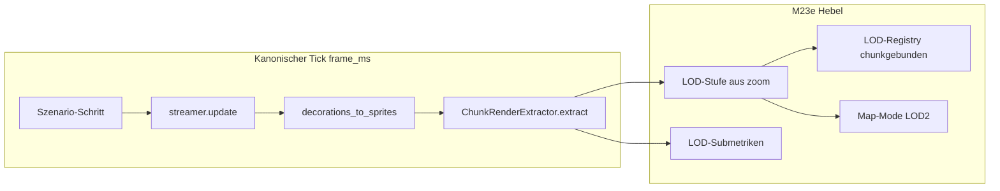

# M23e — Visibility LOD / Map-Mode

## Verbindliche Grundsätze

| Milestone | Inhalt |
|-----------|--------|
| **M23** | Profiling / Metriken / Szenarien / Export |
| **M23a** | Deferred Unload / Sparse Persistence |
| **M23b** | Apply-/Load-Burst-Entschärfung |
| **M23c** | Extract-Optimierung (Tile/Deko) — Microprofile, Cache-/Dirty-Vertrag, Hot-Path |
| **M23d** | Chunk-/Gruppen-Batching im sichtbarkeitsabhängigen Extract-/Darstellungspfad |
| **M23e** | Visibility LOD / Map-Mode / Mipmap-Settings auf Extract-Pfad |
| **M24** | Ores / Suppression-Runtime — **nicht** Teil von M23e |

Harte Regeln:

1. **M23e ist ein LOD-/Map-Mode-Milestone auf dem sichtbarkeitsabhängigen Extract-/Darstellungspfad.** Sichtbare Welt wird bei großem Sichtfeld über explizite LOD-Stufen repräsentiert — nicht über verstecktes Batching ohne LOD.
2. **M23e arbeitet ausschließlich an Phasen 3–4 des kanonischen Ticks** — `decorations_to_sprites`, `ChunkRenderExtractor.extract` (`deco_extract_ms`, `tile_extract_ms`). Streaming, Apply, Unload, Save-Format und M23a/M23b-Pfade bleiben **unangetastet**.
3. **M23e baut direkt auf M23c (Extract-Optimierung) und M23d (Chunk-Render-Batching) auf** und ergänzt sie um **Sichtbarkeits-LOD und Mipmap-Settings** für große Sichtfelder.
4. **M23e erfindet keine zweite Metrikwelt.** Additive optionale LOD-/Mipmap-Submetriken sind erlaubt; `schema_version: 1`, Pflichtfelder und bestehende KPIs bleiben kompatibel. Demo- und CLI-Runs bleiben vergleichbar.
5. **M23e ist datengetrieben** — Vorher/Nachher auf identischen Szenarien mit gleichem `extract_enabled` und dokumentiertem Config-Fingerprint.
6. **M23e ist kein Ores-/Suppression-Milestone.** M24 bleibt Ores; M23e implementiert **keine** Ore- oder Suppression-Logik.
7. **Kanonische `frame_ms`-Definition bleibt unverändert:** Szenario-Schritt → `streamer.update` → Deko-Extract → Tile-Extract. Render/GPU bleibt **außerhalb** von `frame_ms`. LOD-/Mipmap-Arbeit zählt klar zu `tile_extract_ms` / `extract_ms`.
8. **M23b DoD, M23c Cache-/Dirty-Vertrag und M23d Batching-/Guardrail-Verträge müssen auf Post-M23e-Runs grün bleiben.**
9. **M23e darf keine neue globale Welt-Batch-Primärrepräsentation einführen**, die Chunk-Grenzen semantisch oder invalidierungstechnisch verwischt. LOD2 darf Chunk-Gruppen nutzen, aber **keine** globale Welt-Sammelstruktur als Primärpfad.

---

## Problembeleg (bindend)

### Post-M23c Demo — Extract-dominant trotz Hot-Path-Optimierung

Quelle: [`20260712T082720Z_demo_unknown`](docs/benchmarks/perf/runs/20260712T082720Z_demo_unknown/analysis/analysis_diagnosis.json) (Post-M23c Demo; historischer Kontext für Sichtfeld-Skalierung)

| KPI | Wert |
|-----|------|
| M23b DoD | **bestanden** |
| Anteil an `frame_ms` | Stream **7.7 %**, Apply **3.2 %**, Unload **0.3 %**, **Extract 91.8 %** |
| `tile_extract_ms` mean / p95 / max | **2.95 / 4.89 / 6.41 ms** |
| `extract_ms` mean / p95 / max | **3.54 / 5.82 / 7.99 ms** |
| `frame_ms` mean / p95 / max | **3.85 / 6.42 / 11.95 ms** |
| `chunk_count` mean / p95 | **176.8 / 189** |
| Korrelation `frame_ms ↔ tile_extract_ms` | **r ≈ 0.943** (stark) |
| Korrelation `frame_ms ↔ extract_ms` | **r ≈ 0.957** (stark) |
| Korrelation `frame_ms ↔ chunk_count` | **r ≈ 0.395** (Post-M23c-Demo); Post-M23b-Baseline **r ≈ 0.684** (moderat) |

### Post-M23b Zoom-/Sichtfeld-Korrelation (bindender Problemrahmen)

Quelle: [`20260712T074209Z_demo_unknown`](docs/benchmarks/perf/runs/20260712T074209Z_demo_unknown/analysis/analysis_diagnosis.json)

| Korrelation | Wert |
|-------------|------|
| `frame_ms ↔ zoom` | **r ≈ -0.824** (stark negativ — Zoom-Out verschlechtert Performance) |
| `frame_ms ↔ chunk_count` | **r ≈ 0.684** (moderat) |
| `frame_ms ↔ tile_extract_ms` | **r ≈ 0.974** (stark) |
| `frame_ms ↔ extract_ms` | **r ≈ 0.987** (stark) |

### Post-M23d — Batching verbessert, Sichtfeld-Skalierung bleibt

Quelle: [`M23D_BASELINE.md`](docs/benchmarks/perf/M23D_BASELINE.md), Post-M23d Microbench/CLI

| Befund | Wert / Fakt |
|--------|-------------|
| M23d-Ziel | Batch-Registry + Cull-Cache als produktiver Pfad — **erreicht** |
| Demo `chunk_count ≥ 150`, `tile_extract_ms` p95 | Baseline **~4.95 ms** (Post-M23c **4.89 ms**) — **weiterhin hoch** bei großem Sichtfeld |
| `zoom_out` CLI | Verbesserung gegen Post-M23c, aber bei extremem Zoom (z. B. 0.05) bleibt Extract spürbar (**~0.29 ms** Microbench-Synthese 24 Chunks) |
| LOD in M23d | **Explizit ausgeschlossen** — Voll-Detail-Batches auch bei Zoom-Out |

**Schlussfolgerung (verbindlich, nicht weich):** Nach M23d bleibt bei sehr großem Sichtfeld / Zoom-Out der Extract-/Darstellungspfad trotz chunkgebundenem Batching skalierschwach; eine sichtbarkeitsabhängige LOD-/Map-Mode-Repräsentation ist als nächster Performance-Hebel nötig.

---

## Zielbild

Nach M23e:

- Bei großem Sichtfeld / starkem Zoom-Out wird sichtbare Welt **nicht mehr ausschließlich** in Voll-Detail-Batches dargestellt, sondern über eine **explizit definierte LOD-/Map-Repräsentation** (Tile-/Chunk-LOD, Map-Mode).
- Die LOD-Repräsentation basiert auf den bestehenden **`TileLayerBatch`- und `TileChunkRenderData`-Strukturen**; kein neuer globaler Welt-Primärtyp, der Chunk-Grenzen verwischt.
- **`tile_extract_ms` und `frame_ms` p95/max** sinken auf Demo und `zoom_out`-CLI **signifikant** gegenüber Post-M23d-Baseline — mit explizitem Schwellenvertrag (**≥ 1.5× Reduktion** bei `chunk_count ≥ 150`, analog M23d).
- **M23b DoD** und **M23c Cache-/Dirty-Vertrag** bleiben grün. Streaming/Apply/Unload unverändert. M23d Batching-Pfad bleibt für LOD0 integriert.
- **Kanonische `frame_ms`-Definition** bleibt unverändert. LOD-/Mipmap-Arbeit zählt klar zu `tile_extract_ms` / `extract_ms`.
- **Kostenverschiebungs-Guardrails** (M23d) bleiben bindend — LOD-Erfolg gilt nur bei echter Reduktion, nicht Umbuchung.
- Projekt ist **Extract-seitig bereit für M24-Ores**, ohne Ore-Implementierung vorwegzunehmen.

---

## Architekturprinzipien

### 1. LOD-Stufenmodell (bindende Entscheidung)

| Ebene | Festlegung |
|-------|------------|
| **LOD0 (Detail)** | Voll-Detail-Chunk-Layer-Batches wie in M23d, für normale/nähere Zoom-Level |
| **LOD1 (Aggregiert)** | Chunkgebundene vereinfachte Repräsentation (z. B. zusammengefasste Tile-Kategorien) für mittlere Zoom-Out-Stufen |
| **LOD2 (Map-Mode / Overview)** | Coarse-Grained Repräsentation (z. B. Biome-/Tile-Klassen oder Oberflächen-Cluster) für extreme Zoom-Out-Sicht |
| **Bindung** | Jede LOD-Einheit ist an `(chunk_coord, layer_id)` oder klar definierte **Chunk-Gruppen** gebunden; **keine** globale Welt-Batch als Primärrepräsentation |
| **Umschaltkriterium** | LOD-Stufe wird **deterministisch** aus `zoom` und Sichtfeld-Parametern abgeleitet — **keine** heuristische oder zufällige Umschaltung |

Exakte Aggregationsregeln (LOD1-Klassen, LOD2-Cluster-Größe) werden in Phase 2 festgelegt — die **Stufenrichtung** oben ist bindend.

### 2. Mipmap-Settings / Map-Mode (bindende Entscheidung)

| Aspekt | Festlegung |
|--------|------------|
| **Mipmap-Settings** | Config-gesteuerte LOD-/Mipmap-Parameter in dedizierter JSON ([`assets/content/visibility_lod.json`](assets/content/visibility_lod.json) oder integriert in [`profiling.json`](assets/content/profiling.json) / [`streaming.json`](assets/content/streaming.json)) — **niemals Hardcode** |
| **Zoom-Grenzen** | Klare Grenzen für `zoom`-Intervalle, welche LOD-Stufe verwendet wird (LOD0, LOD1, LOD2) |
| **Map-Mode-Flag** | Optionaler Modus (z. B. `map_mode=true`), der explizit LOD2 nutzt; **kein** automatischer Wechsel ohne klaren Vertrag |
| **Renderer-Schnittstelle** | LOD-/Map-Mode wirkt **ausschließlich** über `RenderFrame.tile_chunks` / `TileLayerBatch`; GPU-Pipelines ([`render_graphics/tile_layer.py`](render_graphics/tile_layer.py)) bleiben unverändert |
| **Konfiguration** | Alle LOD-/Mipmap-Settings werden dokumentiert, versioniert, aus Config geladen; **keinerlei** Hidden-Flags oder Magic-Zahlen im Code |

### 3. Scope-Abgrenzung (bindend)

- M23e darf **nicht** Streaming, Apply, Unload, Save v4/v5 oder Worker-Architektur umbauen.
- M23e darf **nicht** `schema_version` brechen; alle LOD-/Mipmap-Metriken sind **additive optionale Felder**.
- M23e darf **keine** Ores-, Suppression-, Exploration-, Fog-of-War- oder Traffic-Features implementieren. Diese bleiben **M24+** vorbehalten.
- M23e darf **keine** neue globale Welt-Batch-Primärrepräsentation einführen, die Dirty/Rebuild/Invalidierung chunkgebunden verwässert.

### 4. Invalidierungs- und Umschaltvertrag (bindend)

| Ereignis | Verhalten |
|----------|-----------|
| **`set_tile` / `dirty_chunks`** | Betroffene `(coord, layer_id)`-Einträge in **allen betroffenen LOD-Stufen** invalidieren (mindestens LOD0; LOD1/LOD2 wenn abgeleitet aus geänderten Tiles) |
| **`invalidate(coord)`** | Alle LOD-Registry- und Cache-Einträge des Chunks (ggf. Chunk-Gruppe) entfernen — M23c/M23d-Vertrag |
| **Zoom-Wechsel über LOD-Grenze** | Deterministischer LOD-Umschalt; kein Full-Rebuild der gesamten sichtbaren Welt — nur betroffene Stufen/Chunks |
| **Reine Pan innerhalb LOD-Stufe** | Cull-/LOD-Cache-Reuse analog M23d; keine unnötigen LOD0-Full-Rebuilds |
| **Map-Mode aktiv** | Explizit LOD2; Umschalt zurück zu LOD0/LOD1 bei Deaktivierung oder Zoom-In über Grenze |

### 5. Modul-Grenzen

- **Primärer Hebel:** [`bridge/chunk_extractor.py`](bridge/chunk_extractor.py) — LOD-Auswahl, LOD-Registry, Integration mit M23d Batch-Registry
- **Config:** [`assets/content/visibility_lod.json`](assets/content/visibility_lod.json) (neu) oder erweiterte bestehende Content-JSONs
- **Typen unverändert nutzen:** [`render_scene/types.py`](render_scene/types.py) — `TileLayerBatch`, `TileChunkRenderData`, `RenderFrame`
- **Sichtbarkeit:** [`bridge/visibility.py`](bridge/visibility.py) — `visible_chunk_coords`, Zoom-Input für LOD-Ableitung
- **Metriken:** [`game_core/perf/models.py`](game_core/perf/models.py), [`game_core/perf/run_analysis/extract_kpis.py`](game_core/perf/run_analysis/extract_kpis.py)

### 6. Metrik-/Benchmark-Vertrag

**Bestehende KPIs für Vorher/Nachher (Pflicht, unverändert):**

| KPI | Quelle |
|-----|--------|
| `frame_ms` mean / p95 / max | `summary.json` + `frames.jsonl` |
| `tile_extract_ms` mean / p95 / max | `frames.jsonl` |
| `deco_extract_ms` mean / p95 / max | `frames.jsonl` |
| `extract_ms` mean / p95 / max | `frames.jsonl` |
| `chunk_count` mean / p95 | `frames.jsonl` |
| M23b DoD | [`m23b_dod.py`](game_core/perf/run_analysis/m23b_dod.py) |
| M23c/M23d Submetriken | weiterhin parallel gültig |

**Zulässige additive LOD-/Mipmap-Submetriken — Pflichtkategorien (exakte Feldnamen in Phase 1):**

| Kategorie (verbindlich) | Was messbar sein muss |
|-------------------------|----------------------|
| **LOD-Gruppenzahl** | Anzahl LOD0/LOD1/LOD2-Gruppen pro Frame |
| **LOD-Zeitanteile** | Zeitanteil pro LOD-Stufe innerhalb `tile_extract_ms` |
| **LOD-Umschaltungen** | Umschalt-Ereignisse zwischen LOD-Stufen pro Frame oder kumuliert |
| **Map-Mode** | Ob Map-Mode aktiv; optional LOD2-Anteil |

Submetriken nur wenn Profiling aktiv; zero overhead wenn deaktiviert. `schema_version: 1` bleibt.

**Kostenverschiebungs-Guardrails (verbindlich, analog M23d):**

| Guardrail | Regel |
|-----------|-------|
| **Extract-Nachbarn** | LOD-Reduktionen bei `tile_extract_ms` zählen nur bei stabilen oder nicht regressiven `deco_extract_ms` / `extract_ms` |
| **Kanonischer Tick** | Keine Verlagerung von LOD-Arbeit außerhalb `tile_extract_ms` |
| **Streaming/Apply/Unload** | `stream_ms`, `stream_apply_ms`, `stream_unload_ms` nicht regressiv; M23b DoD grün |
| **Semantik/Determinismus** | LOD-Umschalt deterministisch; sichtbare Semantik bei gleichem Zoom/Welt-Zustand reproduzierbar |
| **Kurzform** | LOD-Erfolg = echte Kostenreduktion bei Zoom-Out, nicht Umbuchung |

**Vergleichsregeln:** Identische `scenario_id`, gleiches `extract_enabled`, dokumentierter Config-Fingerprint; Compare via [`compare_perf_runs.py`](tools/compare_perf_runs.py).

---

## Optimierungs- / Umbau-Kategorien

### a — LOD-/Map-Mode-Metriken (Phase 1)

Ziel: LOD-/Map-Mode-Verhalten sichtbar machen, bevor der Pfad umgestellt wird.

| Kategorie | Inhalt |
|-----------|--------|
| **a1 LOD-Gruppen-Metriken** | Kategorie LOD-Gruppenzahl: LOD0/LOD1/LOD2 pro Frame |
| **a2 LOD-Zeit-Metriken** | Kategorie Zeitanteile pro LOD-Stufe innerhalb `tile_extract_ms` |
| **a3 LOD-Umschalt-Metriken** | Kategorie Umschalt-Ereignisse zwischen LOD-Stufen |
| **a4 Export-Kompatibilität** | Additive Felder unter optionalen Extract-Feldern; exakte Namen Phase-1-Entscheid; zero overhead wenn Profiling aus |

### b — LOD-/Mipmap-Datenmodell (Phase 2)

Ziel: stabile, deterministische LOD-Datenstrukturen.

| Kategorie | Inhalt |
|-----------|--------|
| **b1 LOD-Registry** | Key `(chunk_coord, layer_id, lod_level)` → `TileLayerBatch` oder abgeleitete Aggregat-Batch; LOD2 darf Chunk-Gruppen-Keys nutzen, **nicht** globale Welt |
| **b2 LOD-Cache / Cull** | Wiederverwendung pro LOD-Stufe und Sichtbereich — konsistent mit M23d Cull-Cache |
| **b3 Invalidierung** | `set_tile`/Dirty und `invalidate(coord)` wirken klar auf passende LOD-Stufen |
| **b4 Lebenszyklus** | Tabellen für LOD0/LOD1/LOD2: Build → Register → Cull → Reuse |
| **b5 Config-Vertrag** | `visibility_lod.json`: Zoom-Grenzen, Map-Mode-Default, LOD1/LOD2-Aggregationsparameter |

### c — Produktiver LOD-/Map-Mode-Pfad (Phase 3)

Ziel: sichtfeldabhängige Repräsentationswahl im produktiven Extract-Pfad.

| Kategorie | Inhalt |
|-----------|--------|
| **c1 LOD-Auswahl** | `extract()` nutzt M23d Batching/LOD-Registry; wählt LOD-Stufe deterministisch nach `zoom`, Config und Szenario |
| **c2 Map-Mode** | Expliziter Map-Mode erzwingt LOD2 — kein versteckter Auto-Map-Mode |
| **c3 Skalierung** | Kosten skalieren primär mit **LOD-Stufe** und Miss/Rebuild, nicht linear mit jedem sichtbaren Detail-Chunk bei Zoom-Out |
| **c4 Detailpfad-Fallback** | LOD0-only ohne LOD-Registry bleibt Test-/Debug-Fallback (`extract_mode='per_chunk'` oder `lod_mode='detail_only'` — exakter Flag-Name Phase 3) |

### d — Nicht in M23e (explizit ausgeschlossen)

| Ausgeschlossen | Begründung |
|----------------|------------|
| Ores / Suppression / Exploration / Fog / Traffic | M24+ |
| Streaming-/Apply-/Unload-Redesign | M23a/M23b-Vertrag |
| Save v5 / Worker-Neudesign | Scope-Grenze |
| GPU-/Renderer-Backend-Umbau | Außerhalb `frame_ms`; `pack_textured_tile_chunks` unverändert |
| Globale Welt-LOD-Primärrepräsentation | Verwischt Chunk-Grenzen |
| Zweites Profiling-/Metriksystem | M23-Vertrag |

---

## Umsetzungsphasen

### Phase 0 — Baseline & Zielvertrag

**Module:** [`docs/benchmarks/perf/M23E_BASELINE.md`](docs/benchmarks/perf/M23E_BASELINE.md) (neu), [`ruleset.md`](ruleset.md), [`docs/benchmarks/perf/runs/`](docs/benchmarks/perf/runs/)

- **M23e-Vorher-Referenz (Post-M23d):** Demo mit `chunk_count ≥ 150` — `tile_extract_ms` p95 **~4.95 ms** ([`M23D_BASELINE.md`](docs/benchmarks/perf/M23D_BASELINE.md)); `frame_ms` p95 **~6.42 ms** (Post-M23c/Post-M23d Demo-Referenz).
- **Historischer Sichtfeld-Kontext:** Post-M23c Demo `20260712T082720Z_demo_unknown` — Extract **91.8 %**, Korrelationen oben.
- **Zoom-Problem:** Post-M23b `frame_ms ↔ zoom` **r ≈ -0.824** — bindend dokumentiert.
- **Szenario-Set:** `demo` (Integration), `zoom_out` (Primär-LOD-Reproduktion), `steady` (LOD-Stabilität), `catchup` (Regression).
- **Schwellenvertrag Phase 0 festlegen** (verbindlich):
  - Demo, Frames mit `chunk_count ≥ 150`: `tile_extract_ms` p95 **≥ 1.5× Reduktion** gegen Post-M23d-Baseline
  - `frame_ms` p95 auf Demo **messbar gesenkt** (Extract-getrieben)
  - `zoom_out`-CLI: `tile_extract_ms` p95/max **signifikant gesenkt** gegen Post-M23d `m23d_baseline_zoom_out` / `m23d_candidate_zoom_out`
  - M23b DoD, M23c Cache-Vertrag, M23d Batching-Vertrag **grün**
  - **Kostenverschiebungs-Guardrails:** `deco_extract_ms`, `stream_ms`, `stream_apply_ms`, `stream_unload_ms` **nicht regressiv**
- CLI-Baselines erzeugen falls fehlend: `m23e_baseline_zoom_out`, `m23e_baseline_steady`.

**DoD:** `M23E_BASELINE.md` + ruleset-Abschnitt M23e; Demo-/zoom_out-Analyse verlinkt; Schwellenvertrag inkl. Guardrails dokumentiert.

---

### Phase 1 — LOD-/Map-Mode-Metriken

**Module:** [`bridge/chunk_extractor.py`](bridge/chunk_extractor.py), [`game_core/perf/models.py`](game_core/perf/models.py), [`game_core/perf/session.py`](game_core/perf/session.py), [`game_core/perf/export_schema.py`](game_core/perf/export_schema.py), [`tools/run_perf_scenario.py`](tools/run_perf_scenario.py), [`apps/chunk_world_demo.py`](apps/chunk_world_demo.py)

- `ExtractStepMetrics` um LOD-Metrik-Kategorien erweitern (a1–a3).
- **Exakte Feldnamen** in Phase 1 festlegen — additiv, M23/M23c/M23d-Muster.
- Optionale Frame-Felder nur wenn `tile_extract_ms > 0`.
- M23c/M23d-Submetriken **parallel** exportieren.
- [`extract_kpis.py`](game_core/perf/run_analysis/extract_kpis.py) und [`compare_perf_runs.py`](tools/compare_perf_runs.py) um LOD-KPIs erweitern.

**DoD:** Alle LOD-Pflichtkategorien im Export bei aktivem Profiling; fehlen bei deaktiviertem Profiling; Tests: No-Overhead, Summen-Konsistenz innerhalb `tile_extract_ms`.

---

### Phase 2 — LOD-/Mipmap-Datenmodell

**Module:** [`bridge/chunk_extractor.py`](bridge/chunk_extractor.py), [`assets/content/visibility_lod.json`](assets/content/visibility_lod.json), [`docs/benchmarks/perf/M23E_BASELINE.md`](docs/benchmarks/perf/M23E_BASELINE.md), [`tests/test_chunk_cache.py`](tests/test_chunk_cache.py) (erweitern)

- LOD-Registry (b1), LOD-Cache (b2), Invalidierungsvertrag (b3) implementieren und in `M23E_BASELINE.md` dokumentieren.
- Config-Vertrag (b5): Zoom-Grenzen, Map-Mode, LOD-Parameter — **kein Hardcode**.
- Lebenszyklus-Tabellen LOD0/LOD1/LOD2 (b4).
- Unit-Tests:
  - Deterministische LOD-Ableitung aus `zoom`
  - `set_tile` invalidiert betroffene LOD-Stufen chunklokal
  - `invalidate(coord)` räumt alle LOD-Ebenen chunkweise
  - Zoom über LOD-Grenze: Umschalt ohne globalen Rebuild

**DoD:** Dokumentierter LOD-/Invalidierungs-Vertrag; Config geladen und versioniert; Tests grün; M23d Batch-Pfad für LOD0 integrierbar.

---

### Phase 3 — Produktiver LOD-/Map-Mode-Pfad

**Module:** [`bridge/chunk_extractor.py`](bridge/chunk_extractor.py), [`bridge/__init__.py`](bridge/__init__.py), [`apps/chunk_world_demo.py`](apps/chunk_world_demo.py)

- `extract()` wählt LOD-Stufe deterministisch (c1–c2); Map-Mode explizit.
- LOD0 nutzt M23d Batching; LOD1/LOD2 nutzen abgeleitete Aggregat-Batches.
- Detailpfad (c4) Test-Only — **nicht** produktiver Hauptpfad.
- Determinismus: Bei gleichem Welt+Kamera+Zoom reproduzierbare `RenderFrame`-Semantik (Tile-IDs/Positionen konsistent zur LOD-Stufe).
- Keine Änderung an `ChunkStreamer.update`, M23b-Caps, Deko-Extract-Semantik.

**DoD:** Demo und CLI nutzen LOD-Pfad; Schwellenvertrag erfüllt; Guardrails grün; M23/M23a/M23b/M23c/M23d-Tests grün.

---

### Phase 4 — Benchmarks / Compare / Candidate-Auswertung

**Module:** [`tools/compare_perf_runs.py`](tools/compare_perf_runs.py), [`tools/analyze_perf_run.py`](tools/analyze_perf_run.py), [`docs/benchmarks/perf/runs/`](docs/benchmarks/perf/runs/)

- Runs: **Demo** + **`zoom_out`** (Pflicht) + **`steady`** oder **`catchup`** (Regression).
- Pre: Post-M23d-Baseline; Post: `m23e_candidate_*`.
- Compare: Extract-KPIs + LOD-Submetriken + `chunk_count`- und **Zoom-Stratifizierung**.
- **M23b DoD**, **M23c Cache-Vertrag**, **M23d Batching-Vertrag** auf Candidates verifizieren.
- **Kostenverschiebungs-Prüfung (Pflicht):** LOD-Erfolg ungültig bei reiner Umbuchung; Nachbar-KPIs stabil.

**DoD:** Compare mit LOD-Deltas; Schwellenvertrag erfüllt; Guardrails erfüllt; Zoom-Out zeigt niedrigere absolute Extract-Werte.

---

### Phase 5 — Doku / Milestone-Abschluss

**Module:** [`ruleset.md`](ruleset.md), [`docs/ARCHITECTURE.md`](docs/ARCHITECTURE.md), [`docs/benchmarks/perf/README.md`](docs/benchmarks/perf/README.md), [`docs/benchmarks/perf/ANALYSIS.md`](docs/benchmarks/perf/ANALYSIS.md), [`docs/benchmarks/perf/M23E_BASELINE.md`](docs/benchmarks/perf/M23E_BASELINE.md)

- Milestone-Tabelle M23 → M23d → M23e → M24.
- Pre/Post-M23e Kern-KPIs (Demo + `zoom_out`).
- LOD-Kapitel: Stufenmodell, Config, Umschaltvertrag, Map-Mode, Guardrails.
- Klarstellung: M23b + M23c + M23d + M23e = M23-CPU-/Extract-Basis vor M24-Ores.

**DoD:** Doku widerspruchsfrei; kein M24-Ores-Scope-Leak; Milestone in ruleset markierbar.

---

## Verbotene Abweichungen

- Änderung der kanonischen `frame_ms`-Definition oder Tick-Reihenfolge
- Änderung von `ChunkStreamer.update()`-Reihenfolge, Caps oder Streaming-Modell
- Breaking-Changes an `schema_version: 1`, Pflichtfeldern oder Hitch-Tags
- Einführung einer globalen Welt-Batch- oder Welt-LOD-Primärrepräsentation
- Ores / Suppression / Exploration / Fog of War / Traffic-Features
- GPU-/Renderer-Umbau als M23e-Hebel
- Zweites Profiling-/Metriksystem neben M23
- Heuristische oder zufällige LOD-Umschaltung
- Hidden-Flags oder Magic-Zahlen für LOD-Grenzen im Code
- M23e-Erfolg durch Kostenverschiebung statt echter Reduktion „erkaufen“
- Streaming-, Apply-, Unload-, Save-Architektur neu planen
- M24-Ores vorwegnehmen

---

## Definition of Done (M23e gesamt)

M23e ist abgeschlossen, wenn **alle** Punkte erfüllt sind:

### 1. Extract-/LOD-Reduktion (gegen Phase-0-Baseline Post-M23d)

| KPI | Baseline (Post-M23d) | M23e-Ziel |
|-----|----------------------|-----------|
| `tile_extract_ms` p95 (Demo, `chunk_count ≥ 150`) | ~4.95 ms | **≥ 1.5× Reduktion** |
| `frame_ms` p95 (Demo) | ~6.42 ms | **messbar gesenkt** (Extract-getrieben) |
| `tile_extract_ms` p95/max (`zoom_out` CLI) | Post-M23d Referenz | **signifikant gesenkt** |
| `deco_extract_ms` | Post-M23d | **nicht regressiv** |

### 2. Kostenverschiebungs-Guardrails (verbindlich)

- Reduktionen bei `tile_extract_ms` gelten **nur** bei stabilen oder nicht regressiven `deco_extract_ms`, `extract_ms`, `stream_ms`, `stream_apply_ms`, `stream_unload_ms`
- Keine Verlagerung von LOD-Arbeit außerhalb `tile_extract_ms` im kanonischen Tick
- **LOD-Erfolg ist ungültig, wenn Kosten nur verschoben statt reduziert wurden**

### 3. LOD-Verhalten nachweisbar

- LOD-Submetriken (Pflichtkategorien) zeigen: bei Zoom-Out dominieren LOD1/LOD2-Gruppen; LOD0-Anteil sinkt
- Umschaltungen deterministisch und in Metriken nachvollziehbar
- Map-Mode explizit aktivierbar und messbar

### 4. Architektur-Invarianten

- LOD-Stufenmodell LOD0/LOD1/LOD2 bindend; Umschaltung deterministisch aus `zoom` + Config
- Keine globale Welt-Primärrepräsentation; Invalidierung chunkgebunden
- LOD wirkt über `RenderFrame.tile_chunks` / `TileLayerBatch`; GPU unverändert
- M23c Cache-/Dirty-Vertrag und M23d Batching-Pfad (LOD0) nicht unterlaufen

### 5. Streaming/Apply/Unload intakt

- `m23b_dod_passed = true` auf Post-M23e Demo-Run
- Keine inakzeptable Apply-Burst-Signatur
- M23/M23a/M23b/M23c/M23d-Test-Suite grün

### 6. Metrikvertrag

- `schema_version: 1` unverändert
- LOD-/Mipmap-Submetriken nur optional/additiv; Pflichtkategorien abgedeckt
- Demo- und CLI-Runs vergleichbar via `compare_perf_runs.py`

### 7. Artefakte

- Vorher/Nachher-Reports unter `docs/benchmarks/perf/runs/` (Demo + `zoom_out` + Regression)
- [`M23E_BASELINE.md`](docs/benchmarks/perf/M23E_BASELINE.md) mit Post-M23e-Werten, Config-Referenz und Guardrails
- [`assets/content/visibility_lod.json`](assets/content/visibility_lod.json) (oder dokumentierte Integration) + ruleset + ARCHITECTURE + ANALYSIS aktualisiert

### Kritische Testfälle

- LOD-Ableitung deterministisch: gleicher `zoom` → gleiche LOD-Stufe
- Zoom-Out über LOD1/LOD2-Grenze: Kosten sinken, Determinismus pro Stufe
- `set_tile` invalidiert betroffene LOD-Stufen chunklokal
- `invalidate(coord)` räumt alle LOD-Ebenen chunkweise auf
- Map-Mode erzwingt LOD2 explizit
- LOD-Submetriken: zero overhead wenn deaktiviert
- M23b DoD auf Candidate grün
- Kostenverschiebungs-Guardrails auf Candidate-Runs erfüllt
- Keine Regression M23d Batching-Pfad bei LOD0 / normalem Zoom
