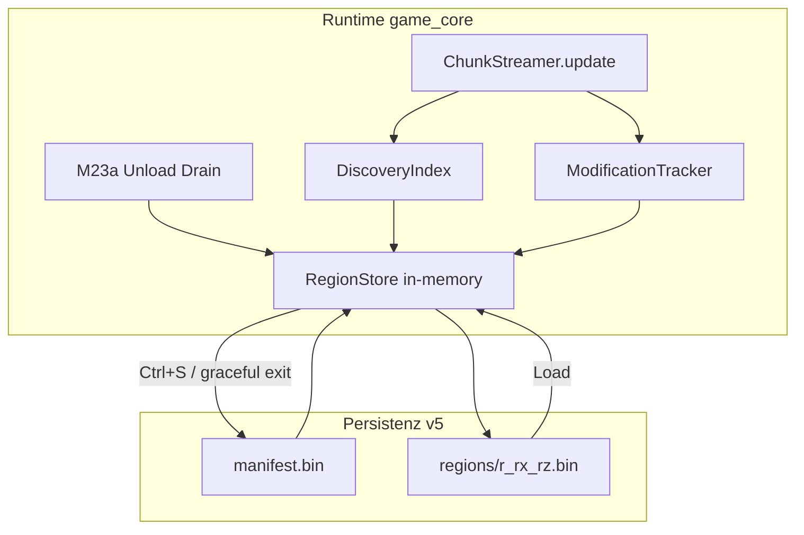

# M24 — Welt-Persistenz Redesign (Regionen, Binär, Discovery/Modification)

## Empfohlener Dateiname

`m24_world_persistence_regions_b3e8f1a2.plan.md`

(Pfad analog zu bestehenden Plänen: `.cursor/plans/m24_world_persistence_regions_b3e8f1a2.plan.md`)

---

## Roadmap-Verschiebung ab M24

**Überholte Planung:** In [`ruleset.md`](ruleset.md), [`docs/ARCHITECTURE.md`](docs/ARCHITECTURE.md) und M23e-Plan steht historisch **M24 = Ores/Ressourcen**. Diese Zuordnung ist **aufgehoben**.

| Milestone | Neu | Bisher (historisch) |
|-----------|-----|---------------------|
| **M24** | **Welt speichern/laden — Persistenz-Redesign (Regionen, binär, Discovery/Modification)** | — (neu) |
| **M25** | Ore-Patches & Resource-Deposits | war M24 |
| **M26** | Mini-Map / Fog of War | war M25 |
| **M27** | Inventar & Item-System | war M26 |
| **M28** | Entity-System (Grundstruktur) | war M27 |
| **M29** | UI-Framework (HUD, Labels) | war M28 |
| **M30** | Audio-System (Grundlagen) | war M29 |

**Abhängigkeitskette:** M25 (Ores) baut **explizit auf M24** auf — Ore-Patches und Abbau-Stand nutzen Region-Payloads und Modified-Slots statt ad-hoc JSON-Deltas.

**Unverändert vor M24:** M17–M23e (Dirty-Cache, Streaming, M23a Deferred Unload, Extract/LOD) bleiben Voraussetzung; M24 ersetzt primär den **Persistenz-/Save-Pfad**, nicht den kanonischen Tick oder Renderer.

---

## Verbindliche Grundsätze

| Milestone | Inhalt |
|-----------|--------|
| M18 | Chunk Streaming (Runtime Load/Unload) |
| M20 | Platform + Streaming-Persistenz (Save v2–v4 JSON) |
| M23a | Deferred Unload + Sparse Terrain-Deltas |
| M23b–M23e | Apply/Extract/LOD — **Persistenz unangetastet** |
| **M24** | **Region-basiertes binäres Save v5, Discovery getrennt von Modification** |
| **M25** | Ores/Ressourcen (früher fälschlich M24) |

Harte Regeln:

1. **M24 ist ein `game_core`-/Persistenz-Milestone** — kein Renderer-, GPU- oder Bridge-Redesign.
2. **Welt ist offen/unendlich** — es gibt keine globale Chunk-Enumeration; persistiert wird nur, was entdeckt und/oder verändert wurde.
3. **Discovery ≠ Modification** — discovered-but-unmodified Chunks brauchen **keine Delta-Payload**, müssen aber im Save erhalten bleiben.
4. **Modified Chunks** — Payload nur bei echten Abweichungen von der deterministischen World-Gen-Baseline.
5. **Region = atomare I/O-Einheit** — Korruption einer Region betrifft maximal 8×8 Chunks, nicht die ganze Welt.
6. **Binär, nicht DB** — feste Header, Slot-Tabelle, Payload-Blobs, Checksummen; kein SQLite/LevelDB.
7. **World-Origin `(0,0)`** — negative Koordinaten sind first-class; `floor_div` ist verbindlich.
8. **Bestehende Architekturregeln** aus [`docs/ARCHITECTURE.md`](docs/ARCHITECTURE.md) (Layering, Bridge, kanonischer Tick) bleiben gültig.

---

## Problembeleg (bindend)

### Ist-Zustand Save v4 ([`streaming_world_io.py`](game_core/streaming_world_io.py))

| Aspekt | Ist | Problem |
|--------|-----|---------|
| Granularität | 1 JSON-Datei pro **modified** Chunk (`chunks/cx_cy.json`) | Millionen Dateien bei großen Welten; langsames FS, kein locality |
| Discovery | **Nicht persistiert** — unveränderte Chunks werden beim Unload verworfen (M23a) | Fog/Exploration und „betretene Welt“ gehen nach Save verloren |
| Format | JSON + [`chunk_delta.py`](game_core/chunk_delta.py) TerrainDelta | Skalierung, Größe, Parse-Kosten |
| Chunk-Größe | **8×8 Tiles** ([`world.py`](game_core/world.py) `CHUNK_SIZE_TILES = 8`) | Ziel-Persistenz 64×64 — semantische Lücke |
| Globale Deko | User-Deko im `manifest.json` | Skaliert nicht; regionale Zuordnung fehlt |
| Recovery | Fehlende Chunk-JSON → Load-Fehler | Keine region-lokale Verwerfbarkeit |

### Abgrenzung [`world_io.py`](game_core/world_io.py)

Fixed-World JSON (M16) bleibt für `STREAMING_MODE=False` — **kein** M24-Scope; nur dokumentierte Abgrenzung/Kompatibilität.

---

## Zielbild



**Warum Regionen statt Einzel-Chunk-Dateien?**

- **Locality:** 64 Chunk-Slots pro Datei → weniger FDs, weniger Verzeichnis-Overhead, sequentieller Read.
- **Recovery:** CRC/Corruption pro Region → Region verwerfen/neu generieren, Rest der Welt lädt.
- **Atomic write:** Eine Region-Datei atomar ersetzen (write temp + rename).
- **Memory bounds:** Beim Save nur dirty Regions flushen, nicht die ganze Welt materialisieren.
- **Discovery-bitmaps:** 64 Slots × 1 Byte Flags pro Region — compact für „nur betreten“.

---

## Koordinatenmodell (verbindlich)

### Einheiten

| Einheit | Größe | Konstante |
|---------|-------|-----------|
| Tile | 1×1 m | `TILE_METERS = 1.0` (Persistenz-Metadaten) |
| Chunk | 64×64 Tiles = 64×64 m | `CHUNK_TILES = 64` |
| Region | 8×8 Chunks = 512×512 m | `REGION_CHUNKS = 8` |

**Code-Mapping (Default):** Persistenz-Achse **X** = bestehendes `wx`, **Z** = bestehendes `wy` (Legacy-Name in Code bis optionales Rename in Folge-PR). Origin `(0,0)` = Tile `(0,0)`.

### Quadranten-Semantik

```text
        +Z (wy / „Norden“)
         ^
         |
  (-X,+Z) | (+X,+Z)
  --------+--------> +X (wx / „Osten“)
  (-X,-Z) | (+X,-Z)
         |
```

- **Oben links:** `-X, +Z`
- **Unten links:** `-X, -Z`
- **Unten rechts:** `+X, -Z`
- **Oben rechts:** `+X, +Z`

### floor_div (verbindlich)

Für alle Chunk-/Region-Zuordnungen:

```python
def floor_div(a: int, b: int) -> int:
    """Euklidische Floor-Division — identisch zu Python // für ints."""
    return a // b

def world_tile_to_chunk(tx: int, tz: int) -> tuple[int, int, int, int]:
    cx = floor_div(tx, CHUNK_TILES)
    cz = floor_div(tz, CHUNK_TILES)
    local_tx = tx - cx * CHUNK_TILES
    local_tz = tz - cz * CHUNK_TILES
    return cx, cz, local_tx, local_tz

def chunk_to_region(cx: int, cz: int) -> tuple[int, int, int, int, int]:
    rx = floor_div(cx, REGION_CHUNKS)
    rz = floor_div(cz, REGION_CHUNKS)
    slot_cx = cx - rx * REGION_CHUNKS  # 0..7
    slot_cz = cz - rz * REGION_CHUNKS  # 0..7
    slot_index = slot_cz * REGION_CHUNKS + slot_cx  # 0..63, row-major Z
    return rx, rz, slot_cx, slot_cz, slot_index
```

**Negative Beispiele (Pflicht-Tests):**

- Tile `(-1, -1)` → Chunk `(-1, -1)`, local `(63, 63)`
- Tile `(-64, 0)` → Chunk `(-1, 0)`, local `(0, 0)`
- Chunk `(-8, 0)` → Region `(-1, 0)`, slot `(0, 0)`

Neue Datei: [`game_core/world_coords.py`](game_core/world_coords.py) — reine Koordinaten-Hilfen, keine Renderer-Abhängigkeit.

---

## Chunk-Slot-Semantik

### Flags pro Slot (uint8)

| Bit | Name | Bedeutung |
|-----|------|-----------|
| 0 | `DISCOVERED` | Chunk wurde sichtbar/geladen/betreten |
| 1 | `MODIFIED` | Chunk weicht von Baseline ab |
| 2 | `HAS_PAYLOAD` | Payload-Blob vorhanden |
| 3–7 | reserviert | 0 |

### Repräsentation

| Zustand | Flags | Payload |
|---------|-------|---------|
| Unbekannt | 0 | — (Slot leer, nicht im Save) |
| Discovered, unmodified | `DISCOVERED` | **keine** — Baseline wird bei Load regeneriert |
| Modified | `DISCOVERED \| MODIFIED \| HAS_PAYLOAD` | binärer Delta-Blob |

### Payload-Typen (ChunkModificationBlob v1)

Reihenfolge im Blob — TLV-Sections:

| Section ID | Inhalt | Quelle heute |
|------------|--------|--------------|
| `0x01` | Tile overrides (layer, local_tx, local_tz, tile_key_id) | [`TileOverride`](game_core/persistenz.py) |
| `0x02` | Procedural suppressions (wx, wz, decoration_id) | [`ProceduralSuppression`](game_core/persistenz.py) |
| `0x03` | Decoration state (modified procedural: harvested, etc.) | M12-Erweiterung |
| `0x04` | Ground items | Schema-Platzhalter v1 (leer erlaubt) |
| `0x05` | User-placed structures/entities | Schema-Platzhalter v1 |

Tile-Keys als **stable uint32 tile_id** (bestehende stable-ID-Funktion aus World-Gen-Worker-Snapshot), nicht als Strings im Binärformat.

---

## Binäres Datenmodell

### Save-Verzeichnisstruktur

```text
saves/streaming_world/
  manifest.bin
  regions/
    r_-1_0.bin
    r_0_0.bin
    r_0_1.bin
    ...
```

Region-Dateiname: `r_{rx}_{rz}.bin` — negative Koordinaten mit Vorzeichen.

### manifest.bin (global)

| Feld | Typ | Beschreibung |
|------|-----|--------------|
| magic | char[4] | `WTW1` |
| save_version | uint32 | **5** |
| codec_version | uint16 | Chunk-payload codec (start **1**) |
| header_len | uint16 | Bytes bis Payload-Start |
| world_seed | int64 | |
| world_gen_fingerprint | uint8[32] | SHA-256 |
| chunk_tiles | uint16 | 64 |
| region_chunks | uint8 | 8 |
| tile_meters | float32 | 1.0 |
| player_blob_len | uint32 | |
| player_blob | bytes | binärer Character-Snapshot |
| global_user_deco_count | uint32 | optional: Deko außerhalb Region-Slots (Migration) |
| header_crc32 | uint32 | über alle Felder vor CRC |

**Bewusst nicht im Manifest:** Liste aller Regionen — **implizit** durch vorhandene `regions/*.bin`.

### regions/r_rx_rz.bin

| Feld | Typ |
|------|-----|
| magic | char[4] `WTREG` |
| region_file_version | uint16 **1** |
| header_len | uint16 |
| region_rx | int32 |
| region_rz | int32 |
| slot_count | uint8 = 64 |
| slot_directory | 64 × SlotEntry |
| payload_blob | bytes |
| payload_crc32 | uint32 |
| header_crc32 | uint32 |

**SlotEntry (12 Bytes):**

- `flags: uint8`
- `reserved: uint8`
- `payload_offset: uint32` (relativ zu payload_blob start, `0xFFFFFFFF` = none)
- `payload_length: uint32`

**Recovery:** Header-CRC fail → Region verwerfen, loggen, Welt lädt ohne diese Region (Chunks erscheinen undiscovered). Payload-CRC fail → gleiche Region verwerfen.

Neue Module:

- [`game_core/region_codec.py`](game_core/region_codec.py) — encode/decode Region + Chunk blobs
- [`game_core/region_store.py`](game_core/region_store.py) — in-memory RegionStore, dirty tracking
- [`game_core/discovery_index.py`](game_core/discovery_index.py) — discovered/modified Sets

[`streaming_world_io.py`](game_core/streaming_world_io.py) wird zur Fassade: `save_streaming_world_v5` / `load_streaming_world_v5`, v4-Loader bleibt parallel.

---

## Laufzeitverhalten

### Wann `DISCOVERED`?

- Beim **ersten erfolgreichen Load** eines Chunks in `ChunkStreamer._load_chunk` / Apply aus Pool — **einmalig pro Chunk-Koordinate**.
- Setzt Bit in `DiscoveryIndex` + markiert Region dirty in `RegionStore`.
- **Nicht** beim reinen Prefetch ohne Apply (Pool-Submit allein reicht nicht).

### Wann `MODIFIED`?

Bestehende [`PersistenzFlags`](game_core/persistenz.py) erweitern / mappen:

- `TILE_MODIFIED` → modified
- `SUPPRESSION` (Baum gefällt) → modified
- `USER_DECO_IN_BOUNDS` → modified
- Decoration state changes (Früchte) → modified
- Ground items / structures → modified (wenn Section non-empty)

`compute_terrain_delta` in [`chunk_delta.py`](game_core/chunk_delta.py) bleibt Logik-Kern, liefert aber `ChunkModificationBlob` statt JSON-dict.

### Wann Region-Daten schreiben?

| Trigger | Verhalten (Default) |
|---------|---------------------|
| **Manueller Save (Ctrl+S)** | Alle dirty Regions → atomar `regions/r_*.bin` + `manifest.bin` |
| **Graceful Exit** | Optionaler Auto-Save (Config `streaming.json`: `auto_save_on_exit: true`) |
| **Unload/Drain (M23a)** | **Nur in-memory** `RegionStore` aktualisieren — **kein** Disk-I/O pro Unload |
| **Deferred Drain modified** | Delta in RegionStore mergen (ersetzt `persistent_deltas` dict langfristig) |

M23a-Gedanke bleibt: Unload budgetiert, Drain entscheidet persist vs discard — aber **discovered** wird immer in RegionStore gehalten, auch wenn kein Delta.

### Integration [`chunk_streaming.py`](game_core/chunk_streaming.py)

- `persistent_deltas: dict` → abgelöst durch `RegionStore` (Übergang: beide parallel in Phase 3, dann Cutover)
- `_drain_pending`: bei modified → Blob in RegionStore; bei discovered-only → nur Flag
- Load: RegionStore aus v5 hydratisieren → `_load_chunk` wählt Baseline + apply blob

### Integration [`world.py`](game_core/world.py)

- `CHUNK_SIZE_TILES`: **8 → 64** (Breaking — eigene Phase, siehe unten)
- `get_persistenz_flags` / Tracking bleibt chunklokal
- Keine globale Materialisierung aller Chunks

---

## Chunk-Größe 8→64: Folgearbeit (explizit)

**Ist:** [`world.py`](game_core/world.py) `CHUNK_SIZE_TILES = 8`, ARCHITECTURE/ruleset „8×8 Tiles“.

**Soll M24:** Persistenz und Runtime-Chunks **64×64 Tiles**.

| Bereich | Folge |
|---------|-------|
| [`world.py`](game_core/world.py) | Konstanten 64, Hilfsfunktionen |
| [`world_gen.py`](game_core/world_gen.py) | Chunk-Generierung pro 64×64 |
| [`chunk_streaming.py`](game_core/chunk_streaming.py) | Viewport-Caps, Radien neu kalibrieren |
| [`collision_grid.py`](game_core/collision_grid.py) | Solid-Grid-Größe pro Chunk |
| [`bridge/chunk_extractor.py`](bridge/chunk_extractor.py) | Batch-Größe — **kein** GPU-Umbau, nur Datenmenge |
| Tests / Benchmarks | Schwellen anpassen |
| Save v4 Migration | 8×8-Deltas → 64×64-Region-Slots **nicht** automatisch bit-identisch; Remap oder „neue Welt“ |

**Default-Strategie:** M24 Phase 1 migriert Runtime auf 64×64 in `game_core`; Rendering skaliert über bestehende Tile-Pipeline (mehr Tiles pro Chunk sichtbar — Performance-Risiko dokumentiert, nicht M24-Blocker für Persistenz-DoD).

**Render-Pixel:** `TILE_SIZE_PX = 32` bleibt — 1 Tile = 1 m ist **Persistenz-Semantik**, nicht Pixel-Metrik (1 m ≈ 32 px im Demo).

---

## Migrationsstrategie v4 → v5

**Empfehlung (Default): Parallel-Loader + One-Shot-Upgrade**

1. **Read-Compatibility:** `load_streaming_world` erkennt v4 (`manifest.json` + `chunks/`) und v5 (`manifest.bin` + `regions/`).
2. **Kein silent auto-write:** v4-Load funktioniert; Upgrade nur via:
   - `python tools/migrate_save_v4_to_v5.py <save_dir>` oder
   - Demo-Prompt „Save upgraden?“ beim ersten v4-Load (optional Phase 6).
3. **Upgrade-Ablauf:**
   - Backup `save_dir` → `save_dir.v4.bak`
   - v4 modified chunks → Region-Slots (discovered+modified)
   - v4 fehlende discovered info: **nicht rekonstruierbar** — nur modified chunks migrieren; Discovery startet nach Upgrade neu (dokumentiert)
   - User-Deko aus manifest → regionale Section oder global section in v5
4. **Chunk-Größen-Mismatch v4 (8) → v5 (64):** Migration tool **remapped** modified tiles in Ziel-Chunk-Koordinaten; unmodified discovered **verloren** (akzeptiert, Breaking-Note in Release)

---

## Betroffene Module

| Datei | Änderung |
|-------|----------|
| [`game_core/streaming_world_io.py`](game_core/streaming_world_io.py) | v5 Save/Load, v4-Loader behalten, Snapshot erweitern |
| [`game_core/chunk_delta.py`](game_core/chunk_delta.py) | Blob-Erzeugung/-Anwendung, JSON parallel für Tests/Migration |
| [`game_core/persistenz.py`](game_core/persistenz.py) | Flags erweitern: `DISCOVERED` runtime-only vs persist; Deco/Ground-Item-Typen |
| [`game_core/world.py`](game_core/world.py) | CHUNK_SIZE 64, Persistenz-Hooks |
| [`game_core/chunk_streaming.py`](game_core/chunk_streaming.py) | DiscoveryIndex, RegionStore-Anbindung, Drain |
| **neu** `game_core/world_coords.py` | floor_div, chunk/region mapping |
| **neu** `game_core/region_codec.py` | Binär encode/decode |
| **neu** `game_core/region_store.py` | In-memory + dirty flush |
| **neu** `game_core/discovery_index.py` | Discovered/Modified tracking |
| [`apps/chunk_world_demo.py`](apps/chunk_world_demo.py) | Ctrl+S/L auf v5 |
| **neu** `tools/migrate_save_v4_to_v5.py` | One-shot migration |
| [`ruleset.md`](ruleset.md), [`docs/ARCHITECTURE.md`](docs/ARCHITECTURE.md) | Roadmap M24–M30 neu |

**Unberührt:** `render_graphics/`, `render_scene/`, GPU-Pipelines.

---

## Phasenplan (Implementierung)

### Phase 0 — Baseline & Format-Vertrag

- `M24_BASELINE.md`: Save-v4-Limits, Ziel-Skalierung, DoD-Schwellen
- Binärformat-Spec (dieser Plan) einfrieren: magic, version, CRC-Regeln
- Koordinaten-Testvektoren (negative Quadranten)

### Phase 1 — Koordinaten + Chunk 64×64 (game_core)

- `world_coords.py` + Tests Quadranten/floor_div
- `CHUNK_SIZE_TILES = 64` + angepasste World-Gen/Streaming/Collision
- Kein v5-I/O yet

### Phase 2 — Region-Codec

- `region_codec.py`: roundtrip Region-Datei, Slot-Flags, CRC
- Unit-Tests ohne Full-World

### Phase 3 — Discovery & RegionStore (Runtime)

- `discovery_index.py`, `region_store.py`
- Hook in `chunk_streaming` Load/Drain
- Discovered-without-payload + modified-with-payload

### Phase 4 — Save/Load v5

- `streaming_world_io.py` v5 Pfade
- Demo Ctrl+S/L
- M23a Drain → RegionStore (in-memory)

### Phase 5 — Migration v4→v5

- `migrate_save_v4_to_v5.py`
- Tests: v4 modified roundtrip via upgrade

### Phase 6 — Doku & Roadmap

- ruleset/ARCHITECTURE: M24 Persistenz, M25 Ores
- M23e-Verweise „→ M24 Ores“ auf „→ M25 Ores“ aktualisieren

---

## Teststrategie

| Test | Inhalt |
|------|--------|
| `test_world_coords_quadrants` | Alle 4 Quadranten, negative tiles/chunks/regions |
| `test_floor_div_edge` | -1, -64, -65, 0, 63, 64 |
| `test_region_slot_index` | 8×8 slot_cx/slot_cz → index 0..63 |
| `test_discovered_no_payload` | Save/Load: Chunk sichtbar, unverändert, regeneriert Baseline |
| `test_modified_tile_override` | Roundtrip Tile-Override in Blob |
| `test_modified_suppression` | Baum-Suppression persistiert |
| `test_region_corrupt_header` | Load skippt Region, Rest ok |
| `test_region_corrupt_payload_crc` | Region verworfen |
| `test_save_load_roundtrip_v5` | Multi-Region, pos+neg coords |
| `test_migration_v4_to_v5` | Modified v4 chunk → v5 slot |
| `test_no_global_enumeration` | Save mit 3 Regionen erzeugt genau 3 Dateien |
| `test_chunk_streaming_discovery` | Erster Load setzt discovered |

---

## Risiken & Guardrails

| Risiko | Guardrail |
|--------|-----------|
| Chunk 8→64 bricht Performance | Streaming-Caps dokumentieren; M23-Metriken nach Phase 1 |
| Discovery-Explosion Save-Größe | Nur Region-Dateien für Regionen mit ≥1 discovered Slot |
| v4 Discovery nicht migrierbar | Release-Note + Backup vor Upgrade |
| Stale ChunkGenPool nach Load | Bestehender Fix (`sync_active`) beibehalten |
| Kostenverschiebung Save | Save-I/O außerhalb `frame_ms`; Ctrl+S explizit |
| Renderer-Drift | Keine Änderungen unter `render_*` |

---

## Definition of Done (M24)

- [ ] Save v5: `manifest.bin` + `regions/r_*.bin` produktiv in Demo (Ctrl+S/L)
- [ ] Discovery und Modification getrennt; discovered-unmodified ohne Payload
- [ ] Modified Chunks mit binärem Delta gegen Baseline
- [ ] Negative Koordinaten korrekt in allen Pfaden
- [ ] Region-CRC: korrupte Region blockiert nicht ganze Welt
- [ ] `CHUNK_SIZE_TILES = 64` in game_core konsistent (Tests grün)
- [ ] v4-Read + Migrations-Tool dokumentiert
- [ ] M23a Deferred Unload weiterhin budgetiert; Drain schreibt RegionStore
- [ ] ruleset/ARCHITECTURE: M24 Persistenz, Ores → M25
- [ ] Renderer unverändert (keine diffs in `render_graphics/`, `render_scene/`)

---

## Offene Entscheidungen

Keine blockierenden — Defaults sind gesetzt:

- **Achse Z = wy** im Code (Rename optional post-M24)
- **Save-Trigger:** Disk nur Ctrl+S + optional exit; Drain nur RAM
- **Ores:** fest **M25** (nicht optional)
- **Auto-Migration:** Tool-basiert, kein silent rewrite
