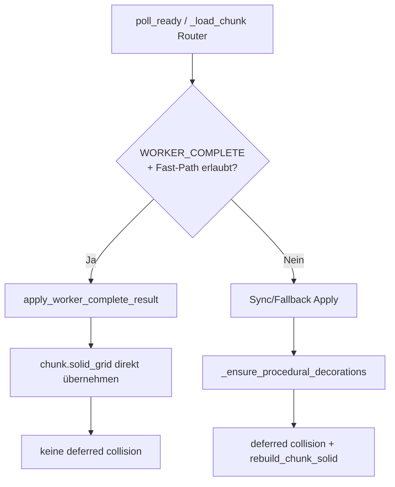

# M24a — Worker-Fast-Path und Collision-Flush-Korrektur

## Empfohlener Dateiname

`m24a_worker_fast_path_8f3c1d2a.plan.md`

(Pfad analog zu bestehenden Plänen: `.cursor/plans/m24a_worker_fast_path_8f3c1d2a.plan.md`)

---

## Stellung in der Roadmap

| Milestone | Inhalt |
|-----------|--------|
| M22e | Worker-Deko + Worker-Solid als vollständige `ChunkGenResult`-Payloads [file:542] |
| M23a | Deferred Unload, sparse Delta-Denke, klare Pfadtrennung im Streaming [file:546] |
| **M24a** | **Hotpath-Korrektur: Worker-Complete wirklich als Fast-Path behandeln** [file:601] |
| M24 | Welt-Persistenz Redesign (Regionen, Discovery/Modification, Binärformat) [file:602] |
| M24b/M25 | mögliche Folgearbeiten: Deko-Index, weitere O(D)-Reduktionen, Persistenz-Ausbau [file:601][file:602] |

**Abgrenzung:** M24a ist ein kleines, gezieltes `game_core`-/Streaming-Milestone vor bzw. neben M24 Persistenz. Es ersetzt weder M24 noch zieht es Persistenz-v5 oder Renderer-Umbauten vor. [file:602][file:601]

---

## Problembeleg (bindend)

### 1. Worker-Apply wird nachträglich entwertet

Die beantwortete Analyse zeigt: Jeder Apply-Pfad hängt die Koordinate an `deferred_collision_coords`, und am Ende des Apply-Blocks wird **bedingungslos** `_flush_deferred_collisions()` ausgeführt. Es gibt keine Unterscheidung zwischen Sync-Load, Fallback und vollständigem Worker-Resultat. [file:601]

Für `WORKER_COMPLETE + _should_use_worker_apply` ist dieser Flush laut Analyse **redundant**, weil `apply_chunk_result` bereits `chunk.solid_grid = result.solid_grid` setzt und `collision_dirty_chunks.discard(coord)` ausführt. Der heutige Rebuild ist damit ein **unvollständiger M22e-Umbau**, keine neue Korrektheitsanforderung. [file:601][file:542]

### 2. Messwerte: Apply ist billig, nachgelagerter Rebuild nicht

Der 64×64-Einzelchunk-Benchmark zeigt:

| Schritt | Thread | Dauer |
|---------|--------|-------|
| `worker_generate_chunk_result` | Worker | ~16,0 s (inkl. Cold-Start) |
| `apply_chunk_result` | Main | ~0,5 ms |
| `rebuild_chunk_solid_after_worker` | Main | ~14 ms |

Für einen isolierten Chunk ist also schon der nachgelagerte Main-Rebuild deutlich teurer als das Apply selbst; im Demo-Lauf wächst `apply_collision_ms` zusätzlich mit der globalen Deko-Liste auf 30–110+ ms. [file:599][file:601]

### 3. Globaler Deko-Scan ist der strukturelle Kostentreiber

Die beantwortete Cursor-Datei gruppiert die Hauptkosten klar:

| Hotspot | Kostenmodell | Relevanz |
|---------|--------------|----------|
| `_flush_deferred_collisions` → `rebuild_chunk_solid` | O(D) pro Chunk | Hauptproblem im Load-Hotpath [file:601] |
| `place_decoration` beim Worker-Apply | O(D×N) pro Chunk | unnötig teuer [file:601] |
| `_has_user_decorations_in_chunk` | O(D) pro Kandidat | Guard-Kosten [file:601] |
| `_chunk_has_procedural_deco` | O(D) | Revive/Unload-Nebenkosten [file:601] |
| `decorations_to_sprites` | O(D) pro Frame | Dauerlast, aber nicht M24a-Pflicht [file:601] |

Die Analyse unterscheidet sauber zwischen **chunk-lokaler Arbeit** (4096 Tiles, 65536 Collision-Zellen) und **globaler Deko-Kopplung**. Problematisch ist nicht 64×64 selbst, sondern dass Main-Thread-Pfade `world.decorations` global scannen, obwohl der Worker nur chunk-lokale Placements kennt. [file:599][file:601]

---

## Verbindliche Grundsätze

1. **M24a ist ein `game_core`-/Streaming-Milestone** — kein Renderer-, GPU-, Bridge- oder Persistenzformat-Redesign. [file:602][file:601]
2. **`WORKER_COMPLETE` ist ein eigener Pfadvertrag.** Vollständige Worker-Resultate sind nicht nur „auch ein Apply-Pfad“, sondern ein echter Fast-Path mit eigener Korrektheitsmatrix. [file:601][file:542]
3. **Worker-Solid ist für frische prozedurale Chunks die Quelle der Wahrheit.** Wenn die bekannten Guards erfüllt sind, darf Main keinen zweiten Solid-Rebuild erzwingen. [file:542][file:601]
4. **Slow-Path bleibt explizit erhalten.** Override, Delta, Debug, User-Deko, User-Paint, terrain-only und dirty-Chunks bleiben Main-Thread-/Fallback-Fälle. [file:542][file:601]
5. **M24a optimiert erst den größten Gewinn mit kleinstem Diff.** Deko-Indizes (`decorations_by_chunk`, `decorations_by_tile`) sind sinnvoll, aber ausdrücklich nicht Phase 1 dieses Milestones. [file:601]
6. **Determinismus-Vertrag aus M22e bleibt unverändert.** Worker-Resultate müssen weiterhin mit der sequentiellen Referenz übereinstimmen; M24a ändert Routing und Side-Effects, nicht World-Gen-Logik. [file:542]

---

## Definition `WORKER_COMPLETE` (verbindlich)

Die beantwortete Datei trennt zwei Ebenen, die M24a sauber in Code überführen soll. [file:601]

### Ebene A — Payload vollständig

`is_worker_complete_result(result, *, worker_apply_enabled, debug_mode) -> bool`

Pflichtbedingungen:

- `worker_apply_enabled is True` [file:601]
- `debug_mode is None` [file:601]
- `result.decorations is not None` [file:601]
- `result.solid_grid is not None` [file:601]
- `validate_chunk_gen_result(result)` läuft erfolgreich, insbesondere korrekte `solid_grid`-Länge [file:601]

### Ebene B — Fast-Path im Streaming zulässig

`can_apply_worker_complete_fast_path(world, streamer, coord, result) -> bool`

Zusätzliche Guards:

- `not streamer.pending_unload.contains(coord)` [file:601]
- `coord not in streamer.persistent_deltas` [file:601]
- `coord not in streamer.persistent_overrides` [file:601]
- `coord not in world.dirty_chunks` [file:601][file:542]
- `not _has_user_decorations_in_chunk(world, coord)` [file:601]

### Wichtige Folgerung

Wenn **beide Ebenen** wahr sind, gilt:

- `chunk.solid_grid = result.solid_grid` ist zulässig, [file:601]
- `collision_dirty_chunks.discard(coord)` ist korrekt, [file:601]
- `_flush_deferred_collisions()` für diese Koordinate ist **verboten**, [file:601]
- `_ensure_procedural_decorations()` ist für diese Koordinate **nicht** zuständig. [file:542][file:601]

---

## Zielbild



### Konkrete Zielwirkung

| Pfad | Heutiger Zustand | Ziel nach M24a |
|------|------------------|----------------|
| Worker-Complete | Apply + globaler Deferred-Flush | Apply-only, kein Rebuild [file:601] |
| Sync/Fallback | Apply + Ensure + Rebuild | unverändert [file:542][file:601] |
| Override/Delta/User-Deko | Slow-Path | unverändert [file:542][file:601] |
| Navigation bei echten Dirty-Chunks | globales `ensure_collision_fresh` | engerer Scope, soweit sicher [file:601] |

---

## Umsetzungsphasen

### Phase 0 — Predicate-Spezifikation und Guard-Vereinheitlichung

**Module:** `game_core/world_gen_result.py`, `game_core/chunk_streaming.py`, ggf. neues Hilfsmodul für Predicates.

Ziele:

- `is_worker_complete_result(...)` und `can_apply_worker_complete_fast_path(...)` explizit definieren. [file:601]
- Heutige implizite Regeln aus `_should_use_worker_apply` dokumentiert an einen Ort ziehen. [file:601][file:542]
- Validierungslücke schließen: nicht nur `decorations is not None and solid_grid is not None`, sondern vollständige Result-Validierung im Predicate-/Apply-Vertrag reflektieren. [file:601]

**DoD:**

- Ein gemeinsamer, testbarer Predicate-Vertrag statt verstreuter Bedingungen. [file:601]
- Tests für positive/negative Fast-Path-Fälle: Debug, Override, Dirty, Pending, User-Deko, terrain-only. [file:601][file:542]

---

### Phase 1 — Streamer: kein Deferred Collision Flush nach Fast-Path

**Module:** `game_core/chunk_streaming.py`

Ziele:

- `defer_collision` nur noch für Slow-Path-Koordinaten setzen. [file:601]
- `deferred_collision_coords.append(coord)` nur, wenn **nicht** Fast-Path. [file:601]
- `_flush_deferred_collisions()` bleibt technisch erhalten, wird aber nicht mehr für Worker-Complete missbraucht. [file:601]

**Verbindliche Regel:**

```python
used_fast = can_apply_worker_complete_fast_path(...)
_apply_chunk_from_result(..., defer_collision=not used_fast)
if not used_fast:
    deferred_collision_coords.append(coord)
```

**DoD:**

- Worker-Complete-Chunk löst keinen Main-Thread-`rebuild_chunk_solid` mehr aus. [file:601]
- Sync-/Fallback-/Override-Pfade verhalten sich unverändert. [file:542][file:601]
- Benchmark zeigt: `apply_chunk_result` bleibt im Sub-Millisekunden-Bereich, `rebuild_chunk_solid_after_worker` entfällt für Fast-Path. [file:599][file:601]

---

### Phase 2 — Apply-Funktion klar trennen

**Module:** `game_core/world_gen_result.py`, `game_core/world.py`

Ziele:

- Entweder neuen Fast-Path `apply_worker_complete_result(world, result, content)` einführen oder `apply_chunk_result` intern klar in Fast-/Slow-Teile zerlegen. [file:601]
- Ungenutzten `collision`-Parameter für den Fast-Path entfernen; API-Klarheit herstellen. [file:601]
- Side-Effects sichtbar machen: Validierung, `chunk_from_result`, Chunk-Einfügen, Deko-Übernahme, `solid_grid`, `collision_dirty_chunks.discard`. [file:601]

**DoD:**

- Fast-Path-Funktion ist als reine Datenübernahme lesbar. [file:601]
- Keine versteckte Vermischung mit `_ensure_procedural_decorations` oder Main-Rebuild-Logik. [file:542][file:601]

---

### Phase 3 — Prozedurale Worker-Deko per Batch-Append übernehmen

**Module:** `game_core/world.py`, `game_core/world_gen_result.py`, ggf. `content_registry.py`

Ziele:

- Für frische Worker-Complete-Chunks keine O(D×N)-`place_decoration`-Schleife mehr. [file:601]
- Batch aus `PlacedDecoration` direkt erzeugen und an `world.decorations` anhängen. [file:601]
- Per-Deko-`collision_dirty` im Fast-Path vermeiden; Solid kommt bereits aus dem Worker. [file:601]

**Wichtig:** Laut Analyse gehen dabei nur bewusst unerwünschte Nebenwirkungen verloren: globaler Duplicate-Scan und per-Deko-Collision-Dirty. Relevante Runtime-Daten (`PlacedDecoration` in `world.decorations`) bleiben erhalten. [file:601]

**DoD:**

- Worker-Complete-Apply verursacht keinen globalen Duplicate-Scan mehr. [file:601]
- Keine Doppeldeko bei normalem Streaming-Router (`coord in world.chunks` schützt vor Doppel-Apply). [file:601]
- Query/Extract/Save lesen weiterhin denselben `world.decorations`-Datenbestand. [file:601]

---

### Phase 4 — Navigation / `ensure_collision_fresh` enger fassen

**Module:** `game_core/world.py`, `game_core/navigation.py`

Ziele:

- Verstehen und dokumentieren, welche Invariante `ensure_collision_fresh()` heute absichert. [file:601]
- Scope verkleinern: Navigation soll nur betroffene Chunks rebuilden, nicht pauschal alle `collision_dirty_chunks` abarbeiten. [file:601]
- Keine Änderung für Fast-Path-Chunks nötig; Fokus auf echte Dirty-Fälle (Paint, User-Deko, Overrides). [file:542][file:601]

**DoD:**

- Navigation löst keine globale Dirty-Leerung mehr für lokale Kollisionsabfragen aus, soweit Testlage und Korrektheit das erlauben. [file:601]
- Korrektheit von `world_cell_solid` bleibt unverändert. [file:601]

---

### Phase 5 — Benchmarks, Regressionen, Doku

**Module:** Benchmarks/Tests, `ruleset.md`, `docs/ARCHITECTURE.md`, Plan-Verweise.

Ziele:

- Vorher/Nachher-Benchmarks für Worker-Complete-Chunk-Apply. [file:599][file:601]
- Regressionen aus M22e/M23a absichern. [file:542][file:546]
- Doku aktualisieren: Worker-Complete ist Apply-only; Slow-Path-Matrix explizit. [file:542][file:601]

**DoD:**

- Dokumentierte Reduktion von `apply_collision_ms` für Worker-Complete-Loads. [file:601][file:599]
- Keine Regression in Persistenz-/Unload-/Override-Pfaden. [file:546][file:602]
- Architektur- und Plan-Dokumente widersprechen dem tatsächlichen Fast-Path nicht mehr. [file:542][file:601]

---

## Teststrategie (verbindlich)

### Bestehende Tests, die relevant bleiben

- `test_apply_chunk_result_matches_reference` bleibt zentrale Referenz für Worker-vs.-Sequential-Zustand. [file:542][file:601]
- M22e-Golden-Tests für Layer, Deko und Solid bleiben unverändert gültig. [file:542]
- Streaming-Tests aus M23a bleiben wichtig für Pending/Revive/Unload-Semantik. [file:546]

### Neue oder angepasste Tests

Pflichtfälle laut beantworteter Datei: [file:601]

1. Worker-Complete-Chunk **ohne** Main-`rebuild_chunk_solid`. [file:601]
2. Override/Dirty/User-Deko bleibt Slow-Path. [file:601][file:542]
3. `solid_grid` aus Worker == Referenzpfad. [file:542][file:601]
4. Keine Doppeldeko bei Batch-Apply. [file:601]
5. Pending/Revive kollidiert nicht mit Worker-Apply. [file:546][file:601]
6. Navigation bleibt korrekt ohne globalen Flush für reine Fast-Path-Chunks. [file:601]

### Regressionstests für Guard-Matrix

Mindestens je ein Test für:

- Debug-Mode deaktiviert Fast-Path. [file:601][file:542]
- `persistent_overrides` deaktiviert Fast-Path. [file:601][file:542]
- `persistent_deltas` deaktiviert Fast-Path. [file:601]
- `dirty_chunks` deaktiviert Fast-Path. [file:601][file:542]
- User-Deko im Chunk deaktiviert Fast-Path. [file:601]
- terrain-only Worker-Result deaktiviert Fast-Path. [file:601][file:542]

---

## Betroffene Module

Primär:

- `game_core/chunk_streaming.py` — Router, Deferred Collision, Fast-/Slow-Path [file:601]
- `game_core/world_gen_result.py` — `is_worker_complete`, `apply_chunk_result`, Validierung [file:601][file:542]
- `game_core/world.py` — Deko-Append, Collision-Dirty-Semantik, `ensure_collision_fresh` [file:601]
- `game_core/navigation.py` — Query-Callsites für Collision-Freshness [file:601]

Sekundär / Tests / Doku:

- `tests/support/chunk_reference.py` [file:542]
- Worker-/Streaming-Regressionstests aus M22e/M23a [file:542][file:546]
- `ruleset.md`, `docs/ARCHITECTURE.md` [file:602][file:542]

---

## Verbote / Grenzen

### In Scope (M24a)

- Fast-Path-Predicate und Streamer-Routing. [file:601]
- Wegfall des Main-Thread-Solid-Rebuilds für Worker-Complete-Chunks. [file:601]
- Klare Apply-Funktion für Worker-Complete. [file:601]
- Batch-Append für prozedurale Worker-Deko. [file:601]
- Engerer `ensure_collision_fresh`-Scope, soweit lokal und testbar. [file:601]

### Out of Scope (explizit)

- `decorations_by_chunk` / `decorations_by_tile` als neue Hauptdatenstruktur. [file:601]
- Persistenz v5 / RegionStore / DiscoveryIndex-Arbeiten aus M24. [file:602]
- Renderer-, Bridge-, Extract- oder GPU-Worldgen-Umbauten. [file:602][file:601]
- Große Deko-LOD-/Sprite-System-Rewrites. [file:601]
- Neue Navigation-Architektur jenseits enger Collision-Freshness-Scopes. [file:601]

---

## Definition of Done

M24a ist abgeschlossen wenn:

- [ ] `WORKER_COMPLETE` als expliziter Predicate-Vertrag im Code existiert. [file:601]
- [ ] Worker-Complete-Chunks laufen ohne `_flush_deferred_collisions()` / `rebuild_chunk_solid` auf dem Main-Thread. [file:601]
- [ ] Sync-, Override-, Delta-, Debug-, Dirty- und User-Deko-Pfade bleiben korrekt auf dem Slow-Path. [file:542][file:601]
- [ ] Prozedurale Worker-Deko wird ohne O(D×N)-`place_decoration`-Pfad übernommen. [file:601]
- [ ] Referenz-/Golden-Tests aus M22e bleiben grün. [file:542]
- [ ] Streaming-/Pending-/Revive-Tests aus M23a bleiben grün. [file:546]
- [ ] Messbar reduzierter Main-Thread-Aufwand für Worker-Complete-Loads ist dokumentiert. [file:599][file:601]
- [ ] Doku widerspricht dem tatsächlichen Fast-Path nicht mehr. [file:542][file:602]

---

## Kurzfazit

M24a greift gezielt die bereits beantworteten und belegten Hotspots an: redundanter Collision-Flush nach Worker-Apply, unnötig teures Deko-Apply und zu breite Collision-Freshness auf dem Main-Thread. Der Milestone ist bewusst klein gehalten: erst den **größten Performance-Gewinn mit minimalem architektonischem Risiko** realisieren, danach größere Strukturmaßnahmen wie Deko-Indizes oder Persistenz-v5 separat angehen. [file:601][file:542][file:602]
