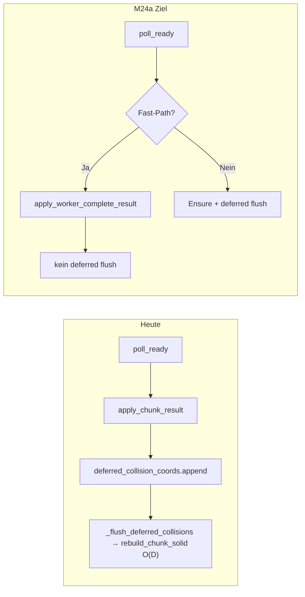

# M24a — Worker-Fast-Path und Collision-Flush-Korrektur

Quellen: [m24a_worker_fast_path_8f3c1d2a.plan.md](m24a_worker_fast_path_8f3c1d2a.plan.md), [m24a_cursor_fragen.md](m24a_cursor_fragen.md), Referenz-Predicates in [helpers/m24a_predicates.py](helpers/m24a_predicates.py), Benchmark [docs/benchmarks/single_chunk_64.json](docs/benchmarks/single_chunk_64.json).

## Problem (belegt)

Heute setzt jeder Load in [`game_core/chunk_streaming.py`](game_core/chunk_streaming.py) `defer_collision=True`, hängt **alle** Koordinaten an `deferred_collision_coords` und ruft bedingungslos `_flush_deferred_collisions()` auf — auch nach Worker-Apply, obwohl [`apply_chunk_result`](game_core/world_gen_result.py) bereits `solid_grid` setzt und `collision_dirty_chunks.discard(coord)` ausführt.



**Messwerte:** `apply_chunk_result` ~0,5 ms vs. `rebuild_chunk_solid_after_worker` ~14 ms (1 Chunk); Demo `apply_collision_ms` 30–110+ ms bei wachsender globaler Deko-Liste.

## Abgrenzung

| In Scope | Out of Scope |
|----------|--------------|
| Predicate + Streamer-Routing | `decorations_by_chunk` / Tile-Index |
| Kein Main-Rebuild nach Worker-Complete | M24 Persistenz v5 / RegionStore |
| `apply_worker_complete_result` + Batch-Deko | Renderer/Bridge/Extract-Umbau |
| Optional Phase 6: Pool-Guardrails | GPU-Worldgen |

**Pool-Guardrails (Phase 6, optional):** Sync-Fallback bei langem `in_flight`, `max_in_flight` — nur wenn Phasen 0–3 grün.

---

## Phase 0 — Predicate-Spezifikation

**Dateien:** [`game_core/world_gen_result.py`](game_core/world_gen_result.py), [`game_core/chunk_streaming.py`](game_core/chunk_streaming.py)

- Logik aus [helpers/m24a_predicates.py](helpers/m24a_predicates.py) nach `game_core` überführen (z. B. `world_gen_result.py` oder kleines `worker_fast_path.py`):
  - `is_worker_complete_result(result, *, worker_apply_enabled, debug_mode)` — inkl. `validate_chunk_gen_result`
  - `can_apply_worker_complete_fast_path(world, streamer, result, ...)` — ersetzt/ergänzt `_should_use_worker_apply`
- `_should_use_worker_apply` delegiert auf `can_apply_worker_complete_fast_path` (kein Verhaltens-Drift)

**Tests (neu):** `tests/test_m24a_fast_path.py` — Guard-Matrix:
- positiv: normales WORKER_COMPLETE
- negativ: Debug, Override, Delta, `dirty_chunks`, User-Deko, `pending_unload`, terrain-only

**DoD:** Ein testbarer Predicate-Vertrag statt verstreuter Bedingungen.

---

## Phase 1 — Streamer: kein Deferred Flush nach Fast-Path

**Datei:** [`game_core/chunk_streaming.py`](game_core/chunk_streaming.py) — `update()` Pool- und Sync-Apply-Blöcke (~458–512)

**Änderung:** Fast-Path-Erkennung **vor** deferred-Liste; nur Slow-Path-Koordinaten flushen.

```python
used_fast = self._should_use_worker_apply(world, result)  # nach Phase 0: can_apply_...
self._apply_chunk_from_result(..., defer_collision=not used_fast, ...)
if not used_fast:
    deferred_collision_coords.append(coord)
```

Gleiche Regel für **beide** Apply-Einstiege:
- Pool-Pfad (`poll_ready` → `_apply_chunk_from_result`)
- Sync-Pfad (`_load_chunk` mit `defer_collision=True`) — Fast-Path trifft hier selten zu, bleibt konsistent

`_apply_chunk_from_result` soll `used_fast` zurückgeben oder intern `defer_collision` respektieren (Worker-Zweig setzt nie deferred).

**Tests:**
- `test_streaming_worker_apply_skips_collision_flush` — Mock `world.rebuild_chunk_solid`, Pool liefert WORKER_COMPLETE → `rebuild_calls == 0`
- Bestehend: [`tests/test_worker_apply.py::test_streaming_pool_uses_apply_not_populate`](tests/test_worker_apply.py) bleibt grün

**DoD:** Worker-Complete löst keinen `rebuild_chunk_solid` im Streamer aus; Slow-Path unverändert.

---

## Phase 2 — Apply-Funktion trennen

**Datei:** [`game_core/world_gen_result.py`](game_core/world_gen_result.py)

- Neu: `apply_worker_complete_result(world, result, content) -> Chunk`
  - Validierung, `chunk_from_result`, `solid_grid`-Copy, `collision_dirty_chunks.discard`
  - **Kein** `collision`-Parameter
- `apply_chunk_result` wird Thin-Wrapper (Backward-compat für Tests) oder ruft intern Fast-Path auf
- Alle Call-Sites in `chunk_streaming` nutzen explizit Fast-Path-Funktion

**DoD:** Fast-Path als reine Datenübernahme lesbar; [`test_apply_chunk_result_matches_reference`](tests/test_worker_apply.py) bleibt grün.

---

## Phase 3 — Deko Batch-Append

**Dateien:** [`game_core/world_gen_result.py`](game_core/world_gen_result.py), optional Hilfsfunktion in [`game_core/world.py`](game_core/world.py)

- Statt `place_decorations_batch` → N× `place_decoration` (O(D×N)):
  - IPC-Placements → `PlacedDecoration`-Liste via `content.decoration_id_to_key` + `tile_to_world_anchor`
  - `world.decorations.extend(batch)` für frischen Chunk-Load
- Kein per-Deko `_mark_decoration_collision_dirty` im Fast-Path

**Invariante:** Router verhindert Doppel-Apply (`coord in world.chunks`); kein Duplicate-Scan nötig.

**Tests:**
- Keine Doppeldeko bei normalem Streaming-Apply
- `len(world.decorations)` und Solid weiterhin == Referenz (`test_apply_chunk_result_matches_reference`)

**DoD:** Worker-Apply ohne globalen Duplicate-Scan; Extract/Save/Query unverändert korrekt.

---

## Phase 4 — Navigation / `ensure_collision_fresh` (enger Scope)

**Dateien:** [`game_core/world.py`](game_core/world.py), [`game_core/navigation.py`](game_core/navigation.py)

- Dokumentieren: Invariante = dirty Chunks haben frisches `solid_grid` vor `world_cell_solid`
- Optional: `ensure_collision_fresh_for_coords(world, coords, ...)` — nur betroffene Chunk-Koordinaten rebuilden statt gesamtes `collision_dirty_chunks`-Set
- Navigation: aus Sample-Punkten der Charaktermaske betroffene Chunks ableiten (1–2 typisch)

**Risiko:** Mittel — nur umsetzen, wenn Unit-Tests für [`tests/test_collision.py`](tests/test_collision.py) + Navigation grün bleiben.

**DoD:** Keine Regression in Kollision; kein globaler Flush-Zwang für reine Fast-Path-Chunks.

---

## Phase 5 — Benchmarks, Regression, Doku

- [`tools/benchmark_single_chunk.py`](tools/benchmark_single_chunk.py): Metrik `rebuild_chunk_solid_after_worker` soll für Fast-Path-Szenario **entfallen** oder 0 ms
- [`docs/benchmarks/single_chunk_64.json`](docs/benchmarks/single_chunk_64.json) nachziehen
- Doku: [`docs/ARCHITECTURE.md`](docs/ARCHITECTURE.md), [`ruleset.md`](ruleset.md) — Worker-Complete = Apply-only; Slow-Path-Matrix
- Volle Regression: `tests/test_worker_apply.py`, `tests/test_worker_solid.py`, `tests/test_chunk_streaming.py`, M23a-Streaming-Tests

**DoD:** Dokumentierter Gewinn bei `apply_collision_ms`; M22e-Golden + M23a-Streaming grün.

---

## Phase 6 (optional) — Pool-Guardrails

**Nur wenn Phasen 0–3 grün.**

**Dateien:** [`game_core/chunk_streaming.py`](game_core/chunk_streaming.py), [`game_core/chunk_gen_pool.py`](game_core/chunk_gen_pool.py), ggf. [`assets/content/streaming.json`](assets/content/streaming.json)

- `max_in_flight_chunks` (Config, z. B. 4–8)
- Sync-Fallback: wenn `pool.is_in_flight(coord)` länger als Schwellwert → `_load_chunk` trotzdem (Notfall sichtbare Chunks)
- Optional Demo-Warmup: ein Dummy-Chunk nach Pool-Init ([`apps/chunk_world_demo.py`](apps/chunk_world_demo.py))

**DoD:** Demo zeigt wieder `chunk_count > 0` ohne 16 s leere Welt; Warte-Frames `stream_loaded=0` sinken messbar.

---

## Implementierungsreihenfolge (Priorität)

1. **Phase 0 + 1** — größter Gewinn (~14–110 ms/Chunk), geringstes Risiko
2. **Phase 2 + 3** — API-Klarheit + O(D×N)-Fix
3. **Phase 5** — Absicherung + Doku
4. **Phase 4** — wenn Zeit/Risiko ok
5. **Phase 6** — optional nach grünem 0–3

## Betroffene Kernmodule

- [`game_core/chunk_streaming.py`](game_core/chunk_streaming.py) — Router, deferred collision
- [`game_core/world_gen_result.py`](game_core/world_gen_result.py) — Apply, Predicates
- [`game_core/world.py`](game_core/world.py) — Deko-Append, `ensure_collision_fresh`
- [`game_core/navigation.py`](game_core/navigation.py) — Phase 4

## Definition of Done (M24a)

- Predicate-Vertrag im Code + Guard-Tests
- Worker-Complete ohne Main-`rebuild_chunk_solid` im Streamer
- Slow-Pfade (Override/Delta/Debug/Dirty/User-Deko) unverändert korrekt
- Batch-Deko ohne O(D×N)-`place_decoration`
- M22e-Referenztests + M23a-Streaming grün
- Benchmark/Doku aktualisiert
