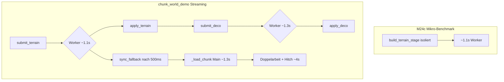
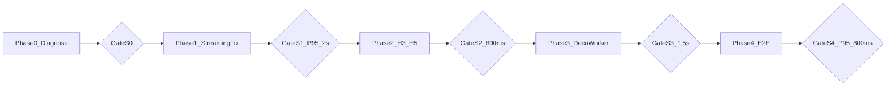

# M24c.1 — Streaming-E2E & verbleibende Terrain-Hebel

## Ausgangslage

### M24c erreicht (Mikro-Benchmark)

| Metrik | M24b | M24c | Quelle |
|--------|------|------|--------|
| `worker_build_terrain_stage` | ~22 s | **~1,1 s** | [`nodeco_single_chunk_64.json`](docs/benchmarks/nodeco_single_chunk_64.json) |
| `build_terrain_stage` sync | ~25 s | **~1,0 s** | gleich |
| H1 Doppel-Cache | 2× | **1×** | `field_cache_builds: 1` |

### Realität im Demo (unverändert schlecht)

Terminal [`terminals/4.txt`](c:\Users\rkier\.cursor\projects\e-Dokumente-Private-Projekte-WT-Extract\terminals\4.txt):

```
stream hitch: loaded=2 stream=4047 ms chunks=12   (~4 s)
stream hitch: loaded=2 stream=21 ms   chunks=14   (~20 ms)
```

**Wechselndes Muster:** ~20 ms (schnelle Applies) vs. **~3,6–4,2 s** (langsame Frames) — trotz M24c-Terrain-Optimierung.

### Cost Breakdown — verbleibende Terrain-Anteile

Quelle: [`terrain_cost_breakdown_baseline.json`](docs/benchmarks/terrain_cost_breakdown_baseline.json)

| Sektion | Anteil | Hypothese |
|---------|--------|-----------|
| Noise (FBM+Simplex) | **46 %** | H2 weitgehend behoben; Rest = echte Samples |
| `field_cache_region` | **24 %** | H3 — redundantes FBM in `sample_biome_region` |
| `resolve_tiles` | **11 %** | H6 |
| `coast_overlay` | **10 %** | H5 — 4× Nachbar-Height pro Land-Tile |
| H1 Doppel-Cache | **0 %** | behoben |

Zusätzlich: **voller Chunk im Demo** = Terrain (~1,1 s) **+** Deco-Worker (~1,3 s) serialisiert → ~2,4 s Worker-Wallclock pro sichtbarem Chunk ([`deco_single_chunk_64.json`](docs/benchmarks/deco_single_chunk_64.json)).

---

## Diagnose — warum Mikro ≠ Demo



### B1 — `is_in_flight` ignoriert READY (Bug, hoch)

[`ChunkGenPool.is_terrain_in_flight`](game_core/chunk_gen_pool.py) prüft nur `SUBMITTED | RUNNING`:

```python
# terrain_in_flight_count zählt READY mit — is_terrain_in_flight nicht!
if state in (_JobState.SUBMITTED, _JobState.RUNNING):  # READY fehlt
```

**Folge:** Terrain-Result ist READY, Apply-Budget (`max_applies_per_frame: 2`) erschöpft, Coord noch nicht in `world.chunks` → Sync-Fallback in [`chunk_streaming.py`](game_core/chunk_streaming.py) Zeile 734–758 feuert → `_load_chunk` → monolithisches `generate_chunk` + `populate_chunk_decorations` auf Main (**~1,3 s/Chunk**).

### B2 — Sync-Fallback bei laufendem Worker (Konfig-Bug, hoch)

[`sync_fallback_in_flight_ms: 500`](assets/content/streaming.json) < gemessene Worker-Zeit **~1100 ms**.

Logik in `update()`:
```python
if pool.is_in_flight(coord):          # nur RUNNING
    if age < 500ms: continue          # warten
# age >= 500ms bei RUNNING → fällt durch zu _load_chunk!
```

Nach 500 ms startet Main-Thread-Sync **während Worker noch rechnet** → doppelte CPU + Main blockiert.

### B3 — `loaded=2` ≠ „Chunk spielbar“ (Metrik, mittel)

[`_route_pool_results`](game_core/chunk_streaming.py) zählt **jedes Apply** (Terrain + Deco separat) als `loaded`. Demo-Hitch-Log nutzt diese Zahl — schnelle ~20 ms Frames sind oft 2× Apply, langsame ~4 s Frames sind 2× Sync-Generate.

### B4 — Warmup veraltet (mittel)

[`warmup_chunk_gen_pool`](game_core/chunk_streaming.py) nutzt Legacy `pool.submit()` (nur Terrain, M24a-Pfad) — wärmt M24b Terrain+Deco-Pipeline nicht.

### B5 — Verbleibende Terrain-Kosten H3/H5 (Phase 2 aus M24c, mittel)

Noch **~34 %** im Terrain-Build — relevant für Sync-Fallback-Pfad und Deco-Worker (teilt `field_cache`).

---

## Zieldefinition M24c.1

**Primärmetrik (neu):** Streaming-E2E, nicht Mikro-Benchmark.

| Metrik | Ist (Demo) | M24c.1-Ziel |
|--------|-----------|-------------|
| `stream_ms` P95 bei Bewegung (2 neue Chunks/Frame) | ~4000 ms | **≤ 800 ms** |
| `apply_sync_generate_ms` pro Stream-Step | ungemessen, geschätzt hoch | **≈ 0** (kein Sync-Fallback im Worker-Pfad) |
| Sync-Fallback-Triggers während RUNNING/READY | ja | **0** |
| `worker_build_terrain_stage` Mikro | ~1,1 s | **≤ 0,8 s** (H3/H5) |
| Vollständiger Worker-Chunk (Terrain+Deco) | ~2,4 s | **≤ 1,5 s** |

**Nordstern:** Kein sichtbarer 4-Sekunden-Hitch mehr beim normalen Chunk-Streaming in `chunk_world_demo`.

---

## In Scope / Out of Scope

**In Scope:**
- Streaming-Integrationsfixes (B1–B4)
- M24c Phase 2 Terrain (H3/H5) — nur bestätigte Breakdown-Anteile
- Deco-Worker-Profiling (warum ~1,3 s trotz gecachtem `field_cache`)
- E2E-Benchmark-Harness für Demo/Perf-Session
- Streaming-Config-Anpassung (`sync_fallback_in_flight_ms`)

**Out of Scope:**
- M24b-Vertragsumbau (Router, Guards, BuildKey)
- Persistenz, Renderer
- M24c Phase 3–4 (Compiled Runtime, SoA) — erst nach M24c.1 Gate
- Phase 4b zweiter ProcessPool

---

## Phasenplan

### Phase 0 — Streaming-Diagnose (Pflicht, zuerst)

**Ziel:** Belegen welcher Pfad die 4-Sekunden-Hitches verursacht.

**Artefakte:**
- [`chunk_world_demo.py`](apps/chunk_world_demo.py): optional `StreamStepMetrics` auch ohne `--profile` (Env `WT_STREAM_DIAG=1`) — loggt `apply_sync_generate_ms`, `terrain_applied`, `deco_applied`, `terrain_discarded_stale`
- Neues Tool [`tools/benchmark_stream_step.py`](tools/benchmark_stream_step.py): simuliert 10 `streamer.update()`-Steps mit Fokus-Bewegung, exportiert JSON
- Metrik `sync_fallback_triggered` in [`StreamStepMetrics`](game_core/perf/models.py) + Zähler in Sync-Pfad

**DoD Phase 0:** Ein reproduzierbarer Report zeigt: Anteil Sync vs. Worker pro langsamer Frame; B1/B2 bestätigt oder widerlegt.

**Gate S0:** Top-Ursache dokumentiert mit ≥1 messbarem Beleg.

---

### Phase 1 — Streaming-Integrationsfixes (größter E2E-Hebel)

**1a — `is_in_flight` symmetrisch zu `in_flight_count`**

In [`chunk_gen_pool.py`](game_core/chunk_gen_pool.py):
```python
def is_terrain_in_flight(self, coord) -> bool:
    return any(
        key.coord == coord and state in (SUBMITTED, RUNNING, READY)
        for key, state in self._terrain_states.items()
    )
```
Analog `is_deco_in_flight` — Sync-Fallback prüft **Terrain oder Deco** pending.

**1b — Sync-Fallback nur wenn Pool leer für Coord**

In [`chunk_streaming.py`](game_core/chunk_streaming.py) Sync-Schleife:
- **Nie** `_load_chunk` wenn `pool.has_pending_result(coord)` (READY in Queue)
- **Nie** `_load_chunk` wenn Terrain/Deco RUNNING (unabhängig von Alter)
- `sync_fallback_in_flight_ms` → **2500** (oder `0` = deaktiviert wenn Worker-Pfad aktiv)

**1c — Warmup M24b-konform**

[`warmup_chunk_gen_pool`](game_core/chunk_streaming.py): `submit_terrain` + `submit_deco` auf Dummy-Coord, poll bis beide consumed — kein Legacy `submit()`.

**1d — `loaded`-Semantik im Demo-Log**

Hitch-Log ergänzen: `terrain_applied`, `deco_applied`, `sync_ms` — nicht nur `loaded`.

**Zwischenziel Phase 1:** `apply_sync_generate_ms == 0` in 20 aufeinanderfolgenden Stream-Steps nach Warmup.

**Gate S1:** Demo `stream_ms` P95 **≤ 2000 ms** (Zwischenziel, nicht Endziel).

---

### Phase 2 — Terrain H3/H5 (M24c Phase 2, datengetrieben)

**Freigabe:** nach Gate S1.

Aus Breakdown priorisiert:

**2a — `sample_climate_and_region` (H3, ~24 %)**
- Ein Warp, gebündelte FBM-Reads
- Seed-Punkt-Klima aus Zell-Cache statt `_climate_at_point` → volles `sample_climate`

**2b — Coast aus Height-Grid (H5, ~10 %)**
- Einmalig `water_class` pro Tile materialisieren
- `_coast_overlay` liest Nachbarn aus Grid, kein live-FBM

**Zwischenziel:** `build_terrain_stage` **≤ 800 ms**; Breakdown `field_cache_region` **−40 %** vs. Baseline.

**Gate S2:** Mikro `worker_build_terrain_stage` ≤ 800 ms; Golden grün.

---

### Phase 3 — Deco-Worker (~1,3 s)

**Freigabe:** nach Gate S2.

**Problem:** [`worker_build_deco_stage`](docs/benchmarks/deco_single_chunk_64.json) ~1301 ms trotz LRU-`field_cache` — fast so teuer wie Terrain.

**Phase 0 für Deco:** Sub-Timings in `build_deco_stage` (`compute_procedural_decorations`, `build_chunk_solid_grid`).

**Vermutung:** Deco-Pfad baut Terrain/Cache neu wenn LRU-Miss ([`world_gen_parallel.py`](game_core/world_gen_parallel.py) `_generate_deco_task` Fallback).

**Ziele:**
- LRU-Miss-Rate im Streamer messbar (`field_cache_misses`)
- Deco-Worker **≤ 500 ms** bei Cache-Hit
- Kein `build_terrain_stage`-Fallback im Deco-Task ohne expliziten Miss

**Gate S3:** Vollständiger Worker-Chunk (Terrain+Deco) **≤ 1,5 s** Mikro.

---

### Phase 4 — E2E-Härtung & Doku

- [`tests/test_m24c1_streaming.py`](tests/test_m24c1_streaming.py): `is_in_flight` inkl. READY; kein Sync bei pending Result; Warmup M24b
- [`docs/benchmarks/terrain_m24c1.md`](docs/benchmarks/terrain_m24c1.md): Vorher/Nachher Demo P95
- `ruleset.md` / `ARCHITECTURE.md` — M24c.1-Abschnitt
- Streaming-Config dokumentiert: `sync_fallback_in_flight_ms` Begründung

**Gate S4 (Abschluss):** Demo `stream_ms` P95 **≤ 800 ms** bei Standard-Bewegung; `apply_sync_generate_ms == 0`.

---

## Freigabekette



**Regel:** Jede Phase = eigener PR. Mikro-Benchmark-Gate allein reicht nicht — **Streaming-Gate ist Pflicht**.

---

## Risiken

| Risiko | Mitigation |
|--------|------------|
| Sync-Fallback komplett deaktivieren → Chunk-Löcher | READY-aware wait; Timeout nur als letzter Ausweg |
| H3/H5 ändert Küstenlinie | Golden-Tests + Start-Area-Coord |
| Deco-LRU-Miss unter Last | `terrain_max_in_flight` + LRU-Cap reviewen |
| Demo-P95 schwankt | `benchmark_stream_step.py` mit festem Seed/Route |

---

## Verhältnis zu M24c

| M24c | M24c.1 |
|------|--------|
| Mikro `build_terrain_stage` | Streaming `stream_ms` E2E |
| Phase 0+1 Quick Wins | Phase 1 Streaming-Fixes |
| Phase 2 H3/H5 (offen) | Phase 2 (nach S1) |
| Phase 3–4 Compiled/SoA | **verschoben** — erst nach M24c.1 Gate S4 |
| Gate A/D Mikro ≤3s **erreicht** | Demo P95 ≤800ms **offen** |

M24c.1 beantwortet: **Warum ist der Spieler-Pfad trotz 20× Mikro-Speedup noch ruckelig?**
