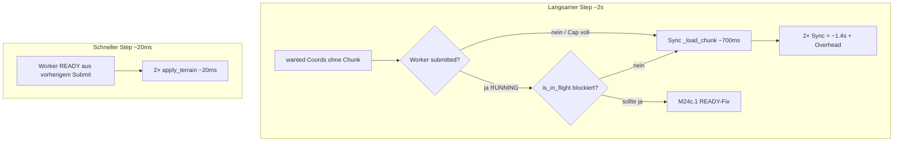
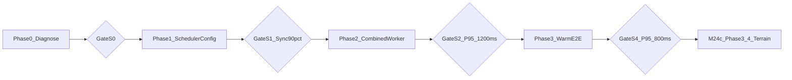

# M24c.2 — Streaming Scheduler & Warm-E2E

## Ausgangslage

### Mikro erreicht (M24c + M24c.1)

| Metrik | M24b | M24c.1 | Quelle |
|--------|------|--------|--------|
| `worker_build_terrain_stage` | ~22 s | **~464–538 ms** | [`deco_single_chunk_64.json`](docs/benchmarks/deco_single_chunk_64.json) |
| Voller Chunk Terrain+Deco (sync) | — | **~665 ms** | gleich |
| Voller Chunk Terrain+Deco (worker) | — | **~917 ms** | gleich |
| H1 Doppel-Cache | 2× | **1×** | M24c |
| H3/H5 Terrain | offen | **teilweise** | Warp-Reuse, Coast-Grid |

### E2E weiterhin Sync-dominiert (M24c.1 Gate S4 verfehlt)

Quelle: [`docs/benchmarks/baselines/stream_step_baseline.json`](docs/benchmarks/baselines/stream_step_baseline.json) (100 Steps, `step_px=4096`)

| Metrik | Ist | M24c.1-Ziel |
|--------|-----|-------------|
| `stream_ms` P50 | **1877 ms** | — |
| `stream_ms` P95 | **4523 ms** | ≤ 800 ms |
| `sync_fallback_triggered_total` | **193** | ≈ 0 |
| `apply_sync_generate_ms_total` | **84941 ms** | ≈ 0 |
| `terrain_applied_total` | **7** | — |
| `deco_applied_total` | **0** | > 0 |

**Wechselmuster (reproduzierbar):**

```
Step gerade: ~20 ms   — terrain_applied=2, sync_fallback=0
Step ungerade: ~2000 ms — terrain_applied=0, sync_fallback=2, apply_sync ~700 ms/Chunk
```

### Root-Cause-Hypothesen (datengetrieben)



| ID | Hypothese | Beleg | Priorität |
|----|-----------|-------|-----------|
| **S1** | `max_sync_applies_per_frame: 2` erlaubt bewusst 2 Sync-Loads/Frame | [`streaming.json`](assets/content/streaming.json) L13–14 | hoch |
| **S2** | Submit-Guard-Loop filtert Liste nicht — `submit_terrain_allowed` wird geprüft, aber volle `terrain_submit_coords` an `pool.submit_terrain()` übergeben | [`chunk_streaming.py`](game_core/chunk_streaming.py) L665–681 | **kritisch** |
| **S3** | `terrain_room`/`terrain_cap_room` schneiden Submit-Liste; nicht-submitted Coords syncen im selben Frame | L658–664 + Sync-Schleife L768+ | hoch |
| **S4** | `max_applies_per_frame: 2` — Apply-Starvation; READY wartet, andere Coords syncen | Baseline + Config | hoch |
| **S5** | Deco-Pipeline hängt: `deco_pause_when_visible_terrain_pending`, `deco_parallelism_cap: 2`, Sync-Pfad umgeht Worker-Deco | `deco_applied_total=0` | hoch |
| **S6** | Cross-Process LRU: Terrain Job auf Worker A, Deco auf Worker B → LRU-Miss → Doppel-Terrain | [`world_gen_parallel.py`](game_core/world_gen_parallel.py) L59–74 | mittel |
| **S7** | Cold-Benchmark mischt Warm/Cold — kein getrenntes Warm-Gate | [`benchmark_stream_step.py`](tools/benchmark_stream_step.py) | messbar |

M24c.1 hat **B1/B2** (READY/Timeout) behoben; M24c.2 adressiert **S1–S7** — Scheduler/Config, nicht Terrain-Noise.

---

## Zieldefinition M24c.2

**Primärmetrik:** Warm-E2E nach 20 Warmup-Steps.

| Metrik | Ist (M24c.1 Baseline) | M24c.2-Ziel |
|--------|----------------------|-------------|
| `stream_ms` P95 (Warm, 100 Steps) | ~4523 ms (gemischt) | **≤ 800 ms** (Gate S4) |
| `stream_ms` P95 (Warm Zwischen) | — | **≤ 1200 ms** (Gate S2) |
| `sync_fallback_triggered` (Warm 100 Steps) | ~193 (gemischt) | **≤ 5** (Gate S2) |
| `apply_sync_generate_ms_total` (Warm) | ~84941 ms | **≈ 0** |
| `deco_applied_total` (Warm 100 Steps) | 0 | **≥ 50** (Health-Signal¹) |
| Combined Worker-Chunk Mikro | ~917 ms | **≤ 1500 ms** (Gate S3) |

¹ **`deco_applied_total` ist kein hartes Gate**, sondern ein Health-Signal: Es zeigt, ob die Deco-Pipeline im Benchmark-Szenario überhaupt „ins Spiel kommt“. Der Wert hängt stark von Route, Sichtbarkeit und Warmup-Setup ab und ist nicht 1:1 mit „Pipeline gesund vs. kaputt“ gleichzusetzen.

**Nordstern:** Kein alternierendes 2-Sekunden-Muster mehr in `chunk_world_demo` nach Warmup; Worker-Pfad konsequent für Terrain+Deco.

---

## In Scope / Out of Scope

**In Scope:** Config, Scheduler-Guards, Submit-Listen-Fix, Combined Worker-Job, Deco-Heuristiken, Prefetch-Tuning, Warm-Benchmark, Tests, Doku.

**Out of Scope:** M24c Terrain Phase 3–4 (Noise-Bündelung, SoA, Compiled Runtime), Persistenz, Renderer, zweiter ProcessPool, M24b Router/BuildKey-Umbau.

---

## Phasenplan

### Phase 0 — Warm-Diagnose & Submit-Trace (Pflicht, zuerst)

**Ziel:** Jeden langsamen Step attributieren: Sync vs. Worker, submitted vs. nicht-submitted.

**Artefakte:**
- [`benchmark_stream_step.py`](tools/benchmark_stream_step.py): `--warmup-steps 20`, `--measure-steps 100`, getrennte Summaries `cold_summary` / `warm_summary`
- Neue Metriken in [`StreamStepMetrics`](game_core/perf/models.py):
  - `sync_skipped_worker_submitted` — Sync verhindert wegen Worker-Submit/In-Flight
  - `sync_skipped_pending_result` — Sync verhindert wegen READY
  - `terrain_submit_attempted` / `terrain_submit_accepted` — Differenz zeigt S2/S3
- Diagnose-Report in [`docs/benchmarks/baselines/stream_step_m24c2_phase0.json`](docs/benchmarks/baselines/)

**DoD:** Pro langsamer Step ist dokumentiert: „Coord X — nicht submitted (Cap/Guard) → Sync".

**Gate S0:** ≥1 messbarer Beleg für S2 oder S3 (Submit-Differenz > 0 in ≥10 % der Steps).

---

### Phase 1 — Scheduler & Config-Fixes (größter E2E-Hebel)

**Freigabe:** nach Gate S0.

#### 1a — Submit-Listen korrekt filtern (Bugfix S2)

In [`chunk_streaming.py`](game_core/chunk_streaming.py):

```python
# Vorher (Bug): Guard-Loop ohne Filterung
terrain_submit_coords = [c for c in terrain_submit_coords if submit_terrain_allowed(...)]
keys = pool.submit_terrain(terrain_submit_coords, ...)
```

Analog für Deco-Submit-Keys.

#### 1b — Sync-Fallback-Contract verschärfen (S1, S3)

Sync-Schleife (L768+):
- **Nie** `_load_chunk` wenn `pool.has_pending_result(coord)`
- **Nie** `_load_chunk` wenn `pool.is_in_flight(coord)` (SUBMITTED/RUNNING/READY)
- **Nie** `_load_chunk` wenn Coord in `terrain_submit_coords` dieses Frames war (neues Set `_step_terrain_submitted_coords`)
- **Nie** `_load_chunk` wenn `pool is not None` und `sync_fallback_only_when_pool_disabled` (Config, default: Sync nur wenn `parallel_prefetch=false` oder expliziter Timeout-Notfall)

Config in [`streaming.json`](assets/content/streaming.json):

| Key | Ist | M24c.2 |
|-----|-----|--------|
| `max_sync_applies_per_frame` | 2 | **0** |
| `max_applies_per_frame` | 2 | **4** (Tune 4–6) |
| `terrain_max_in_flight` | 8 | **12** |
| `terrain_parallelism_cap` | 6 | **8** |
| `prefetch_chunks` | 2 | **3** |
| `deco_parallelism_cap` | 2 | **4** |
| `deco_pause_when_visible_terrain_pending` | true | **false** (oder nur für `wanted`, nicht `prefetch`) |
| `deco_backfill_budget_per_frame` | 2 | **4** |

#### 1c — Deco-Scheduler lockern (S5)

- `deco_pause_when_visible_terrain_pending`: nur blockieren wenn **sichtbare wanted** Terrain pending, nicht globales `visible_pending` über prefetch
- Optional: `prefetch_deco_only_when_idle: false` für Bewegungs-Benchmark
- Metrik `deco_submit_skipped_visible_terrain_pressure` im Warm-Report tracken

#### 1d — Update-Loop-Reihenfolge (S3)

Aktuelle Reihenfolge ist bereits Apply → Submit → Sync. Ergänzung:
- Nach Submit: `_step_submitted_coords` setzen, Sync-Schleife konsultiert dieses Set
- Optional zweiter `poll`-Pass nach Submit (kein Sync im selben Frame für frisch submitted Jobs)

**Zwischenziel:** Warm `sync_fallback_triggered` **≤ 20** in 100 Steps.

**Gate S1:** Warm `apply_sync_generate_ms_total` **< 5000 ms** (90 %+ Reduktion vs. Baseline).

---

### Phase 2 — Combined Terrain+Deco Worker-Job (S6)

**Freigabe:** nach Gate S1.

**Problem:** Zwei ProcessPool-Jobs + prozesslokale [`TerrainStageLRU`](game_core/field_cache_lru.py) → Cross-Process-Miss.

**Lösung:** Ein Worker-Task pro BuildKey:

```python
# world_gen_parallel.py
def _generate_chunk_pipeline_task(build_key: BuildKey) -> tuple[TerrainResult, DecoResult]:
    stage = build_terrain_stage(build_key, _worker_ctx)
    deco_stage = build_deco_stage(stage, _worker_ctx)
    return to_terrain_result(stage), to_deco_result(deco_stage)
```

**Pool-Erweiterung** [`chunk_gen_pool.py`](game_core/chunk_gen_pool.py):
- `submit_chunk_pipeline(build_keys)` — ein Future, bei Completion beide Results in `_terrain_ready` + `_deco_ready` (atomar)
- `pipeline_mode` Config-Flag: `"combined"` (default M24c.2) | `"split"` (Rollback M24b)
- [`chunk_streaming.py`](game_core/chunk_streaming.py): bei `combined` kein separates `submit_deco` — Router wendet Terrain+Deco aus einem Pipeline-Result an

**M24b-Vertrag:** BuildKey, Guards, `apply_terrain_stage` → `apply_deco_stage` Reihenfolge unverändert; nur IPC-Bündelung.

**Mikro-Gate S3:** `worker_build_terrain_stage` + `worker_build_deco_stage` Combined ≤ **1500 ms** in [`benchmark_single_chunk.py`](tools/benchmark_single_chunk.py).

**Gate S2 (Warm):** `stream_ms` P95 **≤ 1200 ms**; `sync_fallback_triggered` Warm **≤ 5**.

**Zusätzliches Health-Signal:** `deco_applied_total` Warm **≥ 50** *oder* nachvollziehbare Erklärung, warum Deco im Benchmark-Szenario selten sichtbar ist (Route, Sichtbarkeit, Warmup).

`deco_applied_total` wird nicht als hartes Muss, sondern als Indikator genutzt, dass die Deco-Pipeline unter realistischen Bedingungen überhaupt „ins Spiel kommt“. Liegt der Wert darunter, muss das Diagnose-Kapitel (Phase 0 / `terrain_m24c2.md`) erklären, ob das an der Szenario-Wahl liegt oder an einem echten Scheduling-Problem.

---

### Phase 3 — Warm-E2E-Härtung, Tests & Doku

**Freigabe:** nach Gate S2.

**Artefakte:**
- [`docs/benchmarks/baselines/stream_step_warm_m24c2.json`](docs/benchmarks/baselines/stream_step_warm_m24c2.json)
- [`docs/benchmarks/terrain_m24c2.md`](docs/benchmarks/terrain_m24c2.md) — Vorher/Nachher vs. M24c.1 Baseline
- [`tests/test_m24c2_streaming.py`](tests/test_m24c2_streaming.py):
  - Submit-Listen-Filter (S2)
  - Sync blockiert bei `_step_submitted_coords`
  - Combined Pipeline liefert Terrain+Deco
  - Warm-Benchmark Smoke (optional CI-skip)
- [`ruleset.md`](ruleset.md) + [`docs/ARCHITECTURE.md`](docs/ARCHITECTURE.md) — M24c.2-Abschnitt

**Gate S4 (Abschluss):** Warm `stream_ms` P95 **≤ 800 ms**; `apply_sync_generate_ms_total` Warm **≈ 0**; `deco_applied_total` > 0.

---

## Freigabekette



**Regel:** Jede Phase = eigener PR. **Warm-Gate ist Pflicht** — Cold allein reicht nicht.

**M24c Terrain Phase 3–4** (Noise/SoA) erst nach Gate S4 — Mikro ist bereits schnell genug; E2E-Scheduler war der Engpass.

---

## Risiken

| Risiko | Mitigation |
|--------|------------|
| `max_sync_applies_per_frame: 0` → Chunk-Löcher bei totem Worker | Timeout-Notfall (`sync_fallback_in_flight_ms: 2500`) bleibt; Diagnose-Metriken |
| Combined Job erhöht Worker-Latenz pro Job | Parallelismus-Cap; Prefetch 3 Steps voraus |
| Deco-Parallelität erhöht CPU-Last | `deco_parallelism_cap` schrittweise 2→4; Mikro messen |
| Warm-Gate schwankt | Fester Seed, feste Route in Benchmark |

---

## Verhältnis zu Vorgänger-Milestones

| Milestone | Fokus | Gate |
|-----------|-------|------|
| M24c | Terrain-Mikro | `build_terrain_stage` ≤ 3 s |
| M24c.1 | Streaming-Integration + H3/H5 | READY/Timeout-Fix; P95 offen |
| **M24c.2** | **Scheduler + Combined Worker + Warm-E2E** | **Warm P95 ≤ 800 ms** |
| M24c Phase 3–4 | Noise/SoA/Compiled | erst nach M24c.2 S4 |

M24c.2 beantwortet: **Warum nutzt E2E den schnellen Worker-Pfad nur jeden zweiten Frame?**
