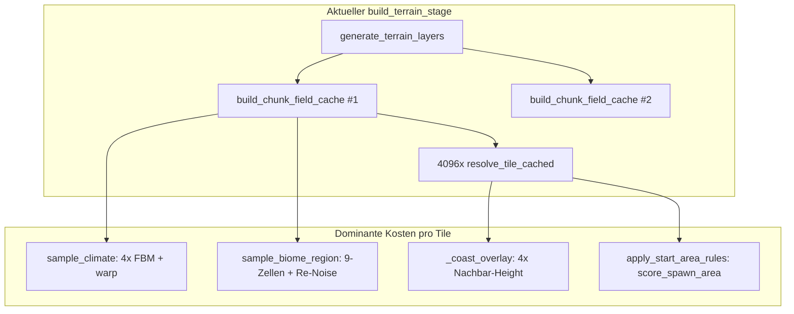
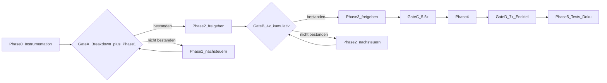

# M24c — Terrain-Generierung beschleunigen

## Problembeleg (M24b-Benchmarks)

Quelle: [`docs/benchmarks/nodeco_single_chunk_64.json`](docs/benchmarks/nodeco_single_chunk_64.json), [`docs/benchmarks/deco_single_chunk_64.json`](docs/benchmarks/deco_single_chunk_64.json), Instrumentierung via [`tools/benchmark_single_chunk.py`](tools/benchmark_single_chunk.py).

| Schritt | Terrain-only | Terrain+Deco |
|---------|-------------|--------------|
| `build_terrain_stage` (sync) | **25.6 s** | **19.8 s** |
| `worker_build_terrain_stage` | **22.4 s** | **22.0 s** |
| `apply_terrain_stage` | **0.78 ms** | **0.87 ms** |
| `build_deco_stage` | — | 4.3 s |
| `worker_build_deco_stage` | — | 19.0 s |

**Schluss:** ~6.2 ms/Tile im Terrain-Build. Main-Apply ist erledigt (M24b). M24c zielt ausschließlich auf den Worker-/Sync-Worldgen-Hotpath.



---

## Harte Zieldefinition

### Nordstern (M24c gesamt)

| Metrik | Ist (M24b) | M24c-Endziel | Pflichtmessung |
|--------|-----------|--------------|----------------|
| `worker_build_terrain_stage` | ~22 s | **≤ 3 s** (≥7×) | [`tools/benchmark_single_chunk.py`](tools/benchmark_single_chunk.py) |
| `build_terrain_stage` sync | ~20–26 s | **≤ 4 s** | gleiche Quelle |
| ms/Tile Terrain | ~6.2 | **≤ 0.75** | abgeleitet |
| `apply_terrain_stage` | <1 ms | **unverändert <5 ms** | Regression-Guard |
| Golden-Chunk-Determinismus | grün | **bitgenau grün** | [`tests/support/chunk_reference.py`](tests/support/chunk_reference.py) |

Das Endziel ≤3 s ist bewusst aggressiv (Basis ~22 s). Es bleibt als Nordstern — **Stop/Go erfolgt über die Phasen-Gates unten**, nicht über ein Alles-oder-nichts-Endurteil.

### Phasen-Zwischenziele (kumulativ, verbindlich)

Basis: `worker_build_terrain_stage` ≈ **22.0 s** (M24b, coord=(1,1)).

| Phase | Kumulatives Ziel | `worker_build_terrain_stage` max | Speedup vs. M24b | Gate |
|-------|------------------|----------------------------------|------------------|------|
| **0** | Breakdown liegt vor | — (kein Speedup erwartet) | — | Top-3-Kosten ≥10 % dokumentiert |
| **1** | Quick Wins | **≤ 8.8 s** | **≥ 2.5×** | Gate A → siehe Freigabekette |
| **2** | Noise-Bündelung | **≤ 5.5 s** | **≥ 4×** | Gate B |
| **3** | Compiled Runtime | **≤ 4.0 s** | **≥ 5.5×** | Gate C |
| **4** | Datenlayout/Scratch | **≤ 3.0 s** | **≥ 7×** | Gate D (Endziel) |
| **5** | Tests + Doku | Endziel gehalten | ≥7× stabil | Abschluss |

**Regel:** Eine Phase gilt nur als abgeschlossen, wenn ihr kumulatives Zwischenziel **und** Golden-Determinismus erfüllt sind. Wird ein Zwischenziel verfehlt, **keine nächste Phase freigeben** — stattdessen innerhalb der aktuellen Phase nachsteuern oder Hypothesen-Priorität anpassen.

---

## In Scope / Out of Scope

**In Scope:**
- Cost Breakdown und Instrumentation innerhalb `build_terrain_stage` / `generate_chunk_terrain_with_context`
- Noise-Hotpath ([`game_core/noise.py`](game_core/noise.py))
- `field_cache`-Aufbau ([`game_core/world_gen.py`](game_core/world_gen.py) `build_chunk_field_cache`)
- Tile-/Biome-Resolution (`resolve_tile_cached`, `_resolve_tile_from_fields`)
- Compiled Runtime für Terrain/Biome-Regeln (Analogon zu M24b `CompiledDecoPass`)
- Datenlayout: weniger Python-Objekte pro Tile im Hotpath
- Benchmark-Erweiterung + Regressionstests
- Ein-Pass-Terrain-Build: Cache einmal, Layers daraus (M24b-kompatibel)

**Out of Scope:**
- M24b-Pipeline-Umbau (BuildKey, Router, Guards, LRU-Ownership)
- Deco-Optimierung (außer Kosten, die Terrain-Redundanz direkt betreffen, z.B. doppelter `field_cache`)
- Persistenz v5, Renderer, `decorations_by_chunk`-Index
- Zweiter ProcessPool (M24b Phase 4b)
- GPU-Noise, Rivers, Ores
- Rust/Cython/NumPy als Default — nur als **Phase 5 Escape Hatch**, wenn Python-Ceiling mit Messdaten belegt ist

---

## Cost Breakdown — Hypothesen mit Code-Belegen

**Status: Hypothesen, keine feste Wahrheit.** Phase 0 misst und darf diese Liste **falsifizieren und umsortieren**.

### Falsifizierungsregel (verbindlich)

1. Phase 0 liefert messbare Anteile für H1–H7 (Prozent von `build_terrain_stage`).
2. **Implementierungsreihenfolge folgt den gemessenen Anteilen**, nicht der Nummerierung H1–H7.
3. Wenn H1 (Doppel-Cache) oder H2 (Perm-Rebuild) in Phase 0 **< 5 %** messen → aus Phase-1-Pflichtliste streichen, Priorität an tatsächlichen Top-Killer vergeben.
4. Wenn eine Hypothese widerlegt wird, wird sie im Plan als „nicht bestätigt" markiert und Phase 1/2-Inhalte entsprechend angepasst — **ohne** den Nordstern oder M24b-Verträge zu ändern.
5. Nach Phase 0 + 1: **neuer Benchmark-Lauf** (Gate A). Erst bei bestandenem Gate A wird Phase 2 freigegeben.

Die unten genannte Reihenfolge ist die **Arbeitshypothese vor Messung** — plausibel aus Code-Review, aber nicht vorweggenommen.

### H1 — Doppelter `field_cache`-Build (Hypothese: sehr hoch)

[`build_terrain_stage`](game_core/chunk_stage.py) ruft `generate_terrain_layers` **und** danach erneut `build_chunk_field_cache`:

```python
# chunk_stage.py — heute
layer0, layer1 = ctx.generate_terrain_layers(cx, cy)  # baut intern bereits cache
cache = build_chunk_field_cache(cx, cy, ...)            # zweites Mal 4096 Tiles
```

[`generate_chunk_terrain_with_context`](game_core/world_gen.py) baut den Cache bereits in Zeile 884.

**Erwartung:** nahezu 2× Redundanz im Cache-Anteil (~40–50 % Gesamtzeit).

### H2 — `simplex2d` baut Permutation pro Sample neu (Hypothese: kritisch)

[`simplex2d`](game_core/noise.py) ruft `_build_perm(seed)` **bei jedem Sample** auf (256-Element-Shuffle). `sample_fbm` iteriert Oktaven → pro Klima-Tile Dutzende Perm-Rebuilds.

**Komplexität:** O(Tile × Oktaven × PermBuild) statt O(Tile × Oktaven).

### H3 — Noise-Redundanz in `sample_biome_region` (Hypothese: hoch)

Pro Tile in `build_chunk_field_cache`:
- `sample_climate`: 4× FBM + `domain_warp_xy`
- `sample_biome_region`: erneut `domain_warp_xy`, 3×3-Zellensuche, `_climate_at_point` → **nochmal volles `sample_climate`** am Seed-Punkt, zweites Klima am Second-Cell, 2× `sample_sub_biome`

**Komplexität:** O(Tile × 9 × Noise) mit Mehrfach-Sampling derselben Felder.

### H4 — `score_spawn_area` pro Start-Tile (Hypothese: hoch, lokalisiert)

[`apply_start_area_rules`](game_core/world_gen.py) ruft `score_spawn_area(cfg)` **pro Tile** auf — das scannt ein `(2r+1)²`-Gitter (default r=24 → 2401 Height-Samples).

**Komplexität:** O(Tiles_in_start_radius × r² × FBM) — katastrophal für Chunks nahe Start.

### H5 — Coast-Nachbar-Height in Resolution (Hypothese: mittel)

[`_coast_overlay`](game_core/world_gen.py): bis zu 4× `sample_height` (volles FBM) pro Land-Tile in `resolve_tile_cached`-Schleife.

**Komplexität:** O(Tile_land × 4 × FBM_octaves).

### H6 — Python-Overhead im inneren Loop (Hypothese: mittel)

- 4096× `ClimateSample` + `BiomeRegionSample` (frozen dataclasses)
- String-Tile-Keys in Layers bis `stable_tile_id` bei Apply
- `tile_mapping_for_biome`: linearer Scan über `climate_classes` pro Aufruf

### H7 — `field_cache`-Inhalt vs. Bedarf (Hypothese: strukturell)

`ChunkFieldCache` speichert pro Tile:
- `ClimateSample` (7 floats + Metadaten)
- `BiomeRegionSample` (BiomeId-Enums, 4 floats, ClimateClass)

Deco nutzt `region` + `climate.height`/Walkability — Terrain-Resolution nutzt dieselben Felder. **Frage M24c:** Kann ein kompakteres SoA-Layout (float-Arrays + int-Biome-IDs) dieselbe Semantik mit weniger Allocations liefern?

---

## Freigabekette (kein Sammel-PR)

M24c wird **phasenweise** umgesetzt und gemessen — nicht als ein großer PR.



| Gate | Voraussetzung | Aktion bei Fail |
|------|---------------|-----------------|
| **A** | Phase 0 DoD + Phase 1 DoD + **≥2.5×** + Golden grün | Phase 1 nachschärfen, **Phase 2 nicht starten** |
| **B** | Gate A + Phase 2 DoD + **≥4×** kumulativ | Phase 2 nachschärfen |
| **C** | Gate B + Phase 3 DoD + **≥5.5×** kumulativ | Phase 3 nachschärfen |
| **D** | Gate C + Phase 4 DoD + **≤3 s** Endziel | Phase 4 nachschärfen oder Escape Hatch prüfen |

**Verbindliche Umsetzungsreihenfolge:**
1. **Nur Phase 0 implementieren** → Baseline-Breakdown einchecken
2. **Nur Phase 1 implementieren** → neu benchmarken → Gate A prüfen
3. **Erst nach Gate A:** Phase 2 freigeben und umsetzen
4. Wiederholen für Gate B → Phase 3, Gate C → Phase 4, Gate D → Phase 5

Jede Phase = **eigener reviewbarer PR** mit Benchmark-Diff im PR-Body.

---

| Vertrag | M24c-Regel |
|---------|-----------|
| `TerrainResult` IPC | unverändert — nur `layer0/layer1` int-IDs |
| `ChunkFieldCache` | bleibt worker-lokal, nie IPC; Inhalt darf intern kompakter werden |
| `build_terrain_stage` Signatur | stabil; interne Implementierung darf ein-Pass werden |
| `BuildKey` / Router / Guards | **nicht anfassen** |
| Determinismus | `sequential_reference_chunk` + `REFERENCE_TEST_COORDS` müssen bytegleich bleiben |

---

## Phasenplan

### Phase 0 — Instrumentation / Cost Breakdown (Pflicht, zuerst)

**Ziel:** Sub-Timings belegen, nicht raten.

**Artefakte:**
- Neues Modul [`game_core/terrain_gen_profile.py`](game_core/terrain_gen_profile.py) — `TerrainGenProfile`, kontextmanager `profile_section(name)`, opt-in per Env/Flag
- Erweiterung [`tools/benchmark_single_chunk.py`](tools/benchmark_single_chunk.py):
  - Sub-Steps: `field_cache_climate`, `field_cache_region`, `resolve_tiles`, `start_area_rules`, `coast_overlay`, `noise_simplex`, `noise_fbm`
  - Ausgabe in JSON unter `steps[]` + `cost_breakdown{}` mit Prozentanteilen
- [`docs/benchmarks/terrain_cost_breakdown_baseline.json`](docs/benchmarks/terrain_cost_breakdown_baseline.json) — eingecheckte Baseline coord=(1,1)

**DoD Phase 0:** Cost-Breakdown-Report existiert; Top-3-Kostenblöcke mit ≥10 % Anteil dokumentiert; H1–H7 mit gemessenem Anteil (%) markiert; **keine Verhaltensänderung**; priorisierte Phase-1-Arbeitsliste aus Messdaten abgeleitet (nicht aus Hypothesen-Nummerierung).

**Gate A Voraussetzung (teilweise):** Phase-0-Artefakte liegen vor — Phase 1 darf starten; Phase 2 darf **noch nicht** starten.

---

### Phase 1 — Nachgewiesene Redundanz eliminieren (größter Soforthebel)

**Inhalt richtet sich nach Phase-0-Breakdown** — die drei Punkte unten sind Default-Arbeitspakete, wenn H1/H2/H4 bestätigt sind:

**1a — Ein-Pass-Terrain-Build** (wenn H1 bestätigt)

Neue kanonische Funktion in [`game_core/world_gen.py`](game_core/world_gen.py):

```python
def build_terrain_layers_and_field_cache(cx, cy, ctx) -> tuple[tuple[str,...], tuple[str,...], ChunkFieldCache]:
    # Einmal 4096: Klima+Region sammeln
    # Einmal 4096: resolve_tile_cached
    # Cache zurückgeben — kein zweiter Durchlauf
```

[`build_terrain_stage`](game_core/chunk_stage.py) nutzt nur diese Funktion (ersetzt `generate_terrain_layers` + separates `build_chunk_field_cache`).

**1b — Perm-Table-Cache in Noise** (wenn H2 bestätigt)

- `FbmPrecalc` erhält `perm: tuple[int, ...]` (einmal bei `precalc_fbm`)
- `simplex2d` nutzt vorgebaute Perm oder separaten `PermCache` keyed by seed
- **Kein** `_build_perm` im Hotpath

**1c — `score_spawn_area` hoisten** (wenn H4 bestätigt)

- Einmal pro Chunk (oder pro `WorldGenContext`-Session) berechnen, in `CompiledTerrainRuntime` oder Config-Snapshot cachen
- `apply_start_area_rules` liest nur gecachten Wert

**Zwischenziel Phase 1:** `worker_build_terrain_stage` ≤ **8.8 s** (≥**2.5×** vs. M24b).

**DoD Phase 1:** Zwischenziel erreicht; Golden grün; bestätigte Hypothesen adressiert; neuer Benchmark eingecheckt.

**Gate A:** Phase 0 + Phase 1 DoD → **Phase 2 freigeben**. Bei Fail: nachsteuern, Phase 2 gesperrt.

**Tests:** bestehende Golden-Tests + neuer `test_build_terrain_stage_single_field_cache_pass`.

---

### Phase 2 — Noise- und Region-Pass zusammenführen

**Freigabe:** nur nach **Gate A**.

**Ziel:** O(Tile) Noise statt O(Tile × Redundanz). Schwerpunkte nach Phase-0/1-Breakdown — typischerweise H3/H5.

- `sample_climate_and_region(wx, wy)` — ein Warp, gebündelte FBM-Reads
- Seed-Punkt-Klima aus bereits gesampeltem Klima-Grid / Zell-Cache statt `_climate_at_point` → `sample_climate`
- Sub-Biome nur einmal pro Tile
- Coast-Overlay: Nachbar-`water_class` aus Chunk-Height-Grid (einmalig materialisiert), nicht live-FBM

**Module:** [`game_core/world_gen.py`](game_core/world_gen.py), ggf. [`game_core/terrain_fields.py`](game_core/terrain_fields.py) (neu, schlank)

**Zwischenziel Phase 2 (kumulativ):** `worker_build_terrain_stage` ≤ **5.5 s** (≥**4×** vs. M24b).

**DoD Phase 2:** Zwischenziel erreicht; Cost-Breakdown zeigt Noise-Anteil −50 % vs. Phase-0-Baseline; Golden grün.

**Gate B:** Phase 2 DoD → Phase 3 freigeben.

---

### Phase 3 — Compiled Terrain Runtime (Config → kompiliert)

**Freigabe:** nur nach **Gate B**.

Analog M24b [`CompiledDecoPass`](game_core/deco_generation.py):

- Neues [`game_core/terrain_generation.py`](game_core/terrain_generation.py):
  - `CompiledBiomeTable` — BiomeId → layer0/layer1 int-IDs, walkable, water_class
  - `CompiledClimateThresholds` — hot/cold/humid/dry als floats, keine Dict-Lookups pro Tile
  - `terrain_config_version()` für BuildKey-Kompatibilität (bereits in `BuildKey.terrain_config_version`)
- JSON/Biomes nur beim Laden; Hotpath: Array-Index + int-Vergleiche
- `tile_mapping_for_biome`-Scan eliminieren → O(1)-Lookup

**Zwischenziel Phase 3 (kumulativ):** `worker_build_terrain_stage` ≤ **4.0 s** (≥**5.5×** vs. M24b).

**DoD Phase 3:** Zwischenziel erreicht; kein `BiomesConfig`-Dict-Zugriff in `resolve_tile_cached`-Innerloop; `terrain_config_version` deterministisch; Golden grün.

**Gate C:** Phase 3 DoD → Phase 4 freigeben.

---

### Phase 4 — Datenlayout & Scratch-Buffers

**Freigabe:** nur nach **Gate C**.

- `ChunkFieldCache` → `TerrainFieldBuffer` (SoA):
  - `heights: array('f')`, `temperatures`, `moistures`, …
  - `nearest_biome: array('B')`, `blend_t: array('f')`
  - Optional: Layers als `array('I')` tile_ids direkt im Build
- Worker-lokaler `TerrainBuildScratch` in `WorldGenContext` — wiederverwendet pro Chunk (keine 4096-Listen-Allokation)
- `to_terrain_result` / IPC unverändert (Konvertierung am Rand)

**Zwischenziel Phase 4 (kumulativ, Endziel):** `worker_build_terrain_stage` ≤ **3.0 s** (≥**7×** vs. M24b).

**DoD Phase 4:** Endziel erreicht; ≤1 heap-allocation pro 4096-Tile-Pass im Hotpath (Scratch reuse); Golden grün.

**Gate D:** Phase 4 DoD → Phase 5 freigeben.

---

### Phase 5 — Benchmark Hardening + Regression

**Freigabe:** nur nach **Gate D**.

**Tests (neu [`tests/test_m24c_terrain_perf.py`](tests/test_m24c_terrain_perf.py)):**
- Determinismus: `build_terrain_stage` Output == `sequential_reference_chunk` Layer-IDs
- Kein Doppel-Cache: Monkeypatch-Counter auf `build_chunk_field_cache` → exakt 1 Aufruf
- `score_spawn_area` max 1× pro Chunk im Start-Radius
- Optional CI-Gate: `worker_build_terrain_stage < 5000 ms` (weicher Schwellenwert, skip ohne `PERF=1`)

**Benchmarks:**
- Aktualisierte [`docs/benchmarks/nodeco_single_chunk_64.json`](docs/benchmarks/nodeco_single_chunk_64.json) mit `pipeline_version: M24c`
- Neues [`docs/benchmarks/terrain_cost_breakdown_m24c.json`](docs/benchmarks/terrain_cost_breakdown_m24c.json)
- Kurz-Doku in [`docs/benchmarks/terrain_m24c.md`](docs/benchmarks/terrain_m24c.md)

**Doku:** [`ruleset.md`](ruleset.md) + [`docs/ARCHITECTURE.md`](docs/ARCHITECTURE.md) — M24c-Abschnitt.

---

## Betroffene Kernmodule

| Modul | Rolle |
|-------|-------|
| [`game_core/noise.py`](game_core/noise.py) | Perm-Cache, FBM-Hotpath |
| [`game_core/world_gen.py`](game_core/world_gen.py) | field_cache, resolve, start_area |
| [`game_core/chunk_stage.py`](game_core/chunk_stage.py) | `build_terrain_stage` Ein-Pass |
| [`game_core/world_gen_context.py`](game_core/world_gen_context.py) | Scratch, compiled runtime handle |
| [`game_core/terrain_generation.py`](game_core/terrain_generation.py) | **neu** — CompiledTerrainRuntime |
| [`game_core/terrain_gen_profile.py`](game_core/terrain_gen_profile.py) | **neu** — Profiling |
| [`tools/benchmark_single_chunk.py`](tools/benchmark_single_chunk.py) | Sub-Step-Timings |
| [`game_core/biomes.py`](game_core/biomes.py) | Compile-Zeit Biome-Tabellen |

**Nicht anfassen:** `chunk_build.py`, `chunk_build_guards.py`, `chunk_streaming.py` Router, `field_cache_lru.py` Vertrag.

---

## Pflicht-Metriken

Jeder PR / Phase endet mit:

1. `python tools/benchmark_single_chunk.py` → JSON diff vs. Baseline
2. `pytest tests/test_chunk_reference.py tests/test_m24b_pipeline.py` → grün
3. Cost-Breakdown: Top-3-Anteile in Prozent
4. ms/Tile = `worker_build_terrain_stage / 4096`

Streaming-Metriken (M23) optional sekundär — M24c ist Chunk-Mikrobenchmark-first.

---

## Risiken

| Risiko | Mitigation |
|--------|-----------|
| Determinismus bricht durch Float-Reorder | Golden-Tests auf allen `REFERENCE_TEST_COORDS`; keine „fast math" |
| Start-Area-Semantik ändert sich | Expliziter Test für coord nahe `(256,256)` |
| Coast-Overlay mit gecachtem Grid weicht ab | Pixel-Vergleich Land-Küste in Golden |
| Zu frühe NumPy-Abhängigkeit | Erst Phase 5 Escape, nur mit Phase-0-Beleg dass Python-Ceiling erreicht |
| M24b Worker-LRU invalid | `field_cache`-Objekttyp darf intern wechseln, LRU keyed by BuildKey bleibt |

---

## Definition of Done (M24c)

**Performance:**
- `worker_build_terrain_stage` ≤ **3 s** (coord=(1,1), Default-Config, 19 Worker)
- `build_terrain_stage` sync ≤ **4 s**
- ≥ **7×** vs. M24b-Baseline dokumentiert

**Architektur:**
- M24b IPC-Verträge unverändert
- Ein-Pass-Terrain-Build, kein doppelter `field_cache`
- Compiled Terrain Runtime im Hotpath
- Cost Breakdown eingecheckt und reproduzierbar

**Tests:**
- Golden-Chunk-Determinismus grün
- M24b-Pipeline-Tests grün
- ≥4 M24c-spezifische Regressionstests (Doppel-Cache, spawn_score hoist, Perm-Cache, ms/Tile-Gate)

**Doku:**
- `ruleset.md` + `ARCHITECTURE.md` M24c-Abschnitt
- `docs/benchmarks/terrain_m24c.md` mit Vorher/Nachher-Tabelle

---

## Erfolgskriterium

> **`build_terrain_stage` ist nicht kosmetisch schneller, sondern um Größenordnungen schneller — bei erhaltenem M24b-Vertrag, bitgenauem Chunk-Output und datengetriebener Begründung jeder Optimierung.**

Umsetzungspfad (datengetrieben, nicht starr):
1. Phase 0 misst → H1–H7 priorisieren oder falsifizieren
2. Phase 1 adressiert bestätigte Top-Killer → Gate A (≥2.5×)
3. Neu benchmarken → Phase 2 nur nach Gate A
4. Phasen 2–4 jeweils mit kumulativem Zwischenziel und Gate
5. Phase 5 sichert Regressionen und dokumentiert Vorher/Nachher

Nordstern ≤3 s bleibt das Endziel — erreicht über Gate D, nicht als Einmal-Sprung.
