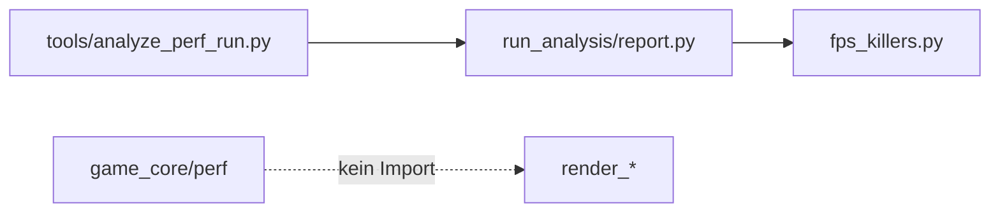

# M25a — FPS Killer Attribution v2 (CPU-Fokus)

## Ausgangslage

### Ist-Stand (Code + Artefakte)

| Bereich | Ist | Plan-Vertrag (M25 Phase 4/5) |
|---------|-----|------------------------------|
| `dominant_phase` | Grob: `stream`, `extract`, `render_cpu`, `present_wait` | `stream_apply`, `stream_pool`, `extract_tiles`, `extract_deco`, `render_cpu`, `present_wait`, `gpu`, `mixed`, `unclear` |
| Decision | `cpu_dominant` / `present_wait_dominant` / `mixed` — ohne `reason_*`, ohne Mean-Metriken | CPU/GPU/Present mit Begründungstext + Kennzahlen |
| Szenario-Kontext | Fehlt in [`fps_killers.json`](docs/benchmarks/perf/runs/20260714T072220Z_demo_31a8d2f/analysis/fps_killers.json) | `scenario_id`, `run_id`, optional `scenario_label`, Toggles |
| A/B | Nicht vorhanden | Baseline/Variant/Delta + `causal_feature` |
| Quantile | Demo-Run: p95/p99 → **gleicher** `frame_index: 35`; Steady-Run: korrekt unterschiedlich (28 vs 61) | Robuste, dokumentierte Quantil-Frame-Auswahl |
| Erzeugung | [`write_all_reports`](game_core/perf/run_analysis/report.py) → `fps_killers_payload(frames)` only | Gleicher Pfad bleibt Single Source; A/B via separates Compare-Tool |

### Vorhandene Daten (nutzbar für M25a)

- **Steady + Full-Frame:** [`20260713T194433Z_steady_unknown`](docs/benchmarks/perf/runs/20260713T194433Z_steady_unknown/) — `cpu_full_frame_ms`, `apply_pool_ms`, `stream_apply_ms`, `deco_extract_ms`, `tile_extract_ms` vorhanden
- **Demo + Full-Frame:** [`20260714T072220Z_demo_31a8d2f`](docs/benchmarks/perf/runs/20260714T072220Z_demo_31a8d2f/) — zeigt Quantil-Kollisions-Bug
- **A/B Baseline fehlt noch:** Kein `steady`-Run mit `extract_enabled=false` im Runs-Ordner; Runner unterstützt `--no-extract` ([`tools/run_perf_scenario.py`](tools/run_perf_scenario.py))

### Architektur-Grenzen (unverändert)



- Keine `game_core → render_*` Imports
- GPU-Felder (`gpu_frame_ms`) im Schema reserviert, M25a-Logik **ignoriert** sie

---

## Zieldefinition M25a

Nach M25a liefert `analyze_perf_run` für mindestens **steady** ein plan-konformes `fps_killers.json` + `fps_killers.md` mit:

1. `dominant_phase` ∈ Plan-Enum (P95, P99, Hitch-Cluster)
2. `decision.decision` ∈ `{cpu_dominant, present_wait_dominant, mixed, unclear}` + `reason_cpu_vs_present`
3. `scenario_id`, `run_id`, Toggle-Snapshot aus Manifest
4. Optionale `ab_comparisons[]`-Sektion (minimal: steady extract on/off)

---

## In Scope / Out of Scope

### In Scope

- Refactor [`game_core/perf/run_analysis/fps_killers.py`](game_core/perf/run_analysis/fps_killers.py)
- Report-Export in [`game_core/perf/run_analysis/report.py`](game_core/perf/run_analysis/report.py)
- Schema/Doku: [`docs/benchmarks/perf/SCHEMA.md`](docs/benchmarks/perf/SCHEMA.md), [`docs/benchmarks/perf/ANALYSIS.md`](docs/benchmarks/perf/ANALYSIS.md)
- Neues Milestone-Dokument: [`docs/milestones/m25a_fps_killer_attribution_v2.plan.md`](docs/milestones/m25a_fps_killer_attribution_v2.plan.md)
- Tests: `tests/test_m25a_fps_killers.py`
- Compare-Tool: `tools/compare_fps_killers.py` (oder Erweiterung von `compare_perf_runs.py` — siehe Phase 4)
- Manifest-Erweiterung (additiv): Toggle-Felder in Export ([`game_core/perf/session.py`](game_core/perf/session.py) + [`export_schema.py`](game_core/perf/export_schema.py))

### Out of Scope (M25b+)

- GPU-dominante Entscheidung (`gpu_dominant` befüllen)
- Vollständige Szenario-Matrix (pan, zoom_stress, ingress, …)
- CI-Gates auf `dominant_phase`
- Hitch-Cluster-ML / Periodizitäts-Detektion über Regelwerk hinaus

---

## Phase 0 — Baseline & Enum-Vertrag

**Artefakte:**

- [`docs/milestones/m25a_fps_killer_attribution_v2.plan.md`](docs/milestones/m25a_fps_killer_attribution_v2.plan.md) (dieser Plan, YAML-Frontmatter wie M24c.2)
- [`docs/benchmarks/perf/M25A_BASELINE.md`](docs/benchmarks/perf/M25A_BASELINE.md) — Referenz-Run(s), erwartete `dominant_phase`-Werte für steady

**Gate S0:** Dokumentierte Ist-/Soll-Tabelle für steady-Run `20260713T194433Z_steady_unknown`

---

## Phase 1 — Dominant-Phase-Klassifikation (Plan-Enum)

**Datei:** [`game_core/perf/run_analysis/fps_killers.py`](game_core/perf/run_analysis/fps_killers.py)

### Neues Enum + Hilfsfunktionen

```python
# game_core/perf/run_analysis/phase_enum.py (neu, klein)
DominantPhase = Literal[
    "stream_apply", "stream_pool", "extract_tiles", "extract_deco",
    "render_cpu", "present_wait", "gpu", "mixed", "unclear"
]
```

### Share-Buckets (disjunkt, Basis = `cpu_full_frame_ms`)

| Phase | ms-Quelle | Hinweis |
|-------|-----------|---------|
| `stream_pool` | `apply_pool_ms` (aus `FrameRecord.extra` oder dediziertes Feld) | Bereits in frames.jsonl |
| `stream_apply` | `max(0, stream_apply_ms - apply_pool_ms)` | Apply ohne Pool-Anteil |
| `extract_tiles` | `tile_extract_ms` | |
| `extract_deco` | `deco_extract_ms` | |
| `render_cpu` | `render_cpu_ms` | |
| `present_wait` | `present_wait_cpu_ms` | |
| `gpu` | `gpu_frame_ms` | M25a: immer 0/None → nicht dominant |

**Klassifikationsregeln** (in ANALYSIS.md dokumentieren):

- **Dominant:** Phase mit höchstem Share ≥ **35 %** von `cpu_full_frame_ms`
- **Mixed:** Top-2-Phasen ≥ **25 %** und Differenz ≤ **10 Prozentpunkte**
- **Unclear:** `cpu_full_frame_ms` fehlt/≤0, oder kein Bucket ≥ **20 %**

**Erweiterung `FrameRecord`:** Property `apply_pool_ms` aus `extra.get("apply_pool_ms", 0.0)` — bereits in JSONL, Parsing in [`load.py`](game_core/perf/run_analysis/load.py) prüfen/ergänzen falls nur in `extra`.

**Hitch-Cluster:** Aggregiere über `RunDiagnosis.hitch_analyses` — pro Cluster (z. B. nach `cause.cause_id` oder periodischem Muster) Median-Shares → `dominant_phase` + `dominant_share`. Mindestens: Top-Hitch-Frame pro Ursache-Klasse.

**Gate S1:** Unit-Tests mit synthetischen Frames — jeder Enum-Wert einmal dominant erreichbar; `mixed`/`unclear`-Grenzfälle abgedeckt

---

## Phase 2 — CPU-vs-Present Decision v2

**Datei:** [`game_core/perf/run_analysis/fps_killers.py`](game_core/perf/run_analysis/fps_killers.py)

Ersetze/erweitere `decision_cpu_vs_present_vs_gpu()`:

| Decision | Bedingung (Mean über Frames mit `cpu_full_frame_ms`) |
|----------|------------------------------------------------------|
| `present_wait_dominant` | `present_wait_share_mean ≥ 0.35` **und** ≥ max(stream_apply, stream_pool, extract_*, render_cpu) |
| `cpu_dominant` | max CPU-Phase-Share ≥ 0.35 **und** `present_wait_share_mean < 0.35` |
| `mixed` | weder noch eindeutig (Top-2 nahe) |
| `unclear` | keine Full-Frame-Daten |

**Export-Felder (neu in `decision`-Objekt):**

```json
{
  "decision": "cpu_dominant",
  "reason_cpu_vs_present": "present_wait_mean_share=0.2% < 35%; stream_pool_mean=41%",
  "cpu_full_frame_ms_mean": 34.1,
  "present_wait_cpu_ms_mean": 0.0,
  "render_cpu_ms_mean": 0.1,
  "present_wait_share_mean": 0.002,
  "gpu_dominant": false
}
```

M25a: `gpu_dominant` immer `false`; kein Branch auf GPU-Timestamps.

**Gate S2:** Steady-Run → `cpu_dominant` + `dominant_phase` ≈ `stream_pool` (apply_pool dominiert in Ist-Daten)

---

## Phase 3 — Szenario-Kontext im Export

**Dateien:** [`fps_killers.py`](game_core/perf/run_analysis/fps_killers.py), [`report.py`](game_core/perf/run_analysis/report.py)

Neue Top-Level-Struktur `fps_killers.json` v2:

```json
{
  "schema_version": 1,
  "attribution_version": 2,
  "scenario_id": "steady",
  "run_id": "20260713T194433Z_steady_unknown",
  "scenario_label": "steady",
  "run_mode": "cli",
  "toggles": {
    "extract_enabled": true,
    "stream_enabled": true,
    "deco_extract_enabled": true,
    "tile_extract_enabled": true
  },
  "has_full_frame": true,
  "decision": { ... },
  "quantiles": {
    "p95": { "frame_index": 28, "cpu_full_frame_ms": 61.2, "dominant_phase": "stream_pool", ... },
    "p99": { "frame_index": 61, ... }
  },
  "hitch_clusters": [ ... ],
  "ab_comparisons": []
}
```

- `fps_killers_payload(frames, manifest, diagnosis)` — Manifest aus `RunDiagnosis`/`LoadedRun` durchreichen ([`write_all_reports`](game_core/perf/run_analysis/report.py) anpassen)
- **Manifest-Erweiterung:** Toggle-Felder optional in `manifest.json` exportieren (Session-Flush); rückwärtskompatibel

**Gate S3:** Regenerierter steady-Report enthält `scenario_id` + `run_id`; Demo-Report zeigt `scenario_id: demo`

---

## Phase 4 — Quantil-Auswahl robust machen

**Problem:** [`build_phase_dominance`](game_core/perf/run_analysis/fps_killers.py) wählt `first frame >= p95/p99 threshold` → bei flachen Verteilungen identischer Frame.

**Fix:**

1. Berechne Schwellwert via bestehendem [`percentile()`](game_core/perf/run_analysis/stats.py)
2. Wähle Frame mit **minimaler absoluter Differenz** `|cpu_full_frame_ms - threshold|`
3. p99: schließe p95-`frame_index` aus (falls alternativer Frame existiert); sonst `same_frame_for_both_quantiles: true` im JSON

**Dokumentation in ANALYSIS.md:** Quantil-Index-Formel (`round((n-1)*p)`), Frame-Auswahl „closest to threshold“, Tie-Breaker `frame_index` aufsteigend.

**Gate S4:** Demo-Run p95 ≠ p99 Frame **oder** explizites Flag; Steady-Run behält unterschiedliche Frames

---

## Phase 5 — A/B-Struktur + minimaler steady-Vergleich

**Neue Datei:** [`tools/compare_fps_killers.py`](tools/compare_fps_killers.py)

```bash
python tools/compare_fps_killers.py \
  docs/benchmarks/perf/runs/<steady_baseline> \
  docs/benchmarks/perf/runs/<steady_no_extract>
```

- Lädt beide Runs, ruft `fps_killers_payload` je Run, baut `ab_comparisons[]`-Eintrag
- Schreibt aggregiertes JSON (optional): `analysis/fps_killers_ab.json`
- Delta-Felder: `frame_ms_p95`, `cpu_full_frame_ms_p95`, `dominant_share_delta`, `decision_changed`

**Minimal-A/B für M25a:**

| Arm | Kommando | Erwartung |
|-----|----------|-----------|
| Baseline | vorhanden: `20260713T194433Z_steady_unknown` | extract on |
| Variant | `python tools/run_perf_scenario.py steady --no-extract` (neu erzeugen) | extract off |

Falls Variant-Run fehlt: `ab_comparisons: []` + `ab_comparisons_note: "variant_run_missing"` — kein Placeholder-JSON mit Fake-Daten.

**Erweiterbar für M25b:** `compare_fps_killers.py --matrix profiling.json` → Liste von Szenario-Einträgen

**Gate S5:** A/B-JSON validiert gegen Schema; bei vorhandenem Variant-Run: `causal_feature: "extract_enabled"`, Δp95 dokumentiert

---

## Phase 6 — Report, Schema, Tests, DoD

### Markdown [`fps_killers.md`](game_core/perf/run_analysis/report.py)

- Tabelle: scenario_id, run_id, decision, reason
- P95/P99: frame_index, cpu_full_frame_ms, dominant_phase, shares
- Hitch-Cluster-Übersicht (Top 3)
- A/B-Sektion (falls vorhanden)

### Schema [`SCHEMA.md`](docs/benchmarks/perf/SCHEMA.md)

- Neuer Abschnitt `fps_killers.json` v2 (additiv; v1-Felder deprecated but parseable)
- Enum-Liste `dominant_phase`
- A/B-Objekt-Schema

### Tests [`tests/test_m25a_fps_killers.py`](tests/test_m25a_fps_killers.py)

- Klassifikation pro Enum + mixed/unclear
- Decision present_wait vs cpu
- Quantil: unterschiedliche Frames + same_frame-Flag
- Payload enthält scenario_id/run_id
- Snapshot-Test gegen steady-Run fixtures (kleine JSON-Fixture, nicht 300 Frames)

### Definition of Done

- [ ] `dominant_phase` plan-konform in fps_killers.json (steady regeneriert)
- [ ] `decision` + `reason_cpu_vs_present` exportiert
- [ ] p95/p99 Quantil-Logik dokumentiert und getestet
- [ ] scenario_id + run_id in jedem fps_killers-Export
- [ ] A/B-Schema in SCHEMA.md + minimal 1 Vergleich (oder dokumentiert fehlende Variant)
- [ ] Keine game_core→render_* Abhängigkeit
- [ ] GPU-Felder optional, M25a-Decision unabhängig davon

---

## Risiken

| Risiko | Mitigation |
|--------|------------|
| `apply_pool_ms` nur in `extra`, nicht typisiert | load.py → explizites Feld oder Property |
| Kein steady `--no-extract`-Run | Phase 5 erzeugt einen; bis dahin leere `ab_comparisons` |
| Demo-Run hat niedrige present_wait → nie `present_wait_dominant` | Unit-Test mit synthetischen Frames; steady reicht für cpu_dominant DoD |
| Alte fps_killers.json brechen Tools | `attribution_version: 2`; v1-Reader tolerant |

---

## Datei-Übersicht

| Datei | Aktion |
|-------|--------|
| [`docs/milestones/m25a_fps_killer_attribution_v2.plan.md`](docs/milestones/m25a_fps_killer_attribution_v2.plan.md) | neu |
| [`game_core/perf/run_analysis/phase_enum.py`](game_core/perf/run_analysis/phase_enum.py) | neu |
| [`game_core/perf/run_analysis/fps_killers.py`](game_core/perf/run_analysis/fps_killers.py) | refactor |
| [`game_core/perf/run_analysis/report.py`](game_core/perf/run_analysis/report.py) | export v2 + md |
| [`game_core/perf/run_analysis/load.py`](game_core/perf/run_analysis/load.py) | apply_pool_ms |
| [`game_core/perf/session.py`](game_core/perf/session.py) | manifest toggles |
| [`tools/compare_fps_killers.py`](tools/compare_fps_killers.py) | neu |
| [`docs/benchmarks/perf/SCHEMA.md`](docs/benchmarks/perf/SCHEMA.md) | erweitern |
| [`docs/benchmarks/perf/ANALYSIS.md`](docs/benchmarks/perf/ANALYSIS.md) | Dominanz-Regeln |
| [`tests/test_m25a_fps_killers.py`](tests/test_m25a_fps_killers.py) | neu |
