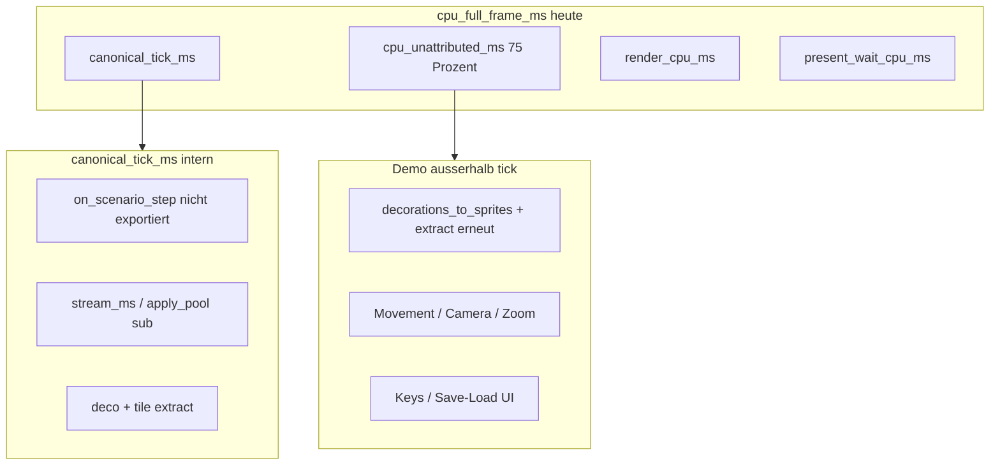

# M25c — CPU Full-Frame Attribution & Streaming-Hitch Isolation

## Problemstatement (bindend — Demo post-M25b)

Referenz-Run: [`20260714T084714Z_demo_a9aaa9e`](docs/benchmarks/perf/runs/20260714T084714Z_demo_a9aaa9e/) (`run_mode: demo`, `--profile`, 60 Warmup-Frames).

| Metrik | Mean | P95 | Max |
| --- | ---: | ---: | ---: |
| `cpu_full_frame_ms` | 46.009 ms | 51.147 ms | **75.598 ms** (Frame 22) |
| `cpu_unattributed_ms` | **34.625 ms** | **37.226 ms** | 60.183 ms |
| `canonical_tick_ms` (`frame_ms` in JSONL) | 10.999 ms | 13.914 ms | **42.334 ms** (Frame 20) |
| `deco_extract_ms` | 5.593 ms | 6.218 ms | 7.277 ms |
| `extract_ms` | 5.719 ms | 6.376 ms | 7.464 ms |
| `stream_ms` | 5.264 ms | 9.289 ms | 37.941 ms |
| `stream_apply_ms` | 0.567 ms | 4.524 ms | 33.484 ms |
| `apply_pool_ms` | 0.557 ms | 4.502 ms | — |
| `render_cpu_ms` | 0.295 ms | 0.324 ms | 0.725 ms |
| `present_wait_cpu_ms` | 0.089 ms | 0.102 ms | 0.315 ms |
| `apply_pool_idle_skip_rate` | **90.7 %** | — | — |

**Kernbefunde:**

- `cpu_unattributed_ms` ≈ `cpu_full_frame_ms − frame_ms − render_cpu_ms − present_wait_cpu_ms` ([`finalize_pending_frame()`](game_core/perf/session.py) Zeilen 264–274) — **~75 % der Full-Frame-Zeit ist eine Black-Box**.
- [`fps_killers.json`](docs/benchmarks/perf/runs/20260714T084714Z_demo_a9aaa9e/analysis/fps_killers.json): `decision: unclear`, P95/P99 `dominant_phase: unclear` — M25a-Phasen decken <25 % ab.
- `frame_ms` korreliert stark mit `stream_ms` (r≈0.959) und `stream_apply_ms` (r≈0.929); `deco_extract_ms` praktisch unkorreliert (r≈−0.008) → **Bursts sind Streaming-, nicht Deco-getrieben**.
- **Zwei Zeitgrenzen nicht vermischen:** Full-Frame-Worst (Frame 22, `cpu_full_frame_ms` 75.598 ms) und kanonischer-Tick-Worst (Frame 20, `canonical_tick_ms` 42.334 ms) sind **verschiedene Frames** — Streaming-Burst-Analyse bezieht sich primär auf die Tick-Grenze; Full-Frame-P95/P99 auf `cpu_full_frame_ms`.
- Streaming-Burst-Referenz (Tick-Grenze): Frame 20 — `canonical_tick_ms` 42.334 ms, `stream_ms` 37.941 ms, `stream_apply_ms` 33.484 ms; `stream_loaded` ohne echten Load-Burst (Nachlauf). Zugehöriges `cpu_full_frame_ms` am selben Frame separat in Burst-Tabelle ausweisen (nicht mit Tick-Max verwechseln).
- M25b Idle-Pool-Erfolg bestätigt: `apply_pool_ms` mean 0.557 ms, idle_skip 90.7 % — **M25c darf diesen Pfad nicht teurer machen**.



**Code-Landkarte (Ist, Demo-Loop [`apps/chunk_world_demo.py`](apps/chunk_world_demo.py)):**

| Abschnitt | Zeilen (ca.) | In `canonical_tick_ms`? | In `cpu_full_frame_ms`? |
| --- | --- | --- | --- |
| `input_state.poll()` | 249 | nein | nein |
| `begin_full_frame()` | 255 | — | Start |
| Input/UI/Regen/Save-Load | 265–379 | nein | ja |
| `run_canonical_tick()` | 386–393 | **ja** → exportiert als `frame_ms` | ja |
| Player/Camera/Zoom | 431–454 | nein | ja |
| `decorations_to_sprites()` | 469–471 | nein (Duplikat!) | ja |
| `extractor.extract()` | 474 | nein (Duplikat!) | ja |
| `renderer.draw()` + timings | 488–495 | nein | ja (`render_*`) |

**Bekannte interne Lücken im kanonischen Tick:**

- [`PerfSession._scenario_ms`](game_core/perf/session.py) wird gemessen, **nicht** nach `FrameMetrics` exportiert.
- [`StreamStepMetrics.sets_ms`](game_core/perf/models.py) existiert, **nicht** in `frames.jsonl`.
- Viele [`StreamStepMetrics`](game_core/perf/models.py)-Zähler (Submit/Apply/Inflight) werden nicht frame-exportiert.

---

## Zieldefinition M25c

### Primärziele

1. **≥90 % CPU-Full-Frame-Abdeckung** durch disjunkte, additive Sub-Metriken; verbleibendes `cpu_residual_ms` P95-Anteil **≤10 %** und absolut **≤5 ms** (post-Warmup, Demo-Run).
2. **Burst-Erklärbarkeit:** Jeder Frame mit `stream_apply_ms ≥ 4 ms` oder `apply_pool_ms ≥ 4 ms` erhält Subphasen, Kontextzähler und regelbasierte `burst_cause_id`.
3. **Dominanzentscheidung:** `fps_killers`/Diagnose nennen Top-CPU-Subblock @ P95 — nicht primär `unclear`.
4. **M25d-Routing:** Evidenzbasierter Vorschlag, welcher Subblock der nächste Optimierungs-Milestone ist.

### Explizite Nicht-Ziele

- Keine Optimierung von `deco_extract_ms`, Worldgen, Render-Architektur, VSync, GPU-Backend.
- Keine Änderung an Chunk-Semantik, Sichtweite, Combined-Pipeline, Sync-Fallback-Policy, Idle-Fast-Path-Logik ([`chunk_streaming.py`](game_core/chunk_streaming.py) M25b-Vertrag).
- Keine Lockerung von M24c.2-/M25b-Regressionstests.
- GPU-Timing höchstens als dokumentierte Messlücke (`gpu_frame_ms` unzuverlässig), kein M25c-Optimierungsziel.

---

## In Scope / Out of Scope

### In Scope

- [`game_core/perf/models.py`](game_core/perf/models.py), [`session.py`](game_core/perf/session.py) — App-Frame-Metriken + Bilanz
- [`apps/chunk_world_demo.py`](apps/chunk_world_demo.py) — Demo-Loop-Instrumentierung (Messgrenzen, kein Tuning)
- [`tools/run_perf_scenario.py`](tools/run_perf_scenario.py) — CLI-Parität (mindestens `cpu_scenario_ms`, Bilanz)
- [`game_core/chunk_streaming.py`](game_core/chunk_streaming.py) — Burst-Kontextzähler + `apply_pool_idle_refresh` Flag (nur Metriken)
- [`game_core/chunk_gen_pool.py`](game_core/chunk_gen_pool.py) — leichte READY/Inflight-Zähler für Export
- Analyse: [`diagnose.py`](game_core/perf/run_analysis/diagnose.py), [`report.py`](game_core/perf/run_analysis/report.py), [`fps_killers.py`](game_core/perf/run_analysis/fps_killers.py), [`phase_enum.py`](game_core/perf/run_analysis/phase_enum.py)
- Gates: [`tools/gate_perf_run.py`](tools/gate_perf_run.py)
- Tests: `tests/test_m25c_cpu_attribution.py`, Erweiterung [`tests/test_m25_full_frame_perf.py`](tests/test_m25_full_frame_perf.py)
- Doku: [`docs/benchmarks/perf/M25C_BASELINE.md`](docs/benchmarks/perf/M25C_BASELINE.md), [`SCHEMA.md`](docs/benchmarks/perf/SCHEMA.md), [`ANALYSIS.md`](docs/benchmarks/perf/ANALYSIS.md)

### Out of Scope

- Entfernen/Konsolidieren des Demo-Duplikat-Extracts (nur **messen** als `cpu_extract_render_ms`; Konsolidierung ggf. M25d)
- Neue Szenario-Matrix außer optionalem Burst-Repro (`steady` reicht für M25b-Regression)
- `attribution_version`-Breaking-Change ohne Rückwärtskompatibilität in Loader

---

## Zeitgrenzen-Nomenklatur (verbindlich)

Zwei getrennte CPU-Zeitdomänen — in **allen** M25c-Reports, Burst-Tabellen und Gates explizit nebeneinander führen:

| Name (Analyse/Doku) | JSONL-Feld (Rückwärtskompat.) | Messgrenze |
| --- | --- | --- |
| **`canonical_tick_ms`** | `frame_ms` | `PerfSession.run_canonical_tick()` — Szenario + Stream + Extract |
| **`cpu_full_frame_ms`** | `cpu_full_frame_ms` | `begin_full_frame()` … `end_full_frame()` — gesamter App-Frame inkl. Input, Sim, Render-Pfad-Duplikat, Draw |

**Regeln:**

- In Burst-Tabellen, CSV-Exports und `analysis_report.md` **immer** beide Spalten `canonical_tick_ms` und `cpu_full_frame_ms` (Loader mappt `frame_ms` → `canonical_tick_ms` in [`FrameRecord`](game_core/perf/run_analysis/models.py)).
- Quantil-/Dominanz-Aussagen für FPS-Killer: **`cpu_full_frame_ms`** @ P95/P99.
- Streaming-Burst-Subphasen (`stream_apply_ms`, `apply_pool_*`): innerhalb **`canonical_tick_ms`** gemessen — Burst-Tabelle zeigt trotzdem beide Gesamtspalten.
- Nie „Worst-Frame“ ohne Angabe der Zeitdomäne; Baseline nennt explizit Frame 20 (Tick) vs. Frame 22 (Full-Frame).

---

## Metrik- und Datenmodell-Design

### A) CPU-Full-Frame-Bilanz (neu, disjunkt)

**Neues Dataclass** `AppFrameStepMetrics` in [`models.py`](game_core/perf/models.py) — mutable, zero-init, nur befüllt wenn `full_frame_enabled`.

| Feld | Typ | Zeitgrenze (Demo) | Bedeutung |
| --- | --- | --- | --- |
| `cpu_input_ms` | float | `input_state.poll()` | Input-Pump |
| `cpu_app_ui_ms` | float | Keys/Save-Load/Regen vor Tick | UI/Tooling im Frame |
| `cpu_scenario_ms` | float | `on_scenario_step()` | StreamView-Berechnung (aus Session übernommen) |
| `cpu_sim_ms` | float | `apply_character_movement`, `player.tick_animation` | Simulation |
| `cpu_camera_ms` | float | Zoom, Cam-Bewegung, `camera_from_viewport` außerhalb Tick | Camera/Viewport |
| `cpu_extract_render_ms` | float | Demo: `decorations_to_sprites` **außerhalb** Tick | Render-Pfad-Extract (Duplikat sichtbar machen) |
| `cpu_tile_render_ms` | float | Demo: `extractor.extract()` **außerhalb** Tick | Tile-Extract für Draw |
| `cpu_render_prep_ms` | float | `character_to_sprite`, `build_overlay_vertices` | Draw-Vorbereitung |
| `cpu_framework_ms` | float | `dt`-Berechnung, Titel-Update-Rest | Rest/Framework |

**Bereits gemessen (weiterverwenden, disjunkt):**

- `canonical_tick_ms` / `frame_ms` — kanonischer Tick-Gesamt ([`run_canonical_tick`](game_core/perf/session.py))
- darin: `deco_extract_ms`, `tile_extract_ms`, `stream_ms`, `stream_apply_ms`, Pool-Submetriken (M25b)
- `render_cpu_ms`, `present_wait_cpu_ms` — unverändert (M25)

**Bilanzformel (pro Frame, nach Finalisierung):**

```
cpu_attributed_ms =
    cpu_input_ms + cpu_app_ui_ms
  + canonical_tick_ms                              # JSONL: frame_ms; enthält stream + extract im Tick
  + cpu_sim_ms + cpu_camera_ms
  + cpu_extract_render_ms + cpu_tile_render_ms + cpu_render_prep_ms
  + cpu_framework_ms
  + render_cpu_ms + present_wait_cpu_ms

cpu_balance_delta_ms = cpu_full_frame_ms - cpu_attributed_ms   # signiert, exportieren
cpu_residual_ms      = max(0, cpu_balance_delta_ms)            # nur für Rest-Anteil-Gates
```

**Bilanz-Integrität (nicht kaschieren):**

- `cpu_balance_delta_ms` wird **immer signiert** nach `frames.jsonl` exportiert.
- **Negatives Delta** (`cpu_attributed_ms > cpu_full_frame_ms`) bedeutet Überlappung/Doppelzählung oder Timer-Inkonsistenz — kein stilles `max(0, …)` allein.
- Gate: `abs(cpu_balance_delta_ms)` P95 **≤ 0.05 ms** (post-Warmup). Einzelne Ausreißer >0.05 ms → Diagnose-Warnung `balance_overlap_suspected`.
- Aggregat-Check: `mean(cpu_balance_delta_ms)` innerhalb **±0.02 ms** (systematische Drift).

**Wichtig — Doppelzählungsregel:**

- `cpu_scenario_ms` ist **Teil von `canonical_tick_ms`** → in Bilanz:
  - **Variante A (empfohlen):** `canonical_tick_ms` als Block; `cpu_scenario_ms` nur als **Tick-Breakdown**, **nicht** zur Summe addieren.
- Demo-Duplikat: `cpu_extract_render_ms`/`cpu_tile_render_ms` sind **bewusst außerhalb** `canonical_tick_ms` — dokumentieren in SCHEMA.

**Legacy-Felder:**

- `cpu_unattributed_ms` bleibt exportiert als **deprecated alias** von `cpu_residual_ms` (nach M25c-Bilanz).
- `frame_ms` bleibt JSONL-Pflichtfeld; Analyse/Reports verwenden durchgängig **`canonical_tick_ms`** als Anzeigename.

**Attribution-Version:** `attribution_version: 3` in `fps_killers.json` (additiv; Loader akzeptiert v2-Runs).

**Neue M25c `dominant_phase`-Erweiterung** in [`phase_enum.py`](game_core/perf/run_analysis/phase_enum.py):

```
cpu_input, cpu_sim, cpu_camera, cpu_extract_render, cpu_render_prep,
cpu_framework, cpu_residual,
+ bestehende stream_*, extract_*, render_cpu, present_wait, gpu
```

Schwellen unverändert: `DOMINANT_THRESHOLD = 0.35`, `MIXED_MIN_SHARE = 0.25`.

### B) Stream-Apply / Pool-Burst-Attribution (Erweiterung M25b)

**Neue/ exportierte Float-Felder** (aus vorhandenen Timern):

| Feld | Quelle | Bedeutung |
| --- | --- | --- |
| `apply_sets_ms` | `StreamStepMetrics.sets_ms` | `_resolve_stream_sets` |
| `apply_non_pool_ms` | abgeleitet: `stream_apply_ms − apply_pool_ms` | Sync-Fallback, Collision, Worker außerhalb Pool-Block |
| `apply_revive_ms` | neu timer in [`chunk_streaming.py`](game_core/chunk_streaming.py) | Pending-Unload-Revive-Schleife |
| `apply_pool_other_ms` | Pool-Block-Rest: `apply_pool_ms − sum(pool_sub_ms)` | Guard/Overhead innerhalb Pool |

**Neue Int-Kontextzähler (pro Frame, optional):**

| Feld | Quelle |
| --- | --- |
| `apply_pool_idle_refresh` | 1 wenn voller Pool-Tick wegen `pool_idle_refresh_frames` |
| `pool_ready_terrain_count` | `len(_terrain_ready)` nach Collect ([`chunk_gen_pool.py`](game_core/chunk_gen_pool.py)) |
| `pool_ready_deco_count` | `len(_deco_ready)` nach Collect |
| `pool_futures_done_count` | Anzahl in diesem Frame collected Futures |
| `stream_wanted_count` | `len(wanted)` |
| `stream_prefetch_count` | `len(prefetch)` |
| `focus_moved` | 1 wenn `hypot(move_dx,move_dy) ≥ pool_idle_move_epsilon_px` |
| `zoom_changed` | 1 wenn Δzoom > ε (Demo: aus Session-State) |
| `terrain_submit_accepted` | bereits in `StreamStepMetrics`, exportieren |
| `terrain_applied` | exportieren |
| `deco_applied` | exportieren |

**Burst-Schwellen (Diagnose):**

- Burst-Frame: `stream_apply_ms ≥ 4.0` **oder** `apply_pool_ms ≥ 4.0` (gemessen innerhalb `canonical_tick_ms`)
- Subphase dominant: größte gemessene Unterphase ≥ **2.0 ms** (absolut, nicht nur Share)

**Burst-Tabelle — Pflichtspalten** (`build_stream_burst_table`, `stream_burst_frames.csv`):

| Spalte | Bedeutung |
| --- | --- |
| `frame_index` | Frame-Index nach Warmup |
| **`canonical_tick_ms`** | Kanonischer Tick (`frame_ms`) |
| **`cpu_full_frame_ms`** | Vollständiger App-Frame |
| `stream_apply_ms`, `apply_pool_ms` | Burst-Trigger-Metriken (Tick-Grenze) |
| `stream_loaded`, `apply_pool_idle_skip`, `apply_pool_idle_refresh` | Kontext |
| Pool-Subphasen + `burst_cause_id` | Erklärung |

Sortierung Default: `stream_apply_ms` desc; sekundär `cpu_full_frame_ms` desc.

**Regelbasierte `burst_cause_id` (priorisiert):**

1. `pool_idle_refresh` — `apply_pool_idle_refresh==1` und `apply_pool_ms≥4`
2. `pool_poll_collect` — `apply_pool_poll_ms` dominant
3. `pool_route_multi` — `apply_pool_route_passes≥2`
4. `pool_submit_scan` — `apply_pool_submit_ms` dominant + `terrain_submit_attempted>0`
5. `stream_sets_recompute` — `apply_sets_ms≥2`
6. `sync_fallback_apply` — `sync_fallback_triggered>0` oder `apply_sync_generate_ms≥2`
7. `apply_collision_flush` — `apply_collision_ms≥2`
8. `pool_suppression_scan` — `apply_pool_suppress_ms≥1` + `deco_suppressed>0`
9. `burst_unknown` — nur wenn keine Subphase ≥2 ms

### C) Instrumentierungs-Overhead

- Config-Schalter in [`assets/content/profiling.json`](assets/content/profiling.json): `detailed_cpu_attribution: true` (Default **true** wenn `--profile`).
- Alle neuen Timer nur wenn `step_metrics is not None` **oder** `full_frame_enabled` (bestehendes M25b-Pattern).
- A/B-Gate: Demo-P95 `cpu_full_frame_ms` Kandidat vs. Referenz mit `detailed_cpu_attribution: false` — Δ ≤ **5 %**.

---

## Phasen mit Gates

### Phase 0 — Code-Landkarte & Baseline-Vertrag

**Artefakte:**

- Neu: [`docs/benchmarks/perf/M25C_BASELINE.md`](docs/benchmarks/perf/M25C_BASELINE.md)
- Update: [`docs/benchmarks/perf/M25B_BASELINE.md`](docs/benchmarks/perf/M25B_BASELINE.md) — Verweis M25c
- Abschnitt „Frame-Loop-Landkarte“ in M25c-Plan (dieses Dokument) ↔ Code-Zeilen verifizieren

**Inhalt M25C_BASELINE (Problemstatement-Tabelle oben + Repro):**

```bash
python apps/chunk_world_demo.py --profile
python tools/analyze_perf_run.py docs/benchmarks/perf/runs/20260714T084714Z_demo_a9aaa9e
```

**Gate S0:** Baseline-Tabelle committed; Landkarte listet alle Full-Frame-Abschnitte mit Datei:Zeile.

---

### Phase 1 — CPU-Frame-Attribution

**Dateien:**

- [`game_core/perf/models.py`](game_core/perf/models.py) — `AppFrameStepMetrics`, Felder in `FrameMetrics`
- [`game_core/perf/session.py`](game_core/perf/session.py):
  - `record_app_phase(name, ms)` oder direktes `AppFrameStepMetrics`
  - Export `cpu_scenario_ms` aus `_scenario_ms`
  - `reconcile_cpu_balance(frame) -> (cpu_balance_delta_ms, cpu_residual_ms)` mit Export beider Werte
  - `finalize_pending_frame`: Bilanz statt naivem `cpu_unattributed`; **kein** alleiniges Klemmen ohne Delta-Export
- [`apps/chunk_world_demo.py`](apps/chunk_world_demo.py):
  - `begin_full_frame()` **vor** `input_state.poll()` verschieben (Messgrenze korrigieren)
  - Timer um UI, Sim, Camera, Duplikat-Extract, Render-Prep
- [`tools/run_perf_scenario.py`](tools/run_perf_scenario.py): CLI exportiert mindestens `cpu_scenario_ms`; übrige App-Phasen = 0

**Tests:**

- `tests/test_m25c_cpu_attribution.py::test_cpu_balance_closes`
- Erweiterung `tests/test_m25_full_frame_perf.py`

**Gate S1 (Demo, post-Warmup):**

- `cpu_residual_ms / cpu_full_frame_ms` P95 **≤ 0.10**
- `cpu_residual_ms` P95 **≤ 5 ms**
- **`abs(cpu_balance_delta_ms)` P95 ≤ 0.05 ms** (Bilanz schließt ohne systematische Überlappung)
- Größter neu sichtbarer Block identifiziert (erwartet: `cpu_extract_render_ms` + `cpu_sim_ms` oder `cpu_camera_ms`)

---

### Phase 2 — Streaming-Burst-Attribution

**Dateien:**

- [`game_core/chunk_streaming.py`](game_core/chunk_streaming.py):
  - Export `apply_sets_ms`, `apply_revive_ms`, `apply_pool_idle_refresh`
  - Snapshot Kontextzähler am Pool-Block-Ende
  - **Keine** Änderung an Idle-Eligibility, Route-Logik, Submit-Filtern (M25b)
- [`game_core/chunk_gen_pool.py`](game_core/chunk_gen_pool.py):
  - `snapshot_ready_counts() -> (terrain, deco, futures_done)` — O(1), nur bei `step_metrics`
- [`game_core/perf/session.py`](game_core/perf/session.py) — Export neuer Stream-Felder nach `FrameMetrics`
- [`game_core/perf/run_analysis/load.py`](game_core/perf/run_analysis/load.py) — optionale Felder in `extra`/`FrameRecord`

**Gate S2:**

- Burst-Frame 20 (Tick): `burst_cause_id != burst_unknown`; Burst-Tabelle zeigt **beide** `canonical_tick_ms` und `cpu_full_frame_ms` für Frame 20
- `apply_sets_ms` + Pool-Submetriken erklären ≥80 % von `stream_apply_ms` an Burst-Frames
- `apply_pool_idle_skip_rate` unverändert ≥ **80 %**

---

### Phase 3 — Analyse, Reports, Gates, Tests

**Dateien:**

- [`diagnose.py`](game_core/perf/run_analysis/diagnose.py):
  - `build_cpu_balance(frames)` — mean/p95/p99/max pro Phase + `residual_share`
  - `build_stream_burst_table(frames, threshold_ms=4.0)` — Top-N Burst-Frames
  - `classify_stream_burst(frame) -> burst_cause_id`
- [`report.py`](game_core/perf/run_analysis/report.py):
  - JSON: `cpu_balance`, `stream_burst_frames`, `top_cpu_subphases_p95`
  - Markdown-Abschnitte in `analysis_report.md`
- [`fps_killers.py`](game_core/perf/run_analysis/fps_killers.py):
  - `attribution_version: 3`
  - `phase_ms_buckets()` inkl. M25c-CPU-Phasen
  - `decision`: `mixed_cpu_workload` statt `unclear` wenn Top-3 > `MIXED_MIN_SHARE`
- [`tools/gate_perf_run.py`](tools/gate_perf_run.py) — neue Flags (M25b-Flags **beibehalten**):

```bash
python tools/gate_perf_run.py <run_dir> \
  --cpu-residual-p95-share-max 0.10 \
  --cpu-residual-p95-max-ms 5 \
  --cpu-balance-delta-p95-max-ms 0.05 \
  --apply-pool-idle-skip-min-rate 0.80 \
  --apply-pool-p95-max-ms 5 \
  --skip-warmup 60
```

**Tests:** `tests/test_m25c_cpu_attribution.py` — Loader-Rückwärtskompatibilität (Run ohne M25c-Felder), Burst-Klassifikation, Gate-Helper

**Gate S3:** Kandidat-Run analysierbar; `cpu_balance` in `analysis_diagnosis.json`; alte Runs ohne Fehler.

---

### Phase 4 — Kandidat-Run, Vergleich, DoD, M25d-Entscheidung

**Messung:**

```bash
python apps/chunk_world_demo.py --profile
python tools/analyze_perf_run.py docs/benchmarks/perf/runs/<m25c_candidate>
python tools/compare_fps_killers.py \
  docs/benchmarks/perf/runs/20260714T084714Z_demo_a9aaa9e \
  docs/benchmarks/perf/runs/<m25c_candidate>
python tools/gate_perf_run.py docs/benchmarks/perf/runs/<m25c_candidate> \
  --cpu-residual-p95-share-max 0.10 --cpu-residual-p95-max-ms 5 \
  --cpu-balance-delta-p95-max-ms 0.05 \
  --apply-pool-idle-skip-min-rate 0.80 --apply-pool-p95-max-ms 5 \
  --skip-warmup 60
# M25b-Regression (steady):
python tools/run_perf_scenario.py --scenario steady
python tools/gate_perf_run.py docs/benchmarks/perf/runs/<steady_run> \
  --cpu-full-frame-p95-max-ms 30 --stream-pool-p95-share-max 0.40 \
  --present-wait-share-max 0.05 --skip-warmup 60
```

**Optional Burst-Repro (Diagnose only):** bestehendes `steady`-Run post-Warmup Frames mit `stream_apply_ms≥4` manuell in Report — kein neues Gate-Szenario nötig.

**M25d-Entscheidungsregel (verbindlich):**

| Bedingung @ P95 (Demo, post-Warmup) | M25d-Fokus |
| --- | --- |
| Größter `cpu_*`-Block ≥35 % **und** absolut ≥8 ms | Entsprechender Optimierungs-Milestone |
| `cpu_extract_render_ms` dominant | **M25d-Extract-Consolidation** — Demo-Duplikat entfernen, Extract einmal pro Frame |
| `cpu_sim_ms` oder `cpu_camera_ms` dominant | **M25d-Simulation/Visibility** |
| `extract_deco` @ P95 ≥35 % **nach** Bilanz (nicht vorher) | **M25d-Deco-Extract** |
| `burst_cause_id` ∈ `{pool_idle_refresh, pool_poll_collect, pool_route_multi}` | **M25d-Stream-Burst** (Feintuning Refresh/Collect, kein Idle-Skip-Rollback) |
| `render_cpu`/`gpu`-Lücke >10 ms unerklärt | **M25-GPU-Timing** (Messung, nicht M25d-Optimierung) |

Implementierungsagent dokumentiert Entscheidung in `M25C_BASELINE.md` Abschnitt „M25d Routing“.

---

## Teststrategie

| Suite | Zweck |
| --- | --- |
| `tests/test_m25c_cpu_attribution.py` | Bilanz, Burst-Klassifikation, Gate-Helper, optionale Felder |
| `tests/test_m25_full_frame_perf.py` | Full-Frame-Contract |
| `tests/test_m25b_stream_pool_reduction.py` | M25b-Regression |
| `tests/test_m24c2_streaming.py` | Streaming-Vertrag |
| `tests/test_m25a_fps_killers.py` | Erweitern für v3-Phasen (Rückwärtskompat v2) |

**Kein** voller `pytest tests/` in CI-Gate — nur obige Dateien.

---

## Harte Definition of Done

- [ ] Demo-Kandidat: `cpu_residual_ms / cpu_full_frame_ms` P95 ≤ **10 %**, absolut P95 ≤ **5 ms**
- [ ] **`abs(cpu_balance_delta_ms)` P95 ≤ 0.05 ms**; kein systematisches negatives Delta ohne Diagnose-Warnung
- [ ] `cpu_balance` in Diagnose/Report; Top-3-Subphasen @ P95 dokumentiert
- [ ] Burst-Tabelle mit **`canonical_tick_ms` + `cpu_full_frame_ms`**; Frame 20 (Tick-Burst) erklärt
- [ ] `fps_killers.json` `attribution_version: 3`; nicht primär `unclear` am Demo-P95
- [ ] M25b-Gates + idle_skip ≥80 % + `apply_pool_ms` P95 ≤5 ms (Demo)
- [ ] M24c.2 + M25b Tests grün
- [ ] `M25C_BASELINE.md`, SCHEMA/ANALYSIS aktualisiert
- [ ] Keine `game_core → render_*` Imports
- [ ] M25d-Routing-Entscheid dokumentiert

---

## Risiken & Gegenmaßnahmen

| Risiko | Mitigation |
| --- | --- |
| Demo-Duplikat-Extract verzerrt Bilanz | Explizit `cpu_extract_render_ms`/`cpu_tile_render_ms`; M25d-Konsolidierung separat |
| `begin_full_frame`-Verschiebung ändert KPI | Vor/Nach-Vergleich in M25C_BASELINE; nur Messgrenze |
| Instrumentierung >5 % Overhead | `detailed_cpu_attribution`-Schalter + Gate |
| Burst weiterhin „unknown“ bei idle_refresh | `apply_pool_idle_refresh` Flag + Schwelle 2 ms |
| Doppelzählung scenario/canonical_tick_ms | Bilanz-Unit-Test + `cpu_balance_delta_ms`-Gate |
| Überlappung kaschiert durch max(0,…) | Signiertes `cpu_balance_delta_ms` + Gate abs≤0.05 ms P95 |

---

## Dateiübersicht

| Datei | Aktion |
| --- | --- |
| [`docs/milestones/m25c_cpu_attribution_and_hitch_isolation.plan.md`](docs/milestones/m25c_cpu_attribution_and_hitch_isolation.plan.md) | neu (dieses Dokument) |
| [`docs/benchmarks/perf/M25C_BASELINE.md`](docs/benchmarks/perf/M25C_BASELINE.md) | neu |
| [`game_core/perf/models.py`](game_core/perf/models.py) | AppFrameStepMetrics, FrameMetrics-Felder |
| [`game_core/perf/session.py`](game_core/perf/session.py) | Bilanz, Export, record_app_phase |
| [`apps/chunk_world_demo.py`](apps/chunk_world_demo.py) | Demo-Timer, begin_full_frame-Grenze |
| [`tools/run_perf_scenario.py`](tools/run_perf_scenario.py) | CLI-Export |
| [`game_core/chunk_streaming.py`](game_core/chunk_streaming.py) | Burst-Kontext, apply_revive_ms, idle_refresh flag |
| [`game_core/chunk_gen_pool.py`](game_core/chunk_gen_pool.py) | ready/futures snapshot |
| [`game_core/perf/run_analysis/diagnose.py`](game_core/perf/run_analysis/diagnose.py) | cpu_balance, burst_table |
| [`game_core/perf/run_analysis/fps_killers.py`](game_core/perf/run_analysis/fps_killers.py) | v3 Phasen |
| [`game_core/perf/run_analysis/phase_enum.py`](game_core/perf/run_analysis/phase_enum.py) | neue dominant_phase-Werte |
| [`tools/gate_perf_run.py`](tools/gate_perf_run.py) | M25c-Gates |
| [`tests/test_m25c_cpu_attribution.py`](tests/test_m25c_cpu_attribution.py) | neu |
| [`assets/content/profiling.json`](assets/content/profiling.json) | detailed_cpu_attribution |
| [`docs/benchmarks/perf/SCHEMA.md`](docs/benchmarks/perf/SCHEMA.md), [`ANALYSIS.md`](docs/benchmarks/perf/ANALYSIS.md) | Felder + Bilanz |

**Nicht anfassen (Vertrag):** Idle-Fast-Path-Eligibility, Combined-Pipeline, Sync-Fallback-Policy, M25b Route/Submit-Optimierungslogik.
