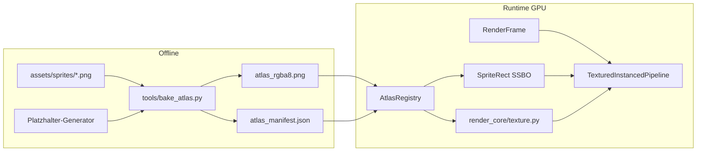

# M6 — Texture Atlas + Material-Handles

## Festgelegte Konventionen

| Regel | Wert |
|-------|------|
| Tile-Größe | 32×32 px |
| Weltkoordinaten | 1 Einheit = 1 Pixel, Y nach oben |
| Anker | **Unten links** — `world_x/y` in [`SpriteInstanceData`](render_scene/types.py) |
| Texturgrößen | Vielfache von 32 (32×32, 32×96, 64×128, …) |
| Atlas-Raster | 1 Zelle = 1 Tile = 32×32 px, **1 px Gutter** zwischen Zellen |
| M6-Scope | **Ein Demo-Atlas**, ein `MaterialHandle(1)`; Multi-Atlas-Batching als Erweiterung dokumentieren |

---

## Architektur / Datenfluss



**Trennung gemäß [`ruleset.md`](ruleset.md):**
- `render_scene/` — reine Typen + Konstanten (kein Vulkan)
- `render_core/` — `VkImage`, Sampler, Upload
- `render_graphics/` — Registry, Pipeline, Packing, Shader
- `tools/` — Bake (kein Runtime-Import aus `game_core`)

---

## Phase 1 — Scene-Typen & Konstanten

**Datei:** [`render_scene/types.py`](render_scene/types.py) + [`render_scene/handles.py`](render_scene/handles.py)

Neue/erweiterte Typen:

```python
TILE_SIZE_PX = 32
ATLAS_CELL_PX = 32
ATLAS_GUTTER_PX = 1

@dataclass(frozen=True, slots=True)
class SpriteRect:
    u0: float; v0: float; u1: float; v1: float
    pixel_w: int; pixel_h: int

@dataclass(frozen=True, slots=True)
class MaterialDescriptor:
    handle: MaterialHandle
    texture: TextureHandle

@dataclass(frozen=True, slots=True)
class AtlasManifestEntry:
    sprite_id: int
    name: str
    cells_w: int; cells_h: int   # in 32px-Zellen
    cell_x: int; cell_y: int     # Atlas-Position (Zelle)

@dataclass(frozen=True, slots=True)
class TextureAtlasDescriptor:
    handle: TextureHandle
    width: int; height: int
    tile_size_px: int = TILE_SIZE_PX
    entries: tuple[AtlasManifestEntry, ...]
```

- Docstrings für `SpriteInstanceData`: **`world_x/y` = Anker unten links**
- Export in [`render_scene/__init__.py`](render_scene/__init__.py)

---

## Phase 2 — Atlas Bake-Tool

**Datei:** [`tools/bake_atlas.py`](tools/bake_atlas.py)

**Optional-Dependency:** `pillow` in [`pyproject.toml`](pyproject.toml) unter `[project.optional-dependencies] atlas = ["pillow"]`

Funktionen:
1. **`generate_placeholder_sprites(out_dir)`** — erzeugt Test-PNGs ohne externe Assets:
   - 32×32 (1×1 Tile)
   - 32×96 (1×3)
   - 64×128 (2×4)
   - 64×64 (2×2)
2. **`load_sources(sprites_dir)`** — lädt `assets/sprites/*.png`, validiert `w % 32 == 0`, `h % 32 == 0`
3. **`pack_grid(entries, atlas_cells_x, atlas_cells_y)`** — Shelf-Packing auf Zellenraster (sortiert nach `cells_h` absteigend)
4. **`bake_atlas(...)`** — schreibt:
   - `assets/demo_atlas/atlas.png` (RGBA8, Po2-Größe z. B. 512×512)
   - `assets/demo_atlas/manifest.json` (Einträge mit `sprite_id`, Zellen-Rect, Pixelgröße)

UV-Berechnung (mit Gutter, Vulkan-konsistent **v=0 oben**):

```python
px_x = cell_x * 32 + GUTTER
px_y = cell_y * 32 + GUTTER
px_w = cells_w * 32 - 2 * GUTTER
px_h = cells_h * 32 - 2 * GUTTER
u0, v0 = px_x / atlas_w, px_y / atlas_h
u1, v1 = (px_x + px_w) / atlas_w, (px_y + px_h) / atlas_h
```

CLI: `python tools/bake_atlas.py [--sprites assets/sprites] [--out assets/demo_atlas] [--generate-placeholders]`

---

## Phase 3 — GPU-Textur (render_core)

**Neue Datei:** [`render_core/texture.py`](render_core/texture.py)

Analog zu [`render_core/buffer.py`](render_core/buffer.py):

- `create_texture_rgba8(physical, device, queue, family, width, height, rgba_bytes)` → `(VkImage, VkDeviceMemory, VkImageView)`
- Staging → `vkCmdCopyBufferToImage`, Layout-Transitions (`UNDEFINED → TRANSFER_DST → SHADER_READ_ONLY`)
- `create_nearest_sampler(device)` — `NEAREST` + `CLAMP_TO_EDGE` (Pixel-Art)
- `destroy_texture(device, image, memory, view)`

Keine Descriptor-Logik in `render_core` — nur Ressourcen-Erstellung.

---

## Phase 4 — AtlasRegistry (render_graphics)

**Neue Datei:** [`render_graphics/atlas_registry.py`](render_graphics/atlas_registry.py)

```python
@dataclass
class AtlasRegistry:
    atlas: TextureAtlasDescriptor
    gpu_texture: GpuTexture          # image + view + sampler
    sprite_rects: list[SpriteRect]   # index = int(SpriteId)
    sprite_lookup_buffer: VkBuffer     # DEVICE_LOCAL SSBO
    material: MaterialDescriptor
```

- `load_from_manifest(device, manifest_path, png_path) -> AtlasRegistry`
- Baut `sprite_rects[sprite_id]` aus Manifest (Lücken = leeres 0×0-Rect, Draw überspringen)
- Packt SSBO: pro Eintrag 32 Bytes (`vec4 uv` + `vec2 size` + padding) — `std430`-kompatibel
- `destroy(device)`

---

## Phase 5 — Anker unten-links + Instanz-Layout

**Betrifft:** [`render_graphics/shaders/instanced.vert`](render_graphics/shaders/instanced.vert), [`render_graphics/instancing.py`](render_graphics/instancing.py), [`render_graphics/debug_grid.py`](render_graphics/debug_grid.py)

### Shader-Fix (bestehende Einfarbig-Pipeline)
Aktuell Mitte-Anker:
```glsl
vec2 world = inCenterSize.xy + (inLocalPos - vec2(0.5)) * inCenterSize.zw;
```
Neu unten-links:
```glsl
vec2 world = inAnchorSize.xy + inLocalPos * inAnchorSize.zw;
```

### Textured Instanz-Buffer (32 Bytes, stride unverändert)
| Offset | Inhalt |
|--------|--------|
| 0 | `anchor_x, anchor_y` (float32×2) |
| 8 | `tint_rgba` (float32×4) |
| 24 | `sprite_id` (uint32) |

`pack_textured_sprite_instances(sprites) -> bytes` — Größe kommt aus Lookup, nicht mehr aus `DEFAULT_QUAD_SIZE`.

### Debug-Grid
[`build_world_grid_vertices(step=32.0)`](render_graphics/debug_grid.py) in [`ortho_renderer.py`](render_graphics/ortho_renderer.py) — sichtbares Tile-Raster.

### Demos anpassen
[`demo_sprite_field`](render_graphics/instancing.py): `spacing=32`, Anker auf 32er-Grid, `scale_x/y=1.0`.

---

## Phase 6 — Textured Pipeline + Shader

**Neue Dateien:**
- [`render_graphics/shaders/textured_instanced.vert`](render_graphics/shaders/textured_instanced.vert)
- [`render_graphics/shaders/textured_instanced.frag`](render_graphics/shaders/textured_instanced.frag)
- [`render_graphics/textured_pipeline.py`](render_graphics/textured_pipeline.py)

### Descriptor Set Layout (1 Set pro Material/Atlas)
| Binding | Typ | Stage |
|---------|-----|-------|
| 0 | `COMBINED_IMAGE_SAMPLER` | Fragment |
| 1 | `STORAGE_BUFFER` (SpriteRect[]) | Vertex |

Push Constants (Vertex): `viewProj` (64 B) — wie [`ColoredPipeline`](render_graphics/pipeline.py).

### Vertex-Shader-Logik
```glsl
SpriteRect rect = rects[spriteId];
vec2 world = anchor + inLocalPos * vec2(rect.pixel_w, rect.pixel_h);
vec2 uv = mix(vec2(rect.u0, rect.v0), vec2(rect.u1, rect.v1), inLocalPos);
fragColor = texture(atlas, uv) * tint;
```

### Pipeline-Erstellung
- Erste Descriptor-Set-Implementierung im Projekt (`VkDescriptorPool`, `VkDescriptorSetLayout`, `vkUpdateDescriptorSets`)
- `record_textured_draw(cmd, pipeline, registry, extent, camera_ubo, instance_count)`
- `vkCmdDraw(6, instanceCount, 0, 0)` — wie [`instance_pipeline.py`](render_graphics/instance_pipeline.py)

[`compile_shaders.py`](render_graphics/shaders/compile_shaders.py): `textured_instanced.vert/frag` ergänzen.

---

## Phase 7 — OrthoFrameRenderer Integration

**Datei:** [`render_graphics/ortho_renderer.py`](render_graphics/ortho_renderer.py)

- `AtlasRegistry` als Feld; beim `create()` Manifest + PNG laden (Default-Pfad `assets/demo_atlas/`)
- `draw(frame)`:
  1. Grid via `ColoredPipeline` (unverändert)
  2. Sprites: `pack_textured_sprite_instances` → Upload → `TexturedInstancedPipeline`
- Swapchain-Recreation: Grid-Pipeline + Textured-Pipeline + Descriptor-Sets neu binden
- `destroy()`: alle drei Ressourcen freigeben

**Draw-Reihenfolge:** Grid → textured sprites (Layer-Sortierung kommt in M7).

---

## Phase 8 — Demo & Doku

**Neue Datei:** [`apps/atlas_demo.py`](apps/atlas_demo.py)
- Bake-Schritt dokumentieren (oder beim Start prüfen, ob `assets/demo_atlas/` existiert → Hinweis)
- ~20 Sprites auf 32px-Grid: Mix aus 1×1, 1×3, 2×4 via `sprite_id` aus Manifest
- Steuerung wie [`apps/instance_demo.py`](apps/instance_demo.py)

**Script-Eintrag:** `wt-atlas-demo = "apps.atlas_demo:main"` in [`pyproject.toml`](pyproject.toml)

**Doku:** [`docs/ARCHITECTURE.md`](docs/ARCHITECTURE.md) — M6 ✓, Konventionen (Tile/Anker/Atlas), Demo-Befehle

**Package-Data:** `"assets/demo_atlas/*"` oder generierte Assets im Repo committen (empfohlen: generierte Platzhalter-Atlas-Dateien committen, damit Demo ohne Pillow läuft)

---

## Abhängigkeiten & Risiken

| Thema | Mitigation |
|-------|------------|
| Erste Descriptor Sets in PyVulkan | Eng an [`instance_pipeline.py`](render_graphics/instance_pipeline.py) / [`pipeline.py`](render_graphics/pipeline.py) orientieren; kleines `descriptor.py` Helper optional |
| PyVulkan `vkUpdateDescriptorSets` | ImageInfo + BufferInfo als CFFI-Structs; in M2–M5 etablierte Patterns nutzen |
| UV-Y-Richtung | Beim Bake und Shader testen; ggf. `v0/v1` tauschen — einmal in Demo verifizieren |
| `scale_x/y` | M6: Lookup-Größe × scale; Default 1.0 für tile-snapped Sprites |

---

## Definition of Done (M6)

- [ ] Bake-Tool: Platzhalter + optional PNG-Ordner → Atlas + Manifest
- [ ] `SpriteRect`, `MaterialDescriptor`, `TILE_SIZE_PX` in `render_scene`
- [ ] GPU-Textur-Upload in `render_core/texture.py`
- [ ] `AtlasRegistry` mit SSBO-Lookup
- [ ] Textured instanced Pipeline mit Descriptor Set
- [ ] Anker unten-links in Shader + Demos; Debug-Grid 32 px
- [ ] `python -m apps.atlas_demo` zeigt texturierte Sprites unterschiedlicher Tile-Größen
- [ ] ARCHITECTURE.md aktualisiert

**Bewusst nicht in M6:** Multi-Atlas-Batching, Tile-Layer (`TileLayerBatch`), Mipmaps, Rotation — folgen in M7/M8.
