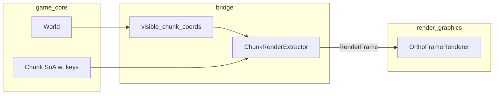

# M8 — Chunk-Daten via TileChunkRenderData

## Festgelegte Konventionen (aus M6/M7 + Diskussion)

| Regel | Wert |
|-------|------|
| Tile-Größe | 32×32 px, Anker unten links |
| Chunk-Größe | **32×32 Tiles** = **1024×1024 px** |
| Chunk `(cx, cy)` | Welt-Anker unten links: `(cx * 1024, cy * 1024)` |
| Tile-IDs | **TileId = SpriteId**, Keys `wt:tiles/grass` etc. |
| Demo-Welt | **16×16 Chunks** (256×256 Tiles gesamt) |
| Layer M8 | nur **Ground** (`LayerId(0)`) |
| Renderer | **kein Umbau** — [`pack_textured_tile_chunks`](render_graphics/tile_layer.py) unterstützt N Chunks bereits |

---

## Architektur / Datenfluss



**Abhängigkeitsregeln bleiben:** [`bridge`](bridge/dependency_rules.py) importiert `game_core` + `render_scene`, **nicht** `render_graphics`. `SpriteCatalog` wird in der Demo geladen und an Extractor übergeben (Bridge darf `SpriteCatalog` aus `render_scene` nutzen).

---

## Phase 1 — Konstanten + game_core

**Neue Datei:** [`game_core/world.py`](game_core/world.py)

```python
CHUNK_SIZE_TILES = 32
CHUNK_SIZE_PX = CHUNK_SIZE_TILES * TILE_SIZE_PX  # 1024

@dataclass(frozen=True, slots=True)
class Chunk:
    coord: ChunkCoord
    tile_keys: tuple[str, ...]  # Länge = 32*32, row-major, wt:… only

@dataclass
class World:
    chunks: dict[ChunkCoord, Chunk]
    chunk_size_tiles: int = CHUNK_SIZE_TILES
```

**Neue Datei:** [`game_core/world_gen.py`](game_core/world_gen.py)

- `generate_demo_world(cols=16, rows=16) -> World`
- Pro Chunk `(cx, cy)` deterministisches Muster aus `wt:tiles/grass`, `wt:tiles/dirt`, `wt:tiles/stone`, `wt:tiles/water` (Variation abhängig von `cx, cy` — z.B. Schachbrett-Offset, Wasser-Streifen an bestimmten cx/cy)
- **Kein** `render_scene`-Import außer `ChunkCoord` — Keys als plain `str`

**Export:** [`game_core/__init__.py`](game_core/__init__.py) — `World`, `Chunk`, `generate_demo_world`

---

## Phase 2 — Sichtbarkeit (bridge)

**Neue Datei:** [`bridge/visibility.py`](bridge/visibility.py)

Aus [`CameraData`](render_scene/types.py) sichtbares Welt-Rechteck berechnen (analog [`build_view_projection`](render_graphics/camera.py): `half_w/h = viewport / zoom / 2`):

```python
left   = cam_x - half_w
right  = cam_x + half_w
bottom = cam_y - half_h
top    = cam_y + half_h
```

Chunk-Indices (mit **1 Chunk Padding** gegen Pop-in):

```python
cx_min = floor(left / CHUNK_SIZE_PX) - padding
cx_max = floor(right / CHUNK_SIZE_PX) + padding
# analog cy; nur Chunks die in World.chunks existieren
```

Reine Funktion, kein GPU-Bezug.

---

## Phase 3 — ChunkRenderExtractor (bridge)

**Neue Datei:** [`bridge/chunk_extractor.py`](bridge/chunk_extractor.py)

```python
@dataclass
class ChunkRenderExtractor:
    world: World
    catalog: SpriteCatalog
    padding_chunks: int = 1

    def extract(self, camera: CameraData, sprites=()) -> RenderFrame:
        ...
```

Pro sichtbarem Chunk:
1. `Chunk` aus `World.chunks` holen
2. Lokale Tile-Indices `(tx, ty)` → Welt-Pixel:
   - `world_x = cx * CHUNK_SIZE_PX + tx * TILE_SIZE_PX`
   - `world_y = cy * CHUNK_SIZE_PX + ty * TILE_SIZE_PX`
3. `tile_ids = tuple(catalog.resolve(key) for key in chunk.tile_keys)` — **TileId = SpriteId**
4. `TileLayerBatch(layer=LayerId(0), tile_ids, world_x, world_y)` bauen
5. `TileChunkRenderData(coord, layers=(batch,))` sammeln

Nutzt [`resolve_sprite`](bridge/sprite_resolve.py) intern.

**Performance M8:** SoA direkt aus Chunk — keine per-Tile Python-Objekte. Pro Chunk max. 1024 Tiles; bei ~9 sichtbaren Chunks ~9k Instanzen (vergleichbar mit M7-Demo).

**Optional:** [`bridge/__init__.py`](bridge/__init__.py) — `ChunkRenderExtractor` exportieren.

---

## Phase 4 — Demo (apps)

**Neue Datei:** [`apps/chunk_world_demo.py`](apps/chunk_world_demo.py)

- `OrthoFrameRenderer.create()` → `sprite_catalog` aus Registry
- `world = generate_demo_world(16, 16)`
- `extractor = ChunkRenderExtractor(world, catalog)`
- Game-Loop:
  - Input → `CameraData`
  - `frame = extractor.extract(camera)` — **kein** direkter Aufruf von `demo_tile_chunk_*`
  - `renderer.draw(frame)`
- FPS + `visible chunks: N` + `tiles: M` im Fenstertitel (FpsCounter wie [`atlas_demo.py`](apps/atlas_demo.py))
- Start-Kamera zentriert auf Weltmitte (~8192 px bei 16×16 Chunks)

**Script:** `wt-chunk-world = "apps.chunk_world_demo:main"` in [`pyproject.toml`](pyproject.toml)

---

## Phase 5 — Doku + Aufräumen

**[`docs/ARCHITECTURE.md`](docs/ARCHITECTURE.md):**
- M8 ✓
- Chunk-Konventionen dokumentieren
- Demo-Eintrag `chunk_world_demo`
- Datenfluss-Diagramm ergänzen

**Kein Verschieben** der M7-Helfer [`demo_tile_chunk_*`](render_graphics/tile_layer.py) — bleiben für Tests; Demo M8 nutzt sie nicht.

**[`render_scene/types.py`](render_scene/types.py):** optional Docstring bei `TileChunkRenderData` — `chunk_coord` ist Chunk-Index, Weltposition ergibt sich aus Konstanten.

---

## Abgrenzung (bewusst nicht in M8)

- Keine Laufzeit-Tile-Änderung / Platzierung
- Kein zweiter Layer (Decoration)
- Kein Charakter / keine Simulation
- Kein Chunk-Streaming von Disk — alle 16×16 Chunks im Speicher
- Keine Bridge-Optimierung (Chunk-Batch-Cache) — erst bei Bedarf

---

## Definition of Done

- [ ] `game_core`: `World`, `Chunk`, `generate_demo_world(16, 16)`
- [ ] `bridge/visibility.py`: kamera-basierte Chunk-Auswahl mit Padding
- [ ] `bridge/chunk_extractor.py`: `extract(camera) -> RenderFrame` mit N sichtbaren Chunks
- [ ] `apps/chunk_world_demo.py`: End-to-End über Bridge, Pan/Zoom, FPS
- [ ] ARCHITECTURE.md aktualisiert

Nach M8 ist der **Renderer-Kern (M1–M8) feature-complete** für Phase 2 laut [`ARCHITECTURE.md`](docs/ARCHITECTURE.md); Gameplay-Erweiterungen (Tiles ändern, Gebäude, Charakter) folgen danach.
